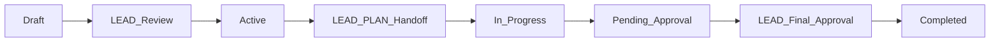

# CLAUDE.md - LEO Protocol Workflow Guide for AI Agents

## Session Prologue (Short)
1. **Follow LEAD→PLAN→EXEC** - Target ≥85% gate pass rate
2. **Use sub-agents** - Architect, QA, Reviewer - summarize outputs
3. **Database-first** - No markdown files as source of truth
4. **Small PRs** - Keep diffs ≤100 lines per change
5. **7-element handoffs** - Required for all phase transitions
6. **Priority-first** - Use `npm run prio:top3` to justify work

*For copy-paste version: see `templates/session-prologue.md` (generate via `npm run session:prologue`)*

## 🏗️ Application Architecture - CRITICAL CONTEXT

### Two Distinct Applications with SEPARATE DATABASES:

#### 1. **EHG_Engineer** (Management Dashboard) - WHERE YOU ARE NOW
   - **Path**: `/mnt/c/_EHG/EHG_Engineer/`
   - **Purpose**: LEO Protocol dashboard for managing Strategic Directives & PRDs
   - **Database**: `dedlbzhpgkmetvhbkyzq` (Supabase - MANAGEMENT DATABASE)
   - **GitHub**: https://github.com/rickfelix/EHG_Engineer.git
   - **Port**: 3000-3001
   - **Role**: MANAGEMENT TOOL ONLY - no customer features here!

#### 2. **EHG** (Business Application) - IMPLEMENTATION TARGET
   - **Path**: `/mnt/c/_EHG/ehg/`
   - **Purpose**: The actual customer-facing business application
   - **Database**: `liapbndqlqxdcgpwntbv` (Supabase - CUSTOMER DATABASE)
   - **GitHub**: https://github.com/rickfelix/ehg.git
   - **Built with**: Vite + React + Shadcn + TypeScript
   - **Role**: WHERE ALL FEATURES GET IMPLEMENTED

⚠️ **CRITICAL DATABASE DISTINCTION**:
- **EHG_Engineer DB** (`dedlbzhpgkmetvhbkyzq`): Contains SDs, PRDs, LEO Protocol data
- **EHG App DB** (`liapbndqlqxdcgpwntbv`): Contains customer data, business logic
- **NEVER** mix these databases - they serve completely different purposes!

### ⚠️ CRITICAL: During EXEC Phase Implementation
1. **Read PRD** from EHG_Engineer database
2. **Navigate** to `/mnt/c/_EHG/ehg/` for implementation
3. **Make code changes** in EHG application (NOT in EHG_Engineer!)
4. **Push changes** to EHG's GitHub repo: `rickfelix/ehg.git`
5. **Track progress** in EHG_Engineer dashboard

### 🔄 Workflow Relationship
```
EHG_Engineer (Management)          EHG App (Implementation)
├── Strategic Directives     →     Features implemented here
├── PRDs                     →     Code changes made here
├── Progress Tracking        ←     Results verified from here
└── Dashboard Views          ←     No changes here!
```

## ⚠️ DYNAMICALLY GENERATED FROM DATABASE
**Last Generated**: 2025-09-26 2:23:28 PM
**Source**: Supabase Database (not files)
**Auto-Update**: Run `node scripts/generate-claude-md-from-db.js` anytime

## 🟢 CURRENT LEO PROTOCOL VERSION: vv4.2.0_story_gates

**CRITICAL**: This is the ACTIVE version from database
**ID**: leo-v4-2-0-story-gates
**Status**: ACTIVE
**Title**: LEO Protocol v4.2.0 - Story Gates & Automated Release Control

### 📅 Protocol Management

**Database-First Architecture**:
- Protocol stored in `leo_protocols` table
- Sub-agents in `leo_sub_agents` table  
- Handoffs in `leo_handoff_templates` table
- Single source of truth - no file conflicts

**To update protocol version**:
```sql
-- Only via database operations
UPDATE leo_protocols SET status = 'active' WHERE version = 'new_version';
UPDATE leo_protocols SET status = 'superseded' WHERE version != 'new_version';
```

## Agent Responsibilities


### Implementation Agent (EXEC)
- **Responsibilities**: Implementation based on PRD. **CRITICAL: Implementations happen in /mnt/c/_EHG/ehg/ (EHG app), NOT in EHG_Engineer!** Always cd to target app before coding. **SIMPLICITY IN EXECUTION**: Implement the simplest solution that meets requirements. Avoid over-engineering. Use proven patterns and existing libraries.
- **Planning**: 0%
- **Implementation**: 30%
- **Verification**: 0%
- **Approval**: 0%
- **Total**: 30%

### Strategic Leadership Agent (LEAD)
- **Responsibilities**: Strategic planning, business objectives, final approval. **SIMPLICITY FIRST**: Challenge complexity, favor simple solutions over perfect architectures. Ask "What's the simplest solution?" and "Why not just configure existing tools?" Default to 80/20 solutions that deliver value quickly.
- **Planning**: 20%
- **Implementation**: 0%
- **Verification**: 0%
- **Approval**: 15%
- **Total**: 35%

### Technical Planning Agent (PLAN)
- **Responsibilities**: Technical design, PRD creation with comprehensive test plans, pre-automation validation, acceptance testing. **PRAGMATIC ENGINEERING**: Use boring technology that works reliably. Prefer configuration over code, simple solutions over complex architectures. Filter sub-agent recommendations through simplicity lens.
- **🔍 Supervisor Mode**: Final "done done" verification with all sub-agents
- **Planning**: 20%
- **Implementation**: 0%
- **Verification**: 15%
- **Approval**: 0%
- **Total**: 35%

## 🚨 EXEC Agent Implementation Requirements

### MANDATORY Pre-Implementation Verification
Before writing ANY code, EXEC MUST:

0. **APPLICATION CHECK** ⚠️ CRITICAL FIRST STEP
   - Confirm target app: `/mnt/c/_EHG/ehg/` (NOT EHG_Engineer!)
   - Verify: `cd /mnt/c/_EHG/ehg && pwd` should show `/mnt/c/_EHG/ehg`
   - Check GitHub: `git remote -v` should show `rickfelix/ehg.git`
   - If you're in EHG_Engineer, you're in the WRONG place for implementation!

1. **URL Verification** ✅
   - Navigate to the EXACT URL specified in the PRD
   - Confirm the page loads and is accessible
   - Take a screenshot for evidence
   - Document: "Verified: [URL] is accessible"

2. **Component Identification** 🎯
   - Identify the exact file path of the target component
   - Confirm component exists at specified location
   - Document: "Target component: [full/path/to/component.tsx]"

3. **Application Context** 📁
   - Verify correct application directory
   - Confirm port number matches PRD
   - Document: "Application: [/path/to/app] on port [XXXX]"

4. **Visual Confirmation** 📸
   - Screenshot current state BEFORE changes
   - Identify exact location for new features
   - Document: "Current state captured, changes will go at [location]"

### Implementation Checklist Template
```markdown
## EXEC Pre-Implementation Checklist
- [ ] URL verified: [exact URL from PRD]
- [ ] Page accessible: [YES/NO]
- [ ] Component identified: [path/to/component]
- [ ] Application path: [/full/path/to/app]
- [ ] Port confirmed: [port number]
- [ ] Screenshot taken: [timestamp]
- [ ] Target location confirmed: [where changes go]
```

### Common Mistakes to AVOID
- ❌ Assuming component location based on naming similarity
- ❌ Implementing without navigating to the URL first
- ❌ Ignoring port numbers in URLs
- ❌ Pattern matching without verification
- ❌ Starting to code before completing checklist
- ❌ Not restarting dev servers after changes
- ❌ **CRITICAL**: Creating files for PRDs, handoffs, or documentation

## 🚨 DATABASE-ONLY ENFORCEMENT

### ABSOLUTE PROHIBITION: No File Creation
LEO Protocol v4.1.2 is **DATABASE-FIRST ONLY**. **NEVER** create:
- ❌ PRD markdown files (`.md`)
- ❌ Handoff documents 
- ❌ Verification reports
- ❌ Any work-related documentation files

### REQUIRED: Database Operations Only
- ✅ PRDs: Use `scripts/add-prd-to-database.js`
- ✅ Handoffs: Store in handoff tracking tables
- ✅ Progress: Update database fields directly
- ✅ Verification: Store results in database
- ✅ Boundary Rules: See `docs/boundary-examples.md` (generate: `npm run docs:boundary`)
- ✅ Dependency Policy: New dependencies require rationale; policy warns on unknown, blocks denied (see `config/allowed-deps.json`)
- ✅ Session Starter: Copy `templates/session-prologue.md` at session start (generate: `npm run session:prologue`)
- ✅ Coverage Floor: 50% minimum (`coverage-grace` label allows 2 PRs bypass)
- ✅ Bundle Cap: 480KB absolute limit (delta: +50KB max vs main branch)

### If You Create Files By Mistake:
1. **STOP immediately**
2. Extract content to database
3. Delete the files
4. Update progress tracking
5. Verify dashboard shows correct status

## 🔄 Git Commit Guidelines

### Commit Format (MANDATORY)
All commits MUST follow Conventional Commits format with SD-ID:
```
<type>(<SD-ID>): <subject>

<body>

<footer>
```

### Required Elements
- **Type**: feat|fix|docs|style|refactor|test|chore|perf|ci|revert
- **Scope**: MUST include Strategic Directive ID (e.g., SD-2025-001)
- **Subject**: Imperative mood, no period, max 72 chars
- **Body**: Explain "why" not "what", wrap at 72 chars
- **Footer**: Breaking changes, co-authorship, AI attribution

### Commit Timing (During EXEC Phase)
1. **After completing each checklist item**
2. **Before context switches** (end of session, meetings, breaks)
3. **At logical breakpoints** (feature complete, tests passing)
4. **Frequency**: Min 1/session, Max 10/checklist item

### Branch Strategy by Application
- **EHG_Engineer changes** (dashboard/tooling): Use `eng/` prefix
  - Example: `eng/dashboard-update`, `eng/leo-protocol-v4`
- **EHG app features** (customer features): Use standard prefixes
  - Example: `feature/SD-2025-001-voice-api`, `fix/SD-2025-002-auth-bug`
- **CRITICAL**: Verify you're in the correct directory before branching!
  - `pwd` should show `/mnt/c/_EHG/ehg` for feature implementation
  - `pwd` should show `/mnt/c/_EHG/EHG_Engineer` for dashboard changes
- **Main branch**: NO direct commits during EXEC phase
- **Merges**: Only via approved Pull Requests after LEAD approval

### AI Attribution
When AI generates code, include in footer:
```bash
git commit -m "feat(SD-2025-001): Implement retry logic

🤖 Generated with [Claude Code](https://claude.ai/code)

Co-Authored-By: Claude <noreply@anthropic.com>"
```

### Quick Reference
- Format: `<type>(<SD-ID>): <subject>`
- Size: <100 lines ideal, <200 max
- Files: 1-3 ideal, 10 max per commit
- Validation: Commits without proper format fail CI

**Full Guidelines**: See `docs/03_protocols_and_standards/leo_git_commit_guidelines_v4.2.0.md`

## 📊 Communication & Context

### Context Economy Rules

**Core Principles**:
- **Response Budget**: ≤500 tokens default (unless complexity requires more)
- **Summarize > Paste**: Reference paths/links instead of full content
- **Fetch-on-Demand**: Name files first, retrieve only needed parts
- **Running Summaries**: Keep condensed handoff/PR descriptions

### Best Practices

**Efficient Context Usage**:
- **Quote selectively**: Show only relevant lines with context
- **Use file:line references**: `src/component.js:42-58` instead of full file
- **Batch related reads**: Minimize round-trips when exploring
- **Archive verbosity**: Move details to handoffs/database, not conversation

### Examples

| ❌ Inefficient | ✅ Efficient |
|----------------|--------------|
| Paste entire 500-line file | Quote lines 42-58 with `...` markers |
| Read file multiple times | Batch read relevant sections once |
| Repeat full error in response | Summarize error + reference line |
| Include all test output | Show failed tests + counts only |

### 🔄 MANDATORY: Server Restart Protocol
After ANY code changes:
1. **Kill the dev server**: `kill [PID]` or Ctrl+C
2. **Restart the server**: `npm run dev` or appropriate command
3. **Wait for ready message**: Confirm server is fully started
4. **Hard refresh browser**: Ctrl+Shift+R / Cmd+Shift+R
5. **Verify changes are live**: Test the new functionality

**WHY**: Dev servers may cache components, especially new files. Hot reload is NOT always reliable.

## Progress Calculation

```
Total = ${agents.map(a => `${a.agent_code}: ${a.total_percentage}%`).join(' + ')} = 100%
```

## 🎯 LEAD Agent Operations

### Finding Active Strategic Directives

As the LEAD agent, you have immediate access to strategic directives:

**Quick Command**:
```bash
node scripts/query-active-sds.js
```

**Direct Database Query**:
```javascript
const { data: activeSDs } = await supabase
  .from('strategic_directives_v2')
  .select('*')
  .in('status', ['draft', 'in_progress', 'active', 'pending_approval'])
  .order('priority', { ascending: false })
  .order('created_at', { ascending: false });
```

### LEAD Decision Matrix

| SD Status | LEAD Action | Command/Script |
|-----------|-------------|----------------|
| **Draft** | Review & approve | `node scripts/lead-approve-sdip.js` |
| **Pending Approval** | Final review | `node scripts/conduct-lead-approval-assessment.js` |
| **Active** | Create LEAD→PLAN handoff | `node scripts/create-exec-to-plan-handoff.js` |
| **In Progress** | Monitor execution | `node scripts/debug-dashboard-progress.js` |

### Key LEAD Responsibilities

1. **Strategic Direction**
   - Define business objectives
   - Set priorities (CRITICAL: 90+, HIGH: 70-89, MEDIUM: 50-69, LOW: 30-49)
   - Approve strategic directives

2. **Handoff Creation**
   - LEAD→PLAN: Strategic objectives to technical planning
   - Must include all 7 mandatory elements
   - Use `node scripts/unified-handoff-system.js`

3. **Progress Monitoring**
   - Review SD progress: `node scripts/test-progress-calculation.js`
   - Check phase completion: `node scripts/complete-lead-phase.js`
   - Final approval: `node scripts/start-lead-approval.js`

### Strategic Directive Lifecycle



### 📋 Directive Submission Review Process

**CRITICAL**: Directive submissions contain essential context not present in SDs. Always review linked submissions before making strategic decisions.

#### Step-by-Step Review Workflow

1. **Query Pending Submissions**:
```javascript
// Find submissions needing LEAD review
const { data: pendingSubmissions } = await supabase
  .from('directive_submissions')
  .select('*')
  .in('status', ['pending_review', 'completed'])
  .is('gate_status->resulting_sd_id', null)
  .order('created_at', { ascending: false });
```

2. **Get Full Submission Context**:
```javascript
// Retrieve submission with linked SD (if exists)
const { data: submission } = await supabase
  .from('directive_submissions')
  .select(\`
    *,
    linked_sd:strategic_directives_v2!gate_status->resulting_sd_id(*)
  \`)
  .eq('id', submission_id)
  .single();
```

3. **Review Checklist**:
- [ ] **Original Input**: Review chairman_input for true intent
- [ ] **Intent Clarity**: Verify intent_summary captures essence
- [ ] **Visual Context**: Check screenshot_url if provided
- [ ] **Strategic Alignment**: Assess fit with organizational goals
- [ ] **Priority Assessment**: Determine business impact (Critical/High/Medium/Low)
- [ ] **Scope Validation**: Ensure scope is achievable and clear
- [ ] **Duplicate Check**: Verify no existing SDs cover this need
- [ ] **Gate Progression**: Confirm all validation gates passed

4. **Decision Matrix**:

| Submission State | Gate Status | LEAD Action | Command |
|-----------------|-------------|-------------|---------|
| Completed + No SD | Gates passed | Create SD | `node scripts/create-sd-from-submission.js` |
| Completed + SD exists | Linked to SD | Verify & handoff | `node scripts/unified-handoff-system.js` |
| Pending | Gates incomplete | Monitor | `node scripts/check-submission-status.js` |
| Failed validation | Gates failed | Archive/remediate | `node scripts/archive-submission.js` |

5. **Quick Review Command**:
```bash
node scripts/lead-review-submissions.js
```

#### Critical Context Elements

When reviewing submissions, pay special attention to:
- **Chairman Input**: The unfiltered original request
- **Screenshot URL**: Visual context for UI/UX requests  
- **SDIP ID**: For tracking through the processing pipeline
- **Processing History**: Number of steps and iterations
- **Metadata**: Additional context from processing

#### Linking Submissions to Strategic Directives

When creating an SD from a submission:
1. Include submission_id in SD metadata
2. Reference key context in SD description
3. Preserve chairman's original intent
4. Map submission scope to SD objectives

## Mandatory Handoff Requirements

Every handoff MUST include these 7 elements:
${handoffTemplates.length > 0 ? handoffTemplates[0].template_structure.sections.map((s, i) => `${i+1}. ${s}`).join('\n') : '(Loading from database...)'}

Missing ANY element = AUTOMATIC REJECTION

## Sub-Agent System (Database-Driven)

### Active Sub-Agents

| Sub-Agent | Code | Activation | Priority |
|-----------|------|------------|----------|
${subAgents.map(sa => `| ${sa.name} | ${sa.code} | ${sa.activation_type} | ${sa.priority} |`).join('\n')}

### Sub-Agent Activation Triggers


#### Information Architecture Lead Triggers:
- "LEAD_SD_CREATION" (keyword) in any context
- "LEAD_HANDOFF_CREATION" (keyword) in any context
- "LEAD_APPROVAL" (keyword) in any context
- "PLAN_PRD_GENERATION" (keyword) in any context
- "PLAN_VERIFICATION" (keyword) in any context
- "EXEC_IMPLEMENTATION" (keyword) in any context
- "EXEC_COMPLETION" (keyword) in any context
- "HANDOFF_CREATED" (keyword) in any context
- "HANDOFF_ACCEPTED" (keyword) in any context
- "PHASE_TRANSITION" (keyword) in any context
- "RETRO_GENERATED" (keyword) in any context
- "FILE_CREATED" (keyword) in any context
- "VIOLATION_DETECTED" (keyword) in any context
- "DAILY_DOCMON_CHECK" (keyword) in any context

#### DevOps Platform Architect Triggers:
- "EXEC_IMPLEMENTATION_COMPLETE" (keyword) in any context
- "create pull request" (keyword) in any context
- "gh pr create" (keyword) in any context
- "LEAD_APPROVAL_COMPLETE" (keyword) in any context
- "create release" (keyword) in any context
- "PLAN_VERIFICATION_PASS" (keyword) in any context
- "github deploy" (keyword) in any context
- "github status" (keyword) in any context

#### Continuous Improvement Coach Triggers:
- "LEAD_APPROVAL_COMPLETE" (keyword) in any context
- "LEAD_REJECTION" (keyword) in any context
- "PLAN_VERIFICATION_COMPLETE" (keyword) in any context
- "PLAN_COMPLEXITY_HIGH" (keyword) in any context
- "EXEC_SPRINT_COMPLETE" (keyword) in any context
- "EXEC_QUALITY_ISSUE" (keyword) in any context
- "HANDOFF_REJECTED" (keyword) in any context
- "HANDOFF_DELAY" (keyword) in any context
- "PHASE_COMPLETE" (keyword) in any context
- "SD_STATUS_COMPLETED" (keyword) in any context
- "SD_STATUS_BLOCKED" (keyword) in any context
- "PATTERN_DETECTED" (keyword) in any context
- "SUBAGENT_MULTIPLE_FAILURES" (keyword) in any context
- "WEEKLY_LEO_REVIEW" (keyword) in any context
- "LEAD_PRE_APPROVAL_REVIEW" (keyword) in any context

#### Product Requirements Expert Triggers:
- "PRD created" (keyword) in any context
- "acceptance criteria" (keyword) in any context
- "user stories" (keyword) in any context
- "generate stories" (keyword) in any context

#### Chief Security Architect Triggers:
- "authentication" (keyword) in any context
- "security" (keyword) in any context

#### Principal Database Architect Triggers:
- "schema" (keyword) in any context
- "migration" (keyword) in any context

#### QA Engineering Director Triggers:
- "coverage" (keyword) in any context

#### Performance Engineering Lead Triggers:
- "optimization" (keyword) in any context

#### Senior Design Sub-Agent Triggers:
- "accessibility" (keyword) in any context

#### Principal Systems Analyst Triggers:
- "existing implementation" (keyword) in any context
- "duplicate" (keyword) in any context
- "conflict" (keyword) in any context
- "already implemented" (keyword) in any context
- "codebase check" (keyword) in any context

### Sub-Agent Activation Process

When triggers are detected, EXEC MUST:

1. **Query Database for Active Triggers**
   ```sql
   SELECT * FROM leo_sub_agent_triggers 
   WHERE active = true 
   AND trigger_phrase IN (detected_phrases);
   ```

2. **Create Formal Handoff** (7 elements from database template)

3. **Execute Sub-Agent** 
   - Option A: Run tool from `script_path` field
   - Option B: Use context from `context_file` field
   - Option C: Document analysis if no tool exists

4. **Store Results in Database**
   ```sql
   INSERT INTO sub_agent_executions (sub_agent_id, results, ...);
   ```

### Handoff Templates


#### PLAN → EXEC (technical_to_implementation)
Elements: Executive Summary, Completeness Report, Deliverables Manifest, Key Decisions & Rationale, Known Issues & Risks, Resource Utilization, Action Items for Receiver
Required: [object Object], [object Object], [object Object], [object Object]


#### LEAD → PLAN (strategic_to_technical)
Elements: Executive Summary, Completeness Report, Deliverables Manifest, Key Decisions & Rationale, Known Issues & Risks, Resource Utilization, Action Items for Receiver
Required: [object Object], [object Object], [object Object]


#### EXEC → PLAN (implementation_to_verification)
Elements: Executive Summary, Completeness Report, Deliverables Manifest, Key Decisions & Rationale, Known Issues & Risks, Resource Utilization, Action Items for Receiver
Required: [object Object], [object Object], [object Object]


## Validation Rules (From Database)


- **hasADR** (undefined)
  - Severity: undefined
  - Definition: undefined


- **hasInterfaces** (undefined)
  - Severity: undefined
  - Definition: undefined


- **hasTechDesign** (undefined)
  - Severity: undefined
  - Definition: undefined


- **designArtifacts** (undefined)
  - Severity: undefined
  - Definition: undefined


- **dbSchemaReady** (undefined)
  - Severity: undefined
  - Definition: undefined


- **securityScanClean** (undefined)
  - Severity: undefined
  - Definition: undefined


- **riskSpikesClosed** (undefined)
  - Severity: undefined
  - Definition: undefined


- **nfrBudgetsPresent** (undefined)
  - Severity: undefined
  - Definition: undefined


- **coverageTargetSet** (undefined)
  - Severity: undefined
  - Definition: undefined


- **testPlanMatrices** (undefined)
  - Severity: undefined
  - Definition: undefined


- **supervisorChecklistPass** (undefined)
  - Severity: undefined
  - Definition: undefined


## Database Schema Overview

### Core Tables
- `leo_protocols` - Protocol versions and content
- `leo_protocol_sections` - Modular protocol sections
- `leo_agents` - Agent definitions and percentages
- `leo_handoff_templates` - Standardized handoffs
- `leo_sub_agents` - Sub-agent definitions
- `leo_sub_agent_triggers` - Activation rules
- `leo_validation_rules` - Protocol validation

### Key Queries

**Get Current Protocol**:
```sql
SELECT * FROM leo_protocols WHERE status = 'active';
```

**Check Sub-Agent Triggers**:
```sql
SELECT sa.*, t.* 
FROM leo_sub_agents sa
JOIN leo_sub_agent_triggers t ON sa.id = t.sub_agent_id
WHERE t.trigger_phrase ILIKE '%keyword%';
```

**Get Handoff Template**:
```sql
SELECT * FROM leo_handoff_templates 
WHERE from_agent = 'EXEC' AND to_agent = 'PLAN';
```

## API Endpoints (Database-Backed)

- `GET /api/leo/current` - Current active protocol
- `GET /api/leo/agents` - All agents with percentages
- `GET /api/leo/sub-agents` - Active sub-agents with triggers
- `GET /api/leo/handoffs/:from/:to` - Handoff template
- `POST /api/leo/validate` - Validate against rules

## Key Scripts (Database-Aware)

- `get-latest-leo-protocol-from-db.js` - Get version from database
- `generate-claude-md-from-db.js` - Generate this file
- `migrate-leo-protocols-to-database.js` - Migration tool
- `activate-sub-agents-from-db.js` - Check database triggers

## Compliance Tools

All tools now query database instead of files:

### 1. Version Check
```bash
node scripts/get-latest-leo-protocol-from-db.js
```

### 2. Update CLAUDE.md
```bash
node scripts/generate-claude-md-from-db.js
```

### 3. Validate Handoff
```bash
node scripts/leo-checklist-db.js [agent-name]
```

## 🔍 PLAN Supervisor Verification

### Overview
PLAN agent now includes supervisor capabilities for final "done done" verification:
- Queries ALL sub-agents for their verification results
- Ensures all requirements are truly met
- Resolves conflicts between sub-agent reports
- Provides confidence scoring and clear pass/fail verdict

### Activation
Trigger PLAN supervisor verification via:
- **Command**: `/leo-verify [what to check]`
- **Script**: `node scripts/plan-supervisor-verification.js --prd PRD-ID`
- **Automatic**: When testing phase completes

### Verification Process
1. **Read-Only Access**: Queries existing sub-agent results (no re-execution)
2. **Summary-First**: Prevents context explosion with tiered reporting
3. **Conflict Resolution**: Priority-based rules (Security > Database > Testing)
4. **Circuit Breakers**: Graceful handling of sub-agent failures
5. **Maximum 3 Iterations**: Prevents infinite verification loops

### Verdicts
- **PASS**: All requirements met, high confidence (≥85%)
- **FAIL**: Critical issues or unmet requirements
- **CONDITIONAL_PASS**: Minor issues, needs LEAD review
- **ESCALATE**: Cannot reach consensus, needs LEAD intervention

## Dashboard Integration

Dashboard automatically connects to database:
- Real-time protocol updates via Supabase subscriptions
- Version detection from `leo_protocols` table
- Sub-agent status from `leo_sub_agents` table
- PLAN supervisor verification status
- No file scanning needed

## Important Notes

1. **Database is Source of Truth** - Files are deprecated
2. **Real-time Updates** - Changes reflect immediately
3. **No Version Conflicts** - Single active version enforced
4. **Audit Trail** - All changes tracked in database
5. **WebSocket Updates** - Dashboard stays synchronized
6. **PLAN Supervisor** - Final verification before LEAD approval

## 🗄️ Supabase Database Operations (EHG_Engineer Management DB)

⚠️ **THIS SECTION IS FOR EHG_Engineer DATABASE ONLY**
- **Database**: `dedlbzhpgkmetvhbkyzq` - Management/LEO Protocol database
- **NOT for**: EHG customer database (`liapbndqlqxdcgpwntbv`)

### Connection Details (EHG_Engineer DB)
- **Project URL**: https://dedlbzhpgkmetvhbkyzq.supabase.co
- **Project ID**: dedlbzhpgkmetvhbkyzq
- **Purpose**: Strategic Directives, PRDs, LEO Protocol data
- **Connection**: Via Supabase client using environment variables

### Creating Database Tables (in EHG_Engineer DB)

#### Method 1: Using Pooler Connection (FASTEST - Already Configured!)
```bash
# SUPABASE_POOLER_URL is already in .env - use it directly!
node scripts/execute-database-sql.js path/to/schema.sql

# Examples:
node scripts/execute-database-sql.js database/schema/sd_execution_timeline.sql
node scripts/execute-database-sql.js database/schema/007_leo_protocol_schema.sql
```

#### Method 2: Supabase Dashboard (Manual Fallback)
1. Go to: https://supabase.com/dashboard/project/dedlbzhpgkmetvhbkyzq/editor
2. Navigate to SQL Editor
3. Paste and execute SQL

#### Method 3: Enable RPC for Future Automation (Optional)
```sql
-- Run once in Dashboard to enable programmatic SQL execution
CREATE OR REPLACE FUNCTION execute_sql(sql text)
RETURNS json LANGUAGE plpgsql SECURITY DEFINER AS $$
BEGIN
  EXECUTE sql;
  RETURN json_build_object('status', 'success');
EXCEPTION WHEN OTHERS THEN
  RETURN json_build_object('status', 'error', 'message', SQLERRM);
END; $$;
```

### Database Quick Reference (EHG_Engineer DB)
- **Database Name**: EHG_Engineer Management Database
- **Project ID**: dedlbzhpgkmetvhbkyzq (NOT the EHG customer DB!)
- **Connection**: SUPABASE_POOLER_URL in .env (pre-configured for Engineer DB)
- **Schema Location**: /database/schema/ (Engineer DB schemas only)
- **Create Any Table**: `node scripts/execute-database-sql.js database/schema/[filename].sql`
- **Tables Include**: strategic_directives_v2, product_requirements_v2, leo_protocols, etc.

### Key Database Operations Scripts
- `scripts/execute-database-sql.js` - Universal SQL executor (uses pooler connection)
- `scripts/generate-claude-md-from-db.js` - Generate this file from database
- `database/schema/` - All schema definitions

### Troubleshooting Database Operations
- **SSL Certificate Error**: Already handled in execute-database-sql.js
- **Missing SUPABASE_POOLER_URL**: Check .env file (should be present)
- **Table Already Exists**: Script handles gracefully with ON CONFLICT clauses

## 🔧 CRITICAL DEVELOPMENT WORKFLOW

### ⚠️ Server Restart Protocol (MANDATORY)

**After ANY changes to the application, you MUST**:
1. **Kill the server process**
2. **Build the React client** (if UI changes were made)
3. **Restart the server**

```bash
# Method 1: Using process management
pkill -f "node server.js"

# Method 2: If running in Claude Code background
# Use KillBash tool with shell_id

# Build React client (REQUIRED for UI/component changes)
cd /mnt/c/_EHG/EHG_Engineer
npm run build:client

# Restart server
PORT=3000 node server.js
```

### Why This is Required

**React Build Process**:
- React components are compiled from `src/client/src/` to `src/client/dist/`
- Server serves static files from `dist`, not source files
- CSS changes must be bundled and minified via Vite
- No hot-reloading is configured in this setup

**File Structure**:
```
src/client/
├── src/               # Source files (your edits)
│   ├── components/    # React components
│   └── styles/        # CSS files
└── dist/              # Built files (served by server)
    ├── index.html
    └── assets/
```

### Development Commands

```bash
# Complete development cycle
cd /mnt/c/_EHG/EHG_Engineer
npm run build:client && PORT=3000 node server.js

# Build client only
npm run build:client

# Check if server is running
lsof -i :3000
```

### Environment Variables Required
```env
NEXT_PUBLIC_SUPABASE_URL=https://dedlbzhpgkmetvhbkyzq.supabase.co
NEXT_PUBLIC_SUPABASE_ANON_KEY=[your-anon-key]
# Optional: SUPABASE_SERVICE_ROLE_KEY for admin operations
# Optional: DATABASE_URL for direct psql access
```

---

*Generated from Database: 2025-09-26*
*Protocol Version: vv4.2.0_story_gates*
*Database-First Architecture: ACTIVE*
