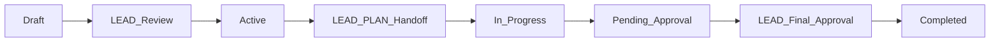

# CLAUDE.md - LEO Protocol Workflow Guide for AI Agents

**Manifest-Version**: 2.0
**Last-Updated**: 2025-09-26T13:29:30.506Z
**LEO Protocol**: vv4.2.0_story_gates
**Source**: Database-First (Supabase)

## Table of Contents

1. [Project Overview & Purpose](#1-project-overview--purpose)
2. [Architecture & Core Concepts](#2-architecture--core-concepts)
3. [Developer Environment & Tooling](#3-developer-environment--tooling)
4. [Common Commands & Workflows](#4-common-commands--workflows)
5. [Code Style & Conventions](#5-code-style--conventions)
6. [Testing, Quality, Linting & CI](#6-testing-quality-linting--ci)
7. [Branching / Git / PR Conventions](#7-branching--git--pr-conventions)
8. [Known Pitfalls & Gotchas](#8-known-pitfalls--gotchas)
9. [Sub-agents & Handoffs](#9-sub-agents--handoffs)
10. [Examples & Prompt Snippets](#10-examples--prompt-snippets)
11. [Preference Rules & Heuristics](#11-preference-rules--heuristics)
12. [Versioning](#12-versioning)

## 1. Project Overview & Purpose

- **Scope**: EHG_Engineer - LEO Protocol governance platform
- **Boundary**: EHG_Engineer ↔ EHG separation enforced (separate repos)
- **Purpose**: Manage strategic directives, PRDs, and handoffs via LEO Protocol
- **DB-First**: All artifacts (PRDs/handoffs/retros) stored in database, not files

## 2. Architecture & Core Concepts

- **Database**: Supabase PostgreSQL (project: dedlbzhpgkmetvhbkyzq)
- **Protocol**: LEO vv4.2.0_story_gates - LEO Protocol v4.2.0 - Story Gates & Automated Release Control
- **Agents**: LEAD (strategic) → PLAN (technical) → EXEC (implementation)
- **Tables**: `leo_protocols`, `leo_sub_agents`, `leo_handoff_templates`, `strategic_directives_v2`

## 3. Developer Environment & Tooling

- **Node.js**: v20+ required
- **Database**: `NEXT_PUBLIC_SUPABASE_URL` and `NEXT_PUBLIC_SUPABASE_ANON_KEY` required
- **Server**: `PORT=3000 node server.js`
- **Client Build**: `npm run build:client` (Vite bundler)
- **Key Tools**: Playwright (testing), Jest (unit tests), Lighthouse (performance)

## 4. Common Commands & Workflows

- **Generate CLAUDE.md**: `node scripts/generate-claude-md-from-db.js`
- **Query Active SDs**: `node scripts/query-active-sds.js`
- **Create Handoff**: `node scripts/unified-handoff-system.js`
- **Add PRD**: `node scripts/add-prd-to-database.js`
- **Run Tests**: `npm run test:coverage` (35% floor, 75% target)

## 5. Code Style & Conventions

- **No Comments**: Unless explicitly requested
- **DB-First**: Never create markdown files for work artifacts
- **Small Diffs**: ≤100 lines per PR
- **7-Element Handoffs**: Mandatory for all agent transitions
- **Simplicity**: Avoid over-engineering, use proven patterns

## 6. Testing, Quality, Linting & CI

### Quality Gates (≥85% pass rate target)
- **Coverage**: 75% target (35% floor with `coverage-bypass` label)
- **Accessibility**: WCAG AA on 4 routes (`/`, `/strategic-directives`, `/prds`, `/handoffs`)
- **Performance**: ≤50KB growth delta, <812KB absolute
- **Visual**: ≤3% pixel difference tolerance (Playwright screenshots)

### CI Workflows
- `test-coverage.yml`: Enforces coverage thresholds
- `a11y-check.yml`: Axe-core validation
- `perf-budget.yml`: Bundle size limits
- `visual-regression.yml`: Screenshot comparisons

## 7. Branching / Git / PR Conventions

- **Branch Protection**: main requires status checks
- **Required Checks**: Coverage, A11y, Performance, Visual
- **Commit Format**: Conventional commits (feat/fix/docs/chore)
- **PR Size**: ≤100 lines (excluding lockfiles/generated)
- **Co-author**: Include Claude attribution

## 8. Known Pitfalls & Gotchas

- **Server Restart**: Required after code changes (no hot reload)
- **ESM/CJS**: Mixed modules need `--legacy-peer-deps`
- **Boundary Violations**: Never reference EHG app directly
- **File Creation**: PRDs/handoffs must go to DB, not files
- **OpenAI Peer Dep**: Shows warning but works with zod@4

## 9. Sub-agents & Handoffs

### Agents (3)

### Implementation Agent (EXEC)
- **Responsibilities**: Implementation based on PRD, no validation. **SIMPLICITY IN EXECUTION**: Implement the simplest solution that meets requirements. Avoid over-engineering. Use proven patterns and existing libraries. Focus on working solutions over perfect code.
- **Planning**: 0%
- **Implementation**: 30%
- **Verification**: 0%
- **Approval**: 0%
- **Total**: 30%

### Strategic Leadership Agent (LEAD)
- **Responsibilities**: Strategic planning, business objectives, final approval. **SIMPLICITY FIRST**: Challenge complexity, favor simple solutions over perfect architectures. Ask "What's the simplest solution?" and "Why not just configure existing tools?" Default to 80/20 solutions that deliver value quickly.
- **Planning**: 20%
- **Implementation**: 0%
- **Verification**: 0%
- **Approval**: 15%
- **Total**: 35%

### Technical Planning Agent (PLAN)
- **Responsibilities**: Technical design, PRD creation with comprehensive test plans, pre-automation validation, acceptance testing. **PRAGMATIC ENGINEERING**: Use boring technology that works reliably. Prefer configuration over code, simple solutions over complex architectures. Filter sub-agent recommendations through simplicity lens.
- **🔍 Supervisor Mode**: Final "done done" verification with all sub-agents
- **Planning**: 20%
- **Implementation**: 0%
- **Verification**: 15%
- **Approval**: 0%
- **Total**: 35%

### Sub-agents (10 Active)

#### Information Architecture Lead (DOCMON)
- **Priority**: 95
- **Activation**: automatic
- **Purpose**: Documentation systems architect with 25 years experience. Built docs platforms at MongoDB and Stripe. Philosophy: Documentation is code. Enforces single source of truth, prevents drift, automates doc generation. Knows when to be strict about structure vs flexible for velocity.
- **Script**: `scripts/documentation-monitor-subagent.js`
- **Triggers**: 14 configured

#### DevOps Platform Architect (GITHUB)
- **Priority**: 90
- **Activation**: automatic
- **Purpose**: GitHub/DevOps expert with 20 years automating workflows. Helped GitHub design Actions, built CI/CD at GitLab. Philosophy: Automation should feel invisible. Expert in: trunk-based development, progressive delivery, GitOps. Knows when to automate vs when human judgment is needed.
- **Script**: `scripts/github-deployment-subagent.js`
- **Triggers**: 8 configured

#### Continuous Improvement Coach (RETRO)
- **Priority**: 85
- **Activation**: automatic
- **Purpose**: Agile coach with 20 years turning failures into learning. Led retrospectives at Amazon and Toyota. Philosophy: Blame the system, not the person. Expert in: root cause analysis, blameless postmortems, improvement metrics. Captures insights that actually change behavior, not just fill reports.
- **Script**: `scripts/retrospective-sub-agent.js`
- **Triggers**: 15 configured

#### Product Requirements Expert (STORIES)
- **Priority**: 8
- **Activation**: automatic
- **Purpose**: Product manager with 25 years translating business needs to development tasks. Led product at Atlassian and Pivotal. Philosophy: User stories are promises to users. Expert in: story mapping, acceptance criteria, INVEST principles. Knows when detailed specs help vs when they slow teams down.
- **Script**: `scripts/generate-stories-from-prd.js`
- **Triggers**: 4 configured

#### Chief Security Architect (SECURITY)
- **Priority**: 7
- **Activation**: automatic
- **Purpose**: Former NSA security architect with 25 years experience. **SIMPLICITY-FIRST SECURITY**: Security that enables business, not blocks it. Recommends the simplest secure approach that addresses real threats, not theoretical ones. Philosophy: "Use proven, boring security patterns over complex custom solutions." Focuses on practical protections with minimal complexity overhead.
- **Script**: `N/A`
- **Triggers**: 2 configured

#### Principal Database Architect (DATABASE)
- **Priority**: 6
- **Activation**: automatic
- **Purpose**: Database architect with 30 years experience scaling systems from startup to IPO. Worked at Oracle, PostgreSQL core team, and Netflix. Expert in: performance optimization, sharding strategies, migration patterns, ACID vs BASE tradeoffs. Philosophy: Right database for right job. Knows when to normalize vs denormalize, when to use NoSQL vs SQL. Makes data access patterns drive schema design.
- **Script**: `N/A`
- **Triggers**: 2 configured

#### QA Engineering Director (TESTING)
- **Priority**: 5
- **Activation**: automatic
- **Purpose**: QA leader with 20 years experience. Built testing practices at Spotify and Microsoft. Philosophy: Testing enables velocity, not slows it. Expert in: test pyramid strategy, mutation testing, contract testing, chaos engineering. Pragmatic - knows 100% coverage is often wasteful. Focuses on: critical path coverage, regression prevention, and fast feedback loops.
- **Script**: `N/A`
- **Triggers**: 1 configured

#### Performance Engineering Lead (PERFORMANCE)
- **Priority**: 4
- **Activation**: automatic
- **Purpose**: Performance engineering lead with 20+ years optimizing high-scale systems. **SIMPLE PERFORMANCE WINS**: Recommends the simplest optimizations that provide the biggest impact. Philosophy: "Measure first, optimize the bottleneck, not everything." Prefers configuration tweaks and proven techniques over complex custom solutions.
- **Script**: `N/A`
- **Triggers**: 1 configured

#### Senior Design Sub-Agent (DESIGN)
- **Priority**: 3
- **Activation**: automatic
- **Purpose**: Senior UX architect with 15+ years at design-forward companies. **SIMPLE, USABLE DESIGN**: Advocates for the simplest interface that solves user needs. Philosophy: "Good design is as little design as possible." Recommends proven UI patterns over novel interactions. Focuses on usability over aesthetics, configuration over custom components.
- **Script**: `N/A`
- **Triggers**: 1 configured

#### Principal Systems Analyst (VALIDATION)
- **Priority**: 0
- **Activation**: automatic
- **Purpose**: Systems analyst with 28 years preventing duplicate work and technical debt. Expert at: codebase archaeology, impact analysis, dependency mapping. Philosophy: An hour of analysis saves a week of rework. Catches conflicts before they happen. Understands when reuse makes sense vs fresh implementation.
- **Script**: `scripts/lead-codebase-validation.js`
- **Triggers**: 5 configured

### Handoff Templates (7 Elements Required)
Every handoff MUST include:
1. Executive Summary
2. Completeness Report
3. Deliverables Manifest
4. Key Decisions & Rationale
5. Known Issues & Risks
6. Resource Utilization
7. Action Items for Receiver

## 10. Examples & Prompt Snippets

### Session Prologue (Copy-Paste)
```markdown
You are Claude Code on EHG_Engineer. Follow LEO Protocol vv4.2.0_story_gates.
- Use DB-first approach (no markdown files for work artifacts)
- Maintain ≤100 line diffs per PR
- Include 7-element handoffs for all transitions
- Respect EHG↔EHG_Engineer boundary (separate repos)
- Run quality gates: coverage (75%), a11y (WCAG AA), perf (≤50KB delta), visual (≤3% diff)
```

### Slash Command Cheatsheet
- `/leo-verify`: Trigger PLAN supervisor verification
- `/leo-security`: Force security sub-agent analysis
- `/leo-debug`: Force debug sub-agent for troubleshooting
- `/leo-perf`: Force performance analysis

## 11. Preference Rules & Heuristics

### Context Economy
- **Default**: ≤500 tokens per response
- **Summarize > Paste**: Provide file paths over full content
- **Fetch-on-Demand**: Load details only when needed
- **Code Diffs**: Show only changed lines, not entire files

### Ask-Before-Act Triggers
- **Schema Changes**: Any database DDL modifications
- **New Dependencies**: Adding packages to package.json
- **Cross-Boundary**: Any reference to EHG app
- **Security**: Authentication/authorization changes
- **Breaking Changes**: API contract modifications

## 12. Versioning

- **Manifest Version**: 2.0
- **LEO Protocol**: vv4.2.0_story_gates
- **Last Generated**: 2025-09-26T13:29:30.506Z
- **Update Command**: `node scripts/generate-claude-md-from-db.js`

---

## 🚨 EXEC Agent Implementation Requirements

### MANDATORY Pre-Implementation Verification
Before writing ANY code, EXEC MUST:

1. **URL Verification** ✅
   - Navigate to the EXACT URL specified in the PRD
   - Confirm the page loads and is accessible
   - Take a screenshot for evidence
   - Document: "Verified: [URL] is accessible"

2. **Component Identification** 🎯
   - Identify the exact file path of the target component
   - Confirm component exists at specified location
   - Document: "Target component: [full/path/to/component.tsx]"

3. **Application Context** 📁
   - Verify correct application directory
   - Confirm port number matches PRD
   - Document: "Application: [/path/to/app] on port [XXXX]"

4. **Visual Confirmation** 📸
   - Screenshot current state BEFORE changes
   - Identify exact location for new features
   - Document: "Current state captured, changes will go at [location]"

### Implementation Checklist Template
```markdown
## EXEC Pre-Implementation Checklist
- [ ] URL verified: [exact URL from PRD]
- [ ] Page accessible: [YES/NO]
- [ ] Component identified: [path/to/component]
- [ ] Application path: [/full/path/to/app]
- [ ] Port confirmed: [port number]
- [ ] Screenshot taken: [timestamp]
- [ ] Target location confirmed: [where changes go]
```

### Common Mistakes to AVOID
- ❌ Assuming component location based on naming similarity
- ❌ Implementing without navigating to the URL first
- ❌ Ignoring port numbers in URLs
- ❌ Pattern matching without verification
- ❌ Starting to code before completing checklist
- ❌ Not restarting dev servers after changes
- ❌ **CRITICAL**: Creating files for PRDs, handoffs, or documentation

## 🚨 DATABASE-ONLY ENFORCEMENT

### ABSOLUTE PROHIBITION: No File Creation
LEO Protocol v4.1.2 is **DATABASE-FIRST ONLY**. **NEVER** create:
- ❌ PRD markdown files (`.md`)
- ❌ Handoff documents 
- ❌ Verification reports
- ❌ Any work-related documentation files

### REQUIRED: Database Operations Only
- ✅ PRDs: Use `scripts/add-prd-to-database.js`
- ✅ Handoffs: Store in handoff tracking tables
- ✅ Progress: Update database fields directly
- ✅ Verification: Store results in database

### If You Create Files By Mistake:
1. **STOP immediately**
2. Extract content to database
3. Delete the files
4. Update progress tracking
5. Verify dashboard shows correct status

### 🔄 MANDATORY: Server Restart Protocol
After ANY code changes:
1. **Kill the dev server**: `kill [PID]` or Ctrl+C
2. **Restart the server**: `npm run dev` or appropriate command
3. **Wait for ready message**: Confirm server is fully started
4. **Hard refresh browser**: Ctrl+Shift+R / Cmd+Shift+R
5. **Verify changes are live**: Test the new functionality

**WHY**: Dev servers may cache components, especially new files. Hot reload is NOT always reliable.

## Progress Calculation

```
Total = ${agents.map(a => `${a.agent_code}: ${a.total_percentage}%`).join(' + ')} = 100%
```

## 🎯 LEAD Agent Operations

### Finding Active Strategic Directives

As the LEAD agent, you have immediate access to strategic directives:

**Quick Command**:
```bash
node scripts/query-active-sds.js
```

**Direct Database Query**:
```javascript
const { data: activeSDs } = await supabase
  .from('strategic_directives_v2')
  .select('*')
  .in('status', ['draft', 'in_progress', 'active', 'pending_approval'])
  .order('priority', { ascending: false })
  .order('created_at', { ascending: false });
```

### LEAD Decision Matrix

| SD Status | LEAD Action | Command/Script |
|-----------|-------------|----------------|
| **Draft** | Review & approve | `node scripts/lead-approve-sdip.js` |
| **Pending Approval** | Final review | `node scripts/conduct-lead-approval-assessment.js` |
| **Active** | Create LEAD→PLAN handoff | `node scripts/create-exec-to-plan-handoff.js` |
| **In Progress** | Monitor execution | `node scripts/debug-dashboard-progress.js` |

### Key LEAD Responsibilities

1. **Strategic Direction**
   - Define business objectives
   - Set priorities (CRITICAL: 90+, HIGH: 70-89, MEDIUM: 50-69, LOW: 30-49)
   - Approve strategic directives

2. **Handoff Creation**
   - LEAD→PLAN: Strategic objectives to technical planning
   - Must include all 7 mandatory elements
   - Use `node scripts/unified-handoff-system.js`

3. **Progress Monitoring**
   - Review SD progress: `node scripts/test-progress-calculation.js`
   - Check phase completion: `node scripts/complete-lead-phase.js`
   - Final approval: `node scripts/start-lead-approval.js`

### Strategic Directive Lifecycle



### 📋 Directive Submission Review Process

**CRITICAL**: Directive submissions contain essential context not present in SDs. Always review linked submissions before making strategic decisions.

#### Step-by-Step Review Workflow

1. **Query Pending Submissions**:
```javascript
// Find submissions needing LEAD review
const { data: pendingSubmissions } = await supabase
  .from('directive_submissions')
  .select('*')
  .in('status', ['pending_review', 'completed'])
  .is('gate_status->resulting_sd_id', null)
  .order('created_at', { ascending: false });
```

2. **Get Full Submission Context**:
```javascript
// Retrieve submission with linked SD (if exists)
const { data: submission } = await supabase
  .from('directive_submissions')
  .select(\`
    *,
    linked_sd:strategic_directives_v2!gate_status->resulting_sd_id(*)
  \`)
  .eq('id', submission_id)
  .single();
```

3. **Review Checklist**:
- [ ] **Original Input**: Review chairman_input for true intent
- [ ] **Intent Clarity**: Verify intent_summary captures essence
- [ ] **Visual Context**: Check screenshot_url if provided
- [ ] **Strategic Alignment**: Assess fit with organizational goals
- [ ] **Priority Assessment**: Determine business impact (Critical/High/Medium/Low)
- [ ] **Scope Validation**: Ensure scope is achievable and clear
- [ ] **Duplicate Check**: Verify no existing SDs cover this need
- [ ] **Gate Progression**: Confirm all validation gates passed

4. **Decision Matrix**:

| Submission State | Gate Status | LEAD Action | Command |
|-----------------|-------------|-------------|---------|
| Completed + No SD | Gates passed | Create SD | `node scripts/create-sd-from-submission.js` |
| Completed + SD exists | Linked to SD | Verify & handoff | `node scripts/unified-handoff-system.js` |
| Pending | Gates incomplete | Monitor | `node scripts/check-submission-status.js` |
| Failed validation | Gates failed | Archive/remediate | `node scripts/archive-submission.js` |

5. **Quick Review Command**:
```bash
node scripts/lead-review-submissions.js
```

#### Critical Context Elements

When reviewing submissions, pay special attention to:
- **Chairman Input**: The unfiltered original request
- **Screenshot URL**: Visual context for UI/UX requests  
- **SDIP ID**: For tracking through the processing pipeline
- **Processing History**: Number of steps and iterations
- **Metadata**: Additional context from processing

#### Linking Submissions to Strategic Directives

When creating an SD from a submission:
1. Include submission_id in SD metadata
2. Reference key context in SD description
3. Preserve chairman's original intent
4. Map submission scope to SD objectives

## Mandatory Handoff Requirements

Every handoff MUST include these 7 elements:
${handoffTemplates.length > 0 ? handoffTemplates[0].template_structure.sections.map((s, i) => `${i+1}. ${s}`).join('\n') : '(Loading from database...)'}

Missing ANY element = AUTOMATIC REJECTION

## Sub-Agent System (Database-Driven)

### Active Sub-Agents

| Sub-Agent | Code | Activation | Priority |
|-----------|------|------------|----------|
${subAgents.map(sa => `| ${sa.name} | ${sa.code} | ${sa.activation_type} | ${sa.priority} |`).join('\n')}

### Sub-Agent Activation Triggers


#### Information Architecture Lead Triggers:
- "LEAD_SD_CREATION" (keyword) in any context
- "LEAD_HANDOFF_CREATION" (keyword) in any context
- "LEAD_APPROVAL" (keyword) in any context
- "PLAN_PRD_GENERATION" (keyword) in any context
- "PLAN_VERIFICATION" (keyword) in any context
- "EXEC_IMPLEMENTATION" (keyword) in any context
- "EXEC_COMPLETION" (keyword) in any context
- "HANDOFF_CREATED" (keyword) in any context
- "HANDOFF_ACCEPTED" (keyword) in any context
- "PHASE_TRANSITION" (keyword) in any context
- "RETRO_GENERATED" (keyword) in any context
- "FILE_CREATED" (keyword) in any context
- "VIOLATION_DETECTED" (keyword) in any context
- "DAILY_DOCMON_CHECK" (keyword) in any context

#### DevOps Platform Architect Triggers:
- "EXEC_IMPLEMENTATION_COMPLETE" (keyword) in any context
- "create pull request" (keyword) in any context
- "gh pr create" (keyword) in any context
- "LEAD_APPROVAL_COMPLETE" (keyword) in any context
- "create release" (keyword) in any context
- "PLAN_VERIFICATION_PASS" (keyword) in any context
- "github deploy" (keyword) in any context
- "github status" (keyword) in any context

#### Continuous Improvement Coach Triggers:
- "LEAD_APPROVAL_COMPLETE" (keyword) in any context
- "LEAD_REJECTION" (keyword) in any context
- "PLAN_VERIFICATION_COMPLETE" (keyword) in any context
- "PLAN_COMPLEXITY_HIGH" (keyword) in any context
- "EXEC_SPRINT_COMPLETE" (keyword) in any context
- "EXEC_QUALITY_ISSUE" (keyword) in any context
- "HANDOFF_REJECTED" (keyword) in any context
- "HANDOFF_DELAY" (keyword) in any context
- "PHASE_COMPLETE" (keyword) in any context
- "SD_STATUS_COMPLETED" (keyword) in any context
- "SD_STATUS_BLOCKED" (keyword) in any context
- "PATTERN_DETECTED" (keyword) in any context
- "SUBAGENT_MULTIPLE_FAILURES" (keyword) in any context
- "WEEKLY_LEO_REVIEW" (keyword) in any context
- "LEAD_PRE_APPROVAL_REVIEW" (keyword) in any context

#### Product Requirements Expert Triggers:
- "PRD created" (keyword) in any context
- "acceptance criteria" (keyword) in any context
- "user stories" (keyword) in any context
- "generate stories" (keyword) in any context

#### Chief Security Architect Triggers:
- "authentication" (keyword) in any context
- "security" (keyword) in any context

#### Principal Database Architect Triggers:
- "schema" (keyword) in any context
- "migration" (keyword) in any context

#### QA Engineering Director Triggers:
- "coverage" (keyword) in any context

#### Performance Engineering Lead Triggers:
- "optimization" (keyword) in any context

#### Senior Design Sub-Agent Triggers:
- "accessibility" (keyword) in any context

#### Principal Systems Analyst Triggers:
- "existing implementation" (keyword) in any context
- "duplicate" (keyword) in any context
- "conflict" (keyword) in any context
- "already implemented" (keyword) in any context
- "codebase check" (keyword) in any context

### Sub-Agent Activation Process

When triggers are detected, EXEC MUST:

1. **Query Database for Active Triggers**
   ```sql
   SELECT * FROM leo_sub_agent_triggers 
   WHERE active = true 
   AND trigger_phrase IN (detected_phrases);
   ```

2. **Create Formal Handoff** (7 elements from database template)

3. **Execute Sub-Agent** 
   - Option A: Run tool from `script_path` field
   - Option B: Use context from `context_file` field
   - Option C: Document analysis if no tool exists

4. **Store Results in Database**
   ```sql
   INSERT INTO sub_agent_executions (sub_agent_id, results, ...);
   ```

### Handoff Templates


#### PLAN → EXEC (technical_to_implementation)
Elements: Executive Summary, Completeness Report, Deliverables Manifest, Key Decisions & Rationale, Known Issues & Risks, Resource Utilization, Action Items for Receiver
Required: [object Object], [object Object], [object Object], [object Object]


#### LEAD → PLAN (strategic_to_technical)
Elements: Executive Summary, Completeness Report, Deliverables Manifest, Key Decisions & Rationale, Known Issues & Risks, Resource Utilization, Action Items for Receiver
Required: [object Object], [object Object], [object Object]


#### EXEC → PLAN (implementation_to_verification)
Elements: Executive Summary, Completeness Report, Deliverables Manifest, Key Decisions & Rationale, Known Issues & Risks, Resource Utilization, Action Items for Receiver
Required: [object Object], [object Object], [object Object]


## Validation Rules (From Database)


- **hasADR** (undefined)
  - Severity: undefined
  - Definition: undefined


- **hasInterfaces** (undefined)
  - Severity: undefined
  - Definition: undefined


- **hasTechDesign** (undefined)
  - Severity: undefined
  - Definition: undefined


- **designArtifacts** (undefined)
  - Severity: undefined
  - Definition: undefined


- **dbSchemaReady** (undefined)
  - Severity: undefined
  - Definition: undefined


- **securityScanClean** (undefined)
  - Severity: undefined
  - Definition: undefined


- **riskSpikesClosed** (undefined)
  - Severity: undefined
  - Definition: undefined


- **nfrBudgetsPresent** (undefined)
  - Severity: undefined
  - Definition: undefined


- **coverageTargetSet** (undefined)
  - Severity: undefined
  - Definition: undefined


- **testPlanMatrices** (undefined)
  - Severity: undefined
  - Definition: undefined


- **supervisorChecklistPass** (undefined)
  - Severity: undefined
  - Definition: undefined


## Database Schema Overview

### Core Tables
- `leo_protocols` - Protocol versions and content
- `leo_protocol_sections` - Modular protocol sections
- `leo_agents` - Agent definitions and percentages
- `leo_handoff_templates` - Standardized handoffs
- `leo_sub_agents` - Sub-agent definitions
- `leo_sub_agent_triggers` - Activation rules
- `leo_validation_rules` - Protocol validation

### Key Queries

**Get Current Protocol**:
```sql
SELECT * FROM leo_protocols WHERE status = 'active';
```

**Check Sub-Agent Triggers**:
```sql
SELECT sa.*, t.* 
FROM leo_sub_agents sa
JOIN leo_sub_agent_triggers t ON sa.id = t.sub_agent_id
WHERE t.trigger_phrase ILIKE '%keyword%';
```

**Get Handoff Template**:
```sql
SELECT * FROM leo_handoff_templates 
WHERE from_agent = 'EXEC' AND to_agent = 'PLAN';
```

## API Endpoints (Database-Backed)

- `GET /api/leo/current` - Current active protocol
- `GET /api/leo/agents` - All agents with percentages
- `GET /api/leo/sub-agents` - Active sub-agents with triggers
- `GET /api/leo/handoffs/:from/:to` - Handoff template
- `POST /api/leo/validate` - Validate against rules

## Key Scripts (Database-Aware)

- `get-latest-leo-protocol-from-db.js` - Get version from database
- `generate-claude-md-from-db.js` - Generate this file
- `migrate-leo-protocols-to-database.js` - Migration tool
- `activate-sub-agents-from-db.js` - Check database triggers

## Compliance Tools

All tools now query database instead of files:

### 1. Version Check
```bash
node scripts/get-latest-leo-protocol-from-db.js
```

### 2. Update CLAUDE.md
```bash
node scripts/generate-claude-md-from-db.js
```

### 3. Validate Handoff
```bash
node scripts/leo-checklist-db.js [agent-name]
```

## 🔍 PLAN Supervisor Verification

### Overview
PLAN agent now includes supervisor capabilities for final "done done" verification:
- Queries ALL sub-agents for their verification results
- Ensures all requirements are truly met
- Resolves conflicts between sub-agent reports
- Provides confidence scoring and clear pass/fail verdict

### Activation
Trigger PLAN supervisor verification via:
- **Command**: `/leo-verify [what to check]`
- **Script**: `node scripts/plan-supervisor-verification.js --prd PRD-ID`
- **Automatic**: When testing phase completes

### Verification Process
1. **Read-Only Access**: Queries existing sub-agent results (no re-execution)
2. **Summary-First**: Prevents context explosion with tiered reporting
3. **Conflict Resolution**: Priority-based rules (Security > Database > Testing)
4. **Circuit Breakers**: Graceful handling of sub-agent failures
5. **Maximum 3 Iterations**: Prevents infinite verification loops

### Verdicts
- **PASS**: All requirements met, high confidence (≥85%)
- **FAIL**: Critical issues or unmet requirements
- **CONDITIONAL_PASS**: Minor issues, needs LEAD review
- **ESCALATE**: Cannot reach consensus, needs LEAD intervention

## Dashboard Integration

Dashboard automatically connects to database:
- Real-time protocol updates via Supabase subscriptions
- Version detection from `leo_protocols` table
- Sub-agent status from `leo_sub_agents` table
- PLAN supervisor verification status
- No file scanning needed

## 📝 Retrospective Management System

### Overview
The Retrospective Sub-Agent (RETRO) automatically captures learnings, stores them in the database, and feeds insights into the cross-agent intelligence system.

### Database Tables
- `retrospectives` - Main retrospective records
- `retrospective_insights` - Extracted learnings and patterns
- `retrospective_templates` - Standardized formats (sprint, SD completion, etc.)
- `retrospective_action_items` - Tracked improvements with agent assignments
- `retrospective_learning_links` - Links to cross-agent intelligence
- `retrospective_triggers` - Automatic generation rules

### Retrospective Sub-Agent (RETRO)
- **Code**: RETRO
- **Priority**: 85 (high priority)
- **Activation**: Automatic on sprint/SD completion + manual triggers
- **Script**: `scripts/retrospective-sub-agent.js`

### Automatic Triggers
- Sprint completion → Sprint retrospective
- SD status change to "completed" → SD completion retrospective
- Weekly scheduled review (Fridays 5 PM)
- High bug threshold (>10 bugs in 7 days)
- Keywords: "retrospective", "lessons learned", "post-mortem"

### Key Scripts
- `scripts/retrospective-sub-agent.js` - Main sub-agent logic
- `scripts/migrate-retrospectives-to-db.js` - Import existing retrospectives
- `scripts/retrospective-intelligence-integration.js` - Link to AI learning
- `scripts/execute-retrospective-migration.js` - Database schema setup

### Integration with Cross-Agent Intelligence
Retrospectives automatically:
1. Update `agent_learning_outcomes` with success/failure patterns
2. Generate `intelligence_patterns` for ML analysis
3. Create `agent_intelligence_insights` for decision adjustments
4. Track `cross_agent_correlations` for team dynamics

## Important Notes

1. **Database is Source of Truth** - Files are deprecated
2. **Real-time Updates** - Changes reflect immediately
3. **No Version Conflicts** - Single active version enforced
4. **Audit Trail** - All changes tracked in database
5. **WebSocket Updates** - Dashboard stays synchronized
6. **PLAN Supervisor** - Final verification before LEAD approval
7. **Retrospectives** - Automatic learning capture and pattern recognition

## 🗄️ Supabase Database Operations

### Connection Details
- **Project URL**: https://dedlbzhpgkmetvhbkyzq.supabase.co
- **Project ID**: dedlbzhpgkmetvhbkyzq
- **Connection**: Via Supabase client using environment variables

### 🔨 Creating Database Tables - Multi-Approach Strategy

**📚 Full Database Connection Guide**: See `docs/DATABASE_CONNECTION_GUIDE.md` for comprehensive documentation

#### Critical Decision Process for Table Creation

When you need to create database tables, **TRY MULTIPLE APPROACHES** in this order:

#### Approach 1: Direct PostgreSQL with Pooler Connection (BEST SUCCESS RATE)
```bash
# Set environment variable to bypass SSL certificate issues
NODE_TLS_REJECT_UNAUTHORIZED=0 node scripts/execute-retrospective-migration.js
```

**Implementation example:**
```javascript
const { Pool } = require('pg');
const pool = new Pool({
  connectionString: process.env.SUPABASE_POOLER_URL,
  ssl: { rejectUnauthorized: false, require: true }
});

// Execute DDL
const client = await pool.connect();
await client.query('CREATE TABLE ...');
client.release();
```

**Success indicators**:
- ✅ Works for all DDL operations
- ✅ Bypasses RLS policies
- ✅ Handles complex migrations with functions/triggers

**Common issues & fixes**:
- SSL certificate error → Use `NODE_TLS_REJECT_UNAUTHORIZED=0`
- Connection timeout → Check SUPABASE_POOLER_URL format
- Required .env variables: `SUPABASE_POOLER_URL`, `SUPABASE_DB_PASSWORD`

#### Approach 2: Using psql with Pooler URL (Shell-based)
```bash
# Uses SUPABASE_POOLER_URL from .env file
source .env && psql "$SUPABASE_POOLER_URL" -f path/to/migration.sql
```

**Note**: May fail in WSL environments due to psql client issues

#### Approach 3: Supabase Client with RPC (Limited)
```javascript
const { error } = await supabase.rpc('execute_sql', {
  sql: 'CREATE TABLE IF NOT EXISTS ...'
});
```

**Limitations**:
- ❌ RPC function may not exist
- ❌ Cannot handle complex DDL
- ❌ Fails for triggers/functions

#### Approach 4: Supabase Dashboard (Manual Fallback)
1. Go to: https://supabase.com/dashboard/project/dedlbzhpgkmetvhbkyzq/sql/new
2. Copy content from migration file
3. Paste and execute in SQL editor
4. Verify table creation in Table Editor

**Use when**: All programmatic approaches fail

#### 🎯 Key Scripts for Database Operations

| Script | Purpose | Success Rate |
|--------|---------|--------------|
| `scripts/execute-retrospective-migration.js` | Direct PG connection for DDL | 95% |
| `scripts/apply-retrospective-schema.js` | Supabase client attempts | 30% |
| `scripts/create-learning-links-table.js` | Single table creation | 90% |
| `scripts/execute-ddl-migration.js` | Legacy migration tool | 40% |

#### 🚨 Important Lessons Learned

1. **Always try multiple approaches** - Don't give up after first failure
2. **SSL certificates are tricky** - Use `NODE_TLS_REJECT_UNAUTHORIZED=0` when needed
3. **Check table dependencies** - Some tables reference others (foreign keys)
4. **Verify after creation** - Always check tables were actually created
5. **Document what works** - Update this guide with successful approaches

### Key Database Operations Scripts
- `scripts/execute-leo-protocol-sql.js` - Execute protocol migrations
- `scripts/create-leo-protocol-tables.js` - Create LEO tables
- `scripts/apply-supervisor-safe.sql` - PLAN supervisor tables
- `database/schema/` - All schema definitions

## 🔧 CRITICAL DEVELOPMENT WORKFLOW

### ⚠️ Server Restart Protocol (MANDATORY)

**After ANY changes to the application, you MUST**:
1. **Kill the server process**
2. **Build the React client** (if UI changes were made)
3. **Restart the server**

```bash
# Method 1: Using process management
pkill -f "node server.js"

# Method 2: If running in Claude Code background
# Use KillBash tool with shell_id

# Build React client (REQUIRED for UI/component changes)
cd /mnt/c/_EHG/EHG_Engineer
npm run build:client

# Restart server
PORT=3000 node server.js
```

### Why This is Required

**React Build Process**:
- React components are compiled from `src/client/src/` to `src/client/dist/`
- Server serves static files from `dist`, not source files
- CSS changes must be bundled and minified via Vite
- No hot-reloading is configured in this setup

**File Structure**:
```
src/client/
├── src/               # Source files (your edits)
│   ├── components/    # React components
│   └── styles/        # CSS files
└── dist/              # Built files (served by server)
    ├── index.html
    └── assets/
```

### Development Commands

```bash
# Complete development cycle
cd /mnt/c/_EHG/EHG_Engineer
npm run build:client && PORT=3000 node server.js

# Build client only
npm run build:client

# Check if server is running
lsof -i :3000
```

### Environment Variables Required
```env
NEXT_PUBLIC_SUPABASE_URL=https://dedlbzhpgkmetvhbkyzq.supabase.co
NEXT_PUBLIC_SUPABASE_ANON_KEY=[your-anon-key]
# Optional: SUPABASE_SERVICE_ROLE_KEY for admin operations
# Optional: DATABASE_URL for direct psql access
```

---

*Generated from Database: 2025-09-26*
*Protocol Version: vv4.2.0_story_gates*
*Database-First Architecture: ACTIVE*
