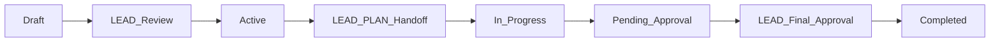

# CLAUDE.md - LEO Protocol Workflow Guide for AI Agents

## ⚠️ DYNAMICALLY GENERATED FROM DATABASE
**Last Generated**: 2025-09-22 8:14:13 AM
**Source**: Supabase Database (not files)
**Auto-Update**: Run `node scripts/generate-claude-md-from-db.js` anytime

## 🟢 CURRENT LEO PROTOCOL VERSION: vv4.2.0_story_gates

**CRITICAL**: This is the ACTIVE version from database
**ID**: leo-v4-2-0-story-gates
**Status**: ACTIVE
**Title**: LEO Protocol v4.2.0 - Story Gates & Automated Release Control

### 📅 Protocol Management

**Database-First Architecture**:
- Protocol stored in `leo_protocols` table
- Sub-agents in `leo_sub_agents` table  
- Handoffs in `leo_handoff_templates` table
- Single source of truth - no file conflicts

**To update protocol version**:
```sql
-- Only via database operations
UPDATE leo_protocols SET status = 'active' WHERE version = 'new_version';
UPDATE leo_protocols SET status = 'superseded' WHERE version != 'new_version';
```

## Agent Responsibilities


### Implementation Agent (EXEC)
- **Responsibilities**: Implementation based on PRD, no validation
- **Planning**: 0%
- **Implementation**: 30%
- **Verification**: 0%
- **Approval**: 0%
- **Total**: 30%

### Strategic Leadership Agent (LEAD)
- **Responsibilities**: Strategic planning, business objectives, final approval
- **Planning**: 20%
- **Implementation**: 0%
- **Verification**: 0%
- **Approval**: 15%
- **Total**: 35%

### Technical Planning Agent (PLAN)
- **Responsibilities**: Technical design, PRD creation with comprehensive and detailed test plans, pre-automation validation, acceptance testing
- **🔍 Supervisor Mode**: Final "done done" verification with all sub-agents
- **Planning**: 20%
- **Implementation**: 0%
- **Verification**: 15%
- **Approval**: 0%
- **Total**: 35%

## 🚨 EXEC Agent Implementation Requirements

### MANDATORY Pre-Implementation Verification
Before writing ANY code, EXEC MUST:

1. **URL Verification** ✅
   - Navigate to the EXACT URL specified in the PRD
   - Confirm the page loads and is accessible
   - Take a screenshot for evidence
   - Document: "Verified: [URL] is accessible"

2. **Component Identification** 🎯
   - Identify the exact file path of the target component
   - Confirm component exists at specified location
   - Document: "Target component: [full/path/to/component.tsx]"

3. **Application Context** 📁
   - Verify correct application directory
   - Confirm port number matches PRD
   - Document: "Application: [/path/to/app] on port [XXXX]"

4. **Visual Confirmation** 📸
   - Screenshot current state BEFORE changes
   - Identify exact location for new features
   - Document: "Current state captured, changes will go at [location]"

### Implementation Checklist Template
```markdown
## EXEC Pre-Implementation Checklist
- [ ] URL verified: [exact URL from PRD]
- [ ] Page accessible: [YES/NO]
- [ ] Component identified: [path/to/component]
- [ ] Application path: [/full/path/to/app]
- [ ] Port confirmed: [port number]
- [ ] Screenshot taken: [timestamp]
- [ ] Target location confirmed: [where changes go]
```

### Common Mistakes to AVOID
- ❌ Assuming component location based on naming similarity
- ❌ Implementing without navigating to the URL first
- ❌ Ignoring port numbers in URLs
- ❌ Pattern matching without verification
- ❌ Starting to code before completing checklist
- ❌ Not restarting dev servers after changes
- ❌ **CRITICAL**: Creating files for PRDs, handoffs, or documentation

## 🚨 DATABASE-ONLY ENFORCEMENT

### ABSOLUTE PROHIBITION: No File Creation
LEO Protocol v4.1.2 is **DATABASE-FIRST ONLY**. **NEVER** create:
- ❌ PRD markdown files (`.md`)
- ❌ Handoff documents 
- ❌ Verification reports
- ❌ Any work-related documentation files

### REQUIRED: Database Operations Only
- ✅ PRDs: Use `scripts/add-prd-to-database.js`
- ✅ Handoffs: Store in handoff tracking tables
- ✅ Progress: Update database fields directly
- ✅ Verification: Store results in database

### If You Create Files By Mistake:
1. **STOP immediately**
2. Extract content to database
3. Delete the files
4. Update progress tracking
5. Verify dashboard shows correct status

### 🔄 MANDATORY: Server Restart Protocol
After ANY code changes:
1. **Kill the dev server**: `kill [PID]` or Ctrl+C
2. **Restart the server**: `npm run dev` or appropriate command
3. **Wait for ready message**: Confirm server is fully started
4. **Hard refresh browser**: Ctrl+Shift+R / Cmd+Shift+R
5. **Verify changes are live**: Test the new functionality

**WHY**: Dev servers may cache components, especially new files. Hot reload is NOT always reliable.

## Progress Calculation

```
Total = ${agents.map(a => `${a.agent_code}: ${a.total_percentage}%`).join(' + ')} = 100%
```

## 🎯 LEAD Agent Operations

### Finding Active Strategic Directives

As the LEAD agent, you have immediate access to strategic directives:

**Quick Command**:
```bash
node scripts/query-active-sds.js
```

**Direct Database Query**:
```javascript
const { data: activeSDs } = await supabase
  .from('strategic_directives_v2')
  .select('*')
  .in('status', ['draft', 'in_progress', 'active', 'pending_approval'])
  .order('priority', { ascending: false })
  .order('created_at', { ascending: false });
```

### LEAD Decision Matrix

| SD Status | LEAD Action | Command/Script |
|-----------|-------------|----------------|
| **Draft** | Review & approve | `node scripts/lead-approve-sdip.js` |
| **Pending Approval** | Final review | `node scripts/conduct-lead-approval-assessment.js` |
| **Active** | Create LEAD→PLAN handoff | `node scripts/create-exec-to-plan-handoff.js` |
| **In Progress** | Monitor execution | `node scripts/debug-dashboard-progress.js` |

### Key LEAD Responsibilities

1. **Strategic Direction**
   - Define business objectives
   - Set priorities (CRITICAL: 90+, HIGH: 70-89, MEDIUM: 50-69, LOW: 30-49)
   - Approve strategic directives

2. **Handoff Creation**
   - LEAD→PLAN: Strategic objectives to technical planning
   - Must include all 7 mandatory elements
   - Use `node scripts/unified-handoff-system.js`

3. **Progress Monitoring**
   - Review SD progress: `node scripts/test-progress-calculation.js`
   - Check phase completion: `node scripts/complete-lead-phase.js`
   - Final approval: `node scripts/start-lead-approval.js`

### Strategic Directive Lifecycle



### 📋 Directive Submission Review Process

**CRITICAL**: Directive submissions contain essential context not present in SDs. Always review linked submissions before making strategic decisions.

#### Step-by-Step Review Workflow

1. **Query Pending Submissions**:
```javascript
// Find submissions needing LEAD review
const { data: pendingSubmissions } = await supabase
  .from('directive_submissions')
  .select('*')
  .in('status', ['pending_review', 'completed'])
  .is('gate_status->resulting_sd_id', null)
  .order('created_at', { ascending: false });
```

2. **Get Full Submission Context**:
```javascript
// Retrieve submission with linked SD (if exists)
const { data: submission } = await supabase
  .from('directive_submissions')
  .select(\`
    *,
    linked_sd:strategic_directives_v2!gate_status->resulting_sd_id(*)
  \`)
  .eq('id', submission_id)
  .single();
```

3. **Review Checklist**:
- [ ] **Original Input**: Review chairman_input for true intent
- [ ] **Intent Clarity**: Verify intent_summary captures essence
- [ ] **Visual Context**: Check screenshot_url if provided
- [ ] **Strategic Alignment**: Assess fit with organizational goals
- [ ] **Priority Assessment**: Determine business impact (Critical/High/Medium/Low)
- [ ] **Scope Validation**: Ensure scope is achievable and clear
- [ ] **Duplicate Check**: Verify no existing SDs cover this need
- [ ] **Gate Progression**: Confirm all validation gates passed

4. **Decision Matrix**:

| Submission State | Gate Status | LEAD Action | Command |
|-----------------|-------------|-------------|---------|
| Completed + No SD | Gates passed | Create SD | `node scripts/create-sd-from-submission.js` |
| Completed + SD exists | Linked to SD | Verify & handoff | `node scripts/unified-handoff-system.js` |
| Pending | Gates incomplete | Monitor | `node scripts/check-submission-status.js` |
| Failed validation | Gates failed | Archive/remediate | `node scripts/archive-submission.js` |

5. **Quick Review Command**:
```bash
node scripts/lead-review-submissions.js
```

#### Critical Context Elements

When reviewing submissions, pay special attention to:
- **Chairman Input**: The unfiltered original request
- **Screenshot URL**: Visual context for UI/UX requests  
- **SDIP ID**: For tracking through the processing pipeline
- **Processing History**: Number of steps and iterations
- **Metadata**: Additional context from processing

#### Linking Submissions to Strategic Directives

When creating an SD from a submission:
1. Include submission_id in SD metadata
2. Reference key context in SD description
3. Preserve chairman's original intent
4. Map submission scope to SD objectives

## Mandatory Handoff Requirements

Every handoff MUST include these 7 elements:
${handoffTemplates.length > 0 ? handoffTemplates[0].template_structure.sections.map((s, i) => `${i+1}. ${s}`).join('\n') : '(Loading from database...)'}

Missing ANY element = AUTOMATIC REJECTION

## Sub-Agent System (Database-Driven)

### Active Sub-Agents

| Sub-Agent | Code | Activation | Priority |
|-----------|------|------------|----------|
${subAgents.map(sa => `| ${sa.name} | ${sa.code} | ${sa.activation_type} | ${sa.priority} |`).join('\n')}

### Sub-Agent Activation Triggers


#### Security Sub-Agent Triggers:
- "authentication" (keyword) in any context
- "security" (keyword) in any context

#### Database Sub-Agent Triggers:
- "schema" (keyword) in any context
- "migration" (keyword) in any context

#### Testing Sub-Agent Triggers:
- "coverage" (keyword) in any context

#### Performance Sub-Agent Triggers:
- "optimization" (keyword) in any context

#### Design Sub-Agent Triggers:
- "accessibility" (keyword) in any context

### Sub-Agent Activation Process

When triggers are detected, EXEC MUST:

1. **Query Database for Active Triggers**
   ```sql
   SELECT * FROM leo_sub_agent_triggers 
   WHERE active = true 
   AND trigger_phrase IN (detected_phrases);
   ```

2. **Create Formal Handoff** (7 elements from database template)

3. **Execute Sub-Agent** 
   - Option A: Run tool from `script_path` field
   - Option B: Use context from `context_file` field
   - Option C: Document analysis if no tool exists

4. **Store Results in Database**
   ```sql
   INSERT INTO sub_agent_executions (sub_agent_id, results, ...);
   ```

### Handoff Templates


#### PLAN → EXEC (technical_to_implementation)
Elements: Executive Summary, Completeness Report, Deliverables Manifest, Key Decisions & Rationale, Known Issues & Risks, Resource Utilization, Action Items for Receiver
Required: [object Object], [object Object], [object Object], [object Object]


#### LEAD → PLAN (strategic_to_technical)
Elements: Executive Summary, Completeness Report, Deliverables Manifest, Key Decisions & Rationale, Known Issues & Risks, Resource Utilization, Action Items for Receiver
Required: [object Object], [object Object], [object Object]


#### EXEC → PLAN (implementation_to_verification)
Elements: Executive Summary, Completeness Report, Deliverables Manifest, Key Decisions & Rationale, Known Issues & Risks, Resource Utilization, Action Items for Receiver
Required: [object Object], [object Object], [object Object]


## Validation Rules (From Database)

No validation rules in database

## Database Schema Overview

### Core Tables
- `leo_protocols` - Protocol versions and content
- `leo_protocol_sections` - Modular protocol sections
- `leo_agents` - Agent definitions and percentages
- `leo_handoff_templates` - Standardized handoffs
- `leo_sub_agents` - Sub-agent definitions
- `leo_sub_agent_triggers` - Activation rules
- `leo_validation_rules` - Protocol validation

### Key Queries

**Get Current Protocol**:
```sql
SELECT * FROM leo_protocols WHERE status = 'active';
```

**Check Sub-Agent Triggers**:
```sql
SELECT sa.*, t.* 
FROM leo_sub_agents sa
JOIN leo_sub_agent_triggers t ON sa.id = t.sub_agent_id
WHERE t.trigger_phrase ILIKE '%keyword%';
```

**Get Handoff Template**:
```sql
SELECT * FROM leo_handoff_templates 
WHERE from_agent = 'EXEC' AND to_agent = 'PLAN';
```

## API Endpoints (Database-Backed)

- `GET /api/leo/current` - Current active protocol
- `GET /api/leo/agents` - All agents with percentages
- `GET /api/leo/sub-agents` - Active sub-agents with triggers
- `GET /api/leo/handoffs/:from/:to` - Handoff template
- `POST /api/leo/validate` - Validate against rules

## Key Scripts (Database-Aware)

- `get-latest-leo-protocol-from-db.js` - Get version from database
- `generate-claude-md-from-db.js` - Generate this file
- `migrate-leo-protocols-to-database.js` - Migration tool
- `activate-sub-agents-from-db.js` - Check database triggers

## Compliance Tools

All tools now query database instead of files:

### 1. Version Check
```bash
node scripts/get-latest-leo-protocol-from-db.js
```

### 2. Update CLAUDE.md
```bash
node scripts/generate-claude-md-from-db.js
```

### 3. Validate Handoff
```bash
node scripts/leo-checklist-db.js [agent-name]
```

## 🔍 PLAN Supervisor Verification

### Overview
PLAN agent now includes supervisor capabilities for final "done done" verification:
- Queries ALL sub-agents for their verification results
- Ensures all requirements are truly met
- Resolves conflicts between sub-agent reports
- Provides confidence scoring and clear pass/fail verdict

### Activation
Trigger PLAN supervisor verification via:
- **Command**: `/leo-verify [what to check]`
- **Script**: `node scripts/plan-supervisor-verification.js --prd PRD-ID`
- **Automatic**: When testing phase completes

### Verification Process
1. **Read-Only Access**: Queries existing sub-agent results (no re-execution)
2. **Summary-First**: Prevents context explosion with tiered reporting
3. **Conflict Resolution**: Priority-based rules (Security > Database > Testing)
4. **Circuit Breakers**: Graceful handling of sub-agent failures
5. **Maximum 3 Iterations**: Prevents infinite verification loops

### Verdicts
- **PASS**: All requirements met, high confidence (≥85%)
- **FAIL**: Critical issues or unmet requirements
- **CONDITIONAL_PASS**: Minor issues, needs LEAD review
- **ESCALATE**: Cannot reach consensus, needs LEAD intervention

## Dashboard Integration

Dashboard automatically connects to database:
- Real-time protocol updates via Supabase subscriptions
- Version detection from `leo_protocols` table
- Sub-agent status from `leo_sub_agents` table
- PLAN supervisor verification status
- No file scanning needed

## Important Notes

1. **Database is Source of Truth** - Files are deprecated
2. **Real-time Updates** - Changes reflect immediately
3. **No Version Conflicts** - Single active version enforced
4. **Audit Trail** - All changes tracked in database
5. **WebSocket Updates** - Dashboard stays synchronized
6. **PLAN Supervisor** - Final verification before LEAD approval

## 🗄️ Supabase Database Operations

### Connection Details
- **Project URL**: https://dedlbzhpgkmetvhbkyzq.supabase.co
- **Project ID**: dedlbzhpgkmetvhbkyzq
- **Connection**: Via Supabase client using environment variables

### Creating Database Tables

#### Method 1: Using RPC Function (if available)
```javascript
const { error } = await supabase.rpc('execute_sql', {
  sql: 'CREATE TABLE IF NOT EXISTS ...'
});
```

#### Method 2: Using psql Command
```bash
# If DATABASE_URL is available in .env
psql $DATABASE_URL -f path/to/migration.sql
```

#### Method 3: Supabase Dashboard (always works)
1. Go to: https://supabase.com/dashboard/project/dedlbzhpgkmetvhbkyzq
2. Navigate to SQL Editor
3. Paste and execute SQL

### Key Database Operations Scripts
- `scripts/execute-leo-protocol-sql.js` - Execute protocol migrations
- `scripts/create-leo-protocol-tables.js` - Create LEO tables
- `scripts/apply-supervisor-safe.sql` - PLAN supervisor tables
- `database/schema/` - All schema definitions

## 🔧 CRITICAL DEVELOPMENT WORKFLOW

### ⚠️ Server Restart Protocol (MANDATORY)

**After ANY changes to the application, you MUST**:
1. **Kill the server process**
2. **Build the React client** (if UI changes were made)
3. **Restart the server**

```bash
# Method 1: Using process management
pkill -f "node server.js"

# Method 2: If running in Claude Code background
# Use KillBash tool with shell_id

# Build React client (REQUIRED for UI/component changes)
cd /mnt/c/_EHG/EHG_Engineer
npm run build:client

# Restart server
PORT=3000 node server.js
```

### Why This is Required

**React Build Process**:
- React components are compiled from `src/client/src/` to `src/client/dist/`
- Server serves static files from `dist`, not source files
- CSS changes must be bundled and minified via Vite
- No hot-reloading is configured in this setup

**File Structure**:
```
src/client/
├── src/               # Source files (your edits)
│   ├── components/    # React components
│   └── styles/        # CSS files
└── dist/              # Built files (served by server)
    ├── index.html
    └── assets/
```

### Development Commands

```bash
# Complete development cycle
cd /mnt/c/_EHG/EHG_Engineer
npm run build:client && PORT=3000 node server.js

# Build client only
npm run build:client

# Check if server is running
lsof -i :3000
```

### Environment Variables Required
```env
NEXT_PUBLIC_SUPABASE_URL=https://dedlbzhpgkmetvhbkyzq.supabase.co
NEXT_PUBLIC_SUPABASE_ANON_KEY=[your-anon-key]
# Optional: SUPABASE_SERVICE_ROLE_KEY for admin operations
# Optional: DATABASE_URL for direct psql access
```

---

*Generated from Database: 2025-09-22*
*Protocol Version: vv4.2.0_story_gates*
*Database-First Architecture: ACTIVE*
