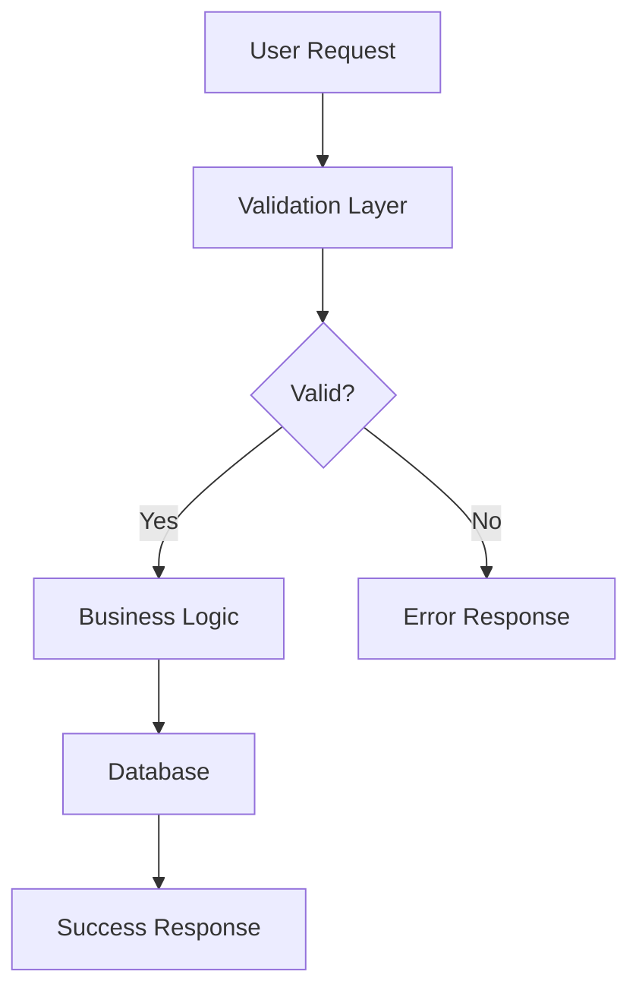
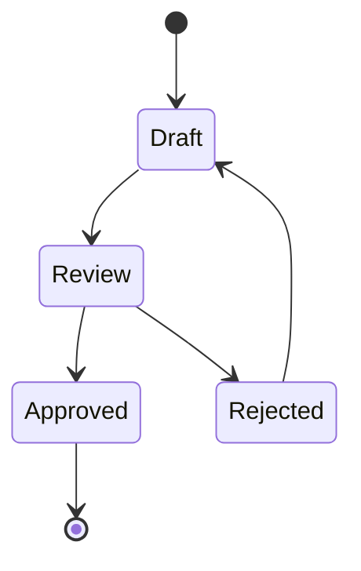
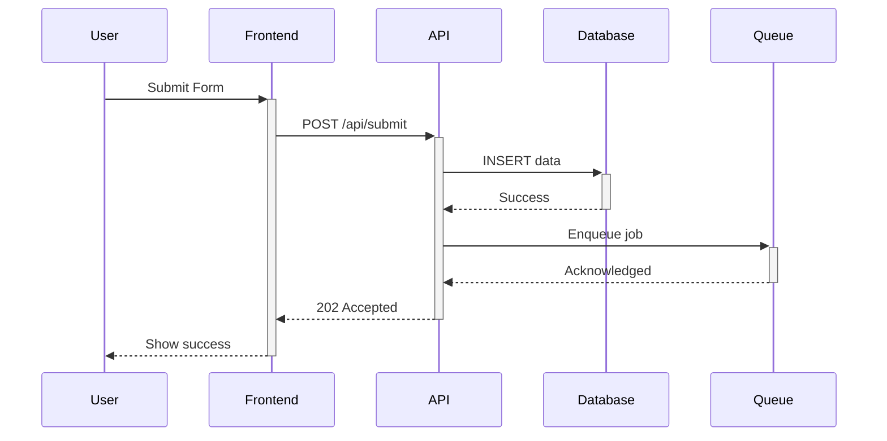

# CLAUDE_PLAN.md - PLAN Phase Operations

**Generated**: 2026-01-02 8:31:59 AM
**Protocol**: LEO 4.3.3
**Purpose**: PLAN agent operations, PRD creation, validation gates (30-35k chars)

---

## 🚫 MANDATORY: Phase Transition Commands (BLOCKING)

**Anti-Bypass Protocol**: These commands MUST be run for ALL phase transitions. Do NOT use database-agent to create handoffs directly.

### ⛔ NEVER DO THIS:
- Using `database-agent` to directly insert into `sd_phase_handoffs`
- Creating handoff records without running validation scripts
- Skipping preflight knowledge retrieval

### ✅ ALWAYS DO THIS:

#### LEAD → PLAN Transition
```bash
node scripts/phase-preflight.js --phase PLAN --sd-id SD-XXX-001
node scripts/handoff.js execute LEAD-TO-PLAN SD-XXX-001
```

#### PLAN → EXEC Transition
```bash
node scripts/phase-preflight.js --phase EXEC --sd-id SD-XXX-001
node scripts/handoff.js execute PLAN-TO-EXEC SD-XXX-001
```

#### EXEC → PLAN Transition (Verification)
```bash
node scripts/handoff.js execute EXEC-TO-PLAN SD-XXX-001
```

#### PLAN → LEAD Transition (Final Approval)
```bash
node scripts/handoff.js execute PLAN-TO-LEAD SD-XXX-001
```

### Compliance Check
```bash
npm run handoff:compliance SD-XXX-001
```

**Database trigger now BLOCKS direct inserts. You MUST use the scripts above.**

## 🎯 Multi-Perspective Planning

## Multi-Perspective Planning

### When to Use Plan Agents

Before creating a PRD, consider launching multiple `Plan` agents to explore different approaches:

**Use Plan agents when**:
- Multiple valid architectures exist
- Trade-offs between simplicity/performance/extensibility
- Uncertain about best approach
- Complex feature with many moving parts

**Skip Plan agents when**:
- Approach is obvious
- Small, well-scoped changes
- Following established patterns exactly
- Trivial bug fixes

### Pattern: Perspectives → Selection → PRD

**Step 1: Launch Plan Agents (Parallel)**
```
Task(subagent_type="Plan", prompt="Design from SIMPLICITY perspective: What is the minimal viable approach that solves the problem with the least complexity?")

Task(subagent_type="Plan", prompt="Design from EXISTING PATTERNS perspective: How can we reuse existing infrastructure, components, and patterns already in the codebase?")

Task(subagent_type="Plan", prompt="Design from EXTENSIBILITY perspective: What design would best support future enhancements while avoiding over-engineering?")
```

**Step 2: Present Options to Human**
- Summarize each perspective (key trade-offs)
- Highlight pros/cons
- Recommend one approach with rationale

**Step 3: Human Selects Approach**

**Step 4: Create PRD Based on Selection**
```bash
node scripts/add-prd-to-database.js --sd-id=<SD-ID>
```

**Step 5: Validate PRD with Sub-Agents (MANDATORY)**

⚠️ **CRITICAL**: Use Task tool with specialized sub-agents, NOT the sub-agent-executor script:

```
# CORRECT - Use Task tool with subagent_type
Task(subagent_type="design-agent", prompt="Execute DESIGN analysis for SD-XXX. Analyze UI components, patterns, accessibility. Store results in sub_agent_execution_results table.")

Task(subagent_type="database-agent", prompt="Execute DATABASE analysis for SD-XXX. Verify schema, RLS policies, query patterns. Store results in sub_agent_execution_results table.")
```

**Why Task tool?** The sub-agent-executor.js is a framework for automated pipelines. For interactive sessions, the Task tool properly invokes agents with full context and stores results.

### Perspective Examples by Task Type

| Task Type | Perspective 1 | Perspective 2 | Perspective 3 |
|-----------|--------------|--------------|--------------|
| New feature | Simplicity | Performance | Maintainability |
| Bug fix | Root cause fix | Quick workaround | Prevention strategy |
| Refactoring | Minimal change | Clean architecture | Gradual migration |
| UI work | User experience | Developer experience | Accessibility |
| API design | RESTful purity | Client convenience | Backwards compatibility |
| Database | Normalized schema | Query performance | Migration safety |

### Quality Over Quantity

Launch 1-3 Plan agents based on complexity:
- **1 agent**: Approach is mostly clear, want sanity check
- **2 agents**: Genuine trade-off between two approaches
- **3 agents**: Complex decision with multiple valid paths

Do NOT launch 3 agents for every task—that wastes time on simple decisions.

## PLAN Phase Negative Constraints

## 🚫 PLAN Phase Negative Constraints

<negative_constraints phase="PLAN">
These anti-patterns are specific to the PLAN phase. Violating them leads to incomplete PRDs and blocked handoffs.

### NC-PLAN-001: No Implementation in PLAN Phase
**Anti-Pattern**: Writing actual code (components, services, migrations) during PLAN
**Why Wrong**: PLAN is for specification, not execution. Code written here won't be tracked.
**Correct Approach**: Document requirements, architecture, and test scenarios. Save coding for EXEC.

### NC-PLAN-002: No PRD Without Exploration
**Anti-Pattern**: Creating PRD immediately after SD approval without reading codebase
**Why Wrong**: PRDs miss existing infrastructure, create duplicate work, conflict with patterns
**Correct Approach**: Read ≥5 relevant files, document findings in exploration_summary

### NC-PLAN-003: No Boilerplate Acceptance Criteria
**Anti-Pattern**: Using generic criteria like "all tests pass", "code review done", "meets requirements"
**Why Wrong**: Russian Judge detects boilerplate (≤50% score), blocks PLAN→EXEC handoff
**Correct Approach**: Write specific, measurable criteria tied to functional requirements

### NC-PLAN-004: No Skipping Sub-Agents
**Anti-Pattern**: Creating PRD without running DESIGN, DATABASE sub-agents
**Why Wrong**: Gate 1 blocks handoff if sub-agent execution not recorded
**Correct Approach**: Use Task tool with specialized sub-agents:
```
Task(subagent_type="design-agent", prompt="Execute DESIGN analysis for SD-XXX...")
Task(subagent_type="database-agent", prompt="Execute DATABASE analysis for SD-XXX...")
```
⚠️ Do NOT use `node lib/sub-agent-executor.js` in interactive sessions - use Task tool instead.

### NC-PLAN-005: No Placeholder Requirements
**Anti-Pattern**: Using "TBD", "to be defined", "will be determined" in requirements
**Why Wrong**: PRD validator blocks placeholders, signals incomplete planning
**Correct Approach**: If truly unknown, use AskUserQuestion to clarify before PRD creation
</negative_constraints>

## Deferred Work Management

### What Gets Deferred
- Technical debt discovered during implementation
- Edge cases not critical for MVP
- Performance optimizations for later
- Nice-to-have features

### Creating Deferred Items
```sql
INSERT INTO deferred_work (sd_id, title, reason, priority)
VALUES ('SD-XXX', 'Title', 'Reason for deferral', 'low');
```

### Tracking
- Deferred items linked to parent SD
- Reviewed during retrospective
- May become new SDs if significant

### Rules
- Document WHY deferred, not just WHAT
- Set realistic priority (critical items shouldn't be deferred)
- Max 5 deferred items per SD

## PRD Template Scaffolding

## 📋 PRD Template Scaffolding

When creating a PRD, use this scaffold as a starting point. Fill in each section with specific, measurable content.

### PRD Creation Checklist

Before running `node scripts/add-prd-to-database.js`:

1. **Exploration Complete?** (Discovery Gate)
   - [ ] Read ≥5 relevant files
   - [ ] Documented findings in exploration_summary
   - [ ] Identified existing patterns to follow

2. **Requirements Specific?** (Russian Judge)
   - [ ] No "TBD" or placeholder text
   - [ ] Each requirement has acceptance criteria
   - [ ] Test scenarios are concrete (not "verify it works")

3. **Architecture Defined?**
   - [ ] Integration points identified
   - [ ] Data flow documented
   - [ ] Dependencies listed

### PRD Section Guide

| Section | Guiding Questions | Example |
|---------|-------------------|---------|
| **executive_summary** | What? Why? Impact? | "This PRD defines X to solve Y, reducing Z by N%" |
| **functional_requirements** | What must it do? How measured? | FR-1: System shall display X when Y occurs |
| **technical_requirements** | What technologies? Constraints? | Must integrate with existing Supabase RLS |
| **system_architecture** | How do components interact? | Data flows: API → Service → Database |
| **test_scenarios** | How do we verify? Edge cases? | TS-1: Given empty input, should show validation error |
| **acceptance_criteria** | How do we know it's done? | All E2E tests pass, Russian Judge ≥70% |
| **risks** | What could go wrong? Mitigations? | Risk: API rate limits. Mitigation: caching layer |

### PRD Script Usage

```bash
# Create PRD with all required fields
node scripts/add-prd-to-database.js \
  --sd-id SD-XXX-001 \
  --title "Feature Name" \
  --status planning

# Or use the generated script template:
node scripts/create-prd-sd-xxx-001.js
```

### Self-Critique Before Handoff

Before submitting PLAN→EXEC handoff, ask yourself:
- **Confidence (1-10)**: How confident am I this PRD is complete?
- **Gaps**: What areas might need clarification during EXEC?
- **Assumptions**: What am I assuming that should be validated?

If confidence < 7, revisit the PRD before handoff.

## Stubbed/Mocked Code Detection


**CRITICAL: Stubbed/Mocked Code Detection** (MANDATORY):

Before PLAN→LEAD handoff, MUST verify NO stubbed/mocked code in production files:

**Check For** (BLOCKING if found):
```bash
# 1. TEST_MODE flags in production code
grep -r "TEST_MODE.*true\|NODE_ENV.*test" lib/ src/ --exclude-dir=test

# 2. Mock/stub patterns
grep -r "MOCK:\|STUB:\|TODO:\|PLACEHOLDER:\|DUMMY:" lib/ src/ --exclude-dir=test

# 3. Commented-out implementations
grep -r "// REAL IMPLEMENTATION\|// TODO: Implement" lib/ src/ --exclude-dir=test

# 4. Mock return values without logic
grep -r "return.*mock.*result\|return.*dummy" lib/ src/ --exclude-dir=test
```

**Acceptable Patterns** ✅:
- `TEST_MODE` in test files (`tests/`, `*.test.js`, `*.spec.js`)
- TODO comments with SD references for future work: `// TODO (SD-XXX): Implement caching`
- Feature flags with proper configuration: `if (config.enableFeature)`

**BLOCKING Patterns** ❌:
- `const TEST_MODE = process.env.TEST_MODE === 'true'` in production code
- `return { verdict: 'PASS' }` without actual logic
- `console.log('MOCK: Using dummy data')`
- Empty function bodies: `function execute() { /* TODO */ }`
- Commented-out real implementations

**Verification Script**:
```bash
# Create verification script
node scripts/detect-stubbed-code.js <SD-ID>
```

**Manual Code Review**:
- Read all modified files from git diff
- Verify implementations are complete
- Check for placeholder comments
- Validate TEST_MODE usage is test-only

**Exit Requirement**: Zero stubbed code in production files, OR documented in "Known Issues" with follow-up SD created.


## ✅ Scope Verification with Explore (PLAN_VERIFY)

## Scope Verification with Explore

### Pattern: Explore → Compare → Validate

After EXEC completes, use Explore agent to verify implementation matches plan BEFORE running formal validation:

**Step 1: Launch Explore Agent**
```
Task(subagent_type="Explore", prompt="What files were modified for SD-XXX? List all changed files and compare to the PRD scope. Flag any changes outside the expected scope.")
```

**Step 2: Compare to Plan/PRD**
- Files modified match PRD scope?
- Any unexpected changes outside scope?
- Any PRD requirements not addressed?
- Any TODO comments left unresolved?

**Step 3: Flag Deviations**
- **Scope creep detected** → Document and discuss with human before proceeding
- **Missing requirements** → Complete before validation
- **Unintended changes** → Revert or justify

**Step 4: Run Formal Validation**
```bash
node scripts/qa-engineering-director-enhanced.js <SD-ID> --full-e2e
node scripts/github-actions-verifier.js <SD-ID>
```

### Why Explore Before Validation?

| Without Explore First | With Explore First |
|-----------------------|-------------------|
| E2E tests run on wrong/extra code | Scope verified before testing |
| Validation fails late with unclear cause | Deviations caught early |
| Wasted CI/CD cycles | Faster feedback loop |
| Scope creep goes unnoticed | Changes documented explicitly |

### Explore Questions for PLAN_VERIFY

Use these prompts to verify scope compliance:

1. **File inventory**: "List all files modified since EXEC started for this SD"
2. **Scope check**: "Which of these changes are outside the PRD scope?"
3. **Completeness check**: "Are there any PRD requirements not yet addressed?"
4. **Code quality**: "Are there any TODO comments or incomplete implementations?"
5. **Test coverage**: "Do the test files cover all PRD requirements?"

### Example Verification Flow

```
Claude: "EXEC is complete. Let me verify scope compliance before formal validation."

Task(subagent_type="Explore", prompt="List all files modified for SD-AUTH-001 and compare to PRD scope")

[Explore returns:
- Modified: src/auth/login.tsx (in scope)
- Modified: src/auth/session.ts (in scope)
- Modified: src/utils/helpers.ts (NOT in PRD)
- Created: tests/auth.spec.ts (in scope)]

Claude: "Found one file modified outside PRD scope: src/utils/helpers.ts.
This change [describe]. Options:
1. Keep change (document as necessary dependency)
2. Revert change (not needed for this SD)
3. Create follow-up SD for this change

Which do you prefer?"
```

## Enhanced QA Engineering Director v2.0 - Testing-First Edition

**Enhanced QA Engineering Director v2.0**: Mission-critical testing automation with comprehensive E2E validation.

**Core Capabilities:**
1. Professional test case generation from user stories
2. Pre-test build validation (saves 2-3 hours)
3. Database migration verification (prevents 1-2 hours debugging)
4. **Mandatory E2E testing via Playwright** (REQUIRED for approval)
5. Test infrastructure discovery and reuse

**5-Phase Workflow**: Pre-flight checks → Test generation → E2E execution → Evidence collection → Verdict & learnings

**Activation**: Auto-triggers on `EXEC_IMPLEMENTATION_COMPLETE`, coverage keywords, testing evidence requests

**Full Guide**: See `docs/reference/qa-director-guide.md`

## Database Schema Documentation

### Database Schema Documentation

Auto-generated schema docs provide quick reference without database queries:

**Paths**:
- EHG_Engineer: `docs/reference/schema/engineer/database-schema-overview.md`
- EHG App: `docs/reference/schema/ehg/database-schema-overview.md`

**Update**: `npm run schema:docs:engineer` or `npm run schema:docs:ehg`

**PRD Integration**: PRDs stored in `product_requirements_v2` table (NOT markdown).
Use `add-prd-to-database.js` to create PRDs with schema review prompts.


## PLAN Pre-EXEC Checklist

## PLAN Agent Pre-EXEC Checklist (MANDATORY)

**Evidence from Retrospectives**: Database verification issues appeared in SD-UAT-003, SD-UAT-020, and SD-008. Early verification saves 2-3 hours per blocker.

Before creating PLAN→EXEC handoff, PLAN agent MUST verify:

### Database Dependencies ✅
- [ ] **Identify all data dependencies** in PRD
- [ ] **Run schema verification script** for data-dependent SDs
- [ ] **Verify tables/columns exist** OR create migration
- [ ] **Document verification results** in PLAN→EXEC handoff
- [ ] If tables missing: **Escalate to LEAD** with options

**Success Pattern** (SD-UAT-003):
> "Database Architect verification provided evidence for LEAD decision. Documented instead of implementing → saved 4-6 hours"

### Architecture Planning ✅
- [ ] **Component sizing estimated** (target 300-600 lines per component)
- [ ] **Existing infrastructure identified** (don't rebuild what exists)
- [ ] **Third-party libraries considered** before custom code

**Success Pattern** (SD-UAT-020):
> "Leveraged existing Supabase Auth instead of building custom → saved 8-10 hours"

### Testing Strategy ✅
- [ ] **Smoke tests defined** (3-5 tests minimum)
- [ ] **Test scenarios documented** in PRD

### Quality Validation ✅
- [ ] **Verified claims with code review** (if UI/UX SD)
- [ ] **Assessed technical feasibility**
- [ ] **Identified potential blockers**

**Success Pattern** (SD-UAT-002):
> "LEAD code review rejected 3/5 false claims → saved hours of unnecessary work"


## 🧪 Test Infrastructure Readiness Gate (Before PLAN→EXEC)

**Source**: Retrospective analysis of SD-STAGE4-AI-FIRST-UX-001, SD-VENTURE-UNIFICATION-001

**Failure Pattern**: "Testing infrastructure validated AFTER implementation" caused:
- 28/32 E2E test failures (mock API config not planned)
- 11/18 unit test timeouts (vitest async issues)
- 2-4 hours of debugging per SD

### MANDATORY Verification Before PLAN→EXEC Handoff

```markdown
## Test Infrastructure Readiness Checklist

### Authentication
- [ ] Test user exists in database (query auth.users)
- [ ] Test credentials match .env.test.local
- [ ] Manual login works: `npm run test:auth:verify` or manual browser test
- [ ] Service role key is valid (for admin operations)

### Unit Tests
- [ ] `npm run test:unit` runs without infrastructure errors
- [ ] Baseline count documented: ___ passing / ___ failing
- [ ] No timeout issues (if vitest, check async handling)

### E2E Tests
- [ ] Playwright installed: `npx playwright --version`
- [ ] Browser dependencies: `npx playwright install`
- [ ] `npm run test:e2e -- --list` shows available tests
- [ ] Mock API configuration reviewed (if applicable)

### Environment
- [ ] .env.test exists with test database credentials
- [ ] Test database is accessible
- [ ] No port conflicts with dev server
```

### Exit Criteria

**BLOCKING**: Do NOT approve PLAN→EXEC handoff if:
- Test user authentication fails
- Unit test suite has infrastructure errors (not test failures)
- E2E environment is not configured

**Pattern Reference**: PAT-RECURSION-005, PAT-AUTH-PW-001

### Why This Gate Exists

From retrospectives:
> "Testing infrastructure validated AFTER implementation = failure pattern"
> "E2E test suite created but never executed due to auth blocker"
> "Mock API configuration not planned upfront"

**Time saved**: 2-4 hours per SD by catching infrastructure issues before implementation.

## Testing Tier Strategy

## Testing Requirements - Clear Thresholds

**Evidence from Retrospectives**: Testing confusion appeared in SD-UAT-002, SD-UAT-020, SD-008.

### Three-Tier Testing Strategy

#### Tier 1: Smoke Tests (MANDATORY) ✅
- **Requirement**: 3-5 tests, <60 seconds execution
- **Approval**: **SUFFICIENT for PLAN→LEAD approval**

#### Tier 2: Comprehensive E2E (RECOMMENDED) 📋
- **Requirement**: 30-50 tests covering user flows
- **Approval**: Nice to have, **NOT blocking for LEAD approval**
- **Timing**: Can be refined post-deployment

#### Tier 3: Manual Testing (SITUATIONAL) 🔍
- **UI changes**: Single smoke test recommended (+5 min)
- **Logic changes <5 lines**: Optional
- **Logic changes >10 lines**: Required

### Anti-Pattern to Avoid ❌

**DO NOT** create 100+ manual test checklists unless specifically required.

**From SD-UAT-020**:
> "Created 100+ test checklist but didn't execute manually. Time spent on unused documentation."

## 🔬 BMAD Method Enhancements

## BMAD Enhancements

### 6 Key Improvements
1. **Unified Handoff System** - All handoffs via `handoff.js`
2. **Database-First PRDs** - PRDs stored in database, not markdown
3. **Validation Gates** - 4-gate validation before EXEC
4. **Progress Tracking** - Automatic progress % calculation
5. **Context Management** - Proactive monitoring, compression strategies
6. **Sub-Agent Compression** - 3-tier output reduction

### Using Handoff System
```bash
node scripts/handoff.js create "{message}"
```

### PRD Creation
```bash
node scripts/add-prd-to-database.js {SD-ID}
```

### Never Bypass
- ⚠️ Always use process scripts
- ⚠️ Never create PRDs as markdown files
- ⚠️ Never skip validation gates

## Research Lookup Before PRD Creation

## Research Lookup Before PRD Creation (MANDATORY)

**CRITICAL**: Before creating any PRD, check if research has been completed for the SD.

### Research Directory Structure

```
docs/research/outputs/
├── index.json                    # Master index of all research
├── SD-RESEARCH-106/
│   ├── index.json                # SD-specific index with prd_generation_notes
│   ├── leo-protocol-v5x-summary.md
│   └── ...
├── SD-RESEARCH-107/
│   └── ...
└── SD-RESEARCH-108/
    └── ...
```

### Lookup Process (Step 0 of PRD Creation)

1. **Check master index**:
   ```bash
   cat docs/research/outputs/index.json | jq '.strategic_directives[] | select(.sd_id == "SD-YOUR-ID")'
   ```

2. **If research exists**, read SD-specific index:
   ```bash
   cat docs/research/outputs/{SD-ID}/index.json
   ```

3. **Extract prd_generation_notes** (MUST be incorporated into PRD):
   ```bash
   cat docs/research/outputs/{SD-ID}/index.json | jq '.prd_generation_notes'
   ```

4. **Read summary files** for detailed findings:
   ```bash
   cat docs/research/outputs/{SD-ID}/*.md
   ```

### index.json Structure

```json
{
  "sd_id": "SD-RESEARCH-106",
  "sd_title": "LEO Protocol Evolution to v5.x",
  "research_status": "complete",
  "documents": [
    {
      "title": "Document Title",
      "filename": "Original.pdf",
      "pages": 18,
      "relevance": "primary|supporting|reference",
      "summary_file": "summary-file.md",
      "key_sections": ["Section 1", "Section 2"],
      "key_decisions": ["Decision 1", "Decision 2"]
    }
  ],
  "prd_generation_notes": [
    "Note 1 - MUST be in PRD",
    "Note 2 - MUST be in PRD"
  ],
  "cross_references": {
    "SD-OTHER-001": "How this SD relates"
  }
}
```

### Integration with PRD Creation

> **WARNING**: If research exists but is not referenced in PRD, the PRD is incomplete.

When research is found:
1. Add `prd_generation_notes` to PRD's `technical_approach` field
2. Reference key decisions in `implementation_plan`
3. Include cross_references in `dependencies` field
4. Link to summary files in PRD metadata

### Example PRD Creation Flow

```bash
# Step 0: Research lookup
cat docs/research/outputs/index.json | jq '.strategic_directives[] | select(.sd_id == "SD-RESEARCH-106")'
# → research_status: "complete"

cat docs/research/outputs/SD-RESEARCH-106/index.json | jq '.prd_generation_notes'
# → ["Reference Temporal.io TypeScript SDK documentation", ...]

# Step 1: Schema review (existing process)
# Step 2: PRD creation with research incorporated
node scripts/add-prd-to-database.js SD-RESEARCH-106
# → PRD includes research findings in technical_approach
```


## CI/CD Pipeline Verification

## CI/CD Pipeline Verification (MANDATORY)

**Evidence from Retrospectives**: Gap identified in SD-UAT-002 and SD-LEO-002.

### Verification Process

**After EXEC implementation complete, BEFORE PLAN→LEAD handoff**:

1. Wait 2-3 minutes for GitHub Actions to complete
2. Trigger DevOps sub-agent to verify pipeline status
3. Document CI/CD status in PLAN→LEAD handoff
4. PLAN→LEAD handoff is **BLOCKED** if pipelines failing

## DESIGN→DATABASE Validation Gates

**4 mandatory gates ensuring sub-agent execution and implementation fidelity.**

| Gate | When | Purpose | Pass Score |
|------|------|---------|------------|
| 1. PLAN→EXEC | After PRD, before EXEC | Verify planning complete | ≥80/100 |
| 2. EXEC→PLAN | After EXEC, before verification | Verify implementation fidelity | ≥80/100 |
| 2.5 Human | After Gate 2 | Manual verification | Checkbox |
| 3. Final | LEAD closure | Traceability audit | ≥80/100 |

### Gate 1: PLAN→EXEC (Pre-Implementation)

**9 Checks** (11 pts each):
1. DESIGN sub-agent executed (`sub_agent_execution_results`)
2. DATABASE sub-agent executed
3. DATABASE informed by DESIGN (`metadata.database_analysis.design_informed`)
4. STORIES sub-agent executed
5. Schema docs consulted (`docs/reference/schema/`)
6. PRD metadata complete (design + database analysis)
7. Sub-agent execution order (DESIGN < DATABASE < STORIES)
8. PRD created via `add-prd-to-database.js`
9. User stories have implementation_context (≥80%)

**Conditional**: Only for SDs with `design` AND `database` categories.

### Gate 2: EXEC→PLAN (Post-Implementation)

**4 Sections** (25 pts each):
- **A. Design Fidelity**: UI components committed, workflows match
- **B. Database Fidelity**: Schema changes match analysis
- **C. Traceability**: Commits reference SD-XXX
- **D. Quality**: Tests exist, no TODO/FIXME in critical paths

### Gate 2.5: Human Inspectability

Manual verification after Gate 2:
- [ ] Design alignment verified visually
- [ ] Database changes reviewed
- [ ] No magic numbers/hardcoded values
- [ ] Error handling present

### Gate 3: LEAD Final Approval

Retroactive audit at SD closure:
- Recommendation adoption rate
- Deviation documentation
- Pattern effectiveness tracking

**Reference**: `scripts/modules/design-database-gates-validation.js`


## 🚪 Gate 2.5: Human Inspectability Validation

**Position**: Between Gate 2 (EXEC → PLAN Handback) and Gate 3 (PLAN → LEAD)

### Purpose
Verify that all backend functionality has corresponding UI representation before marking implementation complete.

### Gate Checklist

#### Data Contract Coverage
- [ ] All `stageX_data` fields mapped to UI components
- [ ] Score values displayed (not just derived states)
- [ ] Confidence indicators visible
- [ ] Timestamps/metadata accessible

#### Component Verification
- [ ] Stage output viewer exists for this stage
- [ ] Key findings panel displays all findings
- [ ] Recommendations are actionable
- [ ] Red flags are highlighted

#### User Journey Validation
- [ ] User can navigate to view outputs
- [ ] Data is presented in human-readable format
- [ ] No "hidden" data requiring DB queries
- [ ] Export/sharing capability exists (if required)

### Scoring

| Score | Criteria |
|-------|----------|
| 100% | All backend fields have UI representation |
| 80% | Core fields visible, minor fields may require expansion |
| 60% | Major fields visible, some data requires logs/DB |
| <60% | BLOCKING - Significant UI gaps |

### Enforcement

**Minimum Score**: 80% to pass Gate 2.5
**Blocking Condition**: Score <80% blocks progression to Gate 3

### Handoff Template Addition

When creating EXEC → PLAN handoff, include:
```json
{
  "ui_coverage": {
    "total_backend_fields": "<count>",
    "fields_with_ui": "<count>",
    "coverage_percentage": "<percent>",
    "missing_components": ["<list>"],
    "gate_2_5_status": "PASS|FAIL"
  }
}
```

## Refactor Brief Documentation

For refactoring SDs with `intensity_level` of cosmetic or structural, use a Refactor Brief instead of a full PRD.

### When to Use Refactor Brief vs Full PRD

| Intensity | Documentation Type | Generator Script |
|-----------|-------------------|------------------|
| cosmetic | Refactor Brief | `node scripts/create-refactor-brief.js SD-XXX` |
| structural | Refactor Brief | `node scripts/create-refactor-brief.js SD-XXX` |
| architectural | Full PRD | `node scripts/add-prd-to-database.js SD-XXX` |

### Creating a Refactor Brief

```bash
# Basic usage
node scripts/create-refactor-brief.js SD-REFACTOR-001

# Interactive mode (prompts for details)
node scripts/create-refactor-brief.js SD-REFACTOR-001 --interactive

# With pre-specified options
node scripts/create-refactor-brief.js SD-REFACTOR-001 --files "src/a.ts,src/b.ts" --smell "duplication"
```

### Refactor Brief Structure

A Refactor Brief contains these lightweight sections:

1. **Document Information**
   - SD ID, Title, Intensity, Created Date, Status

2. **Current State**
   - Code location (primary files, related files)
   - Current implementation description
   - Code smell type being addressed

3. **Desired State**
   - Proposed structure after refactoring
   - Key changes checklist
   - Expected benefits

4. **Files Affected**
   - Table: File | Change Type | Risk Level | Notes
   - Total files and estimated LOC

5. **Risk Zones**
   - Circular dependency risk
   - Breaking import risk
   - Public API change risk
   - Test risks

6. **Verification Criteria**
   - Pre-refactor baseline (tests pass, build succeeds, lint clean)
   - Post-refactor validation (same criteria + imports resolve)
   - REGRESSION-VALIDATOR checklist

7. **Rollback Plan**
   - Git revert command
   - Manual rollback steps if needed

8. **Sign-off**
   - LEAD approval, baseline captured, validation complete, REGRESSION verdict

### REGRESSION-VALIDATOR Integration

For structural and architectural refactoring, invoke the REGRESSION sub-agent:

**Baseline Capture** (before refactoring):
```bash
# REGRESSION captures:
# - Test suite results
# - Public API signatures (exports)
# - Import dependency graph
# - Test coverage metrics
```

**Post-Refactor Validation** (after refactoring):
```bash
# REGRESSION compares:
# - Tests pass without modification
# - API signatures unchanged
# - All imports resolve
# - Coverage not decreased
```

**Verdict Types**:
- **PASS**: All checks passed, refactoring is safe
- **CONDITIONAL_PASS**: Minor issues found, document and proceed with caution
- **FAIL**: Breaking changes detected, fix before proceeding

### Refactoring Handoff Validation

When transitioning phases for refactoring SDs:

| Transition | Required for Refactoring |
|------------|--------------------------|
| LEAD-TO-PLAN | Intensity level set, code smell identified |
| PLAN-TO-EXEC | Refactor Brief stored, files identified |
| EXEC-TO-PLAN | REGRESSION baseline captured |
| PLAN-TO-LEAD | REGRESSION verdict obtained, all tests pass |

### Example: Structural Refactoring Workflow

1. **LEAD Approval**: Sets intensity_level=structural, identifies code smell
2. **PLAN Phase**:
   - Run `node scripts/create-refactor-brief.js SD-XXX --interactive`
   - Brief stored in `product_requirements_v2` with `document_type='refactor_brief'`
3. **EXEC Phase**:
   - REGRESSION captures baseline before changes
   - Implement refactoring following brief
   - Run tests continuously
4. **VERIFY Phase**:
   - REGRESSION compares before/after
   - All tests must pass WITHOUT modification
   - Verdict: PASS required for completion
5. **LEAD Final**: Review REGRESSION verdict, approve closure

## Child SD Field Requirements for LEAD Evaluation

### Required Fields for Child SDs

> **CRITICAL**: Child SDs MUST include ALL fields required for LEAD evaluation.
> LEAD's `autoScore()` function analyzes: title, description, scope, strategic_intent, strategic_objectives.
> Children with minimal fields will receive "hollow" LEAD evaluations and may pass incorrectly.

| Field | Required | LEAD Evaluation Impact |
|-------|----------|------------------------|
| `id` | **YES** | Identification |
| `title` | **YES** | Scored by autoScore() |
| `description` | **YES** | Scored by autoScore() - CRITICAL |
| `scope` | **YES** | Scored by autoScore() - CRITICAL |
| `rationale` | **YES** | Strategic validation |
| `category` | **YES** | SD classification |
| `priority` | **YES** | Execution order |
| `parent_sd_id` | **YES** | Parent reference |
| `relationship_type` | **YES** | Must be 'child' |
| `status` | **YES** | Must be 'draft' |
| `sd_key` | **YES** | Unique key |
| `sequence_rank` | **YES** | Execution sequence |
| `strategic_objectives` | **YES** | Scored by autoScore() |
| `success_criteria` | **YES** | Completion validation |
| `key_changes` | Recommended | Change documentation |
| `risks` | Recommended | Risk assessment |
| `dependencies` | Recommended | Dependency tracking |

### Validation Before LEAD Handoff

Before handing child SDs to LEAD, validate they have sufficient content:

```javascript
function validateChildSDForLead(childSD) {
  const errors = [];

  // Required text fields for autoScore()
  if (!childSD.description || childSD.description.length < 100) {
    errors.push('description must be >= 100 chars for proper LEAD evaluation');
  }
  if (!childSD.scope || childSD.scope.length < 50) {
    errors.push('scope must be >= 50 chars for proper LEAD evaluation');
  }
  if (!childSD.rationale || childSD.rationale.length < 30) {
    errors.push('rationale required for strategic validation');
  }

  // Required arrays
  if (!childSD.strategic_objectives?.length) {
    errors.push('strategic_objectives required for LEAD scoring');
  }
  if (!childSD.success_criteria?.length) {
    errors.push('success_criteria required for completion validation');
  }

  // Relationship fields
  if (!childSD.parent_sd_id) {
    errors.push('parent_sd_id required for child SD');
  }
  if (childSD.relationship_type !== 'child') {
    errors.push('relationship_type must be "child"');
  }

  return { valid: errors.length === 0, errors };
}
```

### Use Validation Script

Run the validation script before submitting children to LEAD:

```bash
node scripts/validate-child-sd-completeness.js <parent_sd_id>
node scripts/validate-child-sd-completeness.js --all-children
```


## Pre-Implementation Plan Presentation Template

## Plan Presentation Template

### Required Sections
1. **Summary**: 2-3 sentences on what/why
2. **Technical Approach**: How it will be implemented
3. **Database Changes**: Schema modifications (if any)
4. **Testing Strategy**: Unit + E2E approach
5. **Risk Assessment**: Potential issues + mitigations

### Format
```markdown
# PRD: {SD-ID} - {Title}

## Summary
[What and why in 2-3 sentences]

## Technical Approach
- Implementation method
- Key decisions

## Database Changes
- Tables affected
- Migration required? (Y/N)

## Testing Strategy
- Unit: [scope]
- E2E: [key flows]

## Risks
| Risk | Mitigation |
|------|------------|
| ... | ... |
```

## Database Schema Overview

### Core Tables
- `leo_protocols` - Protocol versions and content
- `leo_protocol_sections` - Modular protocol sections
- `leo_agents` - Agent definitions and percentages
- `leo_handoff_templates` - Standardized handoffs
- `leo_sub_agents` - Sub-agent definitions
- `leo_sub_agent_triggers` - Activation rules
- `leo_validation_rules` - Protocol validation

### Key Queries

**Get Current Protocol**:
```sql
SELECT * FROM leo_protocols WHERE status = 'active';
```

**Check Sub-Agent Triggers**:
```sql
SELECT sa.*, t.*
FROM leo_sub_agents sa
JOIN leo_sub_agent_triggers t ON sa.id = t.sub_agent_id
WHERE t.trigger_phrase ILIKE '%keyword%';
```

**Get Handoff Template**:
```sql
SELECT * FROM leo_handoff_templates
WHERE from_agent = 'EXEC' AND to_agent = 'PLAN';
```

## API Endpoints (Database-Backed)

- `GET /api/leo/current` - Current active protocol
- `GET /api/leo/agents` - All agents with percentages
- `GET /api/leo/sub-agents` - Active sub-agents with triggers
- `GET /api/leo/handoffs/:from/:to` - Handoff template
- `POST /api/leo/validate` - Validate against rules

## Key Scripts (Database-Aware)

- `get-latest-leo-protocol-from-db.js` - Get version from database
- `generate-claude-md-from-db.js` - Generate this file
- `migrate-leo-protocols-to-database.js` - Migration tool
- `activate-sub-agents-from-db.js` - Check database triggers

## Compliance Tools

All tools now query database instead of files:

### 1. Version Check
```bash
node scripts/get-latest-leo-protocol-from-db.js
```

### 2. Update CLAUDE.md
```bash
node scripts/generate-claude-md-from-db.js
```

### 3. Validate Handoff
```bash
node scripts/leo-checklist-db.js [agent-name]
```

## 🔍 PLAN Supervisor Verification

### Overview
PLAN agent now includes supervisor capabilities for final "done done" verification:
- Queries ALL sub-agents for their verification results
- Ensures all requirements are truly met
- Resolves conflicts between sub-agent reports
- Provides confidence scoring and clear pass/fail verdict

### Activation
Trigger PLAN supervisor verification via:
- **Command**: `/leo-verify [what to check]`
- **Script**: `node scripts/plan-supervisor-verification.js --prd PRD-ID`
- **Automatic**: When testing phase completes

### Verification Process
1. **Read-Only Access**: Queries existing sub-agent results (no re-execution)
2. **Summary-First**: Prevents context explosion with tiered reporting
3. **Conflict Resolution**: Priority-based rules (Security > Database > Testing)
4. **Circuit Breakers**: Graceful handling of sub-agent failures
5. **Maximum 3 Iterations**: Prevents infinite verification loops

### Verdicts
- **PASS**: All requirements met, high confidence (≥85%)
- **FAIL**: Critical issues or unmet requirements
- **CONDITIONAL_PASS**: Minor issues, needs LEAD review
- **ESCALATE**: Cannot reach consensus, needs LEAD intervention

## Dashboard Integration

Dashboard automatically connects to database:
- Real-time protocol updates via Supabase subscriptions
- Version detection from `leo_protocols` table
- Sub-agent status from `leo_sub_agents` table
- PLAN supervisor verification status
- No file scanning needed

## Important Notes

1. **Database is Source of Truth** - Files are deprecated
2. **Real-time Updates** - Changes reflect immediately
3. **No Version Conflicts** - Single active version enforced
4. **Audit Trail** - All changes tracked in database
5. **WebSocket Updates** - Dashboard stays synchronized
6. **PLAN Supervisor** - Final verification before LEAD approval

## Testing Tier Strategy (Updated)


## Testing Requirements - Dual Test Execution (SD-ARCH-EHG-007 Updated)

**Philosophy**: Comprehensive testing = Unit tests (logic) + E2E tests (user experience)

### Architecture Context
- **EHG_Engineer (Port 3000)**: Backend API tests only
- **EHG (Port 8080)**: Frontend tests (E2E, A11y, Visual)

### Tier 1: Smoke Tests (MANDATORY) ✅
- **Requirement**: BOTH unit tests AND E2E tests must pass
- **EHG_Engineer Commands**:
  - Unit: `npm run test:unit` (Jest - backend logic)
  - E2E: `npm run test:e2e` (Playwright - API tests)
- **EHG Commands** (frontend):
  - Unit: `npm run test:unit` (Vitest)
  - E2E: `npm run test:e2e` (Playwright - UI tests)
- **Approval**: **BOTH test types REQUIRED for PLAN→LEAD approval**

### Tier 2: Comprehensive Testing (RECOMMENDED) 📋
- **EHG_Engineer**: Unit coverage, integration tests
- **EHG (Frontend)**:
  - E2E: Full Playwright suite
  - A11y: Accessibility tests (in EHG repository)
  - Integration: Component integration tests
- **Approval**: Nice to have, **NOT blocking** but highly recommended

### Tier 3: Manual Testing (SITUATIONAL) 🔍
- **UI changes**: Visual regression (EHG repository)
- **Complex flows**: Multi-step wizards, payment flows
- **Edge cases**: Rare scenarios not covered by automation

### ⚠️ Architecture Note
**SD-ARCH-EHG-007**: A11y and visual tests moved to EHG unified frontend.
EHG_Engineer focuses on backend API testing only.

## Database Schema Documentation Access

## Schema Documentation Access

### Quick Reference
- **Full schema**: `database/schema/` directory
- **Views**: `v_sd_*` prefix for SD views
- **RLS**: `database/schema/010_rls_policies.sql`

### Key Tables
| Table | Purpose |
|-------|---------|
| strategic_directives | SDs and their metadata |
| prds | PRD content and status |
| retrospectives | Completion retrospectives |
| deferred_work | Deferred items |

### Querying Schema
```sql
-- List tables
SELECT table_name FROM information_schema.tables WHERE table_schema = 'public';

-- Table columns
SELECT column_name, data_type FROM information_schema.columns WHERE table_name = 'strategic_directives';
```

## Child SD Pattern: When to Decompose

### PLAN Agent Responsibility

During parent PRD creation, PLAN agent must evaluate:
- **User story count**: ≥8 stories → consider decomposition
- **Phase boundaries**: 3+ distinct phases → consider decomposition
- **Duration estimate**: Multi-week work → consider decomposition
- **Complexity**: High complexity → consider decomposition

### Decision Matrix

| Criteria | Single SD | Parent + Children |
|----------|-----------|-------------------|
| User Stories | < 8 | ≥ 8 |
| Distinct Phases | 1-2 | 3+ |
| Duration | Days | Weeks |
| Complexity | Low-Medium | High |

### Decomposition Workflow

**Step 1: PLAN Proposes Decomposition**

During parent PRD creation:
1. Identify natural boundaries (phases, features, components)
2. Create child SD records with `parent_sd_id` and `relationship_type = 'child'`
3. Define dependency chain in parent's `dependency_chain` field
4. Document children in parent PRD
5. Mark children as `status = 'draft'` (they need LEAD approval)

**Step 2: Create Child SDs**

```javascript
// Example: Parent PLAN creates 3 children
await supabase.from('strategic_directives_v2').insert([
  {
    id: 'SD-PARENT-001-A',
    title: 'Phase A: Foundation',
    parent_sd_id: 'SD-PARENT-001',
    relationship_type: 'child',
    status: 'draft', // Needs LEAD approval
    current_phase: null,
    priority: 'critical'
  },
  {
    id: 'SD-PARENT-001-B',
    title: 'Phase B: Features',
    parent_sd_id: 'SD-PARENT-001',
    relationship_type: 'child',
    status: 'draft',
    current_phase: null,
    priority: 'high'
  },
  {
    id: 'SD-PARENT-001-C',
    title: 'Phase C: Polish',
    parent_sd_id: 'SD-PARENT-001',
    relationship_type: 'child',
    status: 'draft',
    current_phase: null,
    priority: 'medium'
  }
]);

// Update parent with dependency chain
await supabase.from('strategic_directives_v2')
  .update({
    relationship_type: 'parent',
    dependency_chain: {
      children: [
        {sd_id: 'SD-PARENT-001-A', order: 1, depends_on: null},
        {sd_id: 'SD-PARENT-001-B', order: 2, depends_on: 'SD-PARENT-001-A'},
        {sd_id: 'SD-PARENT-001-C', order: 3, depends_on: 'SD-PARENT-001-B'}
      ]
    }
  })
  .eq('id', 'SD-PARENT-001');
```

**Step 3: Children Go Through LEAD**

After parent PLAN completes:
- Each child SD goes to LEAD individually
- LEAD validates strategic value of THAT child
- LEAD locks scope for THAT child
- LEAD assesses risks for THAT child
- After LEAD approval, child enters PLAN

**Step 4: Sequential Execution**

- Child A: LEAD → PLAN → EXEC → Complete
- Then Child B: LEAD → PLAN → EXEC → Complete
- Then Child C: LEAD → PLAN → EXEC → Complete
- Then Parent: Auto-completes

### Parent PRD Template

```markdown
## Child SD Overview

This SD requires decomposition due to [complexity/phases/duration].

| Child ID | Scope | Priority | Depends On |
|----------|-------|----------|------------|
| SD-XXX-A | Foundation | critical | None |
| SD-XXX-B | Features | high | SD-XXX-A |
| SD-XXX-C | Polish | medium | SD-XXX-B |

## Sequential Execution

Children execute sequentially:
1. Child A completes full LEAD→PLAN→EXEC
2. Child B starts LEAD after Child A completes
3. Child C starts LEAD after Child B completes
4. Parent completes after Child C completes

## Why Children Need Individual LEAD Approval

Each child represents distinct strategic value:
- **Child A (Foundation)**: Validates core architecture decisions
- **Child B (Features)**: Validates feature priority and scope
- **Child C (Polish)**: Validates UX investment vs other priorities

## Completion Criteria

Parent completes when:
- [ ] All children have status = 'completed'
- [ ] Parent progress = 100% (auto-calculated)
```


### Metadata Inheritance Requirement

When creating child SDs, the parent's metadata MUST be inherited to provide full vision context.

**Required Inheritance:**
- vision_spec_references (all specs and philosophy docs)
- governance (strangler pattern, workflow policies)
- prd_requirements (spec reference requirements)
- implementation_guidance (creation mode, critical instructions)

**Implementation:**
```javascript
// After creating child SD records, inherit parent metadata
const { data: parent } = await supabase
  .from('strategic_directives_v2')
  .select('metadata')
  .eq('id', parentId)
  .single();

// Update each child with inherited metadata
for (const childId of childIds) {
  await supabase
    .from('strategic_directives_v2')
    .update({
      metadata: {
        ...childMetadata,
        inherited_from_parent: {
          vision_spec_references: parent.metadata.vision_spec_references,
          governance: parent.metadata.governance,
          prd_requirements: parent.metadata.prd_requirements,
          implementation_guidance: parent.metadata.implementation_guidance
        }
      }
    })
    .eq('id', childId);
}
```

> **NOTE**: A database trigger (trg_inherit_parent_metadata) also enforces this automatically as a safety net.


## Vision V2 PRD Requirements (SD-VISION-V2-*)

### MANDATORY: Vision Spec Integration in PRDs

**For ALL PRDs for SDs matching `SD-VISION-V2-*`:**

Before creating a PRD, you MUST:

1. **Query SD metadata for vision spec references**
2. **Read ALL files listed in `must_read_before_prd`**
3. **Include vision spec citations in PRD sections**

### PRD Section Requirements for Vision V2

| PRD Section | Vision Spec Requirement |
|-------------|------------------------|
| `technical_context` | MUST cite specific spec sections that define the implementation |
| `implementation_approach` | MUST reference spec patterns/examples |
| `acceptance_criteria` | MUST include "Matches spec Section X" criteria |
| `metadata` | MUST include `vision_spec_references` from parent SD |

### PRD Template for Vision V2

Add this to PRD's `technical_context`:

```markdown
### Vision Specification References

This PRD implements requirements from:
- **Primary Spec**: [spec-name.md](path/to/spec) - Sections X, Y, Z
- **Design Philosophy**: [VISION_V2_GLASS_COCKPIT.md](VISION_V2_GLASS_COCKPIT.md)

Key spec requirements addressed:
1. [Requirement from spec Section X]
2. [Requirement from spec Section Y]
```

### Implementation Guidance (from SD metadata)

All Vision V2 SDs have `creation_mode: CREATE_FROM_NEW` - implement fresh per specs, learn from existing code but do not modify it.

## Visual Documentation Best Practices

When creating PRDs and technical specifications, consider adding:

### Architecture Diagrams (Mermaid)


### State Flow Diagrams


### Sequence Diagrams (Complex Interactions)


**When to Use**:
- Complex workflows with multiple decision points → Flowchart
- Multi-component interactions → Sequence diagram
- State transitions → State diagram
- System architecture → Component diagram

## Quality Assessment Integration in Handoffs

**Context**: AI-powered Russian Judge quality assessment is integrated into PLAN → EXEC handoffs to validate PRD and User Story quality before implementation begins.

### When Quality Assessment Runs

**PLAN → EXEC Handoff** (`npm run handoff` from PLAN phase):
1. **PRD Quality Validation**: Evaluates PRD against 4 weighted criteria (see AI-Powered Russian Judge section)
2. **User Story Quality Validation**: Evaluates User Stories against INVEST principles + acceptance criteria clarity
3. **Threshold**: Both must score ≥70% to proceed to EXEC phase

**Why At Handoff Time?**:
- Catches quality issues BEFORE implementation starts (prevents rework)
- Forces PLAN agent to address ambiguity and placeholder text
- Ensures EXEC agent receives implementation-ready requirements

### Hierarchical Context in Handoff Validation

**PRD Validation**:
```javascript
// Automatic parent context fetching
const assessment = await prdRubric.validatePRDQuality(prd, sd);
```

**What Happens**:
1. Handoff script fetches PRD from database
2. If `prd.sd_id` exists, fetches parent SD from `strategic_directives_v2`
3. Passes both PRD + SD context to AI evaluator
4. AI evaluates PRD requirements against SD strategic objectives
5. Returns holistic assessment ("PRD architecture is solid but doesn't address SD's cost reduction objective")

**User Story Validation**:
```javascript
// Fetch PRD context for alignment check
const assessment = await userStoryRubric.validateUserStoryQuality(userStory, prd);
```

**What Happens**:
1. Handoff script fetches User Story from database
2. Fetches parent PRD via `user_story.prd_id`
3. Passes both User Story + PRD context to AI evaluator
4. AI validates User Story acceptance criteria align with PRD requirements

### Handoff Failure Handling

**If Quality Assessment Fails (score < 70)**:

**Handoff Script Returns**:
```javascript
{
  status: 'FAIL',
  phase: 'PLAN',
  issues: [
    'requirements_depth_specificity: Needs significant improvement (4/10) - Most requirements contain placeholder text like "To be defined" which prevents implementation',
    'architecture_explanation_quality: Room for improvement (6/10) - Architecture mentions React components but missing data flow and API integration details'
  ],
  warnings: [
    'test_scenario_sophistication: Room for improvement (6/10) - Test scenarios cover happy path but missing edge cases for error conditions'
  ],
  weighted_score: 62,
  threshold: 70
}
```

**PLAN Agent Must**:
1. **Address all `issues`** (score < 5/10) - These are blockers
2. **Consider `warnings`** (score 5-7/10) - Recommended improvements
3. **Regenerate PRD/User Stories** in database
4. **Re-run handoff validation** (`npm run handoff`)

**Quality Gate Enforcement**: Handoff script will NOT create EXEC handoff entry until PRD/User Story quality passes threshold.

### Integration with PRD Schema

**PRD Database Schema** (`product_requirements_v2` table):
- `id`: PRD identifier
- `sd_id`: Foreign key to parent Strategic Directive
- `functional_requirements`: JSONB array of requirements
- `ui_ux_requirements`: JSONB array of UI requirements
- `technical_architecture`: JSONB object (overview, components, data_flow, integration_points)
- `test_scenarios`: JSONB array of test scenarios
- `acceptance_criteria`: JSONB array of criteria
- `risks`: JSONB array of risks + mitigation
- `status`: PRD lifecycle status

**AI Assessment Validates**:
- **Depth**: Are requirements specific or generic?
- **Architecture**: Are components, data flow, and integration points explained?
- **Tests**: Do scenarios cover happy path + edge cases + error conditions?
- **Risks**: Are technical risks identified with mitigation + rollback plans?

**Quality Before Quantity**: Better to have 5 deeply detailed requirements (score 8/10) than 20 placeholder requirements (score 3/10).

### Common Quality Issues and AI Feedback

**Issue**: Placeholder Text in Requirements
```
AI Feedback: "requirements_depth_specificity: Needs significant improvement (3/10) -
Functional requirement #4 states 'Authentication flow to be defined during implementation'.
This prevents EXEC agent from implementing. Specify: authentication method (OAuth, JWT),
user roles, session timeout, error handling."
```

**Issue**: Missing Architecture Details
```
AI Feedback: "architecture_explanation_quality: Room for improvement (5/10) -
Architecture mentions 'React components and Node.js backend' but missing:
- How do components communicate? (Props, Context, Redux?)
- What is the API structure? (REST endpoints, GraphQL schema?)
- Where is state managed? (Client-side, server-side, hybrid?)"
```

**Issue**: Trivial Test Scenarios
```
AI Feedback: "test_scenario_sophistication: Room for improvement (6/10) -
Test scenarios only cover happy path ('user logs in successfully'). Missing:
- Edge cases: user enters wrong password, network timeout, expired session
- Error conditions: database unavailable, rate limiting, concurrent login attempts
- Performance tests: login under load, response time validation"
```

### Best Practices for PLAN Phase

**To Pass PRD Quality Gate (≥70%)**:
1. **Replace ALL placeholders** ("To be defined", "TBD") with specific details
2. **Add baseline + target metrics** for measurable requirements ("reduce from X to Y")
3. **Document data flow and integration points** in technical architecture
4. **Include edge cases and error conditions** in test scenarios
5. **Provide specific mitigation strategies** (not "test thoroughly") for risks

**To Pass User Story Quality Gate (≥70%)**:
1. **Write specific, testable acceptance criteria** ("Given X, When Y, Then Z")
2. **Follow INVEST principles** (Independent, Negotiable, Valuable, Estimable, Small, Testable)
3. **Provide user context** (who is the user? what problem are they solving?)
4. **Link to parent PRD requirements** for traceability

### Quality Assessment vs Traditional Validation

**Traditional Validation** (still used):
- Field presence: "Does `functional_requirements` exist?"
- Data types: "Is `test_scenarios` a JSONB array?"
- Foreign keys: "Does `sd_id` reference a valid Strategic Directive?"

**AI Quality Assessment** (new):
- Content depth: "Are requirements specific or generic?"
- Semantic meaning: "Does PRD align with SD strategic objectives?"
- Anti-patterns: "Does content contain placeholder text or boilerplate?"

**Both Required**: Traditional validation catches structural issues. AI assessment catches quality issues. A PRD can pass traditional validation (all fields present) but fail AI assessment (all fields contain "To be defined").

### Performance and Cost in Handoffs

**Typical PLAN → EXEC Handoff**:
- PRD validation: ~3-8 seconds, $0.003-0.008
- User Story validation (×5 stories): ~5-10 seconds, $0.005-0.010
- **Total**: ~10-20 seconds, $0.01-0.02 per handoff

**User Prioritization**: Quality over speed. Better to wait 20 seconds for thorough validation than proceed with ambiguous requirements and waste hours in EXEC rework.

**Caching Strategy**: Assessments stored in `ai_quality_assessments` table. If PRD unchanged since last assessment, can reuse previous score (optimization for future implementation).

### Example: Successful PLAN → EXEC Handoff

1. **PLAN agent creates PRD** with specific requirements, detailed architecture, comprehensive tests
2. **User runs**: `npm run handoff`
3. **PRD Quality Assessment**:
   - requirements_depth_specificity: 8/10 (all requirements specific and actionable)
   - architecture_explanation_quality: 9/10 (components, data flow, integration points explained)
   - test_scenario_sophistication: 7/10 (happy path + edge cases covered)
   - risk_analysis_completeness: 8/10 (risks with mitigation + rollback plans)
   - **Weighted Score**: 82/100 ✅ PASS
4. **User Story Quality Assessment**: All stories score ≥70% ✅ PASS
5. **Handoff Entry Created**: `from_phase=PLAN`, `to_phase=EXEC`, `status=pending`
6. **EXEC Agent Proceeds**: Implementation with clear, unambiguous requirements

**Result**: No rework, no ambiguity, faster implementation.

### Files Reference

**Handoff Validation Script**:
- `/scripts/validate-plan-handoff.js` (PRD + User Story quality checks)

**Rubric Implementations**:
- `/scripts/modules/rubrics/prd-quality-rubric.js`
- `/scripts/modules/rubrics/user-story-quality-rubric.js`

**Database Tables**:
- `product_requirements_v2`: Product Requirements Documents
- `user_stories`: User Stories linked to PRDs
- `ai_quality_assessments`: Assessment history and scores
- `handoffs`: Handoff status tracking (includes quality gate results)

## Handoff Templates


#### PLAN → EXEC (plan_presentation)
- **Elements**: goal_summary, file_scope, execution_plan, dependency_impacts, testing_strategy
- **Required**: goal_summary present and ≤300 chars, file_scope has at least one of: create, modify, delete, execution_plan has ≥1 step, testing_strategy has both unit_tests and e2e_tests defined


#### EXEC → PLAN (EXEC-to-PLAN-VERIFICATION)
- **Elements**: Not defined
- **Required**: executive_summary, deliverables_manifest, key_decisions, known_issues, resource_utilization, action_items, completeness_report, rca_integration


#### LEAD → PLAN (strategic_to_technical)
- **Elements**: Executive Summary, Completeness Report, Deliverables Manifest, Key Decisions & Rationale, Known Issues & Risks, Resource Utilization, Action Items for Receiver
- **Required**: {
  "element": "SD created",
  "required": true
}, {
  "element": "Objectives defined",
  "required": true
}, {
  "element": "Priority set",
  "required": true
}


#### PLAN → LEAD (verification_to_approval)
- **Elements**: Executive Summary, Completeness Report, Deliverables Manifest, Key Decisions & Rationale, Known Issues & Risks, Resource Utilization, Action Items for Receiver
- **Required**: {
  "element": "EXEC work complete",
  "required": true
}, {
  "element": "Sub-agent verifications complete",
  "required": true
}, {
  "element": "EXEC checklist >= 80%",
  "required": true
}


#### EXEC → PLAN (implementation_to_verification)
- **Elements**: Executive Summary, Completeness Report, Deliverables Manifest, Key Decisions & Rationale, Known Issues & Risks, Resource Utilization, Action Items for Receiver
- **Required**: {
  "element": "Implementation complete",
  "required": true
}, {
  "element": "Tests passing",
  "required": true
}, {
  "element": "Documentation updated",
  "required": true
}, {
  "format": "Command + pass/fail count + coverage %",
  "element": "Unit Test Results",
  "evidence": "SD-EXPORT-001",
  "required": true
}, {
  "format": "Command + pass/fail count + screenshot URL + Playwright report",
  "element": "E2E Test Results",
  "evidence": "SD-EXPORT-001, SD-EVA-MEETING-002",
  "required": true
}, {
  "format": "Total stories / Validated stories / Coverage % (must be 100%)",
  "element": "User Story Coverage",
  "evidence": "SD-EVA-MEETING-001",
  "required": true
}


## Validation Rules


- **hasADR** (Gate 2A)
  - Weight: 0.35
  - Required: Yes
  - Criteria: 


- **hasInterfaces** (Gate 2A)
  - Weight: 0.35
  - Required: Yes
  - Criteria: 


- **hasTechDesign** (Gate 2A)
  - Weight: 0.3
  - Required: Yes
  - Criteria: 


- **designArtifacts** (Gate 2B)
  - Weight: 0.5
  - Required: Yes
  - Criteria: 


- **dbSchemaReady** (Gate 2B)
  - Weight: 0.5
  - Required: Yes
  - Criteria: 


- **securityScanClean** (Gate 2C)
  - Weight: 0.6
  - Required: Yes
  - Criteria: 


- **riskSpikesClosed** (Gate 2C)
  - Weight: 0.4
  - Required: Yes
  - Criteria: 


- **nfrBudgetsPresent** (Gate 2D)
  - Weight: 0.3
  - Required: Yes
  - Criteria: 


- **coverageTargetSet** (Gate 2D)
  - Weight: 0.3
  - Required: Yes
  - Criteria: 


- **testPlanMatrices** (Gate 2D)
  - Weight: 0.4
  - Required: Yes
  - Criteria: 


- **supervisorChecklistPass** (Gate 3)
  - Weight: 1
  - Required: Yes
  - Criteria: 


- **hasESLintPass** (Gate 0)
  - Weight: 0.4
  - Required: Yes
  - Criteria: 5 criteria defined (command, timeout_ms, description...)


- **hasTypeScriptPass** (Gate 0)
  - Weight: 0.4
  - Required: Yes
  - Criteria: 5 criteria defined (command, timeout_ms, description...)


- **hasImportsPass** (Gate 0)
  - Weight: 0.2
  - Required: No
  - Criteria: 5 criteria defined (command, blocking, timeout_ms...)


- **hasUnitTestsExecuted** (Gate 1)
  - Weight: 0.4
  - Required: Yes
  - Criteria: 5 criteria defined (command, timeout, description...)


- **hasUnitTestsPassing** (Gate 1)
  - Weight: 0.4
  - Required: Yes
  - Criteria: 4 criteria defined (command, description, successCriteria...)


- **hasCoverageThreshold** (Gate 1)
  - Weight: 0.2
  - Required: No
  - Criteria: 5 criteria defined (command, description, minCoverage...)


- **hasTestEvidence** (Gate Q)
  - Weight: 0.35
  - Required: Yes
  - Criteria: 4 criteria defined (command, description, successCriteria...)


- **hasDiffMinimality** (Gate Q)
  - Weight: 0.25
  - Required: No
  - Criteria: 4 criteria defined (command, thresholds, description...)


- **hasRollbackSafety** (Gate Q)
  - Weight: 0.2
  - Required: No
  - Criteria: 4 criteria defined (command, description, migration_paths...)


- **hasMigrationCorrectness** (Gate Q)
  - Weight: 0.2
  - Required: No
  - Criteria: 5 criteria defined (command, description, naming_pattern...)


---

*Generated from database: 2026-01-02*
*Protocol Version: 4.3.3*
*Load when: User mentions PLAN, PRD, validation, or testing strategy*
