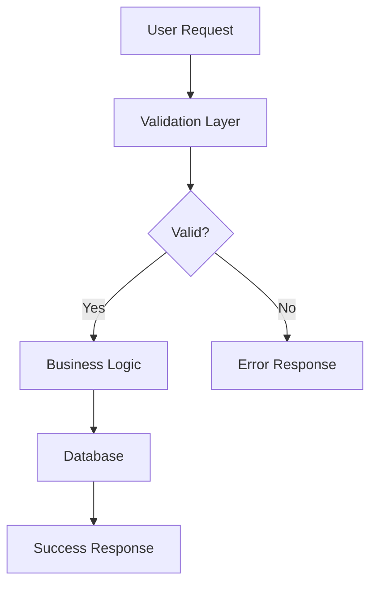
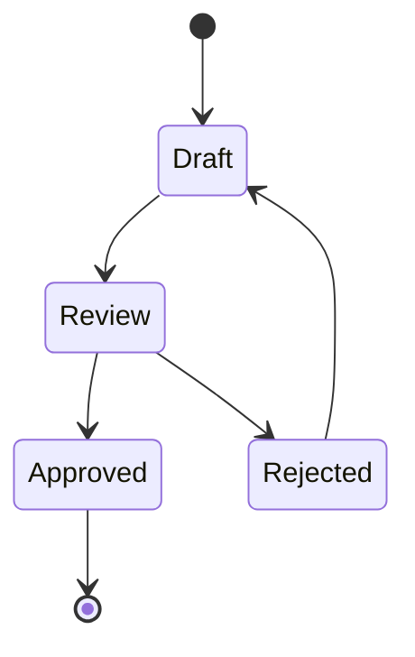
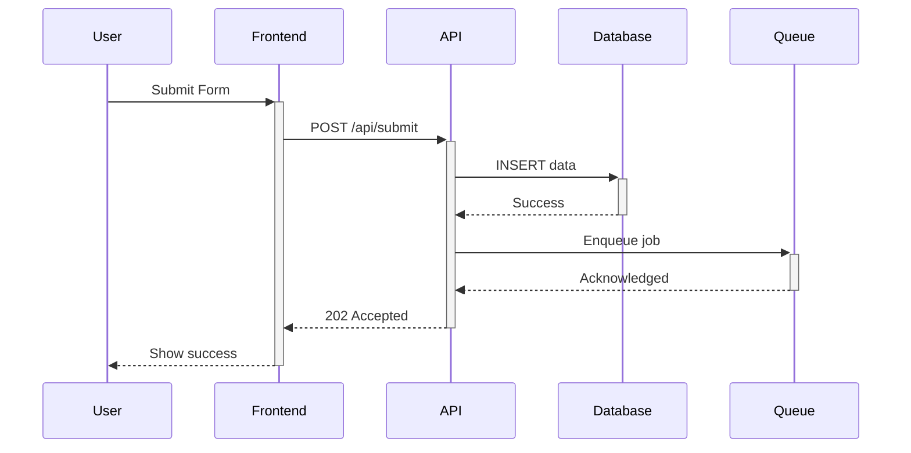

# CLAUDE_PLAN.md - PLAN Phase Operations

**Generated**: 2025-11-28 8:28:02 AM
**Protocol**: LEO 4.3.2
**Purpose**: PLAN agent operations, PRD creation, validation gates (30-35k chars)

---

## Deferred Work Management


## Deferred Work Management

**Purpose**: Prevent losing track of work when reducing SD scope

**Root Cause** (SD-VENTURE-BACKEND-002 Lesson):
When SD-VENTURE-IDEATION-MVP-001's backend scope was deferred, no child SD was created immediately. Work was completed 6 months later but without tracking, requiring extensive backfill to restore LEO Protocol compliance.

**The Problem**:
- LEAD approves SD with 100 story points
- During PLAN, team realizes 40 points should be deferred
- PRD created with 60 points, work proceeds
- Deferred 40 points forgotten → completed later without tracking → backfill nightmare

---

### MANDATORY PROCESS: Create Child SD Immediately

**WHEN**: During PLAN phase, if any work is removed/deferred from approved scope

**REQUIRED ACTION**:
1. **Create child SD BEFORE finalizing PRD**
2. **Transfer user stories** to child SD
3. **Document relationship** in both SDs
4. **Set priority** based on criticality
5. **Link PRDs** (parent PRD references child SD)

---

### Example Workflow

**Scenario**: SD-VENTURE-MVP-001 approved for 10 user stories (100 points)

**PLAN discovers**: Stories 6-10 (40 points) are backend-only, can be deferred

**CORRECT Process** ✅:

```bash
# 1. Create child SD immediately
INSERT INTO strategic_directives_v2 (
  id, title, description, priority, status,
  parent_directive_id, relationship_type
) VALUES (
  'SD-VENTURE-BACKEND-001',
  'Venture Backend Implementation',
  'Deferred backend work from SD-VENTURE-MVP-001',
  'high',           -- Set based on business need
  'approved',       -- Already approved via parent
  'SD-VENTURE-MVP-001',
  'deferred_scope'
);

# 2. Transfer user stories to child SD
UPDATE user_stories
SET sd_id = 'SD-VENTURE-BACKEND-001'
WHERE sd_id = 'SD-VENTURE-MVP-001'
AND id IN ('US-006', 'US-007', 'US-008', 'US-009', 'US-010');

# 3. Update parent PRD to document deferral
UPDATE product_requirements_v2
SET metadata = metadata || jsonb_build_object(
  'scope_reductions', jsonb_build_array(
    jsonb_build_object(
      'deferred_to', 'SD-VENTURE-BACKEND-001',
      'user_stories', ARRAY['US-006', 'US-007', 'US-008', 'US-009', 'US-010'],
      'story_points', 40,
      'reason', 'Backend implementation deferred to separate sprint',
      'deferred_at', NOW()
    )
  )
)
WHERE id = 'PRD-VENTURE-MVP-001';

# 4. Create child PRD immediately (or mark as TODO)
-- Option A: Create minimal PRD now
INSERT INTO product_requirements_v2 (
  id, sd_uuid, title, status, progress,
  deferred_from
) VALUES (
  'PRD-VENTURE-BACKEND-001',
  (SELECT uuid_id FROM strategic_directives_v2 WHERE id = 'SD-VENTURE-BACKEND-001'),
  'Venture Backend Implementation',
  'planning',  -- Will be worked on later
  0,
  'PRD-VENTURE-MVP-001'
);

-- Option B: Add TODO to parent SD notes
-- "TODO: Create PRD-VENTURE-BACKEND-001 when ready to start backend work"
```

---

### Backfill Process (If Child SD Was Not Created)

**Scenario**: Work completed without tracking (like SD-VENTURE-BACKEND-002)

**Required Steps**:

1. **Create SD record**
   - Use historical commit data for dates
   - Set status: 'completed'

2. **Create PRD**
   - Set status: 'implemented' (not 'planning')
   - Set progress: 100

3. **Create user stories**
   - Extract from git commits
   - Set verification_status: 'passing' or 'validated'
   - Put in BOTH user_stories AND sd_backlog_map tables

4. **Create deliverables**
   - Extract from git history
   - Map to valid deliverable_types: api, test, documentation, migration
   - Mark all as completion_status: 'completed'

5. **Create handoffs**
   - EXEC→PLAN: Implementation summary
   - PLAN→LEAD: Verification summary
   - Use manual creation (validation gates not suitable for backfill)

6. **Create retrospective**
   - Document lessons learned
   - Note: "Tracking backfilled retroactively"

7. **Mark SD complete**
   - Fix any blocking issues first
   - Ensure all progress gates pass

**Backfill Scripts Created**: See /scripts/create-*-venture-backend-002-*.mjs

---

### Checklist: Scope Reduction Decision Point

Use this during PLAN phase when considering scope changes:

- [ ] **Identify deferred work**: Which user stories/deliverables are being removed?
- [ ] **Assess criticality**: Is this work needed eventually? (If yes → child SD required)
- [ ] **Create child SD**: Don't defer this step! Create the SD now.
- [ ] **Transfer user stories**: Move them to child SD immediately
- [ ] **Set priority**: high/medium/low based on business need
- [ ] **Document relationship**: Update parent PRD metadata
- [ ] **Create child PRD** (minimal) OR add TODO to parent notes
- [ ] **Notify LEAD**: "Scope reduced, child SD created: SD-XXX"

---

### Red Flags (Lessons from SD-VENTURE-BACKEND-002)

❌ **"We'll create the SD later when we work on it"**
   - Result: Work gets forgotten or done without tracking

❌ **"Let's just note it in the parent PRD description"**
   - Result: No tracking, no progress visibility, no reminders

❌ **"It's only 3 user stories, not worth a separate SD"**
   - Result: Those 3 stories = 25 deliverables, 4 commits, 2 handoffs to backfill

✅ **"Scope changed, creating child SD now"**
   - Result: Work tracked from day 1, no backfill needed

---

### Documentation Updates

This section added to LEO Protocol based on:
- **Incident**: SD-VENTURE-BACKEND-002 backfill (Oct 19, 2025)
- **Root Cause**: Child SD not created when backend scope deferred
- **Solution**: Mandatory child SD creation at scope reduction point
- **Prevention**: PLAN checklist enforcement, LEAD verification

**Related Sections**:
- Phase 2 (PLAN Pre-EXEC Checklist): Added scope reduction check
- Phase 4 (LEAD Verification): Verify child SDs created for deferrals
- Retrospective Templates: Include "Deferred work management" assessment

---

### Integration with Existing Workflow

**PLAN Agent** must now:
1. Check for scope reductions during PRD creation
2. Create child SDs for any deferred work
3. Document relationship in metadata
4. Report to LEAD in PLAN→LEAD handoff

**LEAD Agent** must verify:
- Any scope reduction has corresponding child SD
- Child SD has appropriate priority
- Parent-child relationship documented
- User stories transferred correctly

**Progress Tracking**:
- Parent SD progress: Based on reduced scope (60 points)
- Child SD progress: Tracked independently (40 points)
- Portfolio view: Shows both SDs with relationship

---

### FAQ

**Q: What if we're not sure the deferred work will ever be done?**
A: Create the child SD with priority: 'low'. Better to have it and not need it than lose track of potential work.

**Q: Can we combine multiple deferrals into one child SD?**
A: Yes, if they're related. Example: "SD-VENTURE-FUTURE-ENHANCEMENTS" for all nice-to-have features.

**Q: What if the deferred work changes significantly later?**
A: Update the child SD's PRD when you start working on it. The SD serves as a placeholder until then.

**Q: Do we need a full PRD for the child SD immediately?**
A: Minimal PRD is acceptable. At minimum: title, description, deferred_from reference. Full PRD created when work begins.

**Q: What section_type for database?**
A: Use 'PHASE_2_PLANNING' (belongs in PLAN phase guidance)


## Stubbed/Mocked Code Detection


**CRITICAL: Stubbed/Mocked Code Detection** (MANDATORY):

Before PLAN→LEAD handoff, MUST verify NO stubbed/mocked code in production files:

**Check For** (BLOCKING if found):
```bash
# 1. TEST_MODE flags in production code
grep -r "TEST_MODE.*true\|NODE_ENV.*test" lib/ src/ --exclude-dir=test

# 2. Mock/stub patterns
grep -r "MOCK:\|STUB:\|TODO:\|PLACEHOLDER:\|DUMMY:" lib/ src/ --exclude-dir=test

# 3. Commented-out implementations
grep -r "// REAL IMPLEMENTATION\|// TODO: Implement" lib/ src/ --exclude-dir=test

# 4. Mock return values without logic
grep -r "return.*mock.*result\|return.*dummy" lib/ src/ --exclude-dir=test
```

**Acceptable Patterns** ✅:
- `TEST_MODE` in test files (`tests/`, `*.test.js`, `*.spec.js`)
- TODO comments with SD references for future work: `// TODO (SD-XXX): Implement caching`
- Feature flags with proper configuration: `if (config.enableFeature)`

**BLOCKING Patterns** ❌:
- `const TEST_MODE = process.env.TEST_MODE === 'true'` in production code
- `return { verdict: 'PASS' }` without actual logic
- `console.log('MOCK: Using dummy data')`
- Empty function bodies: `function execute() { /* TODO */ }`
- Commented-out real implementations

**Verification Script**:
```bash
# Create verification script
node scripts/detect-stubbed-code.js <SD-ID>
```

**Manual Code Review**:
- Read all modified files from git diff
- Verify implementations are complete
- Check for placeholder comments
- Validate TEST_MODE usage is test-only

**Exit Requirement**: Zero stubbed code in production files, OR documented in "Known Issues" with follow-up SD created.


## Enhanced QA Engineering Director v2.0 - Testing-First Edition

**Enhanced QA Engineering Director v2.0**: Mission-critical testing automation with comprehensive E2E validation.

**Core Capabilities:**
1. Professional test case generation from user stories
2. Pre-test build validation (saves 2-3 hours)
3. Database migration verification (prevents 1-2 hours debugging)
4. **Mandatory E2E testing via Playwright** (REQUIRED for approval)
5. Test infrastructure discovery and reuse

**5-Phase Workflow**: Pre-flight checks → Test generation → E2E execution → Evidence collection → Verdict & learnings

**Activation**: Auto-triggers on `EXEC_IMPLEMENTATION_COMPLETE`, coverage keywords, testing evidence requests

**Full Guide**: See `docs/reference/qa-director-guide.md`

## Database Schema Documentation

### Database Schema Documentation

Auto-generated schema docs provide quick reference without database queries:

**Paths**:
- EHG_Engineer: `docs/reference/schema/engineer/database-schema-overview.md`
- EHG App: `docs/reference/schema/ehg/database-schema-overview.md`

**Update**: `npm run schema:docs:engineer` or `npm run schema:docs:ehg`

**PRD Integration**: PRDs stored in `product_requirements_v2` table (NOT markdown).
Use `add-prd-to-database.js` to create PRDs with schema review prompts.


## PLAN Pre-EXEC Checklist

## PLAN Agent Pre-EXEC Checklist (MANDATORY)

**Evidence from Retrospectives**: Database verification issues appeared in SD-UAT-003, SD-UAT-020, and SD-008. Early verification saves 2-3 hours per blocker.

Before creating PLAN→EXEC handoff, PLAN agent MUST verify:

### Database Dependencies ✅
- [ ] **Identify all data dependencies** in PRD
- [ ] **Run schema verification script** for data-dependent SDs
- [ ] **Verify tables/columns exist** OR create migration
- [ ] **Document verification results** in PLAN→EXEC handoff
- [ ] If tables missing: **Escalate to LEAD** with options

**Success Pattern** (SD-UAT-003):
> "Database Architect verification provided evidence for LEAD decision. Documented instead of implementing → saved 4-6 hours"

### Architecture Planning ✅
- [ ] **Component sizing estimated** (target 300-600 lines per component)
- [ ] **Existing infrastructure identified** (don't rebuild what exists)
- [ ] **Third-party libraries considered** before custom code

**Success Pattern** (SD-UAT-020):
> "Leveraged existing Supabase Auth instead of building custom → saved 8-10 hours"

### Testing Strategy ✅
- [ ] **Smoke tests defined** (3-5 tests minimum)
- [ ] **Test scenarios documented** in PRD

### Quality Validation ✅
- [ ] **Verified claims with code review** (if UI/UX SD)
- [ ] **Assessed technical feasibility**
- [ ] **Identified potential blockers**

**Success Pattern** (SD-UAT-002):
> "LEAD code review rejected 3/5 false claims → saved hours of unnecessary work"


## Testing Tier Strategy

## Testing Requirements - Clear Thresholds

**Evidence from Retrospectives**: Testing confusion appeared in SD-UAT-002, SD-UAT-020, SD-008.

### Three-Tier Testing Strategy

#### Tier 1: Smoke Tests (MANDATORY) ✅
- **Requirement**: 3-5 tests, <60 seconds execution
- **Approval**: **SUFFICIENT for PLAN→LEAD approval**

#### Tier 2: Comprehensive E2E (RECOMMENDED) 📋
- **Requirement**: 30-50 tests covering user flows
- **Approval**: Nice to have, **NOT blocking for LEAD approval**
- **Timing**: Can be refined post-deployment

#### Tier 3: Manual Testing (SITUATIONAL) 🔍
- **UI changes**: Single smoke test recommended (+5 min)
- **Logic changes <5 lines**: Optional
- **Logic changes >10 lines**: Required

### Anti-Pattern to Avoid ❌

**DO NOT** create 100+ manual test checklists unless specifically required.

**From SD-UAT-020**:
> "Created 100+ test checklist but didn't execute manually. Time spent on unused documentation."

## 🔬 BMAD Method Enhancements

**BMAD** (Build-Measure-Adapt-Document) Method principles integrated into LEO Protocol to reduce context consumption, improve implementation quality, and enable early error detection.

### Core Principles

1. **Dev Agents Must Be Lean**: Minimize context consumption throughout workflow
2. **Natural Language First**: Reduce code-heavy implementation guidance
3. **Context-Engineered Stories**: Front-load implementation details to reduce EXEC confusion
4. **Risk Assessment**: Multi-domain analysis during LEAD_PRE_APPROVAL
5. **Mid-Development Quality Gates**: Checkpoint pattern for large SDs
6. **Early Validation**: Catch issues at gates, not during final testing

---

### Six BMAD Enhancements

**1. Risk Assessment Sub-Agent (RISK)**
- **Phase**: LEAD_PRE_APPROVAL (mandatory for all SDs)
- **Purpose**: Multi-domain risk scoring before approval
- **Domains**: Technical Complexity (1-10), Security Risk (1-10), Performance Risk (1-10), Integration Risk (1-10), Data Migration Risk (1-10), UI/UX Risk (1-10)
- **Storage**: risk_assessments table
- **Script**: node lib/sub-agent-executor.js RISK SD-ID
- **Benefit**: Early risk identification prevents 4-6 hours rework per SD

**2. User Story Context Engineering (STORIES)**
- **Phase**: PLAN_PRD (after PRD creation, before EXEC)
- **Purpose**: Hyper-detailed implementation context for each user story
- **Fields Added**: implementation_context, architecture_references, example_code_patterns, testing_scenarios
- **Storage**: user_stories table columns
- **Script**: node lib/sub-agent-executor.js STORIES SD-ID
- **Benefit**: Reduces EXEC confusion by 30-40% through front-loaded guidance
- **Validation**: PLAN→EXEC handoff checks for ≥80% coverage

**3. Retrospective Review for LEAD**
- **Phase**: LEAD_PRE_APPROVAL (before approving new SDs)
- **Purpose**: Learn from similar completed SDs
- **Analysis**: Success patterns, failure patterns, effort adjustments, risk mitigations
- **Storage**: Queries retrospectives table
- **Script**: node scripts/retrospective-review-for-lead.js SD-ID
- **Benefit**: Informed decision-making based on historical data

**4. Checkpoint Pattern Generator**
- **Phase**: PLAN_PRD (for SDs with >8 user stories)
- **Purpose**: Break large SDs into 3-4 manageable checkpoints
- **Benefits**: 30-40% context reduction, 50% faster debugging, early error detection
- **Storage**: strategic_directives_v2.checkpoint_plan (JSONB)
- **Script**: node scripts/generate-checkpoint-plan.js SD-ID
- **Validation**: PLAN→EXEC handoff requires checkpoint plan for large SDs

**5. Test Architecture Phase Enhancement**
- **Phase**: PLAN_PRD and PLAN_VERIFY (QA Director integration)
- **Purpose**: Structured test planning with 4 strategies
- **Strategies**: Unit (business logic), E2E (user flows), Integration (APIs/DB), Performance (benchmarks)
- **Storage**: test_plans table
- **Script**: QA Director auto-generates during PLAN phase
- **Benefit**: 100% user story → E2E test mapping enforced
- **Validation**: EXEC→PLAN handoff checks test plan existence and coverage

**6. Lean EXEC_CONTEXT.md**
- **Phase**: EXEC_IMPLEMENTATION (context optimization)
- **Purpose**: Reduced CLAUDE.md for EXEC agents (~500 lines vs 5000+)
- **Content**: EXEC-specific guidance only (no LEAD/PLAN operations)
- **Location**: docs/EXEC_CONTEXT.md
- **Benefit**: 90% context reduction during EXEC phase

---

### Validation Gates Integration

**PLAN→EXEC Handoff**:
- ✅ User story context engineering (≥80% coverage)
- ✅ Checkpoint plan (if SD has >8 stories)
- ✅ Risk assessment exists

**EXEC→PLAN Handoff**:
- ✅ Test plan generated (unit + E2E strategies)
- ✅ User story → E2E mapping (100% requirement)
- ✅ Test plan stored in database

**Validation Script**: scripts/modules/bmad-validation.js
**Integration**: Automatic via unified-handoff-system.js

---

### Quick Reference: BMAD Scripts

```bash
# 1. Risk Assessment (LEAD_PRE_APPROVAL)
node lib/sub-agent-executor.js RISK SD-ID

# 2. User Story Context Engineering (PLAN_PRD)
node lib/sub-agent-executor.js STORIES SD-ID

# 3. Retrospective Review (LEAD_PRE_APPROVAL)
node scripts/retrospective-review-for-lead.js SD-ID

# 4. Checkpoint Plan (PLAN_PRD, if >8 stories)
node scripts/generate-checkpoint-plan.js SD-ID

# 5. Test Architecture (PLAN_VERIFY, automatic)
node scripts/qa-engineering-director-enhanced.js SD-ID

# 6. Lean EXEC Context (reference during EXEC)
cat docs/EXEC_CONTEXT.md
```

---

### Expected Impact

**Context Consumption**:
- User story context engineering: 30-40% reduction in EXEC confusion
- Checkpoint pattern: 30-40% reduction in total context per large SD
- Lean EXEC_CONTEXT.md: 90% reduction during EXEC phase

**Time Savings**:
- Risk assessment: 4-6 hours saved per SD (early issue detection)
- Test architecture: 2-3 hours saved per SD (structured planning)
- Retrospective review: Informed decisions prevent 3-4 hours unnecessary work

**Quality Improvements**:
- Early validation gates catch issues before late-stage rework
- Structured test planning ensures 100% user story coverage
- Context engineering reduces implementation ambiguity

---

### Database Schema Additions

**New Tables**:
- risk_assessments: Risk scoring across 6 domains
- test_plans: Structured test strategies (4 types)

**Enhanced Tables**:
- user_stories: Added implementation_context, architecture_references, example_code_patterns, testing_scenarios
- strategic_directives_v2: Added checkpoint_plan (JSONB)

**Sub-Agents**:
- leo_sub_agents: Added RISK (code: 'RISK', priority: 8)
- leo_sub_agents: Added STORIES (code: 'STORIES', priority: 50)

---

### Further Reading

- **BMAD Principles**: See retrospectives from SD-UAT-002, SD-UAT-020, SD-EXPORT-001
- **Implementation Guide**: docs/bmad-implementation-guide.md
- **Validation Gates**: docs/reference/handoff-validation.md

*Last Updated: 2025-10-12*
*BMAD Method: Build-Measure-Adapt-Document*


## DESIGN→DATABASE Validation Gates

The LEO Protocol enforces the DESIGN→DATABASE workflow pattern through 4 mandatory validation gates that ensure:
1. Sub-agent execution completeness (PLAN→EXEC)
2. Implementation fidelity to recommendations (EXEC→PLAN)
3. End-to-end traceability (PLAN→LEAD)
4. Workflow ROI and pattern effectiveness (LEAD Final)

**Passing Score**: ≥80 points (out of 100) required for each gate

---

### Gate 1: PLAN→EXEC Handoff (Pre-Implementation)

**When**: After PRD creation, before EXEC starts implementation
**Purpose**: Verify planning is complete and recommendations exist
**Script**: `scripts/modules/design-database-gates-validation.js`
**Integration Point**: `unified-handoff-system.js` line ~271 (after BMAD validation)

**9 Validation Checks** (11 points each + 1 buffer = 100 points):

1. **DESIGN Sub-Agent Executed** (11 points)
   - Queries: `sub_agent_execution_results` table
   - Checks: `sub_agent_name = 'DESIGN'` AND `status = 'SUCCESS'`

2. **DATABASE Sub-Agent Executed** (11 points)
   - Queries: `sub_agent_execution_results` table
   - Checks: `sub_agent_name = 'DATABASE'` AND `status = 'SUCCESS'`

3. **DATABASE Informed by DESIGN** (11 points)
   - Queries: `product_requirements_v2.metadata.database_analysis.design_informed`
   - Checks: `design_informed = true`

4. **STORIES Sub-Agent Executed** (11 points)
   - Queries: `sub_agent_execution_results` table
   - Checks: `sub_agent_name = 'STORIES'` AND `status = 'SUCCESS'`

5. **Schema Documentation Consulted** (11 points)
   - Analyzes: `database_analysis.analysis` text
   - Checks: References to `docs/reference/schema/`

6. **PRD Metadata Complete** (11 points)
   - Checks: Both `design_analysis` AND `database_analysis` exist in PRD metadata

7. **Sub-Agent Execution Order** (11 points)
   - Validates: DESIGN timestamp < DATABASE timestamp < STORIES timestamp

8. **PRD Created Via Script** (11 points)
   - Detects: `add-prd-to-database.js` metadata signature

9. **User Stories Context Coverage** (12 points)
   - Calculates: % of stories with `implementation_context`
   - Threshold: ≥80% coverage required

**Conditional Execution**:
- Only validates SDs with BOTH `design` AND `database` categories
- OR scope contains both "UI" AND "database" keywords
- Use: `shouldValidateDesignDatabase(sd)` helper function

---

### Gate 2: EXEC→PLAN Handoff (Post-Implementation)

**When**: After EXEC completes implementation, before PLAN verification
**Purpose**: Verify EXEC actually implemented DESIGN/DATABASE recommendations
**Script**: `scripts/modules/implementation-fidelity-validation.js`
**Integration Point**: `unified-handoff-system.js` line ~486 (after BMAD validation)

**4 Validation Sections** (25 points each = 100 points):

#### A. Design Implementation Fidelity (25 points)

- **A1: UI Components** (10 points)
  - Git analysis: `git log --all --grep="SD-XXX" --name-only`
  - Checks: Component files (.tsx, .jsx) committed

- **A2: Workflows** (10 points)
  - Queries: EXEC→PLAN handoff deliverables
  - Checks: Workflow implementation mentioned

- **A3: User Actions** (5 points)
  - Git analysis: `git log --all --grep="SD-XXX" --patch`
  - Checks: CRUD operations in code changes

#### B. Database Implementation Fidelity (25 points)

- **B1: Migrations** (15 points)
  - Scans: `database/migrations`, `supabase/migrations`
  - Checks: Migration files exist for SD

- **B2: RLS Policies** (5 points)
  - Git analysis: Checks for CREATE POLICY statements

- **B3: Migration Complexity** (5 points)
  - Reads: Migration file line count
  - Compares: To DATABASE analysis estimate (optional)

#### C. Data Flow Alignment (25 points)

- **C1: Database Queries** (10 points)
  - Git analysis: Checks for .select(), .insert(), .update(), .from()

- **C2: Form/UI Integration** (10 points)
  - Git analysis: Checks for useState, useForm, onSubmit, <form>, Input, Button

- **C3: Data Validation** (5 points)
  - Git analysis: Checks for zod, validate, schema, .required()

#### D. Enhanced Testing (25 points)

- **D1: E2E Tests** (15 points)
  - Scans: `tests/e2e`, `tests/integration`, `playwright/tests`
  - Checks: Test files exist for SD

- **D2: Migration Tests** (5 points)
  - Git analysis: Checks for migration + test file mentions

- **D3: Coverage Documentation** (5 points)
  - Queries: EXEC→PLAN handoff metadata
  - Checks: Test coverage documented

**Why This Gate Matters**:
This is the MOST CRITICAL gate - ensures recommendations weren't just generated but actually implemented. Without this, EXEC could ignore all recommendations.

---

### Gate 3: PLAN→LEAD Handoff (Pre-Final Approval)

**When**: After PLAN verification, before LEAD final approval
**Purpose**: Verify end-to-end alignment from design through implementation
**Script**: `scripts/modules/traceability-validation.js`
**Integration Point**: `unified-handoff-system.js` line ~726 (PLAN→LEAD validation)

**5 Validation Sections** (20 points each = 100 points):

#### A. Recommendation Adherence (20 points)

- **A1: Design Adherence** (10 points)
  - Calculates: (Gate 2 design_fidelity / 25) × 100%
  - Thresholds: ≥80% = 10pts, ≥60% = 7pts, <60% = 4pts

- **A2: Database Adherence** (10 points)
  - Calculates: (Gate 2 database_fidelity / 25) × 100%
  - Thresholds: ≥80% = 10pts, ≥60% = 7pts, <60% = 4pts

#### B. Implementation Quality (20 points)

- **B1: Gate 2 Score** (10 points)
  - Checks: Overall Gate 2 validation score
  - Thresholds: ≥90 = 10pts, ≥80 = 8pts, ≥70 = 6pts

- **B2: Test Coverage** (10 points)
  - Queries: EXEC→PLAN handoff metadata
  - Checks: Test coverage documented

#### C. Traceability Mapping (20 points)

- **C1: PRD → Implementation** (7 points)
  - Git analysis: Commits referencing SD ID

- **C2: Design → Code** (7 points)
  - Queries: Deliverables mention design/UI/components

- **C3: Database → Schema** (6 points)
  - Queries: Deliverables mention database/migration/schema/table

#### D. Sub-Agent Effectiveness (20 points)

- **D1: Execution Metrics** (10 points)
  - Queries: `sub_agent_execution_results`
  - Checks: All 3 sub-agents (DESIGN, DATABASE, STORIES) executed

- **D2: Recommendation Quality** (10 points)
  - Checks: Sub-agent results have substantial output (>500 chars)

#### E. Lessons Captured (20 points)

- **E1: Retrospective Prep** (10 points)
  - Queries: PLAN→LEAD handoff metadata
  - Checks: Mentions "lesson", "retrospective", "improvement"

- **E2: Workflow Effectiveness** (10 points)
  - Queries: EXEC→PLAN handoff metadata
  - Checks: Mentions "workflow", "process", "pattern"

---

### Gate 4: LEAD Final Approval (Pre-Completion)

**When**: Before marking SD as complete
**Purpose**: Executive oversight of design-to-implementation alignment
**Script**: `scripts/modules/workflow-roi-validation.js`
**Integration Point**: `unified-handoff-system.js` (LEAD final approval)

**4 Validation Sections** (25 points each = 100 points):

#### A. Process Adherence (25 points)

- **A1: PRD Created Via Script** (5 points)
  - Checks: `metadata.created_via_script` OR sub-agent analyses exist

- **A2: Design Analysis Completed** (5 points)
  - Checks: `metadata.design_analysis` exists

- **A3: Database Analysis Completed** (5 points)
  - Checks: `metadata.database_analysis` exists

- **A4: Design-Informed Database** (5 points)
  - Checks: `metadata.database_analysis.design_informed = true`

- **A5: Proper Workflow Order** (5 points)
  - Checks: Gate 1 validated execution order (DESIGN→DATABASE→STORIES)

#### B. Value Delivered (25 points)

- **B1: Time Efficiency** (10 points)
  - Checks: Sub-agent execution time from Gate 3
  - Thresholds: <15min = 10pts, <30min = 7pts, ≥30min = 5pts

- **B2: Recommendation Quality** (10 points)
  - Checks: Gate 3 validated substantial recommendations

- **B3: Implementation Fidelity** (5 points)
  - Checks: Gate 2 score ≥80 = 5pts, ≥70 = 3pts, <70 = 2pts

#### C. Pattern Effectiveness (25 points)

- **C1: Gate 1 Performance** (6 points)
  - Thresholds: ≥90 = 6pts, ≥80 = 5pts, <80 = 3pts

- **C2: Gate 2 Performance** (6 points)
  - Thresholds: ≥90 = 6pts, ≥80 = 5pts, <80 = 3pts

- **C3: Gate 3 Performance** (6 points)
  - Thresholds: ≥90 = 6pts, ≥80 = 5pts, <80 = 3pts

- **C4: Overall Pattern ROI** (7 points)
  - Calculates: Average of Gate 1-3 scores
  - Thresholds: ≥90 = 7pts ("EXCELLENT - Continue pattern"), ≥80 = 6pts ("GOOD - Continue"), ≥70 = 4pts ("ACCEPTABLE - Monitor")

#### D. Executive Validation (25 points)

- **D1: All Gates Passed** (10 points)
  - Checks: Gate 1, 2, 3 all passed (score ≥80)
  - Scoring: 3/3 = 10pts, 2/3 = 6pts, 1/3 = 3pts, 0/3 = 0pts

- **D2: Quality Thresholds** (10 points)
  - Queries: `sd_retrospectives` table
  - Checks: Retrospective exists

- **D3: Pattern Recommendation** (5 points)
  - Based on avg gate score:
    - ≥80: "CONTINUE - Pattern is effective"
    - ≥70: "MONITOR - Pattern needs improvement"
    - <70: "REVIEW - Pattern may need adjustment"

---

### Integration with Unified Handoff System

**File**: `scripts/unified-handoff-system.js`

#### Integration Points:

1. **Gate 1 (PLAN→EXEC)** - After line 271
   ```javascript
   // After BMAD validation
   if (shouldValidateDesignDatabase(sd)) {
     const gate1 = await validateGate1PlanToExec(sd.id, supabase);
     handoff.metadata.gate1_validation = gate1;

     if (!gate1.passed) {
       throw new Error(`Gate 1 validation failed: ${gate1.score}/100 points`);
     }
   }
   ```

2. **Gate 2 (EXEC→PLAN)** - After line 486
   ```javascript
   // After BMAD validation
   if (shouldValidateDesignDatabase(sd)) {
     const gate2 = await validateGate2ExecToPlan(sd.id, supabase);
     handoff.metadata.gate2_validation = gate2;

     if (!gate2.passed) {
       throw new Error(`Gate 2 validation failed: ${gate2.score}/100 points`);
     }
   }
   ```

3. **Gate 3 (PLAN→LEAD)** - After line 726
   ```javascript
   // During PLAN→LEAD handoff
   if (shouldValidateDesignDatabase(sd)) {
     const gate3 = await validateGate3PlanToLead(sd.id, supabase, gate2Results);
     handoff.metadata.gate3_validation = gate3;

     if (!gate3.passed) {
       throw new Error(`Gate 3 validation failed: ${gate3.score}/100 points`);
     }
   }
   ```

4. **Gate 4 (LEAD Final)** - Before final approval
   ```javascript
   // Before marking SD complete
   if (shouldValidateDesignDatabase(sd)) {
     const allGates = { gate1, gate2, gate3 };
     const gate4 = await validateGate4LeadFinal(sd.id, supabase, allGates);

     if (!gate4.passed) {
       throw new Error(`Gate 4 validation failed: ${gate4.score}/100 points`);
     }
   }
   ```

---

### Validation Flow Diagram

```
PRD Creation (add-prd-to-database.js)
    ↓
    ├─ DESIGN sub-agent → analysis
    ├─ DATABASE sub-agent → analysis (informed by DESIGN)
    └─ STORIES sub-agent → user stories
    ↓
🚪 GATE 1: PLAN→EXEC Handoff
    ├─ ✅ All sub-agents executed?
    ├─ ✅ Execution order correct?
    ├─ ✅ Schema docs consulted?
    └─ ✅ PRD metadata complete?
    ↓
EXEC Implementation
    ├─ Implement UI components (per DESIGN)
    ├─ Create migrations (per DATABASE)
    ├─ Write E2E tests
    └─ Commit with SD ID
    ↓
🚪 GATE 2: EXEC→PLAN Handoff
    ├─ ✅ Components match DESIGN?
    ├─ ✅ Migrations match DATABASE?
    ├─ ✅ Data flow aligned?
    └─ ✅ Tests comprehensive?
    ↓
PLAN Verification
    ↓
🚪 GATE 3: PLAN→LEAD Handoff
    ├─ ✅ Recommendations followed?
    ├─ ✅ Implementation quality high?
    ├─ ✅ End-to-end traceability?
    └─ ✅ Lessons captured?
    ↓
🚪 GATE 4: LEAD Final Approval
    ├─ ✅ All gates passed?
    ├─ ✅ Value delivered?
    ├─ ✅ Pattern effective?
    └─ ✅ Quality thresholds met?
    ↓
SD Complete ✅
```

---

### Standalone Validation Scripts

For manual validation outside handoff flow:

```bash
# Validate Gate 1 (PLAN→EXEC)
node scripts/validate-gate1.js --sd=SD-XXX-001

# Validate Gate 2 (EXEC→PLAN)
node scripts/validate-gate2.js --sd=SD-XXX-001

# Validate Gate 3 (PLAN→LEAD)
node scripts/validate-gate3.js --sd=SD-XXX-001

# Validate Gate 4 (LEAD Final)
node scripts/validate-gate4.js --sd=SD-XXX-001

# Validate all gates
node scripts/validate-all-gates.js --sd=SD-XXX-001
```

---

### When Gates Don't Apply

**Conditional Execution Helper**:
```javascript
export function shouldValidateDesignDatabase(sd) {
  const hasDesignCategory = sd.category?.includes('design');
  const hasDatabaseCategory = sd.category?.includes('database');

  const hasUIKeywords = (sd.scope || '').toLowerCase().includes('ui');
  const hasDatabaseKeywords = (sd.scope || '').toLowerCase().includes('database');

  return (hasDesignCategory && hasDatabaseCategory) ||
         (hasUIKeywords && hasDatabaseKeywords);
}
```

**Behavior**:
- If validation doesn't apply: Returns `{ passed: true, score: 100, warnings: ['Not applicable'] }`
- If validation applies but fails: Returns `{ passed: false, score: <score>, issues: [...] }`
- If validation applies and passes: Returns `{ passed: true, score: ≥80, details: {...} }`

---

### Gate Results Storage

All gate results are stored in handoff metadata:

```javascript
{
  handoff_type: "PLAN-TO-EXEC",
  metadata: {
    gate1_validation: {
      passed: true,
      score: 92,
      max_score: 100,
      issues: [],
      warnings: [],
      details: { ... },
      gate_scores: { ... }
    }
  }
}
```

This enables:
1. **Traceability**: Full audit trail of validation results
2. **Retrospectives**: Quality analysis for continuous improvement
3. **Cascading**: Gate 3 uses Gate 2 results, Gate 4 uses all previous results
4. **Debugging**: Detailed failure information for each gate

## CI/CD Pipeline Verification

## CI/CD Pipeline Verification (MANDATORY)

**Evidence from Retrospectives**: Gap identified in SD-UAT-002 and SD-LEO-002.

### Verification Process

**After EXEC implementation complete, BEFORE PLAN→LEAD handoff**:

1. Wait 2-3 minutes for GitHub Actions to complete
2. Trigger DevOps sub-agent to verify pipeline status
3. Document CI/CD status in PLAN→LEAD handoff
4. PLAN→LEAD handoff is **BLOCKED** if pipelines failing

## Pre-Implementation Plan Presentation Template

**SD-PLAN-PRESENT-001** | **Template Type:** plan_presentation | **Phase:** PLAN → EXEC

### Purpose

The `plan_presentation` template standardizes PLAN→EXEC handoffs by providing structured implementation guidance to the EXEC agent. This template reduces EXEC confusion from 15-20 minutes to <5 minutes by clearly communicating:

- **What** will be implemented (goal_summary)
- **Where** changes will occur (file_scope)
- **How** to implement step-by-step (execution_plan)
- **Dependencies** and impacts (dependency_impacts)
- **Testing approach** (testing_strategy)

### Template Structure

All plan_presentation objects must be included in the `metadata.plan_presentation` field of PLAN→EXEC handoffs.

#### Required Fields

1. **goal_summary** (string, ≤300 chars, required)
   - Brief 2-3 sentence summary of implementation goals
   - Focus on "what" and "why", not "how"
   - Example: `"Add plan_presentation template to leo_handoff_templates table with JSONB validation structure. Enhance unified-handoff-system.js with validation logic (~50 LOC). Reduce EXEC confusion from 15-20 min to <5 min."`

2. **file_scope** (object, required)
   - Lists files to create, modify, or delete
   - At least one category must have ≥1 file
   - Structure:
     ```json
     {
       "create": ["path/to/new-file.js"],
       "modify": ["path/to/existing-file.js"],
       "delete": ["path/to/deprecated-file.js"]
     }
     ```

3. **execution_plan** (array, required, ≥1 step)
   - Step-by-step implementation sequence
   - Each step includes: step number, action description, affected files
   - Structure:
     ```json
     [
       {
         "step": 1,
         "action": "Add validatePlanPresentation() method to PlanToExecVerifier class",
         "files": ["scripts/verify-handoff-plan-to-exec.js"]
       },
       {
         "step": 2,
         "action": "Integrate validation into verifyHandoff() method",
         "files": ["scripts/verify-handoff-plan-to-exec.js"]
       }
     ]
     ```

4. **testing_strategy** (object, required)
   - Specifies unit test and E2E test approaches
   - Both unit_tests and e2e_tests fields required
   - Structure:
     ```json
     {
       "unit_tests": "Test validatePlanPresentation() with valid, missing, and invalid structures",
       "e2e_tests": "Create PLAN→EXEC handoff and verify validation enforcement",
       "verification_steps": [
         "Run test script with 3 scenarios",
         "Verify validation passes for complete plan_presentation"
       ]
     }
     ```

#### Optional Fields

5. **dependency_impacts** (object, optional)
   - Documents dependencies and their impacts
   - Structure:
     ```json
     {
       "npm_packages": ["react-hook-form", "zod"],
       "internal_modules": ["handoff-validator.js"],
       "database_changes": "None (reads from leo_handoff_templates)"
     }
     ```

### Validation Rules

The `verify-handoff-plan-to-exec.js` script validates plan_presentation structure:

- ✅ `goal_summary` present and ≤300 characters
- ✅ `file_scope` has at least one of: create, modify, delete
- ✅ `execution_plan` has ≥1 step
- ✅ `testing_strategy` has both `unit_tests` and `e2e_tests` defined

**Validation Enforcement:** PLAN→EXEC handoffs are rejected if plan_presentation is missing or invalid.

### Complete Example

```json
{
  "metadata": {
    "plan_presentation": {
      "goal_summary": "Add plan_presentation template to leo_handoff_templates table with JSONB validation structure. Enhance unified-handoff-system.js with validation logic (~50 LOC). Reduce EXEC confusion from 15-20 min to <5 min.",
      "file_scope": {
        "create": [],
        "modify": ["scripts/verify-handoff-plan-to-exec.js"],
        "delete": []
      },
      "execution_plan": [
        {
          "step": 1,
          "action": "Add validatePlanPresentation() method to PlanToExecVerifier class",
          "files": ["scripts/verify-handoff-plan-to-exec.js"]
        },
        {
          "step": 2,
          "action": "Integrate validation into verifyHandoff() method",
          "files": ["scripts/verify-handoff-plan-to-exec.js"]
        },
        {
          "step": 3,
          "action": "Add PLAN_PRESENTATION_INVALID rejection handler",
          "files": ["scripts/verify-handoff-plan-to-exec.js"]
        }
      ],
      "dependency_impacts": {
        "npm_packages": [],
        "internal_modules": ["handoff-validator.js"],
        "database_changes": "None (reads from leo_handoff_templates)"
      },
      "testing_strategy": {
        "unit_tests": "Test validatePlanPresentation() with valid, missing, and invalid structures",
        "e2e_tests": "Create PLAN→EXEC handoff and verify validation enforcement",
        "verification_steps": [
          "Run test script with 3 scenarios (TS1, TS2, TS3)",
          "Verify validation passes for complete plan_presentation",
          "Verify validation fails with clear errors for incomplete/invalid structures"
        ]
      }
    }
  }
}
```

### Benefits

- **Reduced Confusion:** EXEC spends <5 min understanding implementation (vs 15-20 min)
- **Consistent Handoffs:** All PLAN→EXEC handoffs follow same structure
- **Auditability:** Implementation decisions queryable via metadata
- **Quality Gate:** Invalid handoffs rejected before EXEC phase begins

### Related Documentation

- **Template Definition:** leo_handoff_templates table, handoff_type = 'plan_presentation'
- **Validation Logic:** scripts/verify-handoff-plan-to-exec.js (PlanToExecVerifier.validatePlanPresentation)
- **Test Coverage:** scripts/test-plan-presentation-validation.mjs (5 test scenarios)


## Database Schema Overview

### Core Tables
- `leo_protocols` - Protocol versions and content
- `leo_protocol_sections` - Modular protocol sections
- `leo_agents` - Agent definitions and percentages
- `leo_handoff_templates` - Standardized handoffs
- `leo_sub_agents` - Sub-agent definitions
- `leo_sub_agent_triggers` - Activation rules
- `leo_validation_rules` - Protocol validation

### Key Queries

**Get Current Protocol**:
```sql
SELECT * FROM leo_protocols WHERE status = 'active';
```

**Check Sub-Agent Triggers**:
```sql
SELECT sa.*, t.*
FROM leo_sub_agents sa
JOIN leo_sub_agent_triggers t ON sa.id = t.sub_agent_id
WHERE t.trigger_phrase ILIKE '%keyword%';
```

**Get Handoff Template**:
```sql
SELECT * FROM leo_handoff_templates
WHERE from_agent = 'EXEC' AND to_agent = 'PLAN';
```

## API Endpoints (Database-Backed)

- `GET /api/leo/current` - Current active protocol
- `GET /api/leo/agents` - All agents with percentages
- `GET /api/leo/sub-agents` - Active sub-agents with triggers
- `GET /api/leo/handoffs/:from/:to` - Handoff template
- `POST /api/leo/validate` - Validate against rules

## Key Scripts (Database-Aware)

- `get-latest-leo-protocol-from-db.js` - Get version from database
- `generate-claude-md-from-db.js` - Generate this file
- `migrate-leo-protocols-to-database.js` - Migration tool
- `activate-sub-agents-from-db.js` - Check database triggers

## Compliance Tools

All tools now query database instead of files:

### 1. Version Check
```bash
node scripts/get-latest-leo-protocol-from-db.js
```

### 2. Update CLAUDE.md
```bash
node scripts/generate-claude-md-from-db.js
```

### 3. Validate Handoff
```bash
node scripts/leo-checklist-db.js [agent-name]
```

## 🔍 PLAN Supervisor Verification

### Overview
PLAN agent now includes supervisor capabilities for final "done done" verification:
- Queries ALL sub-agents for their verification results
- Ensures all requirements are truly met
- Resolves conflicts between sub-agent reports
- Provides confidence scoring and clear pass/fail verdict

### Activation
Trigger PLAN supervisor verification via:
- **Command**: `/leo-verify [what to check]`
- **Script**: `node scripts/plan-supervisor-verification.js --prd PRD-ID`
- **Automatic**: When testing phase completes

### Verification Process
1. **Read-Only Access**: Queries existing sub-agent results (no re-execution)
2. **Summary-First**: Prevents context explosion with tiered reporting
3. **Conflict Resolution**: Priority-based rules (Security > Database > Testing)
4. **Circuit Breakers**: Graceful handling of sub-agent failures
5. **Maximum 3 Iterations**: Prevents infinite verification loops

### Verdicts
- **PASS**: All requirements met, high confidence (≥85%)
- **FAIL**: Critical issues or unmet requirements
- **CONDITIONAL_PASS**: Minor issues, needs LEAD review
- **ESCALATE**: Cannot reach consensus, needs LEAD intervention

## Dashboard Integration

Dashboard automatically connects to database:
- Real-time protocol updates via Supabase subscriptions
- Version detection from `leo_protocols` table
- Sub-agent status from `leo_sub_agents` table
- PLAN supervisor verification status
- No file scanning needed

## Important Notes

1. **Database is Source of Truth** - Files are deprecated
2. **Real-time Updates** - Changes reflect immediately
3. **No Version Conflicts** - Single active version enforced
4. **Audit Trail** - All changes tracked in database
5. **WebSocket Updates** - Dashboard stays synchronized
6. **PLAN Supervisor** - Final verification before LEAD approval

## Testing Tier Strategy (Updated)


## Testing Requirements - Dual Test Execution (UPDATED)

**Philosophy**: Comprehensive testing = Unit tests (logic) + E2E tests (user experience)

### Tier 1: Smoke Tests (MANDATORY) ✅
- **Requirement**: BOTH unit tests AND E2E tests must pass
- **Commands**:
  - Unit: `npm run test:unit` (Vitest - business logic)
  - E2E: `npm run test:e2e` (Playwright - user flows)
- **Approval**: **BOTH test types REQUIRED for PLAN→LEAD approval**
- **Execution Time**: Combined <5 minutes for smoke-level tests
- **Coverage**:
  - Unit: Service layer, business logic, utilities
  - E2E: Critical user paths, authentication, navigation

### Tier 2: Comprehensive Testing (RECOMMENDED) 📋
- **Requirement**: Full test suite with deep coverage
- **Commands**:
  - Unit: `npm run test:unit:coverage` (50%+ coverage target)
  - E2E: All Playwright tests (30-50 scenarios)
  - Integration: `npm run test:integration`
  - A11y: `npm run test:a11y`
- **Approval**: Nice to have, **NOT blocking** but highly recommended
- **Timing**: Can be refined post-deployment

### Tier 3: Manual Testing (SITUATIONAL) 🔍
- **UI changes**: Visual regression testing
- **Complex flows**: Multi-step wizards, payment flows
- **Edge cases**: Rare scenarios not covered by automation

### ⚠️ What Changed (From Protocol Enhancement)
**Before**: "Tier 1 = 3-5 tests, <60s" (ambiguous - which tests?)
**After**: "Tier 1 = Unit tests + E2E tests (explicit frameworks, explicit commands)"

**Lesson Learned**: SD-AGENT-ADMIN-002 testing oversight (ran E2E only, missed unit test failures)


## Database Schema Documentation Access

## 📊 Database Schema Documentation Access

**Auto-Generated Schema Docs** - Reference documentation from live Supabase databases

### Available Schema Documentation

**EHG_Engineer Database** (Management Dashboard):
- **Quick Reference**: `docs/reference/schema/engineer/database-schema-overview.md` (~15-20KB)
- **Detailed Tables**: `docs/reference/schema/engineer/tables/[table_name].md` (2-5KB each)
- **Coverage**: 159 tables documented
- **Purpose**: Strategic Directives, PRDs, retrospectives, LEO Protocol configuration
- **Repository**: /mnt/c/_EHG/EHG_Engineer/
- **Database**: dedlbzhpgkmetvhbkyzq

**EHG Application Database** (Customer-Facing):
- **Quick Reference**: `docs/reference/schema/ehg/database-schema-overview.md` (~15-20KB)
- **Detailed Tables**: `docs/reference/schema/ehg/tables/[table_name].md` (2-5KB each)
- **Coverage**: ~200 tables (requires pooler credentials to generate)
- **Purpose**: Customer features, business logic, user-facing functionality
- **Repository**: /mnt/c/_EHG/ehg/
- **Database**: liapbndqlqxdcgpwntbv

### When to Use Schema Docs

**MANDATORY during PLAN phase**:
- Creating PRDs with database changes
- Validating technical approach
- Identifying table dependencies
- Preventing schema conflicts

**PRD Database Integration**:
PRDs are stored in `product_requirements_v2` table (NOT markdown files). The `add-prd-to-database.js` script prompts for schema review and guides you to populate these fields with schema insights:
- `technical_approach`: Reference existing tables/columns
- `database_changes`: List affected tables with schema context
- `dependencies`: Note table relationships from schema docs

### Regenerating Schema Docs

**Automatic**:
- CI/CD workflow runs on migration changes (see `.github/workflows/schema-docs-update.yml`)
- Weekly scheduled runs (Sunday midnight)

**Manual**:
```bash
# Engineer database (EHG_Engineer)
npm run schema:docs:engineer

# EHG application database (requires pooler credentials)
npm run schema:docs:ehg

# Both databases
npm run schema:docs:all

# Single table (verbose output)
npm run schema:docs:table <table_name>
```

### Integration with PRD Creation Workflow

**Step 1: Review Schema Before PRD**
```bash
# Quick check if tables exist
less docs/reference/schema/engineer/database-schema-overview.md | grep -A 5 "table_name"

# Detailed table review
cat docs/reference/schema/engineer/tables/strategic_directives_v2.md
```

**Step 2: Create PRD with Schema Context**
```bash
# Script automatically prompts for schema review
node scripts/add-prd-to-database.js SD-EXAMPLE-001
# → Detects table names from SD description
# → Asks: "Have you reviewed schema docs for: strategic_directives_v2, user_stories?"
# → Guides you to populate technical_approach and database_changes fields
```

**Step 3: PLAN Agent Validates Schema Awareness**
- PRD must reference specific tables/columns in `technical_approach`
- `database_changes` field must list affected tables
- PLAN→EXEC handoff checks for schema validation

### Critical Reminders

⚠️ **Schema Docs are REFERENCE ONLY**
- Always query database directly for validation
- Schema docs may lag behind recent migrations
- Use as starting point, not source of truth

⚠️ **Application Context Matters**
- Each schema doc header clearly states application and database
- NEVER confuse EHG_Engineer tables with EHG tables
- Check `**Repository**` field to confirm where code changes go

⚠️ **PRD Workflow**
- PRDs are database records (product_requirements_v2 table)
- Use `add-prd-to-database.js` script (triggers STORIES sub-agent)
- Schema insights go in database fields, not markdown

---

*Schema docs generated by: `scripts/generate-schema-docs-from-db.js`*
*Auto-update workflow: `.github/workflows/schema-docs-update.yml`*


## Visual Documentation Best Practices

When creating PRDs and technical specifications, consider adding:

### Architecture Diagrams (Mermaid)


### State Flow Diagrams


### Sequence Diagrams (Complex Interactions)


**When to Use**:
- Complex workflows with multiple decision points → Flowchart
- Multi-component interactions → Sequence diagram
- State transitions → State diagram
- System architecture → Component diagram

## Handoff Templates


#### PLAN → EXEC (plan_presentation)
Elements: [object Object], [object Object], [object Object], [object Object], [object Object]
Required: goal_summary present and ≤300 chars, file_scope has at least one of: create, modify, delete, execution_plan has ≥1 step, testing_strategy has both unit_tests and e2e_tests defined


#### EXEC → PLAN (EXEC-to-PLAN-VERIFICATION)
Elements: Not defined
Required: executive_summary, deliverables_manifest, key_decisions, known_issues, resource_utilization, action_items, completeness_report, rca_integration


#### LEAD → PLAN (strategic_to_technical)
Elements: Executive Summary, Completeness Report, Deliverables Manifest, Key Decisions & Rationale, Known Issues & Risks, Resource Utilization, Action Items for Receiver
Required: [object Object], [object Object], [object Object]


#### PLAN → LEAD (verification_to_approval)
Elements: Executive Summary, Completeness Report, Deliverables Manifest, Key Decisions & Rationale, Known Issues & Risks, Resource Utilization, Action Items for Receiver
Required: [object Object], [object Object], [object Object]


#### EXEC → PLAN (implementation_to_verification)
Elements: Executive Summary, Completeness Report, Deliverables Manifest, Key Decisions & Rationale, Known Issues & Risks, Resource Utilization, Action Items for Receiver
Required: [object Object], [object Object], [object Object], [object Object], [object Object], [object Object]


## Validation Rules


- **hasADR** (undefined)
  - Severity: undefined
  - Definition: undefined


- **hasInterfaces** (undefined)
  - Severity: undefined
  - Definition: undefined


- **hasTechDesign** (undefined)
  - Severity: undefined
  - Definition: undefined


- **designArtifacts** (undefined)
  - Severity: undefined
  - Definition: undefined


- **dbSchemaReady** (undefined)
  - Severity: undefined
  - Definition: undefined


- **securityScanClean** (undefined)
  - Severity: undefined
  - Definition: undefined


- **riskSpikesClosed** (undefined)
  - Severity: undefined
  - Definition: undefined


- **nfrBudgetsPresent** (undefined)
  - Severity: undefined
  - Definition: undefined


- **coverageTargetSet** (undefined)
  - Severity: undefined
  - Definition: undefined


- **testPlanMatrices** (undefined)
  - Severity: undefined
  - Definition: undefined


- **supervisorChecklistPass** (undefined)
  - Severity: undefined
  - Definition: undefined


---

*Generated from database: 2025-11-28*
*Protocol Version: 4.3.2*
*Load when: User mentions PLAN, PRD, validation, or testing strategy*
