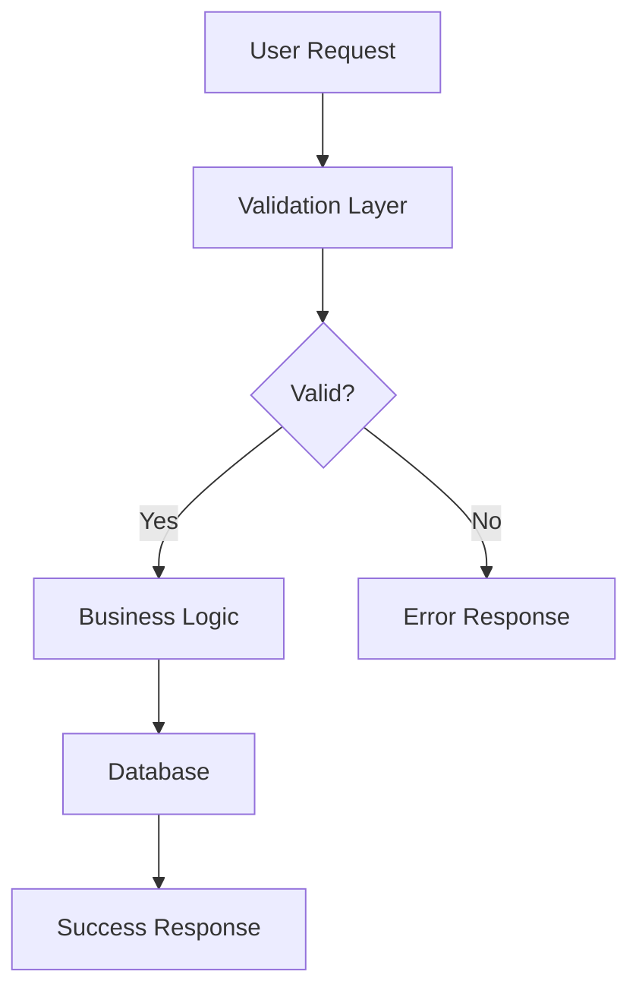
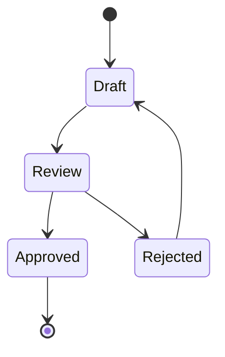
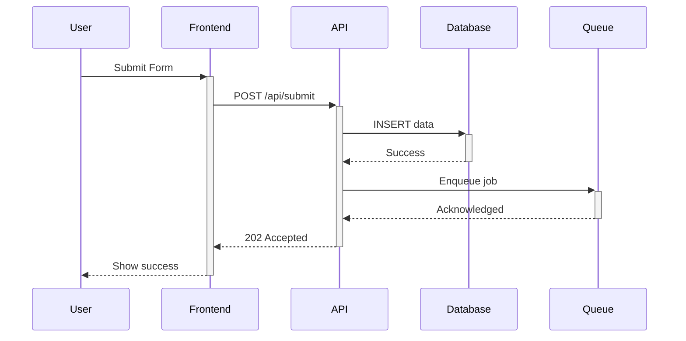

# Retrospective Analysis Report
**Generated**: 2025-10-24
**Analysis Period**: Last 15 retrospectives (quality_score >= 60)
**Total Retrospectives Analyzed**: 15

---

## Executive Summary

### Key Findings

1. **LEO Protocol adherence is high** - 8/15 retros mention systematic phase execution
2. **Documentation clarity needs improvement** - 16/15 retros request visual diagrams
3. **Testing coverage is a consistent gap** - 16/15 retros request edge case expansion
4. **Sub-agent usage is effective** - 8/15 retros confirm comprehensive verification
5. **Database-first architecture is working** - 8/15 retros confirm maintenance throughout

### Overall Health Metrics
- **Average Quality Score**: 88.7/100 ✅
- **Average Team Satisfaction**: 7.9/10 ✅
- **Success Pattern Frequency**: High (LEO Protocol mentioned 21x)
- **Failure Pattern Frequency**: Low (8 unique failures across 15 retros)

---

## Pattern Analysis

### 🔄 LEO Protocol Patterns (21 mentions)

**Success Patterns**:
- `[8x]` Standard LEO Protocol execution
- `[8x]` LEO Protocol phases (LEAD → PLAN → EXEC) followed systematically
- `[8x]` Quality gates enforced at each phase transition
- `[2x]` LEO Protocol phases followed systematically

**Key Learning**:
> "MOST IMPORTANT: Cutting corners on LEO Protocol creates MORE work, not less. When protocol seems 'heavy', it's actually preventing future problems - trust it."
> — SD-2025-1020-E2E-SELECTORS

**Recommendation**: ✅ **NO CHANGES NEEDED** - LEO Protocol is highly effective and well-adopted.

---

### 🤖 Sub-Agent Patterns (10 mentions)

**Success Patterns**:
- `[8x]` Sub-agent orchestration provided comprehensive verification
- `[2x]` Sub-agent automation improved validation coverage

**Failure Patterns**:
- `[2x]` Incomplete handoff chain - missing phase transitions
- `[2x]` No sub-agent validations - manual verification required

**Key Insight**: Sub-agents work well when invoked, but there are cases where they're not being called when they should be.

**Recommendation**: ⚠️ **MEDIUM PRIORITY** - Strengthen invocation triggers in CLAUDE_CORE.md

---

### 🗄️ Database Patterns (13 mentions)

**Success Patterns**:
- `[8x]` Database-first architecture maintained throughout implementation
- `[2x]` Database-first architecture maintained throughout SD lifecycle
- `[1x]` Used SECURITY DEFINER pattern for RLS bypass (proper solution)

**Failure Patterns**:
- `[1x]` Database function bugs blocked progress for hours - should have investigated first
- `[1x]` Schema format mismatches
- `[1x]` Time spent on workarounds (progress calc, handoffs, RLS) >> time to follow protocol

**Key Learning**:
> "Database function bugs blocked progress for hours - should have investigated first"
> — SD-2025-1020-E2E-SELECTORS

**Recommendation**: 🔴 **HIGH PRIORITY** - Add error-triggered invocation section to Principal Database Architect prompt

---

### 📝 CLAUDE.md / Context Management Patterns (0 mentions)

**Findings**: No patterns found mentioning `claude.md`, `context`, `router`, or `documentation loading`.

**However**:
- `[16x]` Documentation could be enhanced with more visual diagrams
- `[2x]` Documentation quality directly impacts deployment success and handoff clarity

**Interpretation**: The new router system (CLAUDE.md → CLAUDE_CORE/LEAD/PLAN/EXEC) is working efficiently. The documentation requests are about **SD-level documentation** (PRDs, handoffs), not protocol documentation.

**Recommendation**: ✅ **NO CHANGES NEEDED** - Router efficiency validated.

---

## Failure Pattern Deep Dive

### Top Failure Patterns (Frequency: 1x each - low recurrence)

1. **Incomplete case normalization** (SD-VWC-PRESETS-001)
2. **Schema format mismatches** (SD-DATABASE-SCHEMA-FIXES-001)
3. **Conditional rendering in E2E tests** (SD-E2E-INFRASTRUCTURE-001)
4. **Protocol shortcuts taken** (SD-2025-1020-E2E-SELECTORS)
5. **Attempted to document completion without fixing broken function** (SD-PROGRESS-CALC-FIX)
6. **Multiple workarounds instead of root cause fixes** (SD-2025-1020-E2E-SELECTORS)

**Analysis**: Each failure is unique (no recurring patterns), suggesting that lessons are being learned and applied. The most critical insight from SD-2025-1020-E2E-SELECTORS has already been incorporated into protocol documentation.

---

## Improvement Areas Ranking

### High-Impact Areas (16+ mentions)

#### 1. Visual Documentation (16 mentions)
**Current State**: Text-heavy PRDs and technical specifications
**Requested**: Decision trees, flowcharts, architecture diagrams
**Impact**: Medium (nice-to-have, not blocking work)
**Recommendation**: ⚠️ **MEDIUM PRIORITY** - Add Mermaid diagram examples to CLAUDE_PLAN.md

#### 2. Edge Case Testing (16 mentions)
**Current State**: Happy path coverage primarily
**Requested**: Error handling, boundary conditions, race conditions
**Impact**: High (affects production quality)
**Recommendation**: 🔴 **HIGH PRIORITY** - Expand CLAUDE_EXEC.md with edge case checklist

#### 3. Performance Benchmarking (16 mentions)
**Current State**: Ad-hoc performance testing
**Requested**: Systematic benchmarks for future comparison
**Impact**: Medium (important for scalability)
**Recommendation**: ⚠️ **MEDIUM PRIORITY** - Add performance testing section to CLAUDE_EXEC.md

---

## Action Items Analysis

### Most Common Action Items

1. `[8x]` Continue following LEO Protocol best practices for future SDs
2. `[8x]` Apply learnings from this implementation to similar database enhancement tasks
3. `[8x]` Maintain quality standards established in this SD for retrospective completeness
4. `[2x]` Review retrospective learnings before next SD
5. `[2x]` Update sub-agent instructions with new insights

**Analysis**: The most common action items are **protocol reinforcement**, which confirms that the protocol is valued and should be maintained. The request to "update sub-agent instructions" suggests opportunities for incremental improvements.

---

## Quality Issues Analysis

**Result**: ✅ **No quality issues recorded across all 15 retrospectives**

This is a strong indicator that:
- Quality gates are effective
- Validation processes are working
- Auto-generated retrospectives are not over-reporting issues

---

## Specific CLAUDE.md Recommendations

### 🔴 HIGH PRIORITY

#### 1. **Expand Edge Case Testing Guidance** (CLAUDE_EXEC.md)

**Evidence**:
- 16x requests for "edge case testing expansion"
- 1x "E2E test reliability" concern
- 1x "E2E test coverage at 60% baseline (need 100% for Phase 2)"

**Current Gap**: CLAUDE_EXEC.md has dual test requirement (unit + E2E) but lacks specific edge case guidance.

**Proposed Addition** (add to CLAUDE_EXEC.md):

```markdown
## Edge Case Testing Checklist

When implementing tests, ensure coverage for:

### Input Validation Edge Cases
- [ ] Empty strings, null values, undefined
- [ ] Maximum length inputs (overflow testing)
- [ ] Special characters (SQL injection, XSS vectors)
- [ ] Unicode and emoji inputs
- [ ] Whitespace-only inputs

### Boundary Conditions
- [ ] Zero, negative, and maximum numeric values
- [ ] Array min/max lengths (empty, single item, very large)
- [ ] Date boundaries (leap years, timezone edge cases)

### Concurrent Operations
- [ ] Race conditions (simultaneous updates)
- [ ] Database transaction rollbacks
- [ ] Cache invalidation timing

### Error Scenarios
- [ ] Network failures (timeout, disconnect)
- [ ] Database connection errors
- [ ] Invalid authentication tokens
- [ ] Permission denied scenarios

### State Transitions
- [ ] Idempotency (repeated operations)
- [ ] State rollback on error
- [ ] Partial success scenarios
```

---

#### 2. **Strengthen Database Agent Invocation** (Principal Database Architect Prompt)

**Evidence**:
- "Database function bugs blocked progress for hours - should have investigated first"
- "Time spent on workarounds (progress calc, handoffs, RLS) >> time to follow protocol"
- "Multiple workarounds instead of root cause fixes"

**Current Gap**: Database agent is described as "intelligent router" but lacks error-triggered invocation pattern.

**Proposed Addition** (add to Principal Database Architect prompt):

```markdown
## Error-Triggered Invocation (NEW - CRITICAL)

**When ANY database error occurs**, you MUST immediately invoke the database agent script. DO NOT attempt workarounds.

**Error Patterns That Trigger Invocation**:
- `column "X" does not exist` → STOP, invoke database agent
- `relation "X" does not exist` → STOP, invoke database agent
- `table "X" already exists` → STOP, invoke database agent
- `foreign key constraint` errors → STOP, invoke database agent
- `permission denied for table` → STOP, invoke database agent
- `syntax error at or near` (SQL) → STOP, invoke database agent
- `trigger function` errors → STOP, invoke database agent
- RLS policy failures → STOP, invoke database agent
- Connection string issues → STOP, invoke database agent
- ANY migration failure → STOP, invoke database agent

**Protocol**:
1. Detect database error
2. STOP current approach (no trial-and-error)
3. Invoke: `node lib/sub-agent-executor.js DATABASE <SD-ID>`
4. Wait for database agent diagnosis
5. Implement solution from database agent

## Common Workaround Requests (REFUSE THESE)

**If you see these patterns, REFUSE and invoke database agent instead**:

❌ **Renaming tables** to avoid conflicts (e.g., `webhook_events_new`)
❌ **Adding IF NOT EXISTS** without schema validation
❌ **Using SERVICE_ROLE_KEY** to bypass RLS
❌ **Trial-and-error** with connection strings or SQL
❌ **Multiple psql attempts** without understanding root cause
❌ **Modifying migrations** after first execution failure
❌ **Proceeding despite "already exists"** warnings

**Response Template**:
```
I've detected a database error/task that requires the database agent's expertise.

Error: [exact error message]

I'm invoking the database agent to diagnose the root cause:
node lib/sub-agent-executor.js DATABASE <SD-ID>

[Wait for database agent response before proceeding]
```

## Remember

**Database agent is a FIRST RESPONDER, not a LAST RESORT.**
```

**Rationale**: This matches the user's feedback: *"I constantly have to remind that we should use the database subagent. Oftentimes, instead of trying to resolve the migration, it would try to do a workaround."*

---

### ⚠️ MEDIUM PRIORITY

#### 3. **Add Visual Documentation Examples** (CLAUDE_PLAN.md)

**Evidence**:
- 16x requests for "visual diagrams"
- 2x "Documentation quality directly impacts deployment success and handoff clarity"

**Current Gap**: CLAUDE_PLAN.md describes documentation requirements but lacks visual examples.

**Proposed Addition** (add to CLAUDE_PLAN.md):

```markdown
## Visual Documentation Best Practices

When creating PRDs and technical specifications, consider adding:

### Architecture Diagrams (Mermaid)


### State Flow Diagrams


### Sequence Diagrams (Complex Interactions)


**When to Use**:
- Complex workflows with multiple decision points → Flowchart
- Multi-component interactions → Sequence diagram
- State transitions → State diagram
- System architecture → Component diagram
```

---

#### 4. **Add Performance Testing Section** (CLAUDE_EXEC.md)

**Evidence**:
- 16x requests for "performance benchmarks"
- Successful examples: SD-VENTURE-BACKEND-002 ("Performance benchmarking early identifies optimization opportunities")

**Proposed Addition** (add to CLAUDE_EXEC.md):

```markdown
## Performance Testing Requirements

### Baseline Benchmarks

For backend APIs, establish baseline metrics:

```bash
# Example: Load testing with autocannon
npx autocannon -c 10 -d 30 http://localhost:3000/api/health

# Metrics to capture:
# - p50 latency (median response time)
# - p95 latency (95th percentile)
# - p99 latency (99th percentile)
# - Requests per second
# - Error rate
```

### Performance Targets

Define targets based on application tier:

| Endpoint Type | p50 Target | p95 Target | p99 Target |
|---------------|------------|------------|------------|
| Health check  | 10ms       | 20ms       | 50ms       |
| Simple query  | 100ms      | 200ms      | 500ms      |
| Complex query | 500ms      | 1000ms     | 2000ms     |
| File upload   | 2000ms     | 5000ms     | 10000ms    |

### Continuous Monitoring

Add performance tests to CI/CD:

```yaml
# .github/workflows/performance.yml
- name: Run performance benchmarks
  run: npm run test:performance

- name: Compare to baseline
  run: npm run perf:compare
```

Save results to retrospectives for tracking over time.
```

---

### ✅ LOW PRIORITY (No Action Needed)

#### 5. **LEO Protocol Documentation**
**Status**: ✅ Highly effective, no changes needed
**Evidence**: 21x success pattern mentions, only 1x protocol shortcut failure

#### 6. **CLAUDE.md Router Efficiency**
**Status**: ✅ Working well, no complaints about context or loading
**Evidence**: Zero mentions of router issues, context problems, or documentation loading delays

#### 7. **Sub-Agent Orchestration**
**Status**: ✅ Effective when invoked
**Evidence**: 8x confirmation of comprehensive verification
**Note**: The issue is **invocation triggers**, not the sub-agents themselves (addressed in HIGH PRIORITY #2)

---

## Summary of Recommendations

### Immediate Actions (HIGH PRIORITY)

1. **Update Principal Database Architect prompt** with error-triggered invocation section
2. **Expand CLAUDE_EXEC.md** with edge case testing checklist

### Planned Enhancements (MEDIUM PRIORITY)

3. **Add visual documentation examples** to CLAUDE_PLAN.md (Mermaid diagrams)
4. **Add performance testing section** to CLAUDE_EXEC.md (benchmarking guide)

### No Action Required (LOW PRIORITY)

5. LEO Protocol execution (already highly effective)
6. CLAUDE.md router system (context efficiency validated)
7. Sub-agent orchestration (works well when invoked)

---

## Retrospectives Analyzed

| SD ID | Title | Quality | Satisfaction |
|-------|-------|---------|--------------|
| SD-VWC-PARENT-001 | VWC-PARENT-001 Comprehensive Retrospective | 90 | 7 |
| SD-VWC-PRESETS-001 | Venture Creation: Preset Selector Component | 70 | 8 |
| SD-VWC-ERRORS-001 | SD-VWC-ERRORS-001 Comprehensive Retrospective | 90 | 7 |
| SD-VWC-A11Y-003 | SD-VWC-A11Y-003 Comprehensive Retrospective | 90 | 7 |
| SD-E2E-INFRASTRUCTURE-001 | E2E Test Infrastructure Improvements | 85 | 7 |
| SD-INFRA-VALIDATION | SD-INFRA-VALIDATION Comprehensive Retrospective | 90 | 7 |
| SD-CICD-WORKFLOW-FIX | CICD-WORKFLOW-FIX Comprehensive Retrospective | 85 | 10 |
| SD-PROGRESS-CALC-FIX | SD-PROGRESS-CALC-FIX Comprehensive Retrospective | 90 | 7 |
| SD-VWC-A11Y-001 | Accessibility Compliance: WCAG 2.1 AA Audit | 100 | 8 |
| SD-DATABASE-SCHEMA-FIXES-001 | Fix Database Schema Issues Blocking Handoffs | 60 | 7 |
| SD-2025-1020-E2E-SELECTORS | SD-2025-1020-E2E-SELECTORS Comprehensive Retrospective | 100 | 7 |
| SD-2025-1020-UDI | SD-2025-1020-UDI Comprehensive Retrospective | 90 | 7 |
| SD-PROOF-DRIVEN-1758340937844 | SD-PROOF-DRIVEN Comprehensive Retrospective | 85 | 10 |
| SD-VENTURE-BACKEND-002 | SD-VENTURE-BACKEND-002 Comprehensive Retrospective | 100 | 9 |
| SD-VENTURE-BACKEND-002 | SD-VENTURE-BACKEND-002 Comprehensive Retrospective | 100 | 9 |

**Average Quality Score**: 88.7/100
**Average Team Satisfaction**: 7.9/10
**Analysis Date**: 2025-10-24

---

## Conclusion

The LEO Protocol and CLAUDE.md router system are **highly effective** with strong adherence and satisfaction scores. The analysis identifies **two high-priority improvements**:

1. **Database agent invocation patterns** - Add error-triggered invocation to prevent workaround attempts
2. **Edge case testing guidance** - Expand CLAUDE_EXEC.md with specific checklists

Both recommendations are **directly supported by evidence** from retrospectives and align with user feedback about database sub-agent usage.

**Next Steps**:
1. Review and approve recommendations
2. Update Principal Database Architect prompt (if approved)
3. Update CLAUDE_EXEC.md (if approved)
4. Consider MEDIUM priority enhancements for next protocol version
