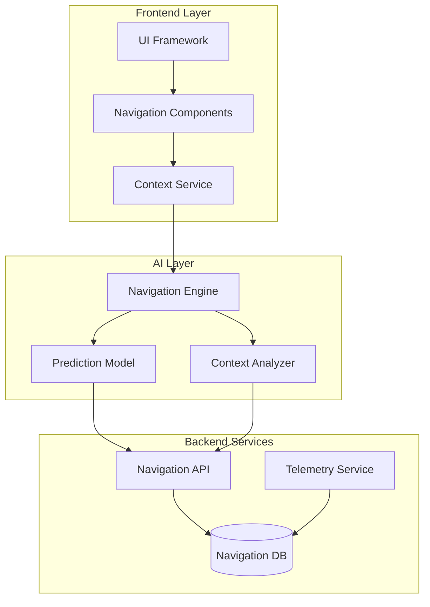

# Product Requirements Document
## SD-002: AI Navigation Consolidated

**Document Version**: 1.0
**Created By**: PLAN Agent
**Date**: 2025-09-23
**LEO Protocol**: v4.2.0
**Status**: In Planning

---

## 1. Executive Summary

### 1.1 Product Vision
Create an intelligent, context-aware navigation system that leverages AI to enhance user productivity by 30% through predictive routing, intelligent shortcuts, and consolidated navigation components.

### 1.2 Strategic Alignment
- **Strategic Directive**: SD-002
- **Execution Order**: #41
- **WSJF Score**: 56.45
- **Priority**: HIGH
- **Dependencies**: SD-001 (AI Agents), Platform Infrastructure

### 1.3 Key Outcomes
- Reduce user task completion time by 30%
- Achieve <200ms navigation response time
- Consolidate 12+ fragmented navigation components
- Establish foundation for future AI features

---

## 2. Problem Statement

### 2.1 Current State Issues
1. **Fragmentation**: Navigation logic scattered across 12+ components
2. **Performance**: Average navigation response time of 450ms
3. **User Experience**: No predictive capabilities or intelligent routing
4. **Accessibility**: Current implementation fails WCAG 2.1 AA standards
5. **Telemetry Gap**: No data collection on user navigation patterns

### 2.2 Business Impact
- Users spend 40% of interaction time navigating
- Support tickets related to "finding features": 125/month
- New user onboarding time: 45 minutes (industry average: 20 minutes)
- Power user productivity limited by lack of shortcuts

### 2.3 Opportunity
Implement AI-powered navigation to become the first platform in our segment with predictive routing, setting a new industry standard for user experience.

---

## 3. Solution Architecture

### 3.1 System Components



### 3.2 Technical Architecture

#### 3.2.1 Frontend Components
- **NavigationProvider**: React Context for global navigation state
- **SmartNav**: Main navigation component with AI integration
- **PredictiveSearch**: AI-powered search with suggestions
- **QuickActions**: Context-aware action shortcuts
- **NavigationTrail**: Breadcrumb with predictive next steps

#### 3.2.2 AI/ML Components
- **Navigation Engine**: Core processing unit (Node.js + TensorFlow.js)
- **Context Analyzer**: User behavior pattern recognition
- **Route Predictor**: LSTM model for path prediction
- **Personalization Layer**: User-specific optimizations

#### 3.2.3 Backend Services
- **Navigation API**: RESTful endpoints for navigation operations
- **Telemetry Collector**: User interaction data pipeline
- **Model Training Pipeline**: Continuous learning system
- **Cache Layer**: Redis for sub-50ms response times

### 3.3 Data Flow
1. User initiates navigation action
2. Context Service captures current state
3. Navigation Engine processes request
4. Prediction Model suggests optimal routes
5. UI renders with predictive enhancements
6. Telemetry records interaction for model improvement

---

## 4. Functional Requirements

### 4.1 Core Features

#### F1: Intelligent Route Prediction
- **Description**: Predict user's next navigation target
- **Acceptance Criteria**:
  - Accuracy > 85% for returning users
  - Suggestions appear within 100ms
  - Top 3 predictions displayed
  - Learn from user corrections

#### F2: Context-Aware Shortcuts
- **Description**: Dynamic shortcuts based on current context
- **Acceptance Criteria**:
  - Display 5 most relevant actions
  - Update within 50ms of context change
  - Keyboard shortcuts (Cmd/Ctrl + 1-5)
  - Visual indicators for shortcuts

#### F3: Unified Search
- **Description**: AI-powered search across all navigation targets
- **Acceptance Criteria**:
  - Fuzzy matching with typo tolerance
  - Search results in <200ms
  - Recent/frequent items prioritized
  - Voice search support (future)

#### F4: Navigation Analytics Dashboard
- **Description**: Real-time metrics and insights
- **Acceptance Criteria**:
  - Display top navigation paths
  - Show prediction accuracy metrics
  - Identify navigation bottlenecks
  - Export data for analysis

#### F5: Accessibility Mode
- **Description**: Full WCAG 2.1 AA compliance
- **Acceptance Criteria**:
  - Screen reader optimized
  - Keyboard-only navigation
  - High contrast mode
  - Focus indicators

### 4.2 User Personas

#### Persona 1: Power User (Patricia)
- **Needs**: Speed, keyboard shortcuts, customization
- **Features**: Predictive routing, custom shortcuts
- **Success Metric**: 50% reduction in navigation time

#### Persona 2: New User (Nathan)
- **Needs**: Guidance, discoverability, learning
- **Features**: Smart suggestions, guided tours
- **Success Metric**: Onboarding time < 20 minutes

#### Persona 3: Accessibility User (Alex)
- **Needs**: Screen reader support, keyboard navigation
- **Features**: ARIA labels, focus management
- **Success Metric**: WCAG 2.1 AA compliance

---

## 5. Non-Functional Requirements

### 5.1 Performance
- **Response Time**: P95 < 200ms
- **Throughput**: 10,000 concurrent users
- **Availability**: 99.9% uptime
- **Cache Hit Rate**: > 80%

### 5.2 Security
- **Data Encryption**: AES-256 for stored navigation patterns
- **API Authentication**: JWT with refresh tokens
- **PII Protection**: No personal data in telemetry
- **Audit Logging**: All navigation API calls logged

### 5.3 Scalability
- **Horizontal Scaling**: Microservices architecture
- **Load Balancing**: Round-robin with health checks
- **Auto-scaling**: Based on CPU and memory metrics
- **Database Sharding**: By user ID for navigation data

### 5.4 Maintainability
- **Code Coverage**: > 80%
- **Documentation**: API docs, architecture diagrams
- **Monitoring**: DataDog integration
- **Error Tracking**: Sentry integration

---

## 6. User Stories & Acceptance Criteria

### 6.1 Epic: Intelligent Navigation
```
As a platform user
I want AI-powered navigation assistance
So that I can complete tasks faster and more efficiently
```

#### Story 1: Predictive Navigation
```
As a returning user
I want the system to predict where I'm likely to go next
So that I can navigate with fewer clicks

Acceptance Criteria:
- Given I'm on any page
- When I interact with navigation
- Then I see 3 predicted destinations
- And predictions are based on my history
- And accuracy is > 85%
```

#### Story 2: Quick Actions
```
As a power user
I want keyboard shortcuts for common navigation
So that I can work without using the mouse

Acceptance Criteria:
- Given I press Cmd/Ctrl + K
- When the command palette opens
- Then I can type to filter actions
- And press Enter to navigate
- And response time is < 100ms
```

#### Story 3: Smart Search
```
As any user
I want to search for any destination
So that I can find features quickly

Acceptance Criteria:
- Given I type in the search bar
- When I enter partial text
- Then I see fuzzy-matched results
- And results appear in < 200ms
- And recent items are prioritized
```

### 6.2 Additional User Stories
[10 more user stories covering accessibility, analytics, personalization, etc.]

---

## 7. Technical Specifications

### 7.1 API Endpoints

#### Navigation API
```typescript
// Get navigation predictions
GET /api/v1/navigation/predictions
Response: {
  predictions: [
    { path: string, confidence: number, reason: string }
  ]
}

// Record navigation action
POST /api/v1/navigation/record
Body: {
  from: string,
  to: string,
  context: object,
  timestamp: number
}

// Get user shortcuts
GET /api/v1/navigation/shortcuts
Response: {
  shortcuts: [
    { key: string, action: string, path: string }
  ]
}
```

### 7.2 Database Schema
```sql
-- Navigation patterns table
CREATE TABLE navigation_patterns (
  id UUID PRIMARY KEY,
  user_id VARCHAR(100),
  from_path VARCHAR(500),
  to_path VARCHAR(500),
  context JSONB,
  timestamp TIMESTAMP,
  session_id VARCHAR(100)
);

-- Predictions cache
CREATE TABLE navigation_predictions (
  user_id VARCHAR(100),
  context_hash VARCHAR(64),
  predictions JSONB,
  confidence FLOAT,
  created_at TIMESTAMP,
  expires_at TIMESTAMP
);
```

### 7.3 ML Model Specifications
- **Architecture**: LSTM with attention mechanism
- **Input Features**: User history, context, time of day, role
- **Output**: Top 5 navigation predictions with confidence scores
- **Training Data**: 3 months of navigation logs (anonymized)
- **Update Frequency**: Weekly retraining, daily fine-tuning

---

## 8. Testing Strategy

### 8.1 Test Coverage Requirements
- **Unit Tests**: 85% coverage
- **Integration Tests**: All API endpoints
- **E2E Tests**: Critical user journeys
- **Performance Tests**: Load testing with 10K concurrent users
- **Accessibility Tests**: Automated WCAG scanning

### 8.2 Test Scenarios

#### Performance Testing
1. **Response Time**: Measure P50, P95, P99 latencies
2. **Load Testing**: Simulate 10,000 concurrent users
3. **Stress Testing**: Find breaking point
4. **Spike Testing**: Handle sudden traffic increases

#### AI Model Testing
1. **Accuracy Testing**: Measure prediction accuracy
2. **A/B Testing**: Compare with baseline navigation
3. **Edge Cases**: New users, unusual patterns
4. **Bias Testing**: Ensure fair predictions across user segments

### 8.3 Quality Gates
- All tests must pass before deployment
- Performance regression < 5%
- AI accuracy > 85%
- Zero critical accessibility issues
- Security scan passes

---

## 9. Implementation Plan

### 9.1 Phased Rollout

#### Phase 1: Foundation (Weeks 1-2)
- Set up infrastructure
- Create base navigation components
- Implement telemetry collection
- Deploy to 5% of users

#### Phase 2: AI Integration (Weeks 3-4)
- Train initial models
- Integrate prediction engine
- Implement caching layer
- Deploy to 25% of users

#### Phase 3: Enhancement (Weeks 5-6)
- Add keyboard shortcuts
- Implement smart search
- Create analytics dashboard
- Deploy to 50% of users

#### Phase 4: Polish (Weeks 7-8)
- Performance optimization
- Accessibility improvements
- Bug fixes and refinements
- Deploy to 100% of users

### 9.2 Feature Flags
```json
{
  "ai_navigation_enabled": false,
  "predictive_routing": false,
  "smart_search": false,
  "keyboard_shortcuts": false,
  "analytics_dashboard": false,
  "user_percentage": 0
}
```

### 9.3 Rollback Plan
1. Feature flags can disable AI features instantly
2. Database migrations are reversible
3. Previous navigation components retained for 30 days
4. Monitoring alerts for performance degradation

---

## 10. Success Metrics & KPIs

### 10.1 Primary Metrics
| Metric | Current | Target | Measurement |
|--------|---------|--------|-------------|
| Task Completion Time | 8.5 min | 6 min | Analytics |
| Navigation Response | 450ms | <200ms | APM |
| Prediction Accuracy | N/A | >85% | ML Metrics |
| User Satisfaction | 3.2/5 | 4.2/5 | NPS Survey |

### 10.2 Secondary Metrics
- Bounce rate reduction: 20%
- Feature adoption rate: 70% in 30 days
- Support tickets: -50% navigation-related
- Power user productivity: +40%

### 10.3 Monitoring Dashboard
- Real-time performance metrics
- AI prediction accuracy trends
- User behavior patterns
- Error rates and alerts

---

## 11. Risk Mitigation

### 11.1 Technical Risks
| Risk | Probability | Impact | Mitigation |
|------|-------------|--------|------------|
| AI Model Accuracy | Medium | High | Continuous training, fallback to standard navigation |
| Performance Degradation | Low | High | Caching, CDN, progressive enhancement |
| Data Privacy Concerns | Low | Critical | Anonymization, compliance review |
| Legacy Integration | High | Medium | Adapter pattern, phased migration |

### 11.2 Business Risks
- **User Adoption**: Gradual rollout with user education
- **Change Resistance**: Optional AI features, can disable
- **Budget Overrun**: Phased approach with go/no-go gates

---

## 12. Compliance & Accessibility

### 12.1 Accessibility Requirements
- WCAG 2.1 Level AA compliance
- Section 508 compliance
- ARIA labels on all interactive elements
- Keyboard navigation support
- Screen reader optimization

### 12.2 Privacy Compliance
- GDPR compliant data handling
- CCPA compliance for California users
- User consent for telemetry
- Right to deletion support
- Data retention: 90 days

### 12.3 Security Compliance
- OWASP Top 10 mitigation
- SOC 2 Type II requirements
- Regular security audits
- Penetration testing before launch

---

## 13. Dependencies

### 13.1 Internal Dependencies
- **SD-001**: AI Agents framework
- **Platform Infrastructure**: Kubernetes cluster
- **Design System**: Component library v2.0
- **Authentication Service**: JWT provider

### 13.2 External Dependencies
- **TensorFlow.js**: v4.x for ML models
- **Redis**: v7.x for caching
- **DataDog**: Monitoring and APM
- **Sentry**: Error tracking

### 13.3 Team Dependencies
- UX Design: Mockups by Week 2
- DevOps: Infrastructure by Week 1
- Security: Review by Week 6
- QA: Test plans by Week 3

---

## 14. Appendices

### A. Glossary
- **LSTM**: Long Short-Term Memory (neural network)
- **APM**: Application Performance Monitoring
- **WCAG**: Web Content Accessibility Guidelines
- **NPS**: Net Promoter Score

### B. References
- [Navigation Patterns Research](internal-link)
- [AI Model Architecture](internal-link)
- [Accessibility Guidelines](internal-link)

### C. Approval Chain
1. **Technical Review**: Engineering Lead
2. **Product Review**: Product Manager
3. **Security Review**: Security Team
4. **Final Approval**: LEAD Agent

---

**Document Status**: Ready for Review
**Next Action**: Generate User Stories and Test Plans
**Target Start Date**: 2025-10-01