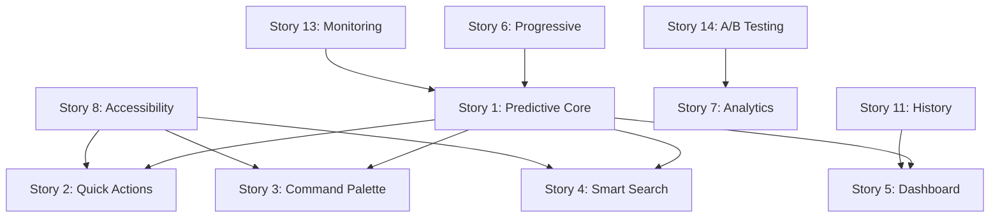

# User Stories for SD-002: AI Navigation Consolidated

**Generated By**: PLAN Agent
**Date**: 2025-09-23
**Total Stories**: 15
**Estimated Points**: 89

---

## Epic: AI-Powered Navigation System

### Story 1: Predictive Navigation Core
**As a** returning user
**I want** the system to predict my next navigation destination
**So that** I can navigate with fewer clicks and save time

**Acceptance Criteria:**
- System analyzes last 30 days of navigation history
- Predictions appear within 100ms of page load
- Top 3 predictions shown with confidence scores
- Predictions update based on current context
- Accuracy tracked and must exceed 85%

**Technical Tasks:**
- Implement LSTM model for prediction
- Create navigation history storage
- Build prediction API endpoint
- Add telemetry for accuracy tracking

**Story Points:** 8

---

### Story 2: Context-Aware Quick Actions
**As a** power user
**I want** dynamic shortcuts based on my current context
**So that** I can access frequent actions instantly

**Acceptance Criteria:**
- Display 5 most relevant actions
- Update within 50ms of context change
- Keyboard shortcuts (Cmd/Ctrl + 1-5)
- Visual indicators for each shortcut
- Customizable shortcut preferences

**Technical Tasks:**
- Build context analysis service
- Create shortcut ranking algorithm
- Implement keyboard event handlers
- Design shortcut UI component

**Story Points:** 5

---

### Story 3: Intelligent Command Palette
**As a** keyboard-focused user
**I want** a command palette with AI suggestions
**So that** I can navigate entirely via keyboard

**Acceptance Criteria:**
- Opens with Cmd/Ctrl + K
- Fuzzy search with typo tolerance
- AI-ranked results based on usage
- Recent commands at top
- Execute with Enter key

**Technical Tasks:**
- Build command palette UI
- Implement fuzzy search algorithm
- Create command registry system
- Add keyboard navigation logic

**Story Points:** 8

---

### Story 4: Smart Search with NLP
**As a** any user
**I want** natural language search for navigation
**So that** I can find features using plain English

**Acceptance Criteria:**
- Understand queries like "show me sales reports"
- Return results in <200ms
- Handle synonyms and variations
- Learn from user selections
- Support voice input (future)

**Technical Tasks:**
- Integrate NLP processing
- Build search index
- Create synonym mapping
- Implement result ranking

**Story Points:** 13

---

### Story 5: Personalized Navigation Dashboard
**As a** frequent user
**I want** a personalized navigation dashboard
**So that** I can see my most-used paths

**Acceptance Criteria:**
- Show top 10 frequent destinations
- Display recent navigation history
- Customizable widget layout
- One-click navigation to any item
- Updates in real-time

**Technical Tasks:**
- Create dashboard component
- Build usage analytics service
- Implement widget system
- Add personalization API

**Story Points:** 5

---

### Story 6: Progressive Navigation Enhancement
**As a** user on a slow connection
**I want** navigation to work even with limited AI features
**So that** I can still use the system effectively

**Acceptance Criteria:**
- Basic navigation works without AI
- AI features load progressively
- Graceful degradation on errors
- Performance metrics displayed
- Fallback to standard navigation

**Technical Tasks:**
- Implement feature detection
- Create fallback navigation
- Add performance monitoring
- Build progressive loading

**Story Points:** 5

---

### Story 7: Navigation Analytics for Admins
**As an** administrator
**I want** to see navigation analytics
**So that** I can optimize the system layout

**Acceptance Criteria:**
- Real-time navigation heatmap
- Most common paths visualization
- Bottleneck identification
- Export data as CSV/JSON
- Filterable by date range

**Technical Tasks:**
- Build analytics dashboard
- Create data aggregation pipeline
- Implement visualization charts
- Add export functionality

**Story Points:** 8

---

### Story 8: Accessibility-First Navigation
**As a** screen reader user
**I want** fully accessible AI navigation
**So that** I can benefit from the same features

**Acceptance Criteria:**
- All elements have ARIA labels
- Keyboard navigation complete
- Screen reader announcements
- Skip links available
- WCAG 2.1 AA compliant

**Technical Tasks:**
- Add comprehensive ARIA markup
- Implement focus management
- Create screen reader hints
- Test with NVDA/JAWS

**Story Points:** 8

---

### Story 9: Mobile-Optimized Navigation
**As a** mobile user
**I want** touch-optimized AI navigation
**So that** I can navigate efficiently on my device

**Acceptance Criteria:**
- Touch gestures for shortcuts
- Responsive design for all screens
- Bottom sheet navigation
- Swipe actions for predictions
- Optimized for thumb reach

**Technical Tasks:**
- Create mobile navigation component
- Implement gesture handlers
- Build responsive layouts
- Optimize touch targets

**Story Points:** 5

---

### Story 10: Collaborative Navigation Sharing
**As a** team member
**I want** to share navigation paths with colleagues
**So that** we can collaborate more effectively

**Acceptance Criteria:**
- Generate shareable navigation links
- Create navigation "recipes"
- Share via email/Slack
- Track shared path usage
- Permission-based sharing

**Technical Tasks:**
- Build link generation system
- Create sharing API
- Implement permission checks
- Add usage tracking

**Story Points:** 3

---

### Story 11: Navigation History & Bookmarks
**As a** user
**I want** to save and revisit navigation paths
**So that** I can quickly return to complex locations

**Acceptance Criteria:**
- Save current path as bookmark
- Organize bookmarks in folders
- Search through history
- Clear history option
- Import/export bookmarks

**Technical Tasks:**
- Create bookmark storage
- Build history tracking
- Implement search functionality
- Add import/export feature

**Story Points:** 5

---

### Story 12: Multi-language Navigation
**As a** non-English speaker
**I want** navigation in my preferred language
**So that** I can use the system comfortably

**Acceptance Criteria:**
- Support 5 initial languages
- Automatic language detection
- Translatable navigation hints
- RTL language support
- Language preference saved

**Technical Tasks:**
- Implement i18n system
- Create translation files
- Add RTL support
- Build language switcher

**Story Points:** 5

---

### Story 13: Navigation Performance Monitoring
**As a** system administrator
**I want** to monitor navigation performance
**So that** I can ensure optimal user experience

**Acceptance Criteria:**
- Real-time response metrics
- Alert on slowdowns >200ms
- Historical performance graphs
- Per-component breakdown
- SLA compliance tracking

**Technical Tasks:**
- Integrate APM monitoring
- Create performance dashboard
- Set up alerting rules
- Build metric collectors

**Story Points:** 3

---

### Story 14: A/B Testing Framework
**As a** product manager
**I want** to A/B test navigation features
**So that** we can optimize based on data

**Acceptance Criteria:**
- Define test cohorts
- Track conversion metrics
- Statistical significance calc
- Feature flag integration
- Results dashboard

**Technical Tasks:**
- Build A/B test framework
- Create cohort assignment
- Implement metric tracking
- Design results UI

**Story Points:** 5

---

### Story 15: Navigation API for Extensions
**As a** third-party developer
**I want** API access to navigation features
**So that** I can build extensions

**Acceptance Criteria:**
- RESTful API endpoints
- API key authentication
- Rate limiting (1000/hour)
- Comprehensive documentation
- SDK in JavaScript/Python

**Technical Tasks:**
- Design API architecture
- Implement authentication
- Add rate limiting
- Create documentation
- Build SDK libraries

**Story Points:** 8

---

## Story Prioritization

### Sprint 1 (Weeks 1-2) - Foundation
- Story 1: Predictive Navigation Core (8 pts)
- Story 6: Progressive Enhancement (5 pts)
- Story 13: Performance Monitoring (3 pts)
**Total: 16 points**

### Sprint 2 (Weeks 3-4) - Core Features
- Story 2: Quick Actions (5 pts)
- Story 3: Command Palette (8 pts)
- Story 8: Accessibility (8 pts)
**Total: 21 points**

### Sprint 3 (Weeks 5-6) - Intelligence
- Story 4: Smart Search (13 pts)
- Story 5: Personalized Dashboard (5 pts)
- Story 11: History & Bookmarks (5 pts)
**Total: 23 points**

### Sprint 4 (Weeks 7-8) - Enhancement
- Story 7: Analytics Dashboard (8 pts)
- Story 9: Mobile Navigation (5 pts)
- Story 14: A/B Testing (5 pts)
**Total: 18 points**

### Backlog (Future)
- Story 10: Collaborative Sharing (3 pts)
- Story 12: Multi-language (5 pts)
- Story 15: API for Extensions (8 pts)
**Total: 16 points**

---

## Success Metrics Per Story

| Story | Key Metric | Target |
|-------|------------|--------|
| 1 | Prediction Accuracy | >85% |
| 2 | Shortcut Usage | >60% users |
| 3 | Command Palette Adoption | >40% users |
| 4 | Search Success Rate | >90% |
| 5 | Dashboard Engagement | 5 min/day |
| 6 | Fallback Frequency | <5% |
| 7 | Analytics Usage | Weekly views |
| 8 | Accessibility Score | 100% WCAG |
| 9 | Mobile Navigation | <300ms |
| 10 | Sharing Frequency | 10/day |
| 11 | Bookmark Usage | 30% users |
| 12 | Language Coverage | 80% users |
| 13 | Performance SLA | 99.9% |
| 14 | Test Velocity | 2/week |
| 15 | API Adoption | 5 integrations |

---

## Dependencies Map

---

## Risk Matrix

| Story | Risk | Mitigation |
|-------|------|------------|
| 1 | Model accuracy | Continuous training |
| 4 | NLP complexity | Use pre-trained models |
| 8 | Accessibility compliance | Early testing |
| 9 | Mobile performance | Progressive enhancement |
| 13 | Monitoring overhead | Sampling strategy |

---

**Document Status**: Complete
**Next Step**: Create Test Plans
**EXEC Ready**: After test plan completion