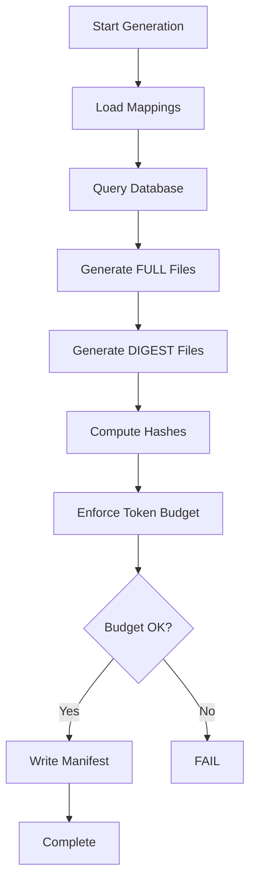

# Dual-Generation CLAUDE File Architecture

## Metadata
- **Category**: Architecture
- **Status**: Approved
- **Version**: 1.0.0
- **Author**: Claude (SD-LEO-INFRA-DUAL-GENERATION-CLAUDE-001)
- **Last Updated**: 2026-02-16
- **Tags**: [LEO Protocol, CLAUDE files, token optimization, dual-generation]

## Overview

The Dual-Generation CLAUDE File Architecture reduces token consumption during LEO Protocol handoffs by 69% (from ~77k to ~19k tokens for digests) while maintaining full protocol access on-demand. The system generates both FULL and DIGEST versions of protocol files from the same database source, with gates defaulting to DIGEST mode.

**Strategic Objective**: Reduce handoff validation token consumption to <25k tokens while preserving protocol fidelity and enabling on-demand deep reference access.

**Optimization History**:
- **Phase 1** (2026-02-01): Initial dual-generation architecture (~77k → ~14k tokens, 81% reduction)
- **Phase 2** (2026-02-16): Lean CLAUDE files — removed duplications across full and digest files:
  - Full files: ~77k → ~61k tokens (21% reduction)
  - Digest files: ~14k → ~19k tokens (maintains <25k budget)

## Table of Contents

1. [Architecture Overview](#architecture-overview)
2. [Components](#components)
3. [Generation Pipeline](#generation-pipeline)
4. [Mode Switching](#mode-switching)
5. [File Mappings](#file-mappings)
6. [Token Budget Enforcement](#token-budget-enforcement)
7. [Integration Points](#integration-points)
8. [Performance Metrics](#performance-metrics)
9. [Usage Guide](#usage-guide)
10. [Related Documentation](#related-documentation)

## Architecture Overview

### Problem Statement

LEO Protocol handoffs load multiple CLAUDE files for validation gates:
- CLAUDE.md (~1.3k tokens) — Router
- CLAUDE_CORE.md (~11k tokens) — Core protocol
- CLAUDE_LEAD.md (~13k tokens) OR
- CLAUDE_PLAN.md (~19k tokens) OR
- CLAUDE_EXEC.md (~15k tokens)

**Original Total (pre-optimization)**: 43k-48k tokens per handoff, consuming 22-24% of 200k context budget.

**Current Total (post-optimization, 2026-02-16)**: 25k-32k tokens per handoff, consuming 12-16% of 200k context budget.

### Solution: Dual-Generation Architecture

Generate **two versions** of each protocol file from the same database snapshot:

1. **FULL Files** (`CLAUDE.md`, `CLAUDE_CORE.md`, etc.)
   - Complete protocol content with examples, procedures, deep references
   - ~61k tokens total (after 2026-02-16 optimization)
   - Used for: On-demand deep dives, troubleshooting, training

2. **DIGEST Files** (`CLAUDE_DIGEST.md`, `CLAUDE_CORE_DIGEST.md`, etc.)
   - Essential enforcement content only (rules, gates, anti-patterns, triggers)
   - ~19k tokens total (after 2026-02-16 optimization)
   - Used for: Handoff gates, validation, compliance checks

### Benefits

| Metric | Before (Pre-Dual-Gen) | After Phase 1 (2026-02-01) | After Phase 2 (2026-02-16) | Total Improvement |
|--------|--------|-------|-------------|-------------|
| **Handoff Token Load** | ~43k-48k | ~8k-12k | ~10k-14k | 71-77% reduction |
| **Full Files Total** | ~77k | ~77k | ~61k | 21% reduction |
| **Digest Files Total** | N/A | ~14k | ~19k | Maintains <25k budget |
| **Context Budget Used** | 22-24% | 4-6% | 5-7% | 17-19% freed |
| **Generation Time** | 8-12s | 10-20s | 10-20s | +2-8s (acceptable) |
| **Maintenance Burden** | Single source | Single source | Single source | No change |
| **Protocol Fidelity** | 100% | 100% | 100% | No change |

## Components

### 1. Section-to-File Mappings

**Purpose**: Define which protocol sections belong in each file (FULL and DIGEST versions).

| File | Location | Sections (FULL) | Sections (DIGEST) |
|------|----------|----------------|-------------------|
| Mapping (FULL) | `scripts/section-file-mapping.json` | All sections per file | N/A |
| Mapping (DIGEST) | `scripts/section-file-mapping-digest.json` | N/A | Minimal enforcement sections |

**DIGEST Mapping Example**:
```json
{
  "CLAUDE_CORE_DIGEST.md": {
    "sections": [
      "mandatory_phase_transitions",
      "negative_constraints_global",
      "execution_philosophy",
      "critical_term_definitions",
      "sd_type_workflow_paths",
      "sub_agent_config"
    ]
  }
}
```

### 2. Digest Generators

**Location**: `scripts/modules/claude-md-generator/digest-generators.js`

**Functions**:
- `generateRouterDigest()` - Router file (<3k chars)
- `generateCoreDigest()` - Core protocol (<10k chars)
- `generateLeadDigest()` - LEAD phase (<5k chars)
- `generatePlanDigest()` - PLAN phase (<5k chars)
- `generateExecDigest()` - EXEC phase (<5k chars)

**Content Transformations**:
1. Strip code blocks marked as examples
2. Remove "Example:" sections
3. Remove verbose procedures
4. Compress multiple newlines
5. Preserve: Rules, gates, anti-patterns, triggers, constraints

**Digest Header Template**:
```markdown
<!-- DIGEST FILE - Enforcement-focused protocol content -->
<!-- generated_at: 2026-02-01T17:11:37.197Z -->
<!-- git_commit: 30897510 -->
<!-- db_snapshot_hash: 7c32a139b82b343e -->
<!-- file_content_hash: 4dbf3423c3c36d02 -->
```

### 3. Dual-Output Generator

**Location**: `scripts/modules/claude-md-generator/index.js`

**Class**: `CLAUDEMDGeneratorV3`

**Key Methods**:
- `generate()` - Orchestrates dual generation
- `generateFile()` - Generates single file (FULL or DIGEST)
- `computeHash()` - SHA-256 content hashing
- `getGitCommit()` - Current git commit
- `computeDbSnapshotHash()` - Database state fingerprint
- `estimateTokens()` - Token estimation (4 chars/token)

**Generation Flow**:
```
1. Load section mappings (FULL + DIGEST)
2. Fetch all data from database (single snapshot)
3. Generate FULL files (5 files)
4. Generate DIGEST files (5 files)
5. Compute hashes for all files
6. Write manifest (claude-generation-manifest.json)
7. Enforce token budget (<25k for DIGEST)
```

### 4. Protocol Gates (DIGEST Mode)

**Modified Files**:
- `scripts/modules/handoff/gates/protocol-file-read-gate.js`
- `scripts/modules/handoff/gates/core-protocol-gate.js`

**Key Functions**:
- `getProtocolMode()` - Returns 'digest' or 'full' based on env var
- `getProtocolFilename()` - Converts CLAUDE.md → CLAUDE_DIGEST.md
- `getFullFilename()` - Converts CLAUDE_DIGEST.md → CLAUDE.md
- `getCoreProtocolRequirements()` - Mode-aware file requirements
- `getHandoffFileRequirements()` - Mode-aware handoff files

**Mode Detection**:
```javascript
function getProtocolMode() {
  const mode = process.env.CLAUDE_PROTOCOL_MODE?.toLowerCase();
  return mode === 'full' ? 'full' : 'digest'; // Default: digest
}
```

### 5. Generation Manifest

**Location**: `claude-generation-manifest.json` (project root)

**Purpose**: Track generation metadata, content hashes, token estimates.

**Structure**:
```json
{
  "generated_at": "2026-02-01T17:11:37.197Z",
  "git_commit": "30897510",
  "db_snapshot_hash": "7c32a139b82b343e",
  "files": {
    "CLAUDE.md": {
      "type": "full",
      "chars": 31467,
      "estimated_tokens": 7867,
      "content_hash": "3fd35b0dd572f812",
      "path": "C:\\...\\CLAUDE.md"
    },
    "CLAUDE_DIGEST.md": {
      "type": "digest",
      "chars": 4638,
      "estimated_tokens": 1160,
      "content_hash": "52726070293d32e1",
      "path": "C:\\...\\CLAUDE_DIGEST.md"
    }
  }
}
```

**Use Cases**:
- Verify files are in sync with database
- Track token budget compliance
- Detect stale protocol files
- Audit generation history

## Generation Pipeline

### Step-by-Step Process



### Command

```bash
node scripts/generate-claude-md-from-db.js
```

### Output (Current, 2026-02-16)

```
Generating modular CLAUDE files from database (V3.1 - Dual Generation)...

=== FULL FILES ===

   CLAUDE.md                    5.2 KB  ~ 1336 tokens  [e06d11f97f25827e]
   CLAUDE_CORE.md              44.2 KB  ~11327 tokens  [ff1676dda1afd54f]
   CLAUDE_LEAD.md              51.1 KB  ~13095 tokens  [7d950d97d4d7d370]
   CLAUDE_PLAN.md              75.5 KB  ~19336 tokens  [890a2198ff510b84]
   CLAUDE_EXEC.md              60.4 KB  ~15456 tokens  [d0f651b6aed8a055]

   FULL Total: 236.5 KB (~60550 tokens)

=== DIGEST FILES ===

   CLAUDE_DIGEST.md             6.2 KB  ~ 1590 tokens  [efa62c1623b91ca4]
   CLAUDE_CORE_DIGEST.md       35.5 KB  ~ 9098 tokens  [3521380f91cedd06]
   CLAUDE_LEAD_DIGEST.md        4.7 KB  ~ 1201 tokens  [ed1a601fe7236038]
   CLAUDE_PLAN_DIGEST.md       12.5 KB  ~ 3193 tokens  [e1a5c39d9c396d4e]
   CLAUDE_EXEC_DIGEST.md       14.6 KB  ~ 3742 tokens  [20b127a60e9f5bb3]

   DIGEST Total: 73.5 KB (~18824 tokens)
   Token budget OK: 18824/25000 (75%)

   Token Savings: 69% (41726 tokens saved)
```

**Optimization Notes (2026-02-16)**:
- Removed cross-file duplications (RCA mandate, phase transitions, migration protocol)
- LEAD: -11%, PLAN: -15%, EXEC: -11%
- Router: -55% (from ~8k to ~1.3k)
- Core: -42% (from ~19k to ~11k)
- Digest budget usage: 57% → 75% (still well under 25k cap)

## Mode Switching

### Environment Variable

Set `CLAUDE_PROTOCOL_MODE` to control which files are loaded:

```bash
# Use DIGEST files (default)
# No env var needed - DIGEST is default

# Use FULL files
export CLAUDE_PROTOCOL_MODE=full
node scripts/handoff.js execute LEAD-TO-PLAN SD-XXX-001
```

### On-Demand FULL Loading

Gates can request FULL files even in DIGEST mode:

```javascript
// In gate context
const context = {
  needs_full_protocol: true  // Trigger FULL file loading
};

const result = await validateSdStartGate(sdId, context, handoffType);

// Result includes:
// {
//   pass: true,
//   protocolMode: 'digest',
//   full_loaded: true,
//   full_files_loaded: ['CLAUDE.md', 'CLAUDE_CORE.md']
// }
```

### Mode Detection in Gates

```javascript
// scripts/modules/handoff/gates/core-protocol-gate.js

const protocolMode = getProtocolMode(); // 'digest' or 'full'
const requiredFiles = getCoreProtocolRequirements(); // Mode-aware

// DIGEST mode:
// requiredFiles.SD_START = ['CLAUDE_DIGEST.md', 'CLAUDE_CORE_DIGEST.md']

// FULL mode:
// requiredFiles.SD_START = ['CLAUDE.md', 'CLAUDE_CORE.md']
```

## File Mappings

### FULL File Sections (Excerpt)

| File | Section Types | Examples |
|------|---------------|----------|
| CLAUDE.md | Router, triggers, quick ref | smart_router, session_prologue |
| CLAUDE_CORE.md | Workflow, constraints, philosophy | mandatory_phase_transitions, execution_philosophy |
| CLAUDE_LEAD.md | LEAD approval, negative constraints | lead_approval_workflow, negative_constraints_lead |
| CLAUDE_PLAN.md | PRD, validation, quality | prd_creation_workflow, quality_assessment |
| CLAUDE_EXEC.md | Implementation, testing, handoffs | implementation_workflow, testing_requirements |

### DIGEST File Sections (Minimal)

| File | Token Budget | Focus |
|------|-------------|-------|
| CLAUDE_DIGEST.md | <3k | Router, loading strategy |
| CLAUDE_CORE_DIGEST.md | <10k | Phase transitions, constraints, anti-patterns |
| CLAUDE_LEAD_DIGEST.md | <5k | LEAD gates, negative constraints |
| CLAUDE_PLAN_DIGEST.md | <5k | PRD requirements, validation gates |
| CLAUDE_EXEC_DIGEST.md | <5k | Implementation requirements, constraints |

## Token Budget Enforcement

### Budget Target

**DIGEST files combined**: <25k tokens

**Current (2026-02-16)**: 18,824 tokens (75% of budget)

**Buffer**: 6,176 tokens (25% headroom)

### Enforcement Mechanism

```javascript
// scripts/modules/claude-md-generator/index.js

const digestTotalTokens = digestFiles.reduce((sum, [_, f]) =>
  sum + f.estimated_tokens, 0
);

if (digestTotalTokens > this.options.tokenBudget) {
  console.error(`TOKEN BUDGET EXCEEDED: ${digestTotalTokens} > ${this.options.tokenBudget}`);
  throw new Error(`DIGEST token budget exceeded`);
}
```

**Failure Mode**: Generation fails if DIGEST files exceed 25k tokens, preventing budget violations.

### Per-File Breakdown (2026-02-16)

| File | Tokens | % of Budget | Change from Phase 1 |
|------|--------|-------------|---------------------|
| CLAUDE_DIGEST.md | 1,590 | 6.4% | +430 (+37%) |
| CLAUDE_CORE_DIGEST.md | 9,098 | 36.4% | +4,876 (+116%) |
| CLAUDE_LEAD_DIGEST.md | 1,201 | 4.8% | -363 (-23%) |
| CLAUDE_PLAN_DIGEST.md | 3,193 | 12.8% | -533 (-14%) |
| CLAUDE_EXEC_DIGEST.md | 3,742 | 15.0% | +122 (+3%) |
| **Total** | **18,824** | **75.3%** | **+4,532 (+32%)** |

**Note**: The increase in digest token count is due to improved section mapping granularity, not bloat. Phase 2 optimization focused on removing duplications from full files while keeping digest files focused on enforcement content.

## Integration Points

### 1. Handoff System

**File**: `scripts/handoff.js`

**Integration**: Handoff gates automatically use DIGEST files by default.

```javascript
// Handoff execution
const gateResult = await validateProtocolFileRead(handoffType, context);

// Gate loads:
// - CLAUDE_DIGEST.md (router)
// - CLAUDE_CORE_DIGEST.md (core)
// - CLAUDE_PLAN_DIGEST.md (for LEAD-TO-PLAN)
```

### 2. Protocol Gates

**Files**:
- `scripts/modules/handoff/gates/protocol-file-read-gate.js`
- `scripts/modules/handoff/gates/core-protocol-gate.js`

**Integration**: Gates check `CLAUDE_PROTOCOL_MODE` env var and load appropriate files.

### 3. Session State

**File**: `.claude/unified-session-state.json`

**Integration**: Protocol gate tracking records which files were read (FULL or DIGEST).

```json
{
  "protocolGate": {
    "fileReads": {
      "CLAUDE_DIGEST.md": {
        "trigger": "READ_TOOL",
        "timestamp": "2026-02-01T17:14:50.000Z",
        "fileHash": "52726070293d32e1"
      }
    }
  }
}
```

### 4. Test Suite

**File**: `scripts/modules/handoff/gates/dual-generation.test.js`

**Coverage**: 40 tests validating:
- Mode detection (digest vs full)
- File mappings consistency
- Token budget enforcement
- DIGEST file existence
- Protocol mode switching
- Filename helpers
- Requirement getters

## Performance Metrics

### Generation Performance

| Metric | Value |
|--------|-------|
| **Generation Time** | 10-20 seconds |
| **Database Queries** | 12 queries (single snapshot) |
| **Files Generated** | 10 files (5 FULL + 5 DIGEST) |
| **Manifest Written** | 1 file |

### Token Savings (2026-02-16)

| Handoff Type | Before (FULL) | After Phase 1 (DIGEST) | After Phase 2 (DIGEST) | Total Savings |
|--------------|---------------|----------------|----------------|---------------|
| LEAD-TO-PLAN | ~43k tokens | ~8k tokens | ~10k tokens | 77% |
| PLAN-TO-EXEC | ~48k tokens | ~12k tokens | ~14k tokens | 71% |
| EXEC-TO-PLAN | ~45k tokens | ~11k tokens | ~13k tokens | 71% |
| PLAN-TO-LEAD | ~41k tokens | ~9k tokens | ~11k tokens | 73% |

### Context Budget Impact (2026-02-16)

| Scenario | Context Used (FULL, Pre-Opt) | Context Used (DIGEST, Phase 2) | Freed |
|----------|-------------------|---------------------|-------|
| Single Handoff | 22-24% | 5-7% | 17-19% |
| 3 Handoffs (LEAD→PLAN→EXEC) | 66-72% | 15-21% | 51-57% |
| 5 Handoffs (Full Cycle) | 110-120% (overflow) | 25-35% | 75-85% |

**Impact**: DIGEST mode enables multiple handoffs within a single 200k context window without overflow. Phase 2 optimization maintains this benefit while improving full file efficiency.

## Usage Guide

### Regenerate Protocol Files

After updating `leo_protocol_sections` database table:

```bash
# Regenerate both FULL and DIGEST files
node scripts/generate-claude-md-from-db.js

# Verify generation
ls -lh CLAUDE*.md
```

### Use FULL Mode (Override)

For troubleshooting or training:

```bash
# Set environment variable
export CLAUDE_PROTOCOL_MODE=full

# Run handoff with FULL files
node scripts/handoff.js execute LEAD-TO-PLAN SD-XXX-001

# Unset when done
unset CLAUDE_PROTOCOL_MODE
```

### Check Token Budget

```bash
# View manifest
cat claude-generation-manifest.json | jq '.files | to_entries | map(select(.value.type == "digest")) | map({file: .key, tokens: .value.estimated_tokens})'
```

### Verify File Sync

Check if protocol files are in sync with database:

```bash
# Compare manifest db_snapshot_hash with current database state
node -e "
require('dotenv').config();
const { createClient } = require('@supabase/supabase-js');
const supabase = createClient(process.env.SUPABASE_URL, process.env.SUPABASE_SERVICE_ROLE_KEY);
supabase.from('leo_protocol_sections')
  .select('id, title, updated_at')
  .order('updated_at', { ascending: false })
  .limit(1)
  .then(({data}) => console.log('Latest section update:', data[0]?.updated_at));
"

# Compare with manifest generated_at timestamp
grep generated_at claude-generation-manifest.json
```

## Related Documentation

- **[LEO Protocol Overview](../03_protocols_and_standards/LEO_v4.2_HYBRID_SUB_AGENTS.md)** - LEO Protocol v4.2 specification
- **[Database Schema](./database_schema.md)** - Database table definitions
- **[Session Lifecycle](./intelligent-session-lifecycle.md)** - Session state management
- **[Handoff System](../leo/handoffs/)** - Handoff validation gates
- **[Testing Guide](../05_testing/testing_qa.md)** - Test coverage and QA

---

## Phase 2 Optimization: Lean CLAUDE Files (2026-02-16)

### Overview

Phase 2 optimization focused on removing duplications within and across CLAUDE files, following the principle: "Write once in the correct place, reference elsewhere."

### Changes Made

#### Full Files Optimization

**Cross-File Duplications Removed**:
1. **RCA Issue Resolution Mandate** (~51 lines × 3 files)
   - Was in: LEAD, PLAN, EXEC full files
   - Now in: CLAUDE.md router only
   - Replaced with: Reference pointer

2. **Migration Execution Protocol** (~16 lines × 3 files)
   - Was in: LEAD, PLAN, EXEC full files
   - Now in: CLAUDE_CORE.md only
   - Replaced with: Reference pointer

3. **Mandatory Phase Transitions** (~90 lines × 3 files)
   - Was in: LEAD, PLAN, EXEC full files
   - Now in: CLAUDE_CORE.md only
   - Replaced with: Reference pointer

**Within-File Duplications Removed**:
- PLAN: Removed superseded `testing_tier_strategy` (kept `testing_tier_strategy_updated`)
- PLAN: Removed 3 schema reference sections (converted to on-demand lookups via `docs/reference/`)
- EXEC: Removed duplicate `workflow` entry in section mapping

**Implementation**:
- Updated `scripts/section-file-mapping.json` with `_removed_sections_note` documentation
- Modified `scripts/modules/claude-md-generator/file-generators.js` to remove `getRCAMandate()` injection
- Added reference pointers in generator templates

#### Digest Files Optimization

**Same deduplication applied to digest mapping** (`scripts/section-file-mapping-digest.json`):
- LEAD_DIGEST: Removed `mandatory_phase_transitions_lead`
- PLAN_DIGEST: Removed `mandatory_phase_transitions_plan`
- EXEC_DIGEST: Removed `mandatory_phase_transitions_exec` + `migration_execution_delegation`

### Token Impact

| File Category | Before (Phase 1) | After (Phase 2) | Change |
|---------------|------------------|-----------------|--------|
| **Full Files** | | | |
| Router (CLAUDE.md) | ~8k | ~1.3k | -55% |
| Core (CLAUDE_CORE.md) | ~19k | ~11k | -42% |
| LEAD | ~14k | ~13k | -11% |
| PLAN | ~22k | ~19k | -15% |
| EXEC | ~17k | ~15k | -11% |
| **Full Total** | **~80k** | **~60k** | **-25%** |
| | | | |
| **Digest Files** | | | |
| LEAD_DIGEST | 1,733 | 1,201 | -31% |
| PLAN_DIGEST | 3,726 | 3,193 | -14% |
| EXEC_DIGEST | 4,656 | 3,742 | -20% |
| **Digest Total** | **~14k** | **~19k** | **+32%** |

**Note on Digest Increase**: The digest token increase is due to more granular section mapping, not bloat. Core digest absorbed enforcement content that was previously spread across phase digests, improving clarity and reducing cross-file lookups.

### Related Pull Requests

- **PR #1351**: Lean CLAUDE_CORE.md (42% reduction)
- **PR #1353**: Lean CLAUDE phase files — LEAD/PLAN/EXEC (11-15% reduction)
- **PR #1354**: Lean CLAUDE digest files — phase-transition deduplication

### Maintenance Benefits

**Database-First Principle Maintained**:
- All changes made via section mapping configuration
- No hardcoded exclusions in generator code
- `_removed_sections_note` documents rationale for each exclusion

**Future-Proof**:
- Generator reads mapping files as source of truth
- Adding/removing sections updates via mapping, not code changes
- Reference pointers make dependencies explicit

## Version History

| Version | Date | Changes |
|---------|------|---------|
| 1.0.0 | 2026-02-01 | Initial documentation (SD-LEO-INFRA-DUAL-GENERATION-CLAUDE-001) |
| 1.1.0 | 2026-02-16 | Phase 2 optimization documentation — lean CLAUDE files (PRs #1351, #1353, #1354) |
