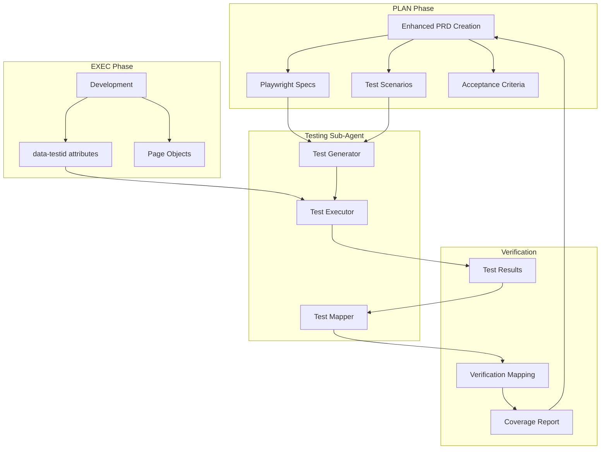

# LEO Protocol v4.2 - Enhanced PRD to Playwright Testing Integration

## Executive Summary

LEO Protocol v4.2 introduces comprehensive **Playwright test integration directly into the PRD creation and execution workflow**. This enhancement ensures that every requirement defined in the PLAN phase has corresponding automated tests that verify implementation in the EXEC phase, creating complete traceability from requirement to verification.

## Key Innovation: Test-Driven PRD Development

### The Problem
Previously, PRDs defined requirements but testing was created separately, leading to:
- Gaps between requirements and test coverage
- Manual effort to create tests after development
- Difficulty tracking which requirements were actually verified
- No automatic link between PRD completion and test validation

### The Solution
PRDs now include **embedded Playwright test specifications** that:
- Define exact selectors and test scenarios during planning
- Auto-generate Playwright test files from requirements
- Map test results back to specific PRD requirements
- Enable continuous verification throughout development

## Architecture Overview



## Database Schema Enhancement

### New Tables Created

1. **prd_playwright_specifications** - Test configuration for each PRD
2. **prd_playwright_scenarios** - Detailed test scenarios with steps
3. **prd_test_verification_mapping** - Links requirements to test results
4. **playwright_generation_queue** - Queue for automated test generation
5. **prd_test_fixtures** - Reusable test data

## Enhanced PRD Structure

### Traditional PRD Fields
- Functional requirements
- Non-functional requirements
- Acceptance criteria

### New Playwright-Enhanced Fields

```javascript
functional_requirements: [
  {
    id: 'REQ-001',
    name: 'User Authentication',
    description: 'Users must be able to log in',
    acceptance_criteria: [...],
    
    // NEW: Playwright Test Specifications
    playwright_test_specs: {
      selectors: {
        emailInput: '[data-testid="email-input"]',
        passwordInput: '[data-testid="password-input"]',
        submitButton: '[data-testid="login-submit"]',
        errorMessage: '[data-testid="login-error"]'
      },
      test_scenarios: [
        {
          name: 'Successful login',
          steps: [...],
          assertions: [...]
        },
        {
          name: 'Invalid credentials',
          steps: [...],
          assertions: [...]
        }
      ],
      api_validations: [...],
      visual_tests: [...],
      accessibility_tests: [...]
    }
  }
]
```

## Workflow Integration

### 1. LEAD Phase - Strategic Direction
- LEAD creates Strategic Directive (SD)
- Identifies high-level testing requirements
- Sets quality gates and coverage targets

### 2. PLAN Phase - Enhanced PRD Creation
```bash
# Create PRD with Playwright specs
node scripts/create-prd-with-playwright.js

# PRD now includes:
- Test selectors for each requirement
- Test scenarios with steps and assertions
- API endpoint validations
- Visual regression test definitions
- Accessibility test requirements
```

### 3. EXEC Phase - Implementation with Testing in Mind
During implementation, EXEC must:
- Add `data-testid` attributes matching PRD specs
- Implement features following test scenarios
- Ensure testability of all components

Example:
```jsx
// PRD specifies: emailInput: '[data-testid="email-input"]'
// EXEC implements:
<input 
  data-testid="email-input"
  type="email"
  onChange={handleEmailChange}
/>
```

### 4. Testing Sub-Agent - Automatic Test Generation

```bash
# Generate Playwright tests from PRD
node lib/testing/prd-playwright-generator.js PRD-ID

# This creates:
- tests/e2e/generated/*.spec.js (test files)
- tests/e2e/generated/pages/*.page.js (page objects)
- tests/e2e/generated/fixtures/test-data.js (test data)
- TEST_PLAN.md (documentation)
```

### 5. Test Execution

```bash
# Run generated tests
npm run test:e2e

# Run specific requirement tests
npm run test:e2e -- req-001.spec.js

# Run with specific browser
npm run test:e2e -- --project=chromium
```

### 6. Test Result Mapping

```bash
# Map test results back to PRD
node lib/dashboard/prd-test-mapper.js map PRD-ID TEST-RUN-ID

# This creates:
- Requirement coverage report
- Test verification mappings
- Pass/fail status per requirement
- Gap analysis for untested requirements
```

## Key Components

### 1. PRD Playwright Generator (`lib/testing/prd-playwright-generator.js`)

**Purpose**: Automatically generates Playwright test files from PRD specifications

**Features**:
- Parses PRD functional requirements
- Generates test scenarios for each requirement
- Creates page object models
- Generates test data fixtures
- Produces test documentation

**Usage**:
```javascript
const generator = new PRDPlaywrightGenerator();
await generator.generateTestsFromPRD('PRD-12345');
```

### 2. PRD Test Mapper (`lib/dashboard/prd-test-mapper.js`)

**Purpose**: Maps Playwright test execution results back to PRD requirements

**Features**:
- Loads test results from Playwright output
- Matches tests to PRD requirements
- Calculates coverage metrics
- Generates verification reports
- Updates PRD validation status

**Usage**:
```javascript
const mapper = new PRDTestMapper();
await mapper.mapTestResults('test-run-id', 'PRD-12345');
```

### 3. Enhanced PRD Creation Script (`scripts/create-prd-with-playwright.js`)

**Purpose**: Creates PRDs with embedded Playwright specifications

**Features**:
- Includes test selectors in requirements
- Defines test scenarios during planning
- Sets performance thresholds
- Specifies accessibility requirements
- Configures visual regression tests

## Test Scenario Structure

Each PRD requirement can define multiple test scenarios:

```javascript
test_scenarios: [
  {
    name: 'Happy path test',
    steps: [
      {
        step: 1,
        action: 'navigate',
        target: '{{baseUrl}}/login',
        data: null,
        assertion: { type: 'url', expected: '/login' }
      },
      {
        step: 2,
        action: 'fill',
        target: '[data-testid="email-input"]',
        data: 'test@example.com',
        assertion: { type: 'value', expected: 'test@example.com' }
      },
      {
        step: 3,
        action: 'click',
        target: '[data-testid="submit"]',
        data: null,
        assertion: { type: 'visible', selector: '.dashboard' }
      }
    ],
    assertions: [
      { type: 'toBeVisible', selector: '.dashboard' },
      { type: 'toHaveURL', pattern: '/dashboard' }
    ]
  }
]
```

## Coverage and Verification

### Coverage Metrics
- **Requirement Coverage**: % of requirements with tests
- **Test Pass Rate**: % of tests passing
- **Code Coverage**: Lines/branches covered
- **Visual Coverage**: Screenshots validated

### Verification States
- **Pending**: No tests executed
- **In Progress**: Tests running
- **Passed**: All tests passing
- **Failed**: One or more tests failing
- **Blocked**: Cannot execute tests

### Coverage Report Example
```markdown
## Coverage Summary
- Total Requirements: 10
- Tested Requirements: 8 (80%)
- Passed Requirements: 7
- Failed Requirements: 1
- Untested Requirements: 2
- Overall Pass Rate: 87.5%
```

## Benefits of Integration

### 1. **Complete Traceability**
Every requirement has a clear path:
```
Requirement → Test Scenario → Test File → Test Result → Verification
```

### 2. **Shift-Left Testing**
- Tests defined during planning, not after development
- Issues caught earlier in development cycle
- Clear acceptance criteria from the start

### 3. **Automated Test Generation**
- No manual test writing required
- Consistent test structure
- Reduced human error

### 4. **Real-Time Verification**
- Test results immediately mapped to requirements
- Dashboard shows live coverage status
- Instant feedback on requirement completion

### 5. **Quality Gates Enforcement**
- Cannot mark PRD complete without test coverage
- Minimum coverage thresholds enforced
- Test passage required for phase transitions

## Implementation Checklist

### For PLAN Agent
- [ ] Include Playwright specs in all PRDs
- [ ] Define selectors for every interactive element
- [ ] Create at least 3 test scenarios per requirement
- [ ] Specify API endpoints to validate
- [ ] Set performance thresholds

### For EXEC Agent
- [ ] Add data-testid attributes matching PRD specs
- [ ] Implement features to pass defined scenarios
- [ ] Ensure components are testable
- [ ] Follow selector naming conventions
- [ ] Validate against test scenarios during development

### For Testing Sub-Agent
- [ ] Generate tests from PRD automatically
- [ ] Execute full test suite
- [ ] Map results to requirements
- [ ] Generate coverage reports
- [ ] Identify gaps in testing

## Example: Complete Flow

### 1. PLAN creates enhanced PRD
```bash
node scripts/create-prd-with-playwright.js
# Output: PRD-ENHANCED-1234567890
```

### 2. EXEC implements with test IDs
```jsx
<div data-testid="feedback-container">
  <textarea data-testid="feedback-input" />
  <button data-testid="submit-feedback">Submit</button>
</div>
```

### 3. Testing Sub-Agent generates tests
```bash
node lib/testing/prd-playwright-generator.js PRD-ENHANCED-1234567890
# Output: 
# ✅ Generated 6 test files
# ✅ Generated 18 test scenarios
# ✅ Generated 6 page objects
```

### 4. Run tests
```bash
npm run test:e2e
# Output:
# Running 18 tests...
# ✅ 16 passed
# ❌ 2 failed
```

### 5. Map results to PRD
```bash
node lib/dashboard/prd-test-mapper.js map PRD-ENHANCED-1234567890
# Output:
# Coverage: 85%
# Pass Rate: 88.9%
# Report: test-results/reports/verification-PRD-ENHANCED-1234567890.md
```

## Database Queries

### Get PRD test coverage
```sql
SELECT * FROM prd_test_coverage_summary 
WHERE prd_id = 'PRD-12345';
```

### Get failing scenarios
```sql
SELECT * FROM prd_playwright_scenarios 
WHERE prd_id = 'PRD-12345' 
AND last_result = 'failed';
```

### Get untested requirements
```sql
SELECT pr.id, pr.name
FROM (
  SELECT jsonb_array_elements(functional_requirements) AS req
  FROM product_requirements_v2
  WHERE id = 'PRD-12345'
) AS requirements
LEFT JOIN prd_playwright_scenarios ps 
ON ps.requirement_id = (req->>'id')
WHERE ps.id IS NULL;
```

## CI/CD Integration

### GitHub Actions Example
```yaml
name: PRD Test Verification
on: [push, pull_request]

jobs:
  test:
    runs-on: ubuntu-latest
    steps:
      - uses: actions/checkout@v2
      
      - name: Setup Node
        uses: actions/setup-node@v2
        
      - name: Install dependencies
        run: npm ci
        
      - name: Generate tests from PRD
        run: node lib/testing/prd-playwright-generator.js ${{ env.PRD_ID }}
        
      - name: Run Playwright tests
        run: npm run test:e2e
        
      - name: Map results to PRD
        run: node lib/dashboard/prd-test-mapper.js map ${{ env.PRD_ID }}
        
      - name: Check coverage threshold
        run: |
          COVERAGE=$(node -e "...")
          if [ $COVERAGE -lt 80 ]; then
            exit 1
          fi
```

## Monitoring and Alerts

### Real-time Test Monitoring
```javascript
// Monitor test execution in real-time
const mapper = new PRDTestMapper();
await mapper.monitorTestExecution('PRD-12345');
```

### Coverage Alerts
- Alert when coverage drops below 80%
- Notify on critical test failures
- Report untested new requirements

## Migration Guide

### For Existing PRDs
1. Run migration script to add Playwright specs
2. Review and enhance test scenarios
3. Generate tests and validate
4. Update EXEC implementation with test IDs

### For New PRDs
1. Always use enhanced PRD creation script
2. Define comprehensive test scenarios
3. Include all test types (e2e, api, visual, a11y)
4. Set realistic coverage targets

## Best Practices

### 1. Selector Naming
- Use descriptive data-testid values
- Follow consistent naming patterns
- Avoid using CSS classes or IDs for tests

### 2. Test Scenario Design
- Start with happy path
- Include edge cases
- Add negative tests
- Consider performance scenarios

### 3. Assertion Strategy
- Test user-visible behavior
- Verify API responses
- Check visual consistency
- Validate accessibility

### 4. Test Data Management
- Use fixtures for consistent data
- Separate test from production data
- Clean up after tests

## Troubleshooting

### Common Issues

**Issue**: Tests can't find elements
**Solution**: Verify data-testid attributes match PRD specs

**Issue**: Low test coverage
**Solution**: Add more test scenarios to PRD requirements

**Issue**: Tests passing locally but failing in CI
**Solution**: Check environment differences, use consistent viewports

**Issue**: Slow test execution
**Solution**: Parallelize tests, optimize selectors, reduce waits

## Future Enhancements

### Planned Features
- AI-powered test scenario suggestions
- Automatic visual regression baseline updates
- Smart test prioritization based on code changes
- Cross-browser compatibility matrix
- Performance benchmark tracking

### Research Areas
- ML-based test maintenance
- Predictive test failure analysis
- Automatic test healing
- Natural language to test conversion

## Conclusion

The LEO Protocol v4.2 Playwright Testing Integration fundamentally changes how we approach quality assurance by:

1. **Embedding testing into requirements** - Tests are not an afterthought but part of planning
2. **Automating test generation** - Reduce manual effort and human error
3. **Ensuring complete traceability** - Every requirement is verifiable
4. **Enabling continuous verification** - Real-time feedback on implementation status
5. **Enforcing quality gates** - Cannot proceed without adequate test coverage

This integration ensures that when the Testing Sub-Agent leverages Playwright, all test details are automatically tied back to the original PRD, creating a closed-loop verification system that guarantees requirement fulfillment.

---

*LEO Protocol v4.2 - Enhanced with Playwright Testing Integration*
*Generated: 2025-09-04*
*Status: ACTIVE*