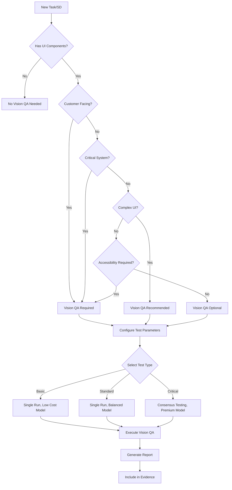

# LEO Protocol Vision QA Integration (Extension v3.1.5.9)


## Table of Contents

- [Metadata](#metadata)
- [1. Vision QA System Overview](#1-vision-qa-system-overview)
  - [1.1. Core Capabilities](#11-core-capabilities)
- [2. Integration Triggers for LEO Agents](#2-integration-triggers-for-leo-agents)
  - [2.1. LEAD Agent Vision QA Triggers](#21-lead-agent-vision-qa-triggers)
  - [2.2. PLAN Agent Vision QA Orchestration](#22-plan-agent-vision-qa-orchestration)
  - [2.3. EXEC Agent Vision QA Execution](#23-exec-agent-vision-qa-execution)
- [3. Vision QA Decision Tree](#3-vision-qa-decision-tree)
- [4. Cost Management Guidelines](#4-cost-management-guidelines)
  - [4.1. Model Selection by Agent Role](#41-model-selection-by-agent-role)
  - [4.2. Automatic Model Selection Rules](#42-automatic-model-selection-rules)
- [5. Integration with Existing LEO Components](#5-integration-with-existing-leo-components)
  - [5.1. Database Integration](#51-database-integration)
  - [5.2. Evidence Package Integration](#52-evidence-package-integration)
  - [5.3. Quality Gate Integration](#53-quality-gate-integration)
- [6. Vision QA Communication Templates](#6-vision-qa-communication-templates)
  - [6.1. LEAD → PLAN with Vision QA Requirement](#61-lead-plan-with-vision-qa-requirement)
  - [6.2. PLAN → EXEC with Vision QA Task](#62-plan-exec-with-vision-qa-task)
  - [6.3. EXEC → PLAN with Vision QA Results](#63-exec-plan-with-vision-qa-results)
- [7. Troubleshooting and Edge Cases](#7-troubleshooting-and-edge-cases)
  - [7.1. When Vision QA is Blocked](#71-when-vision-qa-is-blocked)
  - [7.2. Interpreting Vision QA Failures](#72-interpreting-vision-qa-failures)
- [8. Migration Path for Existing Tests](#8-migration-path-for-existing-tests)
  - [8.1. Gradual Adoption Strategy](#81-gradual-adoption-strategy)
- [9. Appendix: Quick Reference](#9-appendix-quick-reference)
  - [9.1. Vision QA Commands](#91-vision-qa-commands)
  - [9.2. Cost Quick Reference](#92-cost-quick-reference)
- [10. Version History](#10-version-history)

## Metadata
- **Category**: Protocol
- **Status**: Draft
- **Version**: 1.0.0
- **Author**: DOCMON
- **Last Updated**: 2025-12-18
- **Tags**: database, api, testing, migration

**Status: PROPOSED - Vision QA System Integration**
**Created: 2025-01-30**
**Purpose: Define when and how LEO Protocol agents utilize the Vision QA System**

This document extends LEO Protocol v3.1.5.8 to integrate the Vision-Based QA System, providing clear guidelines for when LEAD, PLAN, and EXEC agents should invoke autonomous visual testing capabilities.

---

## 1. Vision QA System Overview

The Vision QA System is an autonomous testing framework that combines Playwright browser automation with multimodal LLMs (GPT-5, Claude Sonnet) to perform intelligent UI testing through an Observe→Think→Act loop.

### 1.1. Core Capabilities
- **Autonomous Navigation**: Achieves high-level test goals without explicit step-by-step instructions
- **Visual Bug Detection**: Identifies UI issues, layout problems, and accessibility concerns
- **Multi-Application Support**: Tests any registered application in the EHG_Engineer ecosystem
- **Automatic Model Selection**: Chooses optimal AI model based on test requirements
- **Cost-Optimized**: Manages API costs through intelligent model selection and limits

---

## 2. Integration Triggers for LEO Agents

### 2.1. LEAD Agent Vision QA Triggers

**When LEAD Should Request Vision QA Testing:**

#### 2.1.1. Strategic Directive Validation
```markdown
**Trigger Conditions**:
- New Strategic Directive involves UI/UX components
- SD includes customer-facing functionality
- SD modifies critical user workflows
- SD requires accessibility compliance verification

**Example Communication**:
**To:** PLAN Agent
**From:** LEAD Agent
**Protocol:** LEO Protocol v3.1.5.9 (Vision QA Integration)
**Strategic Directive:** SD-2025-01-30-A: Enhanced User Dashboard
**Vision QA Required:** YES - Customer-facing UI changes
**Test Goals:**
- Verify dashboard loads correctly
- Validate responsive design across viewports
- Check accessibility compliance
- Detect visual bugs or layout issues
```

#### 2.1.2. Cross-SD Integration Testing
```markdown
**Trigger**: Multiple SDs affect shared UI components
**Action**: Request comprehensive vision testing of integration points
```

### 2.2. PLAN Agent Vision QA Orchestration

**When PLAN Should Incorporate Vision QA:**

#### 2.2.1. Task Planning with UI Components
```markdown
**Decision Matrix for Vision QA Inclusion**:
┌─────────────────────────┬──────────────┬────────────────┐
│ Component Type          │ Risk Level   │ Vision QA?     │
├─────────────────────────┼──────────────┼────────────────┤
│ New UI Feature          │ High         │ Required       │
│ UI Modification         │ Medium       │ Recommended    │
│ Backend Only            │ Low          │ Not Needed     │
│ Payment/Auth UI         │ Critical     │ Mandatory      │
│ Admin Interface         │ Low          │ Optional       │
│ Mobile Responsive       │ High         │ Required       │
│ Accessibility Features │ High         │ Mandatory      │
└─────────────────────────┴──────────────┴────────────────┘
```

#### 2.2.2. Verification Enhancement with Vision QA
```markdown
**Integration with Adaptive Verification Framework (Section 3.2)**:

**Tier 2 Enhanced Verification** - Add Vision QA when:
- Customer-facing functionality involved
- Complex UI interactions present
- Visual regression risk exists
- Accessibility compliance required

**Evidence Package Enhancement**:
- Include Vision QA test reports in verification evidence
- Add screenshot comparisons for visual validation
- Document detected bugs with severity ratings
- Provide consensus test results for critical paths
```

#### 2.2.3. PLAN Vision QA Handoff to EXEC
```markdown
**To:** EXEC Agent
**From:** PLAN Agent
**Protocol:** LEO Protocol v3.1.5.9 (Vision QA Integration)
**Task:** Implement user registration flow
**Vision QA Configuration:**
```javascript
{
  "appId": "APP-001",
  "testGoals": [
    "Complete registration flow successfully",
    "Verify form validation messages",
    "Check mobile responsiveness"
  ],
  "config": {
    "maxIterations": 30,
    "costLimit": 2.00,
    "consensusRuns": 3  // For critical paths
  }
}
```
**Post-Implementation**: Run Vision QA before marking complete
```

### 2.3. EXEC Agent Vision QA Execution

**When EXEC Should Run Vision QA Tests:**

#### 2.3.1. Post-Implementation Validation
```markdown
**Mandatory Vision QA Scenarios**:
1. **After UI Implementation**: Run before completion report
2. **After UI Bug Fixes**: Verify fixes don't introduce regressions
3. **After Integration**: Test cross-component interactions
4. **Before Handoff**: Include results in completion evidence
```

#### 2.3.2. EXEC Vision QA Execution Protocol
```bash
# 1. Register application if needed
node scripts/vision-qa-register-app.js

# 2. Run vision tests
node lib/testing/vision-qa-runner.js \
  --app-id "APP-001" \
  --goal "Verify registration flow" \
  --max-iterations 30

# 3. Generate report
node lib/testing/vision-qa-reporter.js \
  --session-id "TEST-APP-001-[timestamp]" \
  --format markdown > docs/verification-packages/vision-qa-report.md
```

#### 2.3.3. EXEC Completion Report with Vision QA
```markdown
**Section D: Vision QA Validation** (NEW)
- **Tests Executed**: List of test scenarios run
- **Pass Rate**: X% of test goals achieved
- **Bugs Detected**: Count and severity breakdown
- **Visual Regressions**: None/Listed with screenshots
- **Accessibility Score**: Compliance percentage
- **Test Reports**: `docs/verification-packages/[SD-ID]/vision-qa/`
- **Database Records**: Session IDs for vision_qa_sessions table
```

---

## 3. Vision QA Decision Tree



---

## 4. Cost Management Guidelines

### 4.1. Model Selection by Agent Role

```markdown
**LEAD Agent Guidance**:
- Strategic planning: Recommend cost limits based on SD criticality
- High-priority SD: $5-10 budget for comprehensive testing
- Standard SD: $2-5 budget for standard testing
- Low-priority SD: $1-2 budget for basic validation

**PLAN Agent Allocation**:
- Distribute Vision QA budget across tasks
- Reserve premium models (GPT-5) for critical paths
- Use GPT-5-mini for standard testing
- Allocate GPT-5-nano for smoke tests

**EXEC Agent Optimization**:
- Monitor cost accumulation during tests
- Stop tests if approaching limit
- Use consensus testing sparingly
- Report actual costs vs. estimates
```

### 4.2. Automatic Model Selection Rules

The Vision QA System automatically selects models based on test goals:

```markdown
Test Goal Keywords → Model Selection:
- "accessibility", "aria", "keyboard" → claude-sonnet-3.7
- "critical", "payment", "security" → gpt-5
- "performance", "load", "speed" → gpt-5-nano
- "smoke", "basic", "simple" → gpt-5-nano
- Default → gpt-5-mini
```

---

## 5. Integration with Existing LEO Components

### 5.1. Database Integration

```sql
-- Vision QA results are stored in dedicated tables
-- Agents can query test history for patterns

-- Example: Check if UI component has known issues
SELECT COUNT(*) as bug_count, MAX(severity) as max_severity
FROM vision_qa_bugs vqb
JOIN vision_qa_sessions vqs ON vqb.session_id = vqs.id
WHERE vqs.application_id = 'APP-001'
AND vqb.status != 'fixed'
AND vqb.page_url LIKE '%/register%';
```

### 5.2. Evidence Package Integration

```markdown
docs/verification-packages/[SD-ID]/
├── vision-qa/
│   ├── test-summary.md
│   ├── bug-report.md
│   ├── screenshots/
│   │   ├── desktop-1280x720/
│   │   ├── tablet-768x1024/
│   │   └── mobile-375x667/
│   ├── accessibility-report.html
│   └── consensus-results.json
```

### 5.3. Quality Gate Integration

```markdown
**Enhanced Quality Scoring with Vision QA**:
- Base Quality Score: 40 points
- Vision QA Pass Rate: 10 points
  - 100% pass = 10 points
  - 90-99% pass = 8 points
  - 80-89% pass = 6 points
  - <80% pass = 0 points (fails gate)
- Visual Bug Severity: 10 points
  - No critical bugs = 10 points
  - No high bugs = 7 points
  - Medium bugs only = 5 points
  - Critical/high bugs = 0 points
- Accessibility Compliance: 10 points
- Other existing criteria: 30 points
**Total**: 100 points (≥85 required)
```

---

## 6. Vision QA Communication Templates

### 6.1. LEAD → PLAN with Vision QA Requirement

```markdown
**To:** PLAN Agent
**From:** LEAD Agent
**Protocol:** LEO Protocol v3.1.5.9 (Vision QA Integration)
**Strategic Directive:** SD-2025-01-30-A: Customer Portal Enhancement
**Strategic Directive Path:** `docs/strategic_directives/SD-2025-01-30-A.md`
**Related PRD:** SD-2025-01-30-A-PRD-portal
**Related PRD Path:** `docs/product-requirements/SD-2025-01-30-A-PRD-portal.md`

**Vision QA Requirements**:
- Test Type: Comprehensive with consensus
- Budget: $5.00
- Priority Areas: Authentication, Dashboard, Profile Management
- Accessibility: WCAG 2.1 AA compliance required
- Viewports: Desktop, Tablet, Mobile

**Reference Files Required**:
- `docs/strategic_directives/SD-2025-01-30-A.md` (Strategic Directive)
- `docs/product-requirements/SD-2025-01-30-A-PRD-portal.md` (PRD)
- `docs/03_protocols_and_standards/leo-protocol-v3.1.5.md` (Protocol)
- `docs/03_protocols_and_standards/leo_vision_qa_integration.md` (Vision QA Guidelines)
```

### 6.2. PLAN → EXEC with Vision QA Task

```markdown
**To:** EXEC Agent
**From:** PLAN Agent
**Protocol:** LEO Protocol v3.1.5.9 (Vision QA Integration)
**Task:** EES-2025-01-30-A-01: Implement Authentication UI
**Vision QA Test Goals**:
1. User can successfully register new account
2. User can login with valid credentials
3. Form validation messages display correctly
4. Password reset flow functions properly
5. UI is accessible via keyboard navigation

**Vision QA Configuration**:
- Application ID: APP-PORTAL-001
- Max Iterations: 30 per test goal
- Cost Limit: $2.00 total
- Consensus Runs: 3 for login flow
- Bug Detection: High sensitivity

**Success Criteria**:
- All test goals achieved
- No critical or high severity bugs
- Accessibility score ≥ 90%
- Mobile responsive verified
```

### 6.3. EXEC → PLAN with Vision QA Results

```markdown
**To:** PLAN Agent
**From:** EXEC Agent
**Protocol:** LEO Protocol v3.1.5.9 (Vision QA Integration)
**Task Complete:** EES-2025-01-30-A-01: Implement Authentication UI

**Vision QA Test Results**:
- **Test Session ID**: TEST-APP-PORTAL-001-20250130-143022
- **Goals Achieved**: 5/5 (100%)
- **Total Iterations**: 127
- **Total Cost**: $1.76
- **Bugs Found**: 2 medium, 1 low
  - Medium: Contrast ratio on error messages (fixed)
  - Medium: Tab order incorrect on mobile (fixed)
  - Low: Loading spinner slightly off-center (logged)
- **Accessibility Score**: 94%
- **Consensus Agreement**: 100% (3/3 runs consistent)

**Evidence Location**:
- Test Report: `docs/verification-packages/SD-2025-01-30-A/vision-qa/auth-test-report.md`
- Bug Details: `docs/verification-packages/SD-2025-01-30-A/vision-qa/bugs.json`
- Screenshots: `docs/verification-packages/SD-2025-01-30-A/vision-qa/screenshots/`
```

---

## 7. Troubleshooting and Edge Cases

### 7.1. When Vision QA is Blocked

```markdown
**Common Blockers and Solutions**:

1. **Application Not Registered**
   - EXEC must register app using `scripts/register-app.js`
   - Include GitHub repo and local path

2. **API Keys Missing**
   - Ensure OPENAI_API_KEY set (or USE_LOCAL_LLM=true for Ollama)
   - Vision QA will fail without valid credentials

3. **Cost Limit Exceeded**
   - Review test goals for optimization
   - Consider reducing consensus runs
   - Use cheaper models for non-critical tests

4. **Browser Launch Failures**
   - Ensure Playwright dependencies installed
   - Check system resources (RAM/CPU)
   - Try headless mode for CI environments
```

### 7.2. Interpreting Vision QA Failures

```markdown
**Failure Categories**:

1. **Goal Not Achieved**
   - Review if goal is too ambiguous
   - Check if UI elements have proper labels
   - Verify application is in correct state

2. **Low Confidence Actions**
   - Improve element identification (add data-testid)
   - Simplify UI to reduce ambiguity
   - Provide clearer test goals

3. **Consensus Disagreement**
   - Indicates flaky UI or timing issues
   - Review for race conditions
   - Consider adding explicit waits
```

---

## 8. Migration Path for Existing Tests

### 8.1. Gradual Adoption Strategy

```markdown
**Phase 1: Pilot** (Week 1-2)
- Select one non-critical SD for Vision QA pilot
- Run Vision QA in parallel with existing tests
- Compare results and refine configuration

**Phase 2: Expansion** (Week 3-4)
- Apply Vision QA to all new UI-related SDs
- Begin replacing brittle Playwright tests
- Build confidence in autonomous testing

**Phase 3: Full Integration** (Week 5+)
- Vision QA becomes standard for UI testing
- Deprecate manual test maintenance
- Focus on goal-based test definitions
```

---

## 9. Appendix: Quick Reference

### 9.1. Vision QA Commands

```bash
# Register new application
node scripts/register-app.js

# Run vision test
node examples/vision-qa-scenarios.js [scenario-name]

# Run all scenarios
node examples/vision-qa-scenarios.js all

# Interactive test runner
node examples/vision-qa-scenarios.js

# Check test history
psql -c "SELECT * FROM vision_qa_session_summaries WHERE application_id = 'APP-001';"
```

### 9.2. Cost Quick Reference

```markdown
Model Costs (per 1M tokens):
- GPT-5: $2.50 input, $10.00 output
- GPT-5-mini: $0.15 input, $0.60 output
- GPT-5-nano: $0.05 input, $0.20 output
- Claude Sonnet 3.7: $3.00 input, $15.00 output

Typical Test Costs:
- Basic smoke test: $0.05-0.10
- Standard feature test: $0.50-1.00
- Comprehensive with consensus: $2.00-5.00
```

---

## 10. Version History

- **v3.1.5.9** (2025-01-30): Initial Vision QA Integration specification
- Extends LEO Protocol v3.1.5.8 with autonomous visual testing capabilities
- Defines clear triggers and workflows for LEAD, PLAN, and EXEC agents
- Integrates with existing verification and evidence frameworks