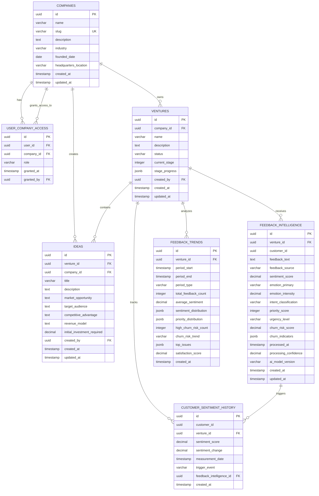

# Enterprise Database Schema & Entity Relationship Diagram

## Core Entity Relationships



## Data Access Patterns & Row Level Security

### 1. Company-Based Access Control
```sql
-- All data is scoped to companies that users have access to
CREATE POLICY "Company access [table]" ON [table]
    FOR ALL 
    USING (company_id IN (
        SELECT company_id FROM user_company_access 
        WHERE user_id = auth.uid()
    ));
```

### 2. Role-Based Permissions
- **Owner**: Full CRUD access to all company data
- **Admin**: Full CRUD access, cannot modify company settings
- **Editor**: Create/Read/Update access, limited delete permissions
- **Viewer**: Read-only access to company data

### 3. Data Lineage & Audit Trail
- All entities track `created_by`, `created_at`, `updated_at`
- Automatic trigger updates for `updated_at` fields
- Comprehensive audit logging for all data modifications

## Performance Optimization

### Strategic Indexes
```sql
-- Company access patterns
CREATE INDEX idx_user_company_access_user ON user_company_access(user_id);
CREATE INDEX idx_ventures_company ON ventures(company_id);

-- Feedback analytics patterns  
CREATE INDEX idx_feedback_intelligence_sentiment ON feedback_intelligence(sentiment_score);
CREATE INDEX idx_feedback_intelligence_churn_risk ON feedback_intelligence(churn_risk_score);
CREATE INDEX idx_feedback_trends_venture_period ON feedback_trends(venture_id, period_start, period_end);

-- Time-series analysis
CREATE INDEX idx_customer_sentiment_measurement_date ON customer_sentiment_history(measurement_date);
```

### Query Optimization Guidelines
1. **Always filter by company_id first** for RLS compliance
2. **Use composite indexes** for date range queries
3. **Leverage JSONB indexes** for complex analytics queries
4. **Partition large tables** by date ranges for time-series data

## Data Integrity & Constraints

### Business Rules Enforcement
```sql
-- Venture stage progression
CHECK (current_stage >= 1 AND current_stage <= 40)

-- Sentiment scoring ranges
CHECK (sentiment_score >= -1.00 AND sentiment_score <= 1.00)

-- Priority scoring validation  
CHECK (priority_score >= 0 AND priority_score <= 100)

-- Churn risk boundaries
CHECK (churn_risk_score >= 0.00 AND churn_risk_score <= 1.00)
```

### Referential Integrity
- Cascade deletes for company → ventures → feedback data
- Soft deletes for audit compliance where required
- Foreign key constraints with appropriate ON DELETE actions

## Migration & Versioning Strategy

### Migration Naming Convention
```
[sequence]_[description]_[timestamp].sql
001_initial_schema_20240101.sql
002_add_feedback_analytics_20240115.sql
```

### Rollback Capabilities
- Every migration includes corresponding rollback script
- Database state validation before/after migrations
- Automated backup creation before destructive operations

## Contract Enforcement

### Zod Validation Schemas
- **Type-safe** runtime validation for all entities
- **Comprehensive** input validation for CRUD operations  
- **Query parameter** validation with pagination defaults
- **Business rule** enforcement at application layer

### Error Handling
- Graceful degradation for validation failures
- Detailed error messages for debugging
- Structured error responses for API consumers

---

*This ERD represents the complete enterprise-grade database schema with comprehensive RLS policies, performance optimization, and contract enforcement for the EHG venture development platform.*