# Enhanced Testing and Debugging Sub-Agents Architecture

## Metadata
- **Category**: Architecture
- **Status**: Draft
- **Version**: 1.0.0
- **Author**: DOCMON
- **Last Updated**: 2025-12-18
- **Tags**: database, api, testing, security

## System Overview

The Enhanced Testing and Debugging Sub-Agents system implements a sophisticated collaboration pattern using the Pareto Principle to deliver maximum impact with minimal complexity. This document provides detailed architectural diagrams and explanations.

## High-Level Architecture

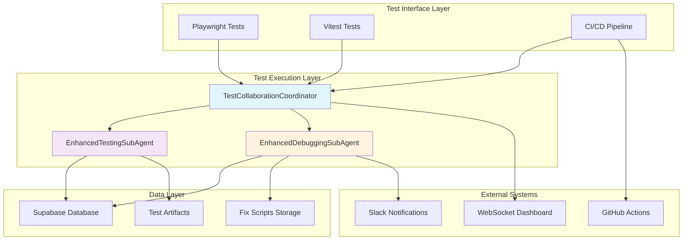

## Detailed Component Architecture

### TestCollaborationCoordinator

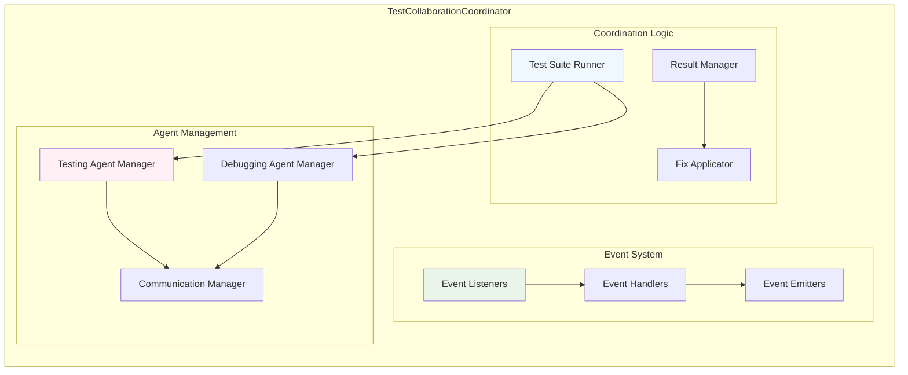

### EnhancedTestingSubAgent Flow

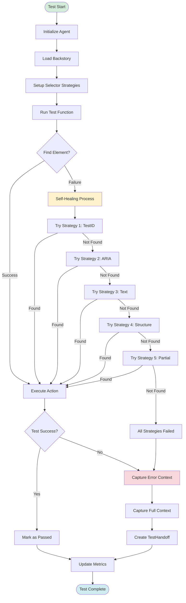

### EnhancedDebuggingSubAgent Flow

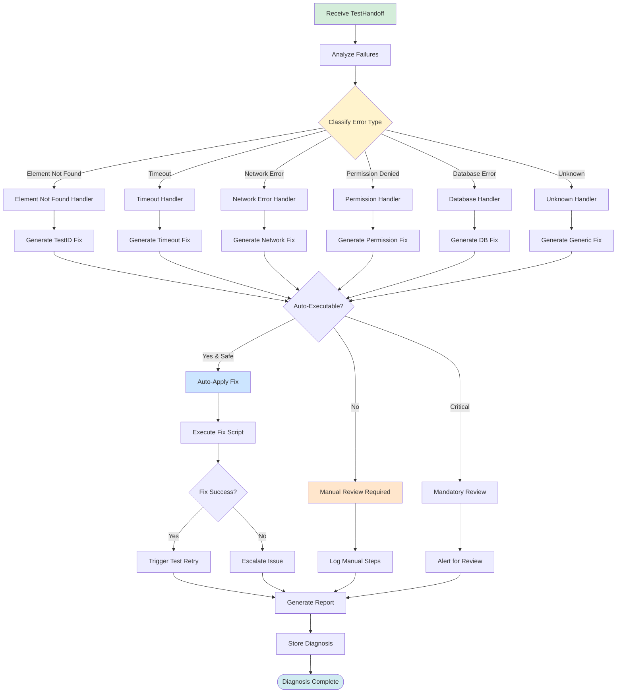

## Self-Healing Selector Architecture

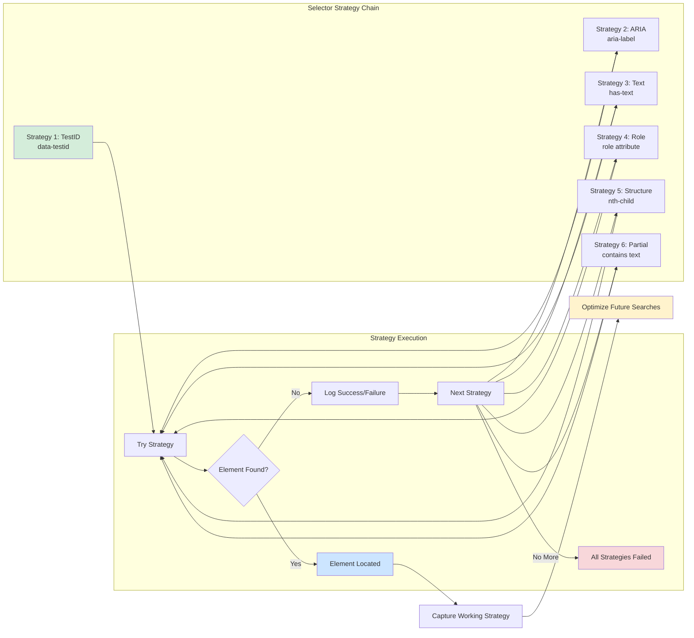

## Fix Generation Architecture

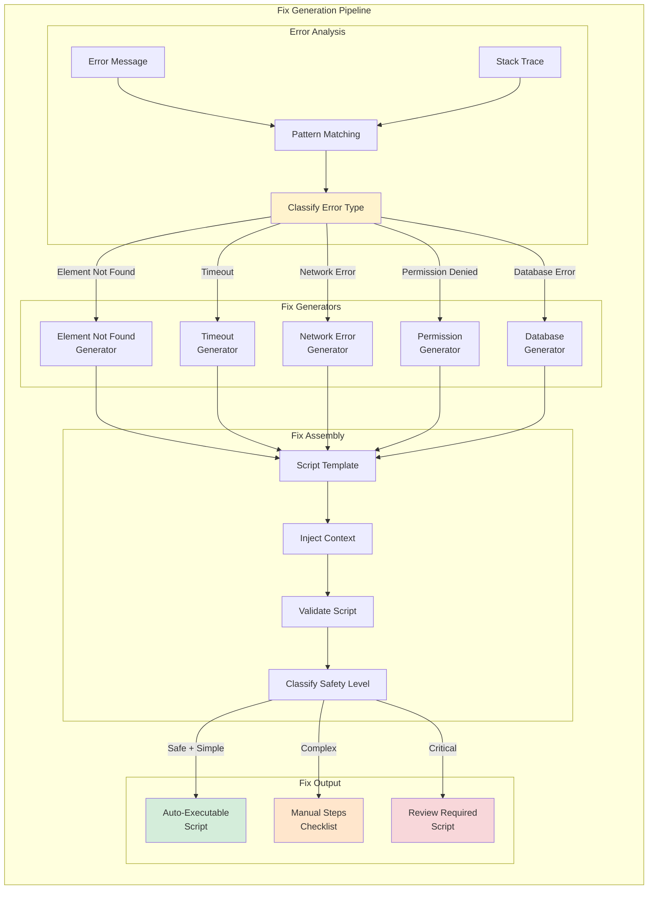

## Real-Time Collaboration Flow

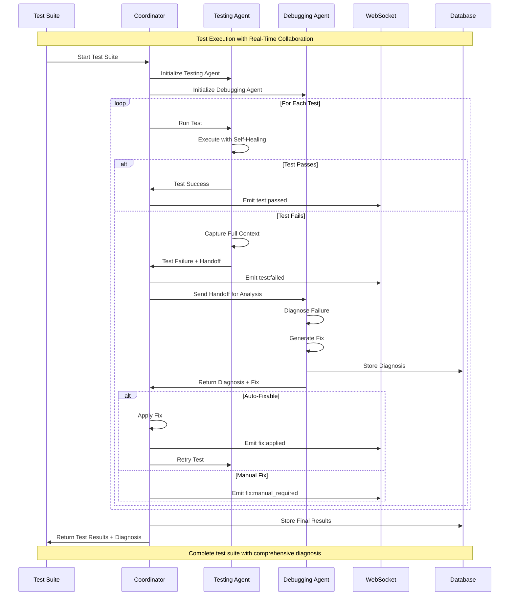

## Data Flow Architecture

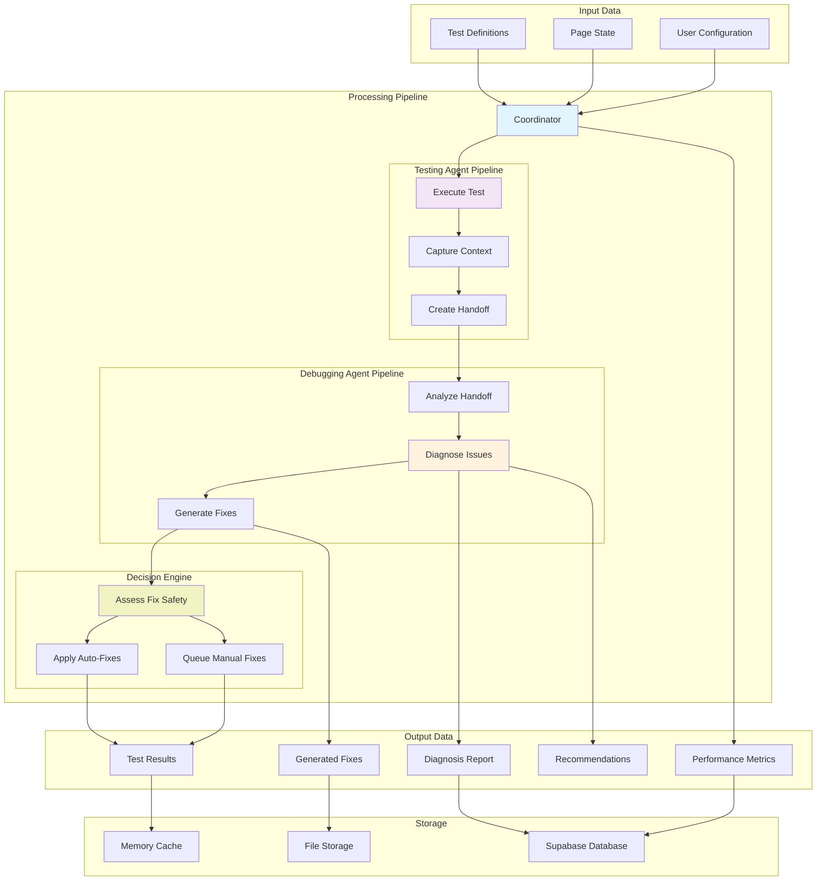

## Performance Optimization Architecture

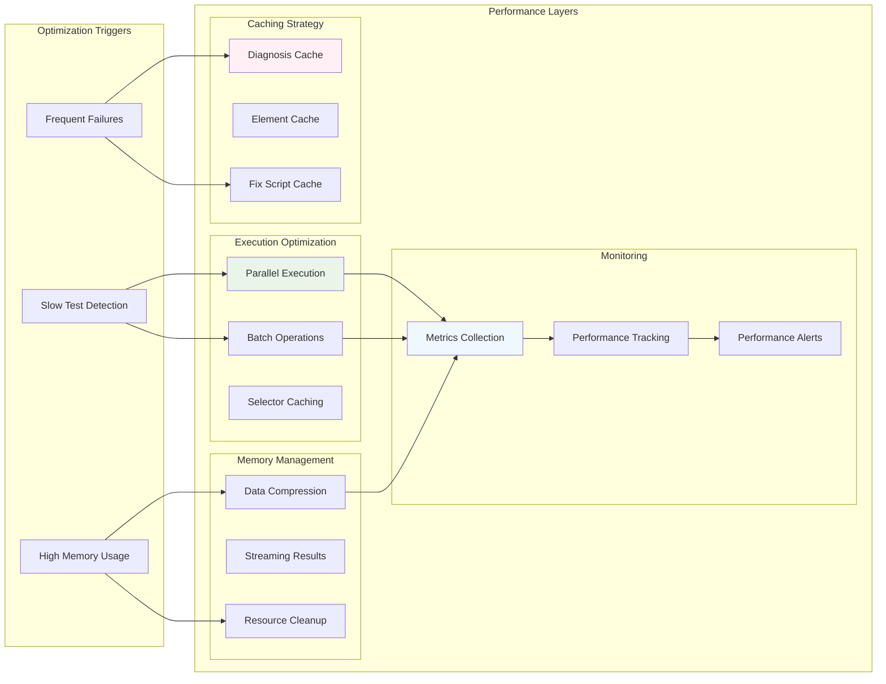

## Integration Points

```mermaid
graph TB
    subgraph "Enhanced Testing System"
        ETS[Enhanced Testing Sub-Agents]
    end
    
    subgraph "Testing Frameworks"
        PW[Playwright]
        VT[Vitest]
        CYPRESS[Cypress]
        WEBDRIVER[WebDriver]
    end
    
    subgraph "CI/CD Systems"
        GHA[GitHub Actions]
        JENKINS[Jenkins]
        GITLAB[GitLab CI]
        AZURE[Azure DevOps]
    end
    
    subgraph "Monitoring & Alerts"
        DATADOG[Datadog]
        NEWRELIC[New Relic]
        SLACK[Slack]
        TEAMS[Microsoft Teams]
    end
    
    subgraph "Storage Systems"
        SUPABASE[Supabase]
        POSTGRES[PostgreSQL]
        S3[AWS S3]
        AZURE_STORAGE[Azure Storage]
    end
    
    subgraph "Dashboard & UI"
        GRAFANA[Grafana]
        CUSTOM_UI[Custom Dashboard]
        JUPYTER[Jupyter Notebooks]
    end
    
    ETS --> PW
    ETS --> VT
    ETS --> CYPRESS
    ETS --> WEBDRIVER
    
    ETS --> GHA
    ETS --> JENKINS
    ETS --> GITLAB
    ETS --> AZURE
    
    ETS --> DATADOG
    ETS --> NEWRELIC
    ETS --> SLACK
    ETS --> TEAMS
    
    ETS --> SUPABASE
    ETS --> POSTGRES
    ETS --> S3
    ETS --> AZURE_STORAGE
    
    ETS --> GRAFANA
    ETS --> CUSTOM_UI
    ETS --> JUPYTER
    
    style ETS fill:#e1f5fe
```

## Security Architecture

```mermaid
graph TB
    subgraph "Security Layers"
        direction TB
        
        subgraph "Authentication & Authorization"
            AUTH[Authentication Layer]
            RBAC[Role-Based Access Control]
            API_KEY[API Key Management]
        end
        
        subgraph "Data Protection"
            ENCRYPT[Data Encryption]
            MASK[Data Masking]
            AUDIT[Audit Logging]
        end
        
        subgraph "Execution Security"
            SANDBOX[Sandboxed Execution]
            VALIDATE[Input Validation]
            WHITELIST[Script Whitelisting]
        end
        
        subgraph "Network Security"
            TLS[TLS/SSL]
            FIREWALL[Firewall Rules]
            VPN[VPN Access]
        end
    end
    
    subgraph "Security Monitoring"
        DETECT[Threat Detection]
        MONITOR[Security Monitoring]
        INCIDENT[Incident Response]
    end
    
    AUTH --> RBAC
    RBAC --> API_KEY
    
    ENCRYPT --> MASK
    MASK --> AUDIT
    
    SANDBOX --> VALIDATE
    VALIDATE --> WHITELIST
    
    TLS --> FIREWALL
    FIREWALL --> VPN
    
    DETECT --> MONITOR
    MONITOR --> INCIDENT
    
    style AUTH fill:#ffebee
    style SANDBOX fill:#e8f5e8
    style DETECT fill:#fff3e0
```

## Scalability Architecture

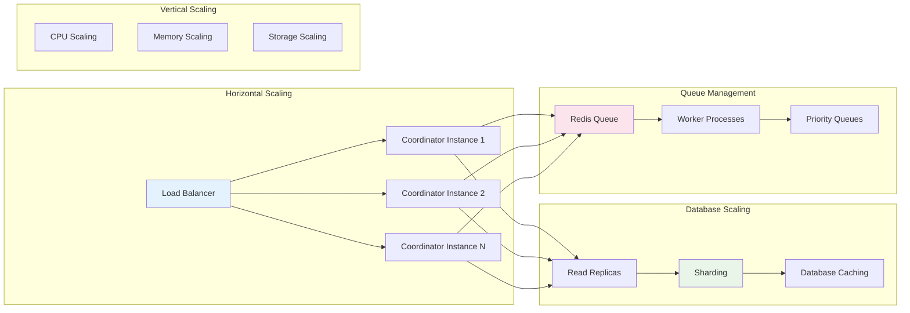

## Deployment Architecture

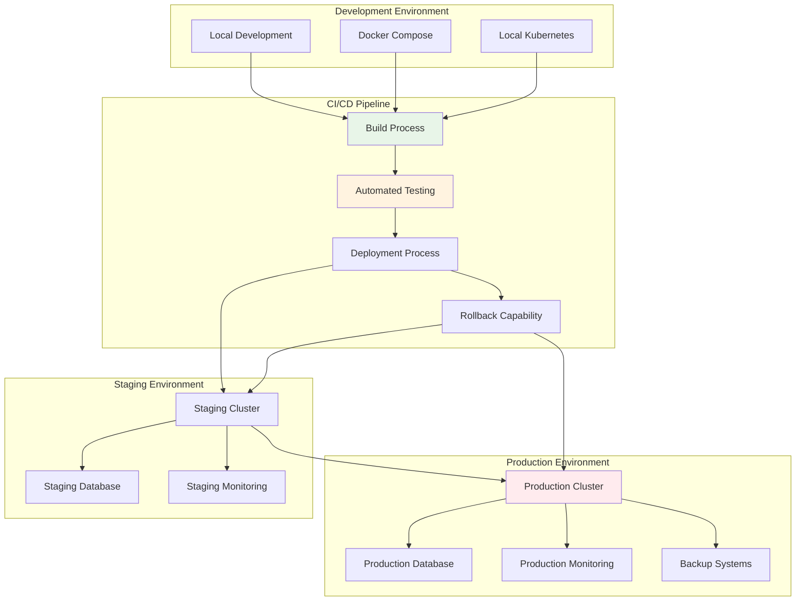

## Key Architectural Principles

### 1. Separation of Concerns
- **Testing Agent**: Focuses solely on test execution and context capture
- **Debugging Agent**: Specializes in failure analysis and fix generation
- **Coordinator**: Manages orchestration and communication

### 2. Event-Driven Architecture
- Asynchronous communication between components
- Real-time event streaming for live monitoring
- Loose coupling through event interfaces

### 3. Self-Healing Design
- Multiple fallback strategies for element location
- Automatic retry with intelligent backoff
- Graceful degradation when components fail

### 4. Observability First
- Comprehensive metrics collection at all levels
- Distributed tracing for end-to-end visibility
- Rich logging with structured data

### 5. Security by Design
- Sandboxed execution environment for fix scripts
- Input validation and sanitization
- Audit trails for all operations

### 6. Performance Optimization
- Parallel execution where possible
- Intelligent caching strategies
- Resource cleanup and memory management

This architecture enables the Enhanced Testing and Debugging Sub-Agents to deliver on the Pareto Principle promise of 80% improvement with 20% effort, while maintaining scalability, security, and reliability.

---

*Last Updated: 2025-09-04*  
*Version: 1.0.0*  
*Part of LEO Protocol v4.1.2 Enhanced Testing Framework*