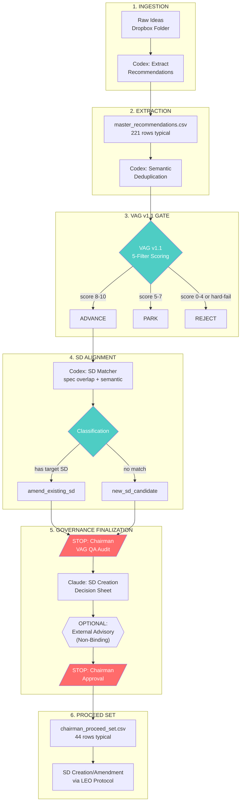

# Strategic Intake Pipeline v1 — Operator Runbook


## Metadata
- **Category**: Guide
- **Status**: Draft
- **Version**: 1.0.0
- **Author**: DOCMON
- **Last Updated**: 2025-12-22
- **Tags**: database, api, schema, authentication

**Version:** 1.1 (LOCKED)
**Effective Date:** 2025-12-13
**Owner:** Chairman (Rick Dronkers)
**Operators:** Codex (deterministic), Claude (judgment), Chairman (authority)
**Optional Advisor:** External Strategic Advisor (high-cost LLM) — non-binding

---

## Quickstart (10-Step Summary)

1. **Collect raw ideas** into dated folder: `Dropbox/_EHG/ehg ideas/Ideas YYYY-MM-DD/`
2. **Run Codex extraction** to produce `master_recommendations_YYYYMMDD.csv`
3. **Deduplicate** via semantic clustering (Codex) → output `*_deduped.csv`
4. **Apply VAG v1.1** scoring to all items → output `vag_v1_1_full_*_adjudication_YYYYMMDD.csv`
5. **Run SD Alignment** matcher → output `sd_alignment_*_classification_YYYYMMDD.csv`
6. **STOP: Chairman reviews VAG QA audit** (30-sample every 7th row)
7. **Filter Proceed Set** (disposition=advance AND f3_subtest=direct) → output `chairman_proceed_set_*.csv`
8. **STOP: Chairman approves SD Creation Decision Sheet** (per-item actions)
9. **Execute SD creation/amendment** per approved decision sheet
10. **Archive all artifacts** to `_outputs/` folder with date stamps

---

## 1. Purpose, Scope & Non-Goals

### Purpose
Transform raw strategic ideas (from reading, research, conversations) into actionable Strategic Directives (SDs) through a rigorous, auditable pipeline with explicit governance gates.

### Scope
- **IN:** Unstructured idea capture → structured recommendations → SD proposals
- **IN:** Value filtering (VAG v1.1), SD alignment, governance finalization
- **IN:** Solo-builder constraint validation (90-day executability)

### Non-Goals
- **NOT:** Idea generation or brainstorming (input is already captured)
- **NOT:** SD execution (that's LEO Protocol LEAD→PLAN→EXEC)
- **NOT:** Real-time processing (this is batch-mode intake)

---

## 2. Pipeline Architecture



---

## 3. Pipeline Stages (Detailed)

### Stage 1: Ingestion

**Operator:** Manual (Chairman)
**Input:** Raw text files, voice notes, screenshots, articles
**Output:** Dated folder with all source material

**Procedure:**
1. Create folder: `Dropbox/_EHG/ehg ideas/Ideas YYYY-MM-DD/`
2. Place all raw idea files (`.txt`, `.md`, `.pdf`, images)
3. Number files sequentially: `01.txt`, `02.txt`, etc.
4. Create `_manifest.json` listing sources and dates

**Pathing Rule:** All raw inputs stay in Dropbox. Never copy to repo until extraction is complete.

---

### Stage 2: Extraction

**Operator:** Codex (deterministic)
**Input:** Raw idea files
**Output:** `master_recommendations_YYYYMMDD.csv`

**Procedure:**
1. Run Codex extraction prompt on each raw file
2. Extract structured fields per recommendation:
   - `rec_id` (format: `REC-YYYYMMDD-NN-MM-SI-SS`)
   - `title` (≤60 chars)
   - `description` (1-3 sentences)
   - `affected_specs` (list of spec files)
   - `affected_stages` (list of stage numbers)
   - `source_file` (original file reference)
3. Merge all extractions into single CSV
4. Validate schema parity (all required columns present)

**Schema:**
```csv
rec_id,title,description,affected_specs,affected_stages,source_file,extraction_confidence
```

**Quality Gate:** Schema parity PASS required before proceeding.

---

### Stage 3: Deduplication

**Operator:** Codex (deterministic)
**Input:** `master_recommendations_YYYYMMDD.csv`
**Output:** `master_recommendations_deduped_YYYYMMDD.csv`

**Procedure:**
1. Compute semantic embeddings for each recommendation
2. Cluster by cosine similarity (threshold: 0.85)
3. Within each cluster, select highest-confidence extraction
4. Mark duplicates with `duplicate_of` field
5. Output deduplicated CSV

**Invariant:** No duplicate `rec_id` values in output.

---

### Stage 4: VAG v1.1 Gate

**Operator:** Claude (judgment)
**Input:** Deduplicated recommendations CSV
**Output:** `vag_v1_1_full_*_adjudication_YYYYMMDD.csv`

**Procedure:**
1. Load VAG v1.1 Governance Contract (frozen)
2. For each recommendation, score 5 filters:
   - **F1 Solo-Builder:** Can one person build this? (0/1/2)
   - **F2 Minimal Surface:** Does it avoid branching/variants? (0/1/2, HARD-FAIL on 0)
   - **F3 Governance-First:** Does it improve Chairman decisions? (0/1/2)
     - Sub-test: `direct` (immediate decision impact) vs `indirect` (deferred benefit)
   - **F4 Production Safety:** No external dependencies? (0/1/2, HARD-FAIL on 0)
   - **F5 Compounding:** Does it enable multiple downstream items? (0/1/2)
3. Sum scores (0-10) and assign disposition:
   - 8-10 → `advance`
   - 5-7 → `park`
   - 0-4 or hard-fail → `reject`
4. Record `hard_fail`, `hard_fail_filter`, `ambiguity_flags`, `rationale_short`

**VAG v1.1 Hard-Fail Patterns (F2):**
```
template, variant, mode, swap based on, segment-specific,
category-specific, if luxury, compound_venture, mobile_b2c,
enterprise vs, product_led | sales_led, maintenance mode
```

**Output Schema:**
```csv
rec_id,title,f1,f2,f3,f3_subtest,f4,f5,total_score,hard_fail,hard_fail_filter,hard_fail_reason,disposition,ambiguity_flags,rationale_short,pipeline_class
```

---

### Stage 5: SD Alignment

**Operator:** Codex (deterministic)
**Input:** VAG-adjudicated CSV (disposition=advance only)
**Output:** `sd_alignment_*_classification_YYYYMMDD.csv`

**Procedure:**
1. Load existing SD registry from database
2. For each advanced recommendation:
   - Compute spec overlap score (Jaccard similarity)
   - Compute semantic similarity to SD descriptions
   - Combine scores: `alignment_score = 0.6*spec_overlap + 0.4*semantic`
3. If `alignment_score ≥ 0.25` for any SD → `amend_existing_sd`
4. Otherwise → `new_sd_candidate`
5. For amendments, record `top_1_sd_id`, `top_1_score`, `match_rationale`

**Known Issue (Dec-13):** Spec `06-hierarchical-agent-architecture.md` was incorrectly routing to SD-VISION-V2-004 instead of SD-VISION-V2-006. Fix: Add explicit spec→SD mapping override table.

**Output Schema:**
```csv
rec_id,recommended_classification,top_1_sd_id,top_1_score,match_rationale
```

---

### Stage 6: Governance Finalization

**Operator:** Claude (judgment) + Chairman (authority)
**Input:** SD alignment CSV + VAG adjudication CSV
**Output:** SD Creation Decision Sheet

**Procedure:**
1. **VAG QA Audit** (STOP point):
   - Sample 30 items using deterministic method (every Nth row, N = floor(total/30))
   - Claude re-scores sample and compares to Codex scores
   - Flag inconsistencies ≥2 points
   - Chairman reviews and approves audit findings
2. **Proceed Set Generation**:
   - Filter: `disposition=advance AND f3_subtest=direct`
   - Join with SD alignment classification
   - Output: `chairman_proceed_set_*.csv`
3. **SD Creation Decision Sheet** (STOP point):
   - For each proceed item, assign action:
     - `AMEND_EXISTING_SD` (specify target SD)
     - `CREATE_NEW_CHILD_SD` (specify parent SD, scope)
     - `DEFER_UNTIL_LATER_BATCH`
   - Validate: new SDs ≤8, total load ≤90 days solo-builder
   - Chairman approves final decision sheet

---

## 4. Gate Criteria Summary

| Gate | Operator | Pass Criteria | Fail Action |
|------|----------|---------------|-------------|
| Schema Parity | Codex | All required columns present | Fix extraction |
| Dedup Invariant | Codex | No duplicate rec_ids | Re-run clustering |
| VAG v1.1 | Claude | Score 8-10, no hard-fail | Park or Reject |
| VAG QA Audit | Claude+Chairman | ≤10% score variance | Recalibrate VAG |
| SD Alignment | Codex | Alignment score computed | Manual review |
| Load Check | Claude | ≤90 days, ≤8 new SDs | Defer items |
| Chairman Approval | Chairman | Explicit sign-off | Wait |

---

## 5. Human Intervention Points

### STOP Points (Require Explicit Chairman Approval)

1. **After VAG QA Audit:** Chairman must approve audit findings before Proceed Set generation
2. **After SD Creation Decision Sheet:** Chairman must approve per-item actions before SD creation
3. **On Hard-Fail Dispute:** If Claude disagrees with Codex hard-fail, escalate to Chairman

### Advisory Points (Claude Recommendation, Chairman Decision)

- New SD count exceeds 8 → Claude recommends deferrals
- Single SD receives >10 amendments → Claude recommends splitting
- Ambiguity rate >20% → Claude recommends VAG calibration

### 5.3 External Strategic Advisor (Optional, High-Cost)

**[ADDITIVE — v1.1]**

An optional, non-binding advisory review may be invoked by the Chairman before final approval. This role exists **outside** the deterministic pipeline.

#### Purpose

The External Strategic Advisor provides second-order reasoning for high-stakes governance decisions:
- Surfacing unstated assumptions
- Identifying precedent risks
- Detecting long-horizon complexity
- Adversarial review of irreversible decisions

#### When to Invoke

- New SD creation (especially ≥3 new SDs in a batch)
- Material scope expansion to existing SDs
- Items flagged with high ambiguity
- Governance decisions with irreversible consequences

#### Invocation Test

Before requesting advisory review, the Chairman must be able to state in one sentence:

> **"What decision would this advisory materially change?"**

If no such decision exists, advisory review SHOULD NOT be invoked. This prevents invocation driven by curiosity, anxiety, or over-optimization rather than decision leverage.

#### Canonical Example

A frontier-grade reasoning model with second-order reasoning capabilities (e.g., GPT-5.2 via API).

Implementation details (endpoints, parameters, authentication) are intentionally omitted from governance documentation and are maintained separately in operational tooling.

#### Authority Boundaries

| Action | Permitted |
|--------|-----------|
| Surface hidden assumptions | ✓ |
| Flag precedent risks | ✓ |
| Highlight complexity | ✓ |
| Ask Chairman questions | ✓ |
| Score, classify, or route items | ✗ |
| Approve, reject, or override | ✗ |
| Generate pipeline artifacts | ✗ |
| Replace Claude or Codex | ✗ |

#### Cost & Usage Constraints

- **High cost:** External advisors are significantly more expensive than standard operators
- **Chairman intent required:** Must be explicitly requested by Chairman
- **Justification required:** Document why advisory review is needed
- **Scope limit:** Apply only to small, high-impact item sets (typically ≤20 items)

#### Pipeline Placement

```
[SD Creation Decision Sheet]
           │
           ▼
   ┌───────────────────────┐
   │  OPTIONAL:            │
   │  External Advisory    │  ← Chairman-invoked only
   │  Review               │
   │  [NON-BINDING]        │
   └───────────────────────┘
           │
           ▼
[STOP: Chairman Approval]
```

#### Non-Precedent Rule

- Advisory outputs do **not** create precedent
- Cannot be cited as justification for future pipeline behavior
- Must not be reused as training data, heuristics, or scoring patterns
- Each advisory review is a one-time, isolated analysis

---

## 6. Handling Large Artifacts

### Token Limit Issue (Dec-13 Observed)
Large CSV/JSON files (>25,000 tokens) cannot be read in single pass.

### Solution: Chunked Reads
```python
# For CSV files >50 rows
offset = 0
limit = 50
while offset < total_rows:
    chunk = read_csv(file, offset=offset, limit=limit)
    process(chunk)
    offset += limit

# For JSON files, use grep/search first
grep -o '"rec_id":"[^"]*"' large_file.json | head -100
```

### Solution: Summary Extraction
```python
# Extract only needed columns to reduce token load
import csv, json
with open('master_recommendations.csv') as f:
    reader = csv.DictReader(f)
    summary = [{k: row[k] for k in ['rec_id', 'title', 'affected_specs']} for row in reader]
with open('master_summary.json', 'w') as f:
    json.dump(summary, f)
```

---

## 7. Pathing Rules

### Single Source of Truth
| Data Type | Authoritative Location | Copy Policy |
|-----------|----------------------|-------------|
| Raw Ideas | `Dropbox/_EHG/ehg ideas/Ideas YYYY-MM-DD/` | Never copy to repo |
| Pipeline Outputs | `Dropbox/_EHG/ehg ideas/Ideas YYYY-MM-DD/_outputs/` | Copy to repo on archive |
| Governance Contracts | `docs/governance/` (repo) | Canonical |
| Runbooks | `docs/runbooks/` (repo) | Canonical |

### Path Resolution
```
# Dropbox path (Windows)
/mnt/c/Users/rickf/Dropbox/_EHG/ehg ideas/Ideas 2025-12-13/

# Repo path
/mnt/c/_EHG/EHG_Engineer/docs/

# NEVER use relative paths like ../ehg ideas/
# ALWAYS use absolute paths in scripts
```

### Dec-13 Issue: File Path Mismatch
**Problem:** Claude couldn't find artifacts because Dropbox path wasn't specified.
**Fix:** Always confirm full path before processing. Use `ls` to verify.

---

## 8. Deterministic Sampling Method

### Purpose
Audit VAG scoring quality without processing all 221 items manually.

### Method: Every Nth Row
```python
total_items = 221
sample_size = 30
N = floor(total_items / sample_size)  # N = 7

# Sample every 7th item after sorting by rec_id ascending
sample_indices = [i * N for i in range(sample_size)]
# = [0, 7, 14, 21, 28, 35, ...]
```

### Category Balance Check
Ensure sample includes ≥10 items from each pipeline_class:
- `amend_existing_sd`: ≥10
- `new_sd_candidate`: ≥10

If imbalanced, use stratified sampling with replacement.

---

## 9. Failure Modes & Recovery

### FM-1: Can't Find Files
**Symptom:** "File not found" or empty results
**Cause:** Path mismatch (Dropbox vs repo, Windows vs WSL)
**Recovery:**
1. Confirm exact path with `ls`
2. Use absolute paths only
3. Check for spaces in path (quote if needed)

### FM-2: Token Limit Exceeded
**Symptom:** "File too large" or truncated output
**Cause:** CSV/JSON exceeds 25K tokens
**Recovery:**
1. Use chunked reads (offset/limit)
2. Extract summary with Python script
3. Use grep/search to find specific records

### FM-3: Schema Drift
**Symptom:** Missing columns, unexpected data types
**Cause:** Extraction prompt changed, or source format changed
**Recovery:**
1. Compare current schema to canonical schema
2. Re-run extraction with corrected prompt
3. Add missing columns with default values

### FM-4: SD Alignment Routing Error
**Symptom:** Items routed to wrong SD (e.g., spec/06 → SD-004)
**Cause:** Spec→SD mapping has gaps or ambiguity
**Recovery:**
1. Add explicit override in spec→SD mapping table
2. Manual review of affected items
3. Document in known issues

### FM-5: VAG Score Variance
**Symptom:** QA audit shows >10% score variance
**Cause:** Ambiguous filter definitions, inconsistent application
**Recovery:**
1. Review ambiguity flags in VAG output
2. Tighten filter definitions (add patterns)
3. Re-score affected items with updated VAG

---

## 10. Quality Gates Checklist

### Pre-Flight (Before Stage 1)
- [ ] Dated folder created with correct naming
- [ ] All raw files numbered sequentially
- [ ] Manifest file created

### Post-Extraction (After Stage 2)
- [ ] Schema parity PASS
- [ ] No empty `rec_id` values
- [ ] Extraction confidence ≥0.7 for all items

### Post-VAG (After Stage 4)
- [ ] All items scored (no nulls)
- [ ] Hard-fail reasons documented
- [ ] Disposition assigned to all items

### Post-Alignment (After Stage 5)
- [ ] All advanced items classified
- [ ] No orphan rec_ids (present in VAG but missing in alignment)
- [ ] Match rationale populated

### Pre-Approval (Before Stage 6 STOP)
- [ ] VAG QA audit completed (30 samples)
- [ ] Score variance ≤10%
- [ ] Proceed Set generated
- [ ] SD Creation Decision Sheet complete
- [ ] Load check PASS (≤90 days, ≤8 new SDs)

---

## Appendix A: Dec-13 Frozen Artifacts

| Artifact | Rows | Purpose |
|----------|------|---------|
| `master_recommendations_20251213.csv` | 221 | All extracted recommendations |
| `sd_alignment_adv_to_sd_pipeline_classification_20251213.csv` | 221 | SD routing decisions |
| `sd_alignment_adv_to_sd_pipeline_amend_rollup_20251213.json` | — | Amendments grouped by target SD |
| `sd_alignment_adv_to_sd_pipeline_new_sd_clusters_20251213.json` | — | New SD candidate clusters |
| `sd_expanded_contexts_20251213.json` | — | Full context for each recommendation |
| `vag_v1_1_full_221_adjudication_20251213.csv` | 221 | VAG v1.1 scoring results |
| `vag_v1_1_top25_shortlist.json` | 25 | Top 25 by score |
| `chairman_proceed_set_top50_vag_direct_20251213.csv` | 44 | Final proceed set |
| `chairman_proceed_set_summary_20251213.md` | — | Summary for Chairman review |

---

## Appendix B: VAG v1.1 Quick Reference

### Scoring Scale
| Score | Filter State |
|-------|--------------|
| 2 | Full pass (green flag matched) |
| 1 | Conditional pass (no flags) |
| 0 | Fail (red flag matched) |

### Disposition Thresholds
| Total Score | Disposition |
|-------------|-------------|
| 8-10 | advance |
| 5-7 | park |
| 0-4 | reject |

### Hard-Fail Conditions
- F2 = 0 (branching/variant detected)
- F4 = 0 (external dependency detected)

---

## Appendix C: Revision History

| Version | Date | Author | Changes |
|---------|------|--------|---------|
| 1.0 | 2025-12-13 | Chairman | Initial release based on Dec-13 intake |
| 1.1 | 2025-12-13 | Chairman | Added External Strategic Advisor (Section 5.3); LOCKED |

---

*End of Strategic Intake Pipeline v1.1 Runbook*
