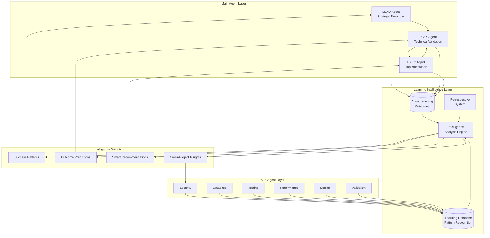

# Agent Learning Architecture Overview

## 🧠 Intelligent Multi-Agent Learning System

The EHG LEO Protocol features a sophisticated **Cross-Agent Intelligence System** that enables continuous learning, pattern recognition, and collaborative decision-making across all agents. This document provides a high-level overview of the learning architecture and intelligence flows.

## 🏗️ System Architecture



## 🔄 Learning Feedback Loops

### 1. **Sub-Agent Pattern Learning**
Sub-agents continuously learn from their analyses:

- **False Positive Recognition**: Identifies patterns that typically result in false alarms
- **True Positive Enhancement**: Recognizes reliable indicators of real issues
- **Confidence Calibration**: Improves confidence scoring based on historical accuracy
- **Fix Pattern Learning**: Remembers successful resolution strategies

### 2. **Main Agent Workflow Learning**
The system tracks complete decision chains:

```
LEAD Decision → PLAN Complexity → EXEC Quality → Business Outcome
```

Each workflow generates learning data:
- **Decision Effectiveness**: How well strategic decisions translate to outcomes
- **Complexity Prediction**: Accuracy of technical complexity estimates
- **Quality Correlation**: Relationship between implementation quality and user satisfaction

### 3. **Cross-Agent Intelligence**
Agents share insights across projects:

- **Pattern Recognition**: Similar project patterns and their outcomes
- **Risk Prediction**: Early warning systems based on historical data
- **Resource Optimization**: Better estimates based on past similar work
- **Success Factor Analysis**: What makes projects succeed or fail

## 📊 Learning Data Flow

### Input Sources
1. **Sub-Agent Executions** → Pattern recognition data
2. **Main Agent Handoffs** → Decision chain tracking
3. **Business Outcomes** → Success/failure measurements
4. **User Feedback** → Satisfaction and adoption metrics
5. **Retrospective Analysis** → Automated learning extraction

### Processing Layers
1. **Pattern Recognition Engine** → Identifies recurring themes
2. **Outcome Correlation Analysis** → Links decisions to results
3. **Predictive Modeling** → Forecasts project success
4. **Recommendation Generation** → Suggests optimal approaches

### Output Applications
1. **Smart Agent Guidance** → Context-aware recommendations
2. **Project Risk Assessment** → Early warning systems
3. **Resource Planning** → Better time/complexity estimates
4. **Process Improvement** → Workflow optimization suggestions

## 🎯 Key Learning Components

### Learning Database (`lib/agents/learning-database.js`)
- **Pattern Recognition**: Machine learning for trend identification
- **Confidence Models**: Adaptive scoring improvements
- **Historical Metrics**: Track analysis accuracy over time
- **Feedback Integration**: Learn from user confirmations/rejections

### Agent Learning Outcomes (`agent_learning_outcomes` table)
- **Complete Workflow Tracking**: LEAD → PLAN → EXEC → Business Results
- **Decision Correlation**: Links early decisions to final outcomes
- **Success Pattern Analysis**: Identifies what makes projects succeed
- **ROI Measurement**: Tracks actual vs. projected return on investment

### Retrospective Intelligence Integration
- **Automated Learning Extraction**: Captures insights without manual effort
- **Cross-Project Pattern Analysis**: Finds similarities across different work
- **Continuous Improvement Suggestions**: Recommends process enhancements
- **Knowledge Base Building**: Accumulates institutional wisdom

## 🚀 Advanced Intelligence Features

### 1. **Predictive Analytics**
- **Project Success Probability**: Early success/failure prediction
- **Complexity Forecasting**: Realistic effort estimation
- **Risk Assessment**: Identify potential problem areas
- **Timeline Accuracy**: Improve delivery estimates

### 2. **Adaptive Recommendations**
- **Context-Aware Guidance**: Recommendations based on similar past projects
- **Agent Capability Matching**: Route work to most suitable agents
- **Optimal Workflow Suggestions**: Best practices based on historical success
- **Quality Gate Customization**: Tailored checkpoints for project types

### 3. **Collaborative Intelligence**
- **Cross-Agent Insight Sharing**: Agents learn from each other's experiences
- **Conflict Detection**: Identify contradictory recommendations early
- **Consensus Building**: Automated resolution of agent disagreements
- **Collective Wisdom**: System gets smarter with each project

## 📈 Intelligence Metrics

### Learning Effectiveness
- **Prediction Accuracy**: How well the system forecasts outcomes
- **Recommendation Adoption**: Rate of agent suggestion acceptance
- **False Positive Reduction**: Decrease in incorrect alerts over time
- **Time to Resolution**: Improvement in problem-solving speed

### Business Impact
- **Project Success Rate**: Improvement in completed project outcomes
- **Resource Efficiency**: Better utilization of development time
- **Quality Improvements**: Higher user satisfaction and fewer defects
- **ROI Enhancement**: Better return on development investment

## 🔧 Technical Implementation

### Database Schema
- **`agent_learning_outcomes`**: Complete workflow outcome tracking
- **`retrospective_learning_links`**: Connect retrospectives to intelligence
- **Learning pattern tables**: Store recognized patterns and correlations
- **Performance metrics tables**: Track agent improvement over time

### Processing Engine
- **Intelligence Analysis Engine**: Central coordination of learning analysis
- **Pattern Recognition Algorithms**: Machine learning for trend identification
- **Outcome Prediction Models**: Forecasting based on historical patterns
- **Recommendation Generation**: Context-aware suggestion systems

### Integration Points
- **Sub-Agent Activation**: Learning influences when/how agents are triggered
- **Main Agent Decision Support**: Intelligence informs strategic choices
- **Quality Gate Customization**: Learning adapts validation criteria
- **Retrospective Automation**: Captures insights without manual intervention

## 🎪 Benefits of the Learning System

### For Development Teams
- **Smarter Estimates**: More accurate time and complexity predictions
- **Fewer False Alarms**: Reduced noise from over-sensitive validation
- **Better Guidance**: Context-aware recommendations for common challenges
- **Faster Resolution**: Proven solutions for recurring problems

### For Business Stakeholders
- **Higher Success Rates**: Projects more likely to meet objectives
- **Better ROI**: Improved return on development investments
- **Predictable Delivery**: More accurate timeline and scope estimates
- **Quality Improvements**: Higher user satisfaction and adoption

### For System Evolution
- **Continuous Improvement**: System gets smarter with each project
- **Adaptive Processes**: Workflows optimize themselves over time
- **Institutional Memory**: Accumulated knowledge doesn't get lost
- **Scaling Intelligence**: Benefits compound as system usage grows

---

*This learning architecture represents a significant advancement in AI-assisted development, where the system truly learns from experience and becomes more valuable over time.*

## 📚 Related Documentation
- [Cross-Agent Intelligence Guide](cross-agent-intelligence.md)
- [Sub-Agent Learning System](sub-agent-learning.md)
- [Learning Database Deep Dive](learning-database-guide.md)
- [Intelligence Dashboard](intelligence-dashboard.md)