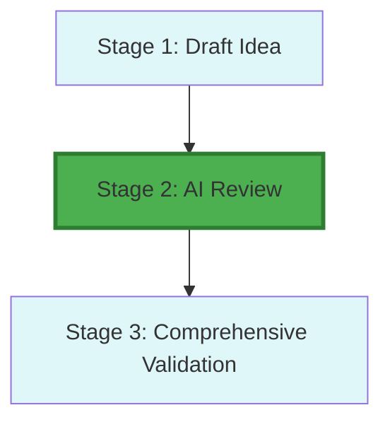

<!-- ARCHIVED: 2026-01-26T16:26:38.119Z
     Reason: Duplicate of canonical file
     Original location: docs\workflow\dossiers\stage-02\02_stage-map.md
     See: docs/fixes/duplicate-consolidation-manifest.json for details
-->

# Stage 2: Dependency & Recursion Map

## Metadata
- **Category**: Guide
- **Status**: Draft
- **Version**: 1.0.0
- **Author**: DOCMON
- **Last Updated**: 2026-01-21
- **Tags**: validation, workflow, ci, agent

## Workflow Position

## Dependencies

- **Prior Stages**: Stage 1 (Draft Idea)
- **Next Stage**: Stage 3 (Comprehensive Validation)
- **Parallel Stages**: None
- **Recursive Triggers**: None (per consistency scan)

**Evidence**: EHG_Engineer@6ef8cf4:docs/workflow/stages.yaml:46-47 `"depends_on: [1]"`

## Data Flow

**Inputs**:
1. Structured idea
2. Historical data
3. Market signals

**Outputs**:
1. AI critique report
2. Contrarian analysis
3. Risk assessment

**Evidence**: EHG_Engineer@6ef8cf4:docs/workflow/stages.yaml:48-56

## Downstream Impact

**Blocks**: Stage 3 (Comprehensive Validation) cannot proceed without Stage 2 completion

**Critical Path**: Yes - multi-model analysis gates validation phase

---

## Sources Table

| Source | Repo | Commit | Path | Lines |
|--------|------|--------|------|-------|
| depends_on | EHG_Engineer | 6ef8cf4 | docs/workflow/stages.yaml | 46-47 |
| inputs/outputs | EHG_Engineer | 6ef8cf4 | docs/workflow/stages.yaml | 48-56 |
| recursion scan | EHG_Engineer | 6ef8cf4 | (agent analysis) | N/A |

<!-- Generated by Claude Code Phase 3 | EHG_Engineer@6ef8cf4 | 2025-11-05 -->
