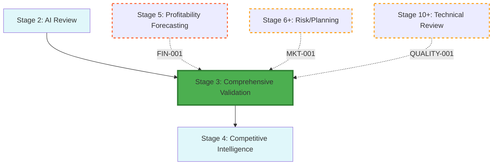

<!-- ARCHIVED: 2026-01-26T16:26:38.029Z
     Reason: Duplicate of canonical file
     Original location: docs\workflow\dossiers\stage-03\02_stage-map.md
     See: docs/fixes/duplicate-consolidation-manifest.json for details
-->

# Stage 3: Dependency & Recursion Map

## Metadata
- **Category**: Guide
- **Status**: Draft
- **Version**: 1.0.0
- **Author**: DOCMON
- **Last Updated**: 2026-01-21
- **Tags**: validation, workflow, ci

## Workflow Position

**Legend**: Solid arrows = forward flow; Dashed arrows = recursion triggers

---

## Dependencies

- **Prior Stages**: Stage 2 (AI Review)
- **Next Stage**: Stage 4 (Competitive Intelligence & Market Defense)
- **Parallel Stages**: None
- **Recursive Triggers**: ✅ **3 inbound** (FIN-001, MKT-001, QUALITY-001)

**Evidence**: EHG_Engineer@6ef8cf4:docs/workflow/stages.yaml:90-91 `"depends_on: [2]"`

---

## Data Flow

**Inputs**:
1. AI review report (from Stage 2)
2. Market research
3. User interviews

**Outputs**:
1. Validation report
2. User feedback
3. Feasibility assessment

**Evidence**: EHG_Engineer@6ef8cf4:docs/workflow/stages.yaml:92-99

---

## Recursion Triggers (Inbound)

### From Stage 5: FIN-001 (CRITICAL)

**Condition**: ROI < 15%
**Severity**: CRITICAL
**Auto-Execute**: Yes
**Reason**: Profitability forecasting reveals venture is not financially viable; requires re-validation of problem-solution fit and willingness-to-pay assumptions

**Evidence**: EHG_Engineer@6ef8cf4:docs/workflow/critique/stage-03.md:38

---

### From Stage 6+: MKT-001 (HIGH)

**Condition**: Market validation failure
**Severity**: HIGH
**Auto-Execute**: Needs approval
**Reason**: Market research reveals flaws in original validation assumptions

**Evidence**: EHG_Engineer@6ef8cf4:docs/workflow/critique/stage-03.md:39

---

### From Stage 10+: QUALITY-001 (HIGH)

**Condition**: Quality standard violation
**Severity**: HIGH
**Auto-Execute**: Needs approval
**Reason**: Technical review uncovers quality issues requiring fundamental rework

**Evidence**: EHG_Engineer@6ef8cf4:docs/workflow/critique/stage-03.md:40

---

## Recursion Triggers (Outbound)

### To Stage 2: MKT-001

**Condition**: User validation contradicts AI analysis
**Severity**: MEDIUM
**Reason**: Need additional AI review with real user feedback

**Evidence**: EHG_Engineer@6ef8cf4:docs/workflow/critique/stage-03.md:58

---

### To Stage 1: CUSTOM

**Condition**: Technical infeasibility discovered
**Severity**: HIGH
**Reason**: Fundamental problem definition needs rework

**Evidence**: EHG_Engineer@6ef8cf4:docs/workflow/critique/stage-03.md:59

---

## Downstream Impact

**Blocks**: Stage 4 (Competitive Intelligence) cannot proceed without Stage 3 Kill/Revise/Proceed decision

**Critical Path**: Yes - decision gate determines venture survival

---

## Sources Table

| Source | Repo | Commit | Path | Lines |
|--------|------|--------|------|-------|
| depends_on | EHG_Engineer | 6ef8cf4 | docs/workflow/stages.yaml | 90-91 |
| inputs/outputs | EHG_Engineer | 6ef8cf4 | docs/workflow/stages.yaml | 92-99 |
| recursion triggers | EHG_Engineer | 6ef8cf4 | docs/workflow/critique/stage-03.md | 35-60 |

<!-- Generated by Claude Code Phase 3 | EHG_Engineer@6ef8cf4 | 2025-11-05 -->
