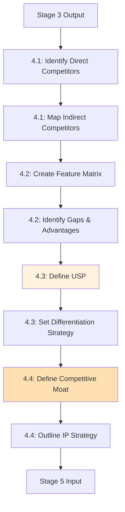

<!-- ARCHIVED: 2026-01-26T16:26:46.495Z
     Reason: Duplicate of canonical file
     Original location: docs\workflow\dossiers\stage-04\06_agent-orchestration.md
     See: docs/fixes/duplicate-consolidation-manifest.json for details
-->

# Stage 4: Agent Orchestration

## Metadata
- **Category**: Guide
- **Status**: Draft
- **Version**: 1.0.0
- **Author**: DOCMON
- **Last Updated**: 2026-01-21
- **Tags**: api, schema, feature, handoff

**Status**: ⚠️ **Partially Defined** (LEAD agent referenced, competitive intelligence tools not mapped)

---

## Agent Assignments (Inferred from stages.yaml)

| Substage | Agent(s) | Role | Source |
|----------|----------|------|--------|
| 4.1 Competitor Identification | LEAD | Identify direct/indirect competitors | stages.yaml:164 |
| 4.2 Feature Comparison | LEAD | Create feature matrix, identify gaps | stages.yaml:169 |
| 4.3 Market Positioning | LEAD | Define USP, set differentiation strategy | stages.yaml:174 |
| 4.4 Defense Strategy | LEAD | Define moat, outline IP strategy | stages.yaml:179 |

**Evidence**: EHG_Engineer@6ef8cf4:docs/workflow/stages.yaml:160-180

---

## Workflow Orchestration

---

## Agent Communication Patterns

**Sequential Execution**: All substages execute sequentially (4.1 → 4.2 → 4.3 → 4.4)

**Handoff Points**:
1. Stage 3 → Substage 4.1 (market definition, validation report)
2. Substage 4.1 → Substage 4.2 (competitor list)
3. Substage 4.2 → Substage 4.3 (feature matrix with gaps)
4. Substage 4.3 → Substage 4.4 (USP and differentiation strategy)
5. Substage 4.4 → Stage 5 (competitive analysis, market positioning, defense strategy)

---

## Known Gaps (from critique)

⚠️ **Missing Competitive Intelligence Tool Integrations**:
- No specific tools identified for competitor research (stages.yaml:164)
- Critique notes "Missing specific tool integrations" (stage-04.md:25)

**Proposed Artifacts** (to close gaps):
1. Integrate competitive intelligence APIs (CB Insights, Crunchbase, SimilarWeb)
2. Define feature matrix schema and storage
3. Implement automated competitor tracking (website changes, funding rounds, feature launches)

**Evidence**: EHG_Engineer@6ef8cf4:docs/workflow/critique/stage-04.md:22-26

---

## Sources Table

| Source | Repo | Commit | Path | Lines |
|--------|------|--------|------|-------|
| LEAD reference | EHG_Engineer | 6ef8cf4 | docs/workflow/critique/stage-04.md | 18 |
| Substages | EHG_Engineer | 6ef8cf4 | docs/workflow/stages.yaml | 160-180 |
| Tool gap | EHG_Engineer | 6ef8cf4 | docs/workflow/critique/stage-04.md | 25 |

<!-- Generated by Claude Code Phase 3 | EHG_Engineer@6ef8cf4 | 2025-11-05 -->
