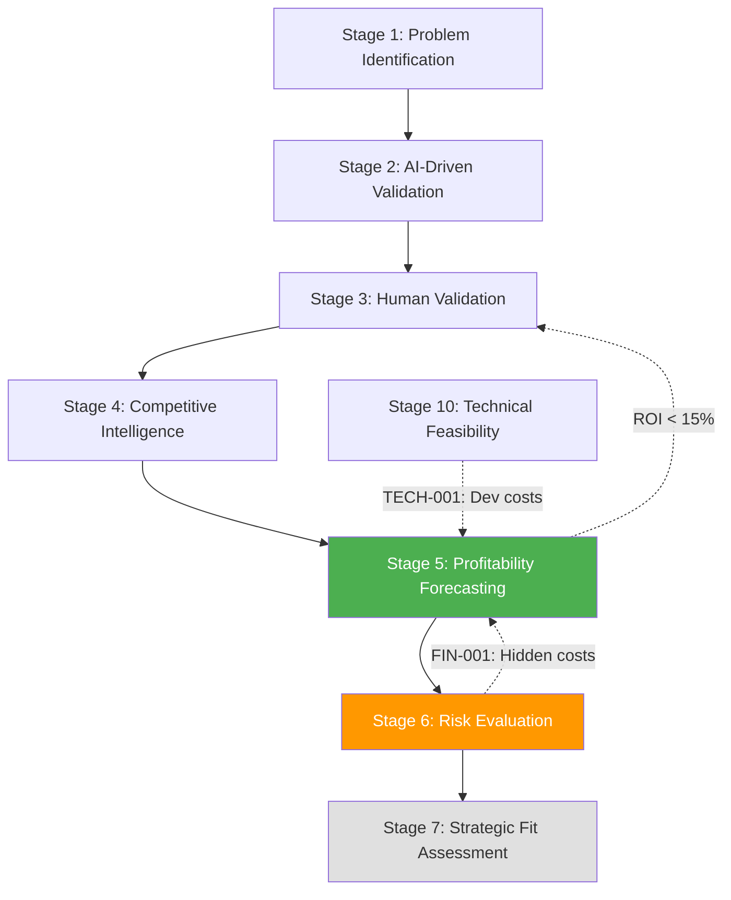
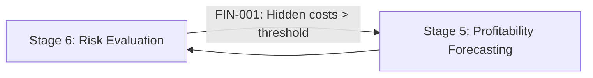

<!-- ARCHIVED: 2026-01-26T16:26:37.761Z
     Reason: Duplicate of canonical file
     Original location: docs\workflow\dossiers\stage-06\02_stage-map.md
     See: docs/fixes/duplicate-consolidation-manifest.json for details
-->

# Stage 6: Dependency Graph & Workflow Position


## Metadata
- **Category**: Guide
- **Status**: Draft
- **Version**: 1.0.0
- **Author**: DOCMON
- **Last Updated**: 2026-01-21
- **Tags**: validation, reference, workflow, ci

**Purpose**: Visualize Stage 6's position in the unified venture creation system and its dependency relationships.

**Evidence**: EHG_Engineer@6ef8cf4:docs/workflow/stages.yaml:228-273 "id: 6, depends_on: [5]"

---

## Stage Position in Ideation Phase

**Phase**: Ideation (Stages 1-10)

**Upstream Dependencies**:
- Stage 5 (Profitability Forecasting) - REQUIRED

**Downstream Dependents**:
- Stage 7 (Strategic Fit Assessment)

**Evidence**: EHG_Engineer@6ef8cf4:docs/workflow/stages.yaml:231-232 "depends_on: - 5"

---

## Dependency Graph



**Legend**:
- **Solid arrows**: Required dependencies
- **Dashed arrows**: Recursion triggers (may return to earlier stage)
- **Orange (S6)**: Current stage
- **Green (S5)**: Upstream dependency
- **Gray (S7)**: Downstream dependent

**Evidence**: EHG_Engineer@6ef8cf4:docs/workflow/critique/stage-06.md:56-59 "Dependencies Analysis"

---

## Critical Path Analysis

**Is Stage 6 on Critical Path?**: ✅ YES

**Reason**: Risk evaluation gates entry to Strategic Fit (Stage 7) and downstream execution phases. Risks must be identified, scored, and mitigated before proceeding.

**Blocking Impact**: If Stage 6 identifies unacceptable risks without viable mitigation, venture may be killed or recursed to earlier stages to adjust scope.

**Evidence**: EHG_Engineer@6ef8cf4:docs/workflow/critique/stage-06.md:56-59 "Critical Path: Yes"

---

## Input Dependencies

**Required from Stage 5**:
1. **Financial model**: Complete P&L projections, ROI calculations, break-even analysis
2. **Technical assessment**: From Stage 10 (if available) or preliminary technical review
3. **Market analysis**: From Stage 4 (competitive positioning, market size)

**Data Flow**:

```
Stage 5 Output (financial_model JSONB)
  → Stage 6 Input: Cost assumptions, revenue projections
  → Stage 6 Analysis: Identify hidden costs (compliance, insurance, legal)
  → Stage 6 Output: Risk-adjusted costs
  → Recursion Trigger (FIN-001): Return to Stage 5 if costs > threshold
```

**Evidence**: EHG_Engineer@6ef8cf4:docs/workflow/stages.yaml:233-236 "inputs: Financial model"

---

## Output Consumers

**Stage 7 (Strategic Fit Assessment) consumes**:
- Risk matrix (identify strategic risks)
- Mitigation plans (assess mitigation feasibility)
- Contingency strategies (evaluate fallback options)

**Chairman consumes**:
- Risk tolerance definition (approve/reject venture based on risk appetite)
- Mitigation effectiveness scores (validate mitigation quality)

**Evidence**: EHG_Engineer@6ef8cf4:docs/workflow/stages.yaml:237-240 "outputs: Risk matrix"

---

## Recursion Flow

**Outbound Recursion** (from Stage 6):



**Scenario**: Risk assessment uncovers GDPR compliance costs ($50k/year), cyber insurance ($20k/year), legal fees ($30k/year) - total $100k/year not in original Stage 5 model.

**Action**: Trigger FIN-001 recursion to Stage 5 to update OpEx and recalculate ROI.

**Evidence**: EHG_Engineer@6ef8cf4:docs/workflow/critique/stage-05.md:91 "Risk assessment uncovers hidden costs"

---

## Workflow Position Summary

| Attribute | Value |
|-----------|-------|
| **Phase** | Ideation (Stages 1-10) |
| **Position** | 6 of 40 |
| **Dependencies** | 1 upstream (Stage 5) |
| **Dependents** | 1+ downstream (Stage 7+) |
| **Recursion Triggers** | 1 outbound (FIN-001 to Stage 5) |
| **Critical Path** | ✅ Yes |

---

## Sources Table

| Source | Repo | Commit | Path | Lines |
|--------|------|--------|------|-------|
| Stage definition | EHG_Engineer | 6ef8cf4 | docs/workflow/stages.yaml | 228-273 |
| Dependencies | EHG_Engineer | 6ef8cf4 | docs/workflow/critique/stage-06.md | 56-59 |
| Recursion reference | EHG_Engineer | 6ef8cf4 | docs/workflow/critique/stage-05.md | 91 |

<!-- Generated by Claude Code Phase 3 | EHG_Engineer@6ef8cf4 | 2025-11-05 -->
