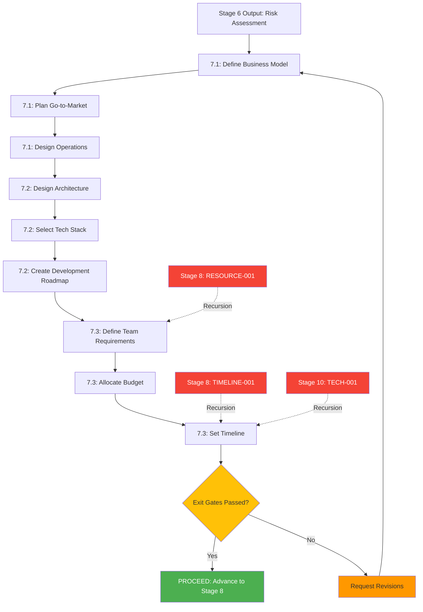

<!-- ARCHIVED: 2026-01-26T16:26:46.233Z
     Reason: Duplicate of canonical file
     Original location: docs\workflow\dossiers\stage-07\06_agent-orchestration.md
     See: docs/fixes/duplicate-consolidation-manifest.json for details
-->

# Stage 7: Agent Orchestration

## Metadata
- **Category**: Guide
- **Status**: Draft
- **Version**: 1.0.0
- **Author**: DOCMON
- **Last Updated**: 2026-01-21
- **Tags**: api, feature, handoff, validation

**Status**: ⚠️ **Not Implemented** (PLAN agent referenced, planning automation agents not mapped)

**Evidence**: EHG_Engineer@6ef8cf4:docs/workflow/critique/stage-07.md:18 "Clear ownership (PLAN)"

---

## Agent Assignments (Inferred from stages.yaml)

| Substage | Agent(s) | Role | Source |
|----------|----------|------|--------|
| 7.1 Business Planning | PLAN + Business Strategist (TBD) | Create business model, go-to-market, operations design | stages.yaml:300-305 |
| 7.2 Technical Planning | PLAN + Tech Architect (TBD) | Design architecture, select tech stack, create development roadmap | stages.yaml:306-311 |
| 7.3 Resource Planning | PLAN + Resource Planner (TBD) | Define team requirements, allocate budget, set timeline | stages.yaml:312-317 |
| Recursion Handler | Recursion Engine (TBD) | Receive RESOURCE-001, TIMELINE-001, TECH-001 triggers from Stages 8, 10 | critique stage-08:62-63, stage-10:39 |

**Evidence**: EHG_Engineer@6ef8cf4:docs/workflow/stages.yaml:299-317 "substages: 7.1, 7.2, 7.3"

---

## Workflow Orchestration

**Evidence**: EHG_Engineer@6ef8cf4:docs/workflow/stages.yaml:299-317 "Substages sequential"

---

## Agent Communication Patterns

**Sequential Execution**: All substages execute sequentially (7.1 → 7.2 → 7.3)

**Handoff Points**:
1. **Stage 6 → Substage 7.1**: Risk assessment, resource requirements, timeline constraints
2. **Substage 7.1 → Substage 7.2**: Business model (informs architecture), go-to-market (informs tech choices)
3. **Substage 7.2 → Substage 7.3**: Technical roadmap (informs team size, timeline)
4. **Substage 7.3 → Stage 8**: Business plan, technical roadmap, resource plan (all 3 outputs)

**Evidence**: EHG_Engineer@6ef8cf4:docs/workflow/stages.yaml:299-317 "substages sequential"

---

## Recursion Engine Integration (Inbound)

**Receives Recursion From Downstream Stages**:

Stage 7 is a **RECURSION TARGET** - other stages may trigger returns to Stage 7 when planning assumptions are invalidated.

### RESOURCE-001 from Stage 8 (Problem Decomposition)

**Scenario**: Task decomposition reveals resource shortage

**Example**:
- Stage 8 breaks down "Build backend API" into 150 tasks
- Estimates 6 engineer-months of work
- But Stage 7 Resource Planning allocated only 3 engineers for 1 month (3 engineer-months)
- **Gap**: Need 6 engineer-months, have 3 engineer-months

**Action**:
1. Stage 8 triggers RESOURCE-001 (HIGH severity)
2. Chairman approves recursion to Stage 7.3 (Resource Planning)
3. Stage 7.3 updates team requirements (hire 3 more engineers OR extend timeline to 2 months)
4. Stage 7.3 recalculates budget (3 more engineers = $450k more OpEx)
5. If budget increase is significant, may trigger recursion to Stage 5 (Profitability Forecasting)

**Evidence**: EHG_Engineer@6ef8cf4:docs/workflow/critique/stage-08.md:62 "Stage 7 | RESOURCE-001 | resource shortage"

---

### TIMELINE-001 from Stage 8 (Problem Decomposition)

**Scenario**: Task breakdown exceeds timeline constraints

**Example**:
- Stage 7 Technical Planning committed to 6-month MVP timeline
- Stage 8 task breakdown estimates 9 months of work
- **Gap**: Committed to 6 months, actual is 9 months

**Action**:
1. Stage 8 triggers TIMELINE-001 (MEDIUM severity)
2. Chairman approves recursion to Stage 7.3 (Resource Planning)
3. Stage 7.3 options:
   - **Increase team size**: Hire more engineers to compress timeline
   - **Reduce scope**: Cut features from MVP (update Technical Roadmap in 7.2)
   - **Extend timeline**: Accept 9-month timeline (update commitments in 7.3)
4. Update resource plan and budget accordingly

**Evidence**: EHG_Engineer@6ef8cf4:docs/workflow/critique/stage-08.md:63 "Stage 7 | TIMELINE-001 | exceeds timeline"

---

### TECH-001 from Stage 10 (Technical Review)

**Scenario**: Timeline infeasible due to technical complexity

**Example**:
- Stage 7 Technical Planning selected "microservices architecture" without considering complexity
- Stage 10 Technical Review identifies: monolith would take 6 months, microservices will take 12 months
- **Gap**: Committed to 6 months, actual is 12 months (due to architecture choice)

**Action**:
1. Stage 10 triggers TECH-001 (HIGH severity)
2. Chairman approves recursion to Stage 7.2 (Technical Planning)
3. Stage 7.2 options:
   - **Simplify architecture**: Switch to monolith (reduce complexity)
   - **Extend timeline**: Accept 12-month timeline (update Stage 7.3 Resource Planning)
   - **Increase resources**: Hire more engineers to maintain 6-month timeline
4. Update technical roadmap, resource plan, and budget

**Evidence**: EHG_Engineer@6ef8cf4:docs/workflow/critique/stage-10.md:39 "Stage 7 | TECH-001 | Timeline infeasible"
**Evidence**: EHG_Engineer@6ef8cf4:docs/workflow/critique/stage-10.md:121 "Timeline impact > 30% | Stage 7 | HIGH"

---

## Recursion Thresholds (Inbound)

**Complete Threshold Table**:

| Trigger | From Stage | Condition | Severity | Action |
|---------|------------|-----------|----------|--------|
| RESOURCE-001 | Stage 8 | Resource shortage identified | HIGH | Chairman approval to update team requirements (7.3) |
| TIMELINE-001 | Stage 8 | Timeline constraint exceeded | MEDIUM | Chairman approval to adjust timeline (7.3) |
| TECH-001 | Stage 10 | Timeline impact > 30% due to technical complexity | HIGH | Chairman approval to adjust technical roadmap (7.2) or timeline (7.3) |

**Evidence**: EHG_Engineer@6ef8cf4:docs/workflow/critique/stage-08.md:62-63 "RESOURCE-001, TIMELINE-001"
**Evidence**: EHG_Engineer@6ef8cf4:docs/workflow/critique/stage-10.md:121 "Timeline impact > 30%"

---

## Chairman Approval Requirements

**All Inbound Recursions Require Chairman Approval** (HIGH or MEDIUM severity):

**RESOURCE-001** (HIGH):
- Chairman must approve resource increase (hiring more engineers)
- Options: Approve resource increase, reduce scope, extend timeline

**TIMELINE-001** (MEDIUM):
- Chairman must approve timeline adjustment or scope reduction
- Options: Approve timeline extension, increase resources, reduce scope

**TECH-001** (HIGH):
- Chairman must approve architecture change or timeline adjustment
- Options: Simplify architecture, extend timeline, increase resources

**Evidence**: EHG_Engineer@6ef8cf4:docs/workflow/critique/stage-08.md:62-63 "HIGH, MEDIUM severity"
**Evidence**: EHG_Engineer@6ef8cf4:docs/workflow/critique/stage-10.md:39 "HIGH | Needs approval"

---

## Performance Requirements

**No Specific Performance SLAs Defined for Stage 7**

**Proposed SLAs**:
- **Business Planning (7.1)**: Complete in 3-5 days (manual) or <1 day (AI-assisted)
- **Technical Planning (7.2)**: Complete in 3-5 days (manual) or <1 day (AI-assisted)
- **Resource Planning (7.3)**: Complete in 2-3 days (manual) or <4 hours (AI-assisted)
- **Total Stage 7**: Complete in 8-13 days (manual) or 2-3 days (AI-assisted)

**Evidence**: EHG_Engineer@6ef8cf4:docs/workflow/critique/stage-07.md:30-33 "Target 80% automation"

---

## Integration Points

**External Systems** (referenced in critique):

1. **Project Management Tools**: Jira, Asana, Monday (for roadmap tracking)
2. **Financial Tools**: Excel, Google Sheets (for budget allocation)
3. **Architecture Tools**: Lucidchart, Miro (for architecture diagrams)
4. **Collaboration Tools**: Notion, Confluence (for plan documentation)

**Evidence**: EHG_Engineer@6ef8cf4:docs/workflow/critique/stage-07.md:26 "Missing specific tool integrations"

---

## Known Gaps (from critique)

⚠️ **No Agents Mapped**:
- No specific agents identified for planning automation (stages.yaml does not reference CrewAI agents)
- Critique notes "Clear ownership (PLAN)" but no detailed agent mapping
- No AI-assisted planning tools implemented (currently 100% manual)

⚠️ **Recursion Engine Not Implemented**:
- No code provided for receiving RESOURCE-001, TIMELINE-001, TECH-001 triggers
- No `recursionEngine.ts` service exists yet
- No `recursion_events` table created yet

⚠️ **No Tool Integrations**:
- Critique notes "Missing specific tool integrations" (stage-07.md:26)
- No integration with Jira, Asana, Excel, Lucidchart

**Evidence**: EHG_Engineer@6ef8cf4:docs/workflow/critique/stage-07.md:24-27 "Weaknesses: Missing tool integrations"

---

## Proposed Artifacts (to close gaps)

**Priority 0 (Blockers)**:
1. **Build recursionEngine.ts**: Implement RESOURCE-001, TIMELINE-001, TECH-001 trigger handlers
2. **Create recursion_events table**: Store recursion history for analytics
3. **Integrate with Stage 8/10**: Ensure Stages 8 and 10 can trigger recursion to Stage 7

**Priority 1 (High)**:
4. **Define Planning Agents**: CrewAI agents or human roles for business strategist, tech architect, resource planner
5. **Build AI-Assisted Planning Tools**:
   - Business model generator (inputs: Stage 4/5 outputs → outputs: Business Model Canvas)
   - Tech stack recommender (inputs: requirements → outputs: architecture, tech stack)
   - Resource estimator (inputs: roadmap → outputs: team size, budget, timeline)
6. **Integrate with Project Management Tools**: Jira API for roadmap tracking

**Priority 2 (Medium)**:
7. **Implement Chairman approval workflow**: UI for approving HIGH/MEDIUM severity recursions
8. **Add planning templates**: Industry-specific templates (SaaS, marketplace, hardware)
9. **Build plan validation rules**: Consistency checks (timeline vs budget, team size vs roadmap)

---

## Sources Table

| Source | Repo | Commit | Path | Lines |
|--------|------|--------|------|-------|
| PLAN reference | EHG_Engineer | 6ef8cf4 | docs/workflow/critique/stage-07.md | 18 |
| Substages | EHG_Engineer | 6ef8cf4 | docs/workflow/stages.yaml | 299-317 |
| Recursion inbound | EHG_Engineer | 6ef8cf4 | docs/workflow/critique/stage-08.md | 62-63, 150 |
| Recursion inbound | EHG_Engineer | 6ef8cf4 | docs/workflow/critique/stage-10.md | 39, 87, 121, 187 |
| Tool gap | EHG_Engineer | 6ef8cf4 | docs/workflow/critique/stage-07.md | 26 |
| Automation target | EHG_Engineer | 6ef8cf4 | docs/workflow/critique/stage-07.md | 30-33 |

---

<!-- Generated by Claude Code Phase 3 | EHG_Engineer@6ef8cf4 | 2025-11-05 -->
