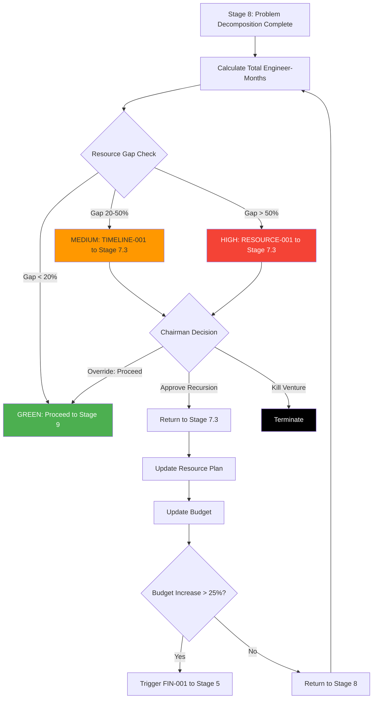

<!-- ARCHIVED: 2026-01-26T16:26:48.323Z
     Reason: Duplicate of canonical file
     Original location: docs\workflow\dossiers\stage-07\07_recursion-blueprint.md
     See: docs/fixes/duplicate-consolidation-manifest.json for details
-->

# Stage 7: Recursion Blueprint


## Metadata
- **Category**: Guide
- **Status**: Draft
- **Version**: 1.0.0
- **Author**: DOCMON
- **Last Updated**: 2026-01-21
- **Tags**: database, api, testing, e2e

**Status**: ⚠️ **INBOUND ONLY** (receives recursion from Stages 8, 10; no outbound triggers defined)

**Consistency Scan Result**: N/Y/N (No detailed recursion in Stage 7 critique, but referenced in Stage 8 and Stage 10 critiques as inbound target)

**Evidence**: EHG_Engineer@6ef8cf4:docs/workflow/critique/stage-07.md:28-71 "Recursive Workflow Behavior (standard improvements only)"
**Evidence**: EHG_Engineer@6ef8cf4:docs/workflow/critique/stage-08.md:62-63 "Stage 7 | RESOURCE-001, TIMELINE-001"
**Evidence**: EHG_Engineer@6ef8cf4:docs/workflow/critique/stage-10.md:39 "Stage 7 | TECH-001"

---

## Recursion Role in Unified Venture Creation System

Stage 7 (Comprehensive Planning Suite) is a **RECURSION TARGET** - downstream stages (8, 10) return to Stage 7 when task decomposition or technical review reveals planning assumptions were incorrect.

**Key Insight**: Planning is inherently optimistic (best-case estimates). Recursion provides **reality check** when detailed analysis (Stage 8) or technical review (Stage 10) reveals gaps.

**Evidence**: EHG_Engineer@6ef8cf4:docs/workflow/critique/stage-08.md:62 "Planning assumptions about team size/skills were incorrect"
**Evidence**: EHG_Engineer@6ef8cf4:docs/workflow/critique/stage-10.md:39 "Comprehensive Planning needs timeline adjustment"

---

## Outbound Recursion Triggers

**Recursion Triggers FROM This Stage**: ⚠️ **NONE DEFINED YET**

**Gap**: Stage 7 critique does not define any outbound recursion triggers. However, logical triggers should exist:

**Proposed Outbound Triggers** (not yet implemented):

| Target Stage | Trigger Type | Condition | Severity | Reason |
|--------------|--------------|-----------|----------|--------|
| **Stage 5** | **PLAN-001** | Resource planning reveals costs 25%+ above financial model | HIGH | Profitability forecasting needs update with accurate cost estimates (larger team, longer timeline = higher OpEx) |
| Stage 6 | PLAN-002 | Technical planning identifies new risks not in Stage 6 | MEDIUM | Risk evaluation needs update (e.g., new compliance requirements, technical debt risks) |

**Evidence**: EHG_Engineer@6ef8cf4:docs/workflow/critique/stage-07.md:28-71 "No detailed recursion triggers defined"

---

## Inbound Recursion Triggers

**Recursion Triggers That May RETURN TO This Stage**:

### PRIMARY TRIGGER: RESOURCE-001 from Stage 8 (Problem Decomposition)

| From Stage | Trigger Type | Condition | Severity | Auto-Execute? | Reason |
|------------|--------------|-----------|----------|---------------|--------|
| **Stage 8** | **RESOURCE-001** | **Decomposition reveals resource shortage** | **HIGH** | **Needs approval** | **PRIMARY TRIGGER**: Task breakdown shows actual resource needs exceed Stage 7 Resource Planning estimates. Requires update to team requirements, budget, and potentially timeline. |

**Evidence**: EHG_Engineer@6ef8cf4:docs/workflow/critique/stage-08.md:62 "Stage 7 | RESOURCE-001 | resource shortage | HIGH"
**Evidence**: EHG_Engineer@6ef8cf4:docs/workflow/critique/stage-08.md:150 "Stage 7 (Comprehensive Planning): May trigger secondary recursion"

---

### SECONDARY TRIGGER: TIMELINE-001 from Stage 8 (Problem Decomposition)

| From Stage | Trigger Type | Condition | Severity | Auto-Execute? | Reason |
|------------|--------------|-----------|----------|---------------|--------|
| Stage 8 | TIMELINE-001 | Task breakdown exceeds timeline constraints | MEDIUM | Needs approval | Task decomposition reveals MVP requires more time than Stage 7 Technical Planning committed. Requires timeline adjustment or scope reduction. |

**Evidence**: EHG_Engineer@6ef8cf4:docs/workflow/critique/stage-08.md:63 "Stage 7 | TIMELINE-001 | exceeds timeline | MEDIUM"

---

### TERTIARY TRIGGER: TECH-001 from Stage 10 (Technical Review)

| From Stage | Trigger Type | Condition | Severity | Auto-Execute? | Reason |
|------------|--------------|-----------|----------|---------------|--------|
| Stage 10 | TECH-001 | Timeline infeasible due to technical complexity | HIGH | Needs approval | Technical review reveals architecture choices in Stage 7.2 (Technical Planning) create timeline infeasibility. Requires architecture simplification or timeline adjustment. |

**Evidence**: EHG_Engineer@6ef8cf4:docs/workflow/critique/stage-10.md:39 "Stage 7 | TECH-001 | Timeline infeasible | HIGH"
**Evidence**: EHG_Engineer@6ef8cf4:docs/workflow/critique/stage-10.md:121 "Timeline impact > 30% | Stage 7 | HIGH"
**Evidence**: EHG_Engineer@6ef8cf4:docs/workflow/critique/stage-10.md:187 "Stage 7 (Comprehensive Planning): Secondary recursion for timeline"

---

## RESOURCE-001 Recursion Logic (from Stage 8)

### Full Recursion Logic (Proposed - Not Yet Implemented)

**Implementation Code** (inferred from Stage 8 critique):

```javascript
// From Stage 8: Problem Decomposition Engine
async function onStage8Complete(ventureId, wbsOutput) {
  const totalEngineerMonths = wbsOutput.calculateTotalEffort();
  const stage7ResourcePlan = await fetchStage7ResourcePlan(ventureId);
  const allocatedEngineerMonths = stage7ResourcePlan.teamSize * stage7ResourcePlan.timelineMonths;

  // Check for resource shortage
  if (totalEngineerMonths > allocatedEngineerMonths * 1.2) {  // 20% buffer
    // HIGH severity: Requires Chairman approval
    await recursionEngine.triggerRecursion({
      ventureId,
      fromStage: 8,
      toStage: 7,
      targetSubstage: '7.3',  // Resource Planning
      triggerType: 'RESOURCE-001',
      triggerData: {
        required_engineer_months: totalEngineerMonths,
        allocated_engineer_months: allocatedEngineerMonths,
        gap_pct: ((totalEngineerMonths - allocatedEngineerMonths) / allocatedEngineerMonths * 100).toFixed(1),
        wbs_summary: wbsOutput.summary,
        stage7_resource_plan: stage7ResourcePlan
      },
      severity: 'HIGH',
      autoExecuted: false,  // Requires Chairman approval
      resolution_notes: `Task decomposition requires ${totalEngineerMonths} engineer-months, but Stage 7 allocated only ${allocatedEngineerMonths}. Options:
        1. Increase team size (hire ${Math.ceil((totalEngineerMonths - allocatedEngineerMonths) / stage7ResourcePlan.timelineMonths)} more engineers)
        2. Extend timeline (add ${Math.ceil((totalEngineerMonths - allocatedEngineerMonths) / stage7ResourcePlan.teamSize)} more months)
        3. Reduce scope (cut features to fit ${allocatedEngineerMonths} engineer-months)
        4. Combination of above`
    });

    // Wait for Chairman approval before proceeding
    return { status: 'PENDING_RECURSION', targetStage: 7 };
  }

  // No resource shortage: proceed to Stage 9
  return { status: 'COMPLETE', nextStage: 9 };
}
```

**Evidence**: EHG_Engineer@6ef8cf4:docs/workflow/critique/stage-08.md:62 "Decomposition reveals resource shortage"

---

### Why Stage 7?

**Re-Planning Requirements**:

1. **Team requirements definition (Substage 7.3)**: Original team size estimate was too small
2. **Budget allocation (Substage 7.3)**: More engineers = higher salaries, potentially trigger recursion to Stage 5 (Profitability)
3. **Timeline adjustment (Substage 7.3)**: If cannot increase team, must extend timeline
4. **Technical roadmap update (Substage 7.2)**: May need to reduce scope to fit resource constraints

**Evidence**: EHG_Engineer@6ef8cf4:docs/workflow/critique/stage-08.md:62 "Planning assumptions about team size/skills were incorrect"

---

### Trigger Data Payload

**What Gets Passed to Stage 7**:

```javascript
{
  required_engineer_months: 180,        // Actual effort from WBS
  allocated_engineer_months: 90,        // Original Stage 7 estimate (3 engineers × 6 months)
  gap_pct: 100.0,                       // 100% gap (need double the resources)
  wbs_summary: {
    total_tasks: 450,
    frontend_tasks: 150,
    backend_tasks: 200,
    devops_tasks: 50,
    qa_tasks: 50
  },
  stage7_resource_plan: {
    teamSize: 5,                        // Original: 3 frontend, 2 backend
    timelineMonths: 6,
    budget: 450000
  }
}
```

**Purpose**: Stage 7 uses this data to recalculate team requirements, budget, and timeline

**Evidence**: EHG_Engineer@6ef8cf4:docs/workflow/critique/stage-08.md:62 "RESOURCE-001 trigger"

---

## TIMELINE-001 Recursion Logic (from Stage 8)

### Scenario: Task Breakdown Exceeds Timeline Constraints

**Example**:
- Stage 7.3 committed to 6-month MVP timeline
- Stage 8 task decomposition estimates 9 months of sequential work
- **Gap**: Committed to 6 months, actual is 9 months (50% overage)

**Action**:
1. Stage 8 triggers TIMELINE-001 (MEDIUM severity)
2. Chairman approves recursion to Stage 7.3 (Resource Planning)
3. Stage 7.3 options:
   - **Increase team size**: Add 50% more engineers (5 → 7.5 ≈ 8 engineers) to compress timeline to 6 months
   - **Extend timeline**: Accept 9-month timeline, update commitments
   - **Reduce scope**: Cut 33% of features to fit 6-month timeline
4. Update resource plan, budget, and communicate timeline change to stakeholders

**Evidence**: EHG_Engineer@6ef8cf4:docs/workflow/critique/stage-08.md:63 "Task breakdown exceeds timeline constraints"

---

### Recursion Thresholds

**Threshold for TIMELINE-001**:

| Metric | Threshold | Severity | Action |
|--------|-----------|----------|--------|
| Timeline overage | > 20% | MEDIUM | Chairman approval to recurse to Stage 7.3 |
| Timeline overage | > 50% | HIGH | Chairman approval to recurse to Stage 7.2 (may need architecture simplification) |

**Example**:
- Committed: 6 months
- Actual (from WBS): 7.5 months (25% overage) → MEDIUM severity
- Actual (from WBS): 10 months (67% overage) → HIGH severity (may need to simplify architecture)

**Evidence**: EHG_Engineer@6ef8cf4:docs/workflow/critique/stage-08.md:63 "TIMELINE-001 | MEDIUM"

---

## TECH-001 Recursion Logic (from Stage 10)

### Scenario: Timeline Infeasible Due to Technical Complexity

**Example**:
- Stage 7.2 selected "microservices architecture" for MVP
- Stage 10 Technical Review identifies:
  - Microservices require: API gateway, service mesh, container orchestration (Kubernetes)
  - Estimated time: 12 months (vs 6-month commitment in Stage 7.3)
  - **Gap**: 100% timeline increase due to architecture complexity

**Action**:
1. Stage 10 triggers TECH-001 (HIGH severity)
2. Chairman approves recursion to Stage 7.2 (Technical Planning)
3. Stage 7.2 options:
   - **Simplify architecture**: Switch to monolith (reduces complexity, timeline to 6 months)
   - **Accept complexity**: Keep microservices, update Stage 7.3 timeline to 12 months, increase budget
   - **Hybrid approach**: Start with monolith MVP, refactor to microservices post-launch
4. Update technical roadmap (7.2), resource plan (7.3), and potentially trigger recursion to Stage 5 (if budget exceeds financial model)

**Evidence**: EHG_Engineer@6ef8cf4:docs/workflow/critique/stage-10.md:39 "Timeline infeasible due to technical complexity"
**Evidence**: EHG_Engineer@6ef8cf4:docs/workflow/critique/stage-10.md:87 "HIGH issues → May trigger recursion to Stage 7"

---

### Recursion Thresholds

**Threshold for TECH-001**:

| Metric | Threshold | Severity | Action |
|--------|-----------|----------|--------|
| Timeline impact | > 30% | HIGH | Chairman approval to recurse to Stage 7.2 or 7.3 |
| Development cost increase | > 25% | HIGH | Chairman approval to recurse to Stage 7.3, may trigger recursion to Stage 5 |
| Solution feasibility | < 0.5 | CRITICAL | Auto-recurse to Stage 3 (may bypass Stage 7 entirely) |

**Evidence**: EHG_Engineer@6ef8cf4:docs/workflow/critique/stage-10.md:121 "Timeline impact > 30% | Stage 7 | HIGH"
**Evidence**: EHG_Engineer@6ef8cf4:docs/workflow/critique/stage-10.md:122 "Development cost increase > 25% | Stage 5 | HIGH"

---

## Loop Prevention

**Max Recursions**: 3 returns to Stage 7 per venture per trigger type

**Tracking Mechanism**:

```sql
SELECT COUNT(*) AS recursion_count
FROM recursion_events
WHERE venture_id = $1
  AND to_stage = 7
  AND trigger_type = $2;  -- 'RESOURCE-001', 'TIMELINE-001', or 'TECH-001'
```

**Escalation After 3rd Recursion**:

Chairman must approve one of the following:
1. **Continue with adjusted plan**: Accept resource shortage, longer timeline, or higher complexity
2. **Kill venture**: Not feasible to execute within acceptable constraints
3. **Pivot**: Fundamentally change approach (e.g., buy instead of build, partner instead of solo)

**Evidence**: Similar pattern to Stage 5 FIN-001 loop prevention (EHG_Engineer@6ef8cf4:docs/workflow/critique/stage-05.md:95-101)

---

## Chairman Controls

### HIGH Severity (RESOURCE-001, TECH-001)

**Behavior**:
- **Requires Chairman approval before recursion**: Workflow pauses until decision made
- **Chairman approval options**:
  1. **Proceed**: Accept warning, advance despite gap (accept technical debt or optimistic estimates)
  2. **Recurse**: Trigger recursion to Stage 7.2 or 7.3
  3. **Kill**: Terminate venture (not feasible to execute)

**Override Scenarios**:
- Strategic bet (accept higher cost/timeline for market entry)
- Adjust thresholds for specific venture type (e.g., R&D ventures have longer timelines)
- Temporary gap (can hire more engineers mid-project if needed)

**Evidence**: EHG_Engineer@6ef8cf4:docs/workflow/critique/stage-08.md:62 "HIGH | Needs approval"
**Evidence**: EHG_Engineer@6ef8cf4:docs/workflow/critique/stage-10.md:39 "HIGH | Needs approval"

---

### MEDIUM Severity (TIMELINE-001)

**Behavior**:
- **Requires Chairman approval before recursion**: Workflow pauses until decision made
- **Chairman approval options**:
  1. **Proceed**: Accept timeline constraint violation, adjust expectations
  2. **Recurse**: Trigger recursion to Stage 7.3 (Resource Planning)
  3. **Kill**: Terminate venture (timeline not acceptable)

**Override Scenarios**:
- Market launch window flexible (no hard deadline)
- Willing to increase team size mid-project
- Scope reduction acceptable (MVP can be smaller)

**Evidence**: EHG_Engineer@6ef8cf4:docs/workflow/critique/stage-08.md:63 "MEDIUM | Needs approval"

---

## Performance Requirements

**SLAs for Recursion Handling** (proposed, not yet implemented):

| Operation | Target Latency | Purpose |
|-----------|----------------|---------|
| Recursion detection | <500ms | Evaluate resource gap, timeline overage, technical complexity after Stage 8/10 complete |
| Chairman notification | <5 seconds | Send email/dashboard alert when recursion triggered |
| Total recursion latency | <1 minute | From Stage 8/10 detection to Chairman notification |

**Evidence**: Similar to Stage 5 performance requirements (EHG_Engineer@6ef8cf4:docs/workflow/critique/stage-05.md:116-120)

---

## UI/UX Implications

### Pre-emptive Warning System (Proposed)

**Real-time Resource Indicator** (as user enters data in Stage 7.3 Resource Planning):

```
Team Size: 3 engineers
Timeline: 6 months
Calculated Capacity: 18 engineer-months

Historical Data (similar ventures):
  - Average Effort: 25 engineer-months
  - Your Estimate: 18 engineer-months  [🟡 YELLOW: 28% below average]

⚠️ Warning: Resource estimate below average for similar ventures
May trigger RESOURCE-001 recursion from Stage 8 if actual effort higher.
```

**Color Coding**:
- 🟢 **Green**: Estimate ≥ average (low risk of recursion)
- 🟡 **Yellow**: Estimate 20-30% below average (moderate risk)
- 🔴 **Red**: Estimate > 30% below average (high risk of recursion)

**Evidence**: Similar to Stage 5 ROI indicator (EHG_Engineer@6ef8cf4:docs/workflow/critique/stage-05.md:122-127)

---

### Recursion Explanation Modal (Proposed)

**When recursion triggers from Stage 8 or 10, show modal**:

```
┌─────────────────────────────────────────────────────────────┐
│ ⚠️ Recursion Triggered: Resource Shortage (RESOURCE-001)   │
├─────────────────────────────────────────────────────────────┤
│                                                             │
│ Task decomposition (Stage 8) requires 180 engineer-months  │
│ Stage 7 Resource Planning allocated 90 engineer-months     │
│                                                             │
│ Gap: 100% (need double the resources)                      │
│                                                             │
│ Options to resolve:                                        │
│  1. Increase team size: Hire 5 more engineers             │
│  2. Extend timeline: Add 6 more months                     │
│  3. Reduce scope: Cut 50% of features                      │
│                                                             │
│ System will return to Stage 7.3 (Resource Planning)        │
│ to update team requirements and budget.                    │
│                                                             │
│ [View WBS Breakdown] [Continue to Stage 7.3]              │
└─────────────────────────────────────────────────────────────┘
```

**Evidence**: Similar to Stage 5 recursion modal (EHG_Engineer@6ef8cf4:docs/workflow/critique/stage-05.md:128-131)

---

### Plan Comparison View (Proposed)

**Side-by-side comparison** (after recursion resolved):

```
┌────────────────────────────────────────────────────────────────┐
│ Resource Plan Comparison                                       │
├───────────────────────────┬────────────────────────────────────┤
│ Original (Stage 7.3 v1)   │ After Recursion (Stage 7.3 v2)     │
├───────────────────────────┼────────────────────────────────────┤
│ Team: 5 engineers         │ Team: 8 engineers (↑60%)           │
│ Timeline: 6 months        │ Timeline: 6 months (unchanged)     │
│ Budget: $450k             │ Budget: $720k (↑60%)               │
│ Capacity: 30 eng-months   │ Capacity: 48 eng-months (↑60%)    │
│ Required: 45 eng-months   │ Required: 45 eng-months            │
│ Gap: 50% shortage ❌      │ Gap: 7% buffer ✅                  │
├───────────────────────────┼────────────────────────────────────┤
│ Decision: RECURSE         │ Decision: PROCEED                  │
└───────────────────────────┴────────────────────────────────────┘
```

**Purpose**: Help Chairman/users understand impact of recursion and validate improvements

**Evidence**: Similar to Stage 5 financial comparison (EHG_Engineer@6ef8cf4:docs/workflow/critique/stage-05.md:132)

---

## Integration Points

### 1. recursionEngine.ts

**Purpose**: Central recursion orchestration service

**Responsibilities**:
- Receive RESOURCE-001, TIMELINE-001, TECH-001 triggers from Stages 8, 10
- Evaluate recursion thresholds (resource gap %, timeline overage %, technical complexity)
- Request Chairman approval (all triggers are HIGH or MEDIUM severity)
- Update venture stage status (return to Stage 7.2 or 7.3)
- Preserve context for comparison analysis

**Evidence**: EHG_Engineer@6ef8cf4:docs/workflow/critique/stage-08.md:62-63 "Recursion triggers"

---

### 2. recursion_events Table

**Purpose**: Database logging for all recursion events

**Schema** (proposed):
```sql
CREATE TABLE recursion_events (
  id UUID PRIMARY KEY DEFAULT gen_random_uuid(),
  venture_id UUID REFERENCES ventures(id) NOT NULL,
  from_stage INT NOT NULL,                  -- 8 or 10
  to_stage INT NOT NULL,                    -- 7
  target_substage VARCHAR(10),              -- '7.2' or '7.3'
  trigger_type VARCHAR(50) NOT NULL,        -- 'RESOURCE-001', 'TIMELINE-001', 'TECH-001'
  trigger_data JSONB,                       -- Full WBS data, technical review data
  severity VARCHAR(20) NOT NULL,            -- 'HIGH', 'MEDIUM'
  auto_executed BOOLEAN DEFAULT false,      -- Always false (requires Chairman approval)
  resolution_notes TEXT,
  recursion_count_for_stage INT,
  created_at TIMESTAMP DEFAULT NOW(),
  resolved_at TIMESTAMP,
  chairman_override BOOLEAN DEFAULT false,
  chairman_override_reason TEXT
);

CREATE INDEX idx_recursion_venture ON recursion_events(venture_id);
CREATE INDEX idx_recursion_to_stage ON recursion_events(to_stage, trigger_type);
```

**Evidence**: Similar to Stage 5 recursion_events table (EHG_Engineer@6ef8cf4:docs/workflow/critique/stage-05.md:137)

---

### 3. validationFramework.ts

**Purpose**: Reuse threshold validation logic

**Integration**:
```typescript
import { validateThreshold } from './validationFramework';

const resourceGapValidation = validateThreshold({
  metric: 'Resource Gap',
  value: resourceGapPct,
  thresholds: [
    { max: 20, severity: 'NONE', action: 'proceed' },
    { min: 20, max: 50, severity: 'MEDIUM', action: 'approve' },
    { min: 50, severity: 'HIGH', action: 'approve' }
  ]
});
```

**Evidence**: Similar to Stage 5 validation framework integration (EHG_Engineer@6ef8cf4:docs/workflow/critique/stage-05.md:133-134)

---

## Recursion Flow Diagram

**Complete Flow** (from Stage 8 completion to recursion resolution):



---

## Testing Strategy

**Unit Tests**:
1. Test resource gap calculation (required vs allocated engineer-months)
2. Test timeline overage calculation (WBS estimate vs Stage 7 commitment)
3. Test recursion trigger creation (correct payload, severity, target substage)
4. Test loop prevention (block after 3rd recursion)

**Integration Tests**:
1. Test full recursion flow: Stage 8 → Stage 7.3 → Stage 8
2. Test Chairman approval workflow (HIGH/MEDIUM severity)
3. Test Chairman override (skip recursion despite threshold violation)
4. Test recursion history tracking (database logging)

**E2E Tests**:
1. Test resource indicator (green/yellow/red) updates as user enters data in Stage 7.3
2. Test recursion modal displays correct information
3. Test plan comparison view shows delta between original and updated
4. Test Chairman notification (email/dashboard)

---

## Known Gaps

⚠️ **No Outbound Recursion Defined**: Stage 7 critique does not define triggers to earlier stages (e.g., to Stage 5 when budget exceeds financial model)

⚠️ **No Implementation Code**: Unlike Stage 5 (which has full JavaScript code in critique), Stage 7 has no recursion implementation provided

⚠️ **No Pre-emptive Warnings**: No real-time indicator (like Stage 5 ROI indicator) to warn users of likely recursion

⚠️ **Recursion Engine Not Built**: No `recursionEngine.ts` service exists yet to handle inbound triggers

**Evidence**: EHG_Engineer@6ef8cf4:docs/workflow/critique/stage-07.md:28-71 "Standard improvements only (no detailed recursion)"

---

## Sources Table

| Source | Repo | Commit | Path | Lines |
|--------|------|--------|------|-------|
| Stage 7 critique | EHG_Engineer | 6ef8cf4 | docs/workflow/critique/stage-07.md | 28-71 |
| RESOURCE-001 trigger | EHG_Engineer | 6ef8cf4 | docs/workflow/critique/stage-08.md | 62, 150 |
| TIMELINE-001 trigger | EHG_Engineer | 6ef8cf4 | docs/workflow/critique/stage-08.md | 63, 150 |
| TECH-001 trigger | EHG_Engineer | 6ef8cf4 | docs/workflow/critique/stage-10.md | 39, 87, 121, 187 |

---

<!-- Generated by Claude Code Phase 3 | EHG_Engineer@6ef8cf4 | 2025-11-05 -->
