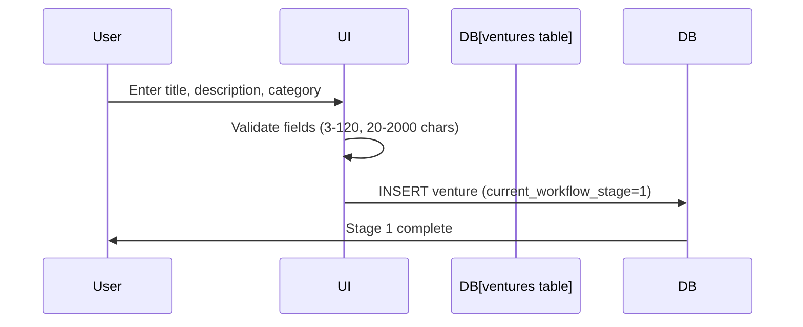

# Stage 1: Agent Orchestration

## Python CrewAI Agents (EHG App)

**Status**: ⚠️ No agents explicitly mapped to Stage 1 in available documentation

### Agent Scan Results

Scanned `/mnt/c/_EHG/ehg/agent-platform/app/agents/` and `/app/crews/`:

**Agents Found** (15+):
- base_agent.py
- ceo_agent.py
- complexity_assessment.py
- market_sizing.py
- tech_feasibility.py
- regulatory_risk.py

**Crews Found** (15+):
- quick_validation_crew.py
- deep_research_crew.py
- board_directors_crew.py

**Stage 1 Mapping**: None explicitly documented in stages.yaml or critiques

**Evidence**: EHG@0d80dac:agent-platform/app/agents/ (directory scan), EHG@0d80dac:agent-platform/app/crews/ (directory scan)

### Governance Handoffs (Node.js Sub-Agents)

**No handoffs at Stage 1** — Governance integration occurs at later stages (Stage 40 → PRD creation)

## Proposed Agent Mapping (Gap Identified)

**Recommendation**: Based on Stage 1 outputs ("Structured idea document", "Initial validation"), the following agents COULD be used but are not currently mapped:

1. **Market Sizing Agent** (market_sizing.py) - Preliminary TAM/SAM/SOM
2. **Complexity Assessment Agent** (complexity_assessment.py) - Initial feasibility check

**Note**: These are PROPOSED mappings based on agent capabilities, not confirmed implementations. Added to gaps backlog.

---

## Execution Flow (Proposed)

**Note**: No agent invocation currently documented for Stage 1

---

## Sources Table

| Source | Repo | Commit | Path | Lines |
|--------|------|--------|------|-------|
| Agent directory scan | EHG | 0d80dac | agent-platform/app/agents/ | N/A |
| Crew directory scan | EHG | 0d80dac | agent-platform/app/crews/ | N/A |
| stages.yaml (no agent refs) | EHG_Engineer | 6ef8cf4 | docs/workflow/stages.yaml | 2-42 |
