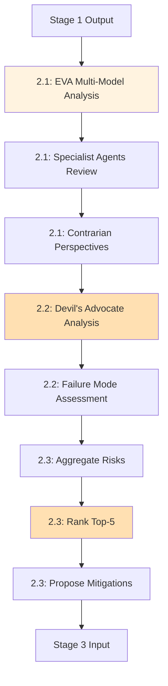

# Stage 2: Agent Orchestration

**Status**: ⚠️ **Partially Defined** (EVA referenced, specialist agents not mapped)

---

## Agent Assignments (Inferred from stages.yaml)

| Substage | Agent(s) | Role | Source |
|----------|----------|------|--------|
| 2.1 Multi-Model Analysis | EVA (multi-model) | Execute multi-model critique | stages.yaml:72 |
| 2.1 Multi-Model Analysis | Specialist agents (TBD) | Domain-specific review | stages.yaml:73 |
| 2.2 Contrarian Red Team | LEAD (devil's advocate mode) | Challenge assumptions | stages.yaml:78 |
| 2.3 Risk Prioritization | LEAD | Rank top-5 risks | stages.yaml:83 |

**Evidence**: EHG_Engineer@6ef8cf4:docs/workflow/stages.yaml:69-84

---

## Workflow Orchestration

---

## Agent Communication Patterns

**Parallel Execution**: None (sequential multi-model → contrarian → prioritization)

**Handoff Points**:
1. Stage 1 → Substage 2.1 (structured idea document)
2. Substage 2.1 → Substage 2.2 (multi-model critique)
3. Substage 2.2 → Substage 2.3 (aggregated risks)
4. Substage 2.3 → Stage 3 (AI critique report with top-5 risks)

---

## Known Gaps (from critique)

⚠️ **Missing Specialist Agent Mappings**:
- No specific agents identified for domain review (stages.yaml:73)
- Critique notes "Missing specific tool integrations" (stage-02.md:25)

**Proposed Artifacts** (to close gaps):
1. Map specialist agents to domains (financial, technical, market, legal)
2. Define handoff schema between EVA and specialists
3. Document parallel vs. sequential execution strategy

**Evidence**: EHG_Engineer@6ef8cf4:docs/workflow/critique/stage-02.md:22-26

---

## Sources Table

| Source | Repo | Commit | Path | Lines |
|--------|------|--------|------|-------|
| EVA reference | EHG_Engineer | 6ef8cf4 | docs/workflow/stages.yaml | 72 |
| Specialist agents | EHG_Engineer | 6ef8cf4 | docs/workflow/stages.yaml | 73 |
| LEAD reference | EHG_Engineer | 6ef8cf4 | docs/workflow/stages.yaml | 78, 83 |
| Agent gap | EHG_Engineer | 6ef8cf4 | docs/workflow/critique/stage-02.md | 25 |

<!-- Generated by Claude Code Phase 3 | EHG_Engineer@6ef8cf4 | 2025-11-05 -->
