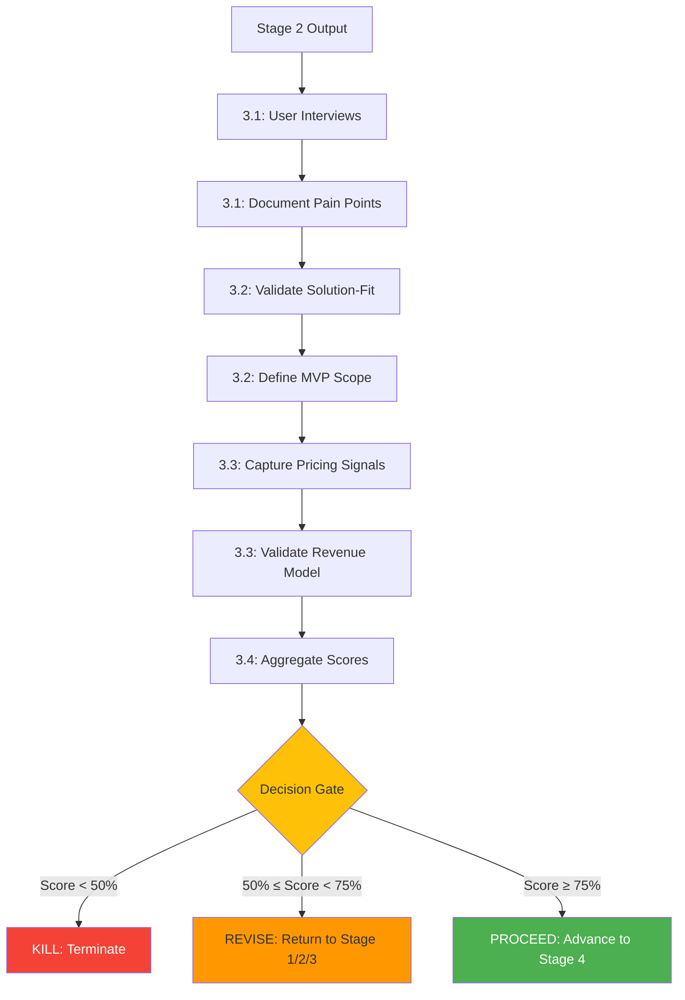

# Stage 3: Agent Orchestration

**Status**: ⚠️ **Partially Defined** (PLAN agent referenced, validation agents not mapped)

---

## Agent Assignments (Inferred from stages.yaml)

| Substage | Agent(s) | Role | Source |
|----------|----------|------|--------|
| 3.1 Problem Validation | PLAN | Conduct user interviews, document pain points | stages.yaml:116 |
| 3.2 Solution Validation | PLAN | Validate solution-fit, define MVP scope | stages.yaml:121 |
| 3.3 Willingness to Pay | PLAN | Capture pricing signals, validate revenue model | stages.yaml:126 |
| 3.4 Kill/Revise/Proceed Gate | PLAN + Chairman | Make decision, document next steps | stages.yaml:131 |

**Evidence**: EHG_Engineer@6ef8cf4:docs/workflow/stages.yaml:112-133

---

## Workflow Orchestration

---

## Agent Communication Patterns

**Sequential Execution**: All substages execute sequentially (3.1 → 3.2 → 3.3 → 3.4)

**Handoff Points**:
1. Stage 2 → Substage 3.1 (AI review report)
2. Substage 3.1 → Substage 3.2 (pain points document)
3. Substage 3.2 → Substage 3.3 (MVP scope)
4. Substage 3.3 → Substage 3.4 (pricing signals)
5. Substage 3.4 → Stage 4 or Recursion (decision + validation report)

---

## Chairman Approval Requirements

**Substage 3.4** requires Chairman approval for:
- **KILL decisions**: Confirm venture termination
- **REVISE decisions**: Approve recursion target stage
- **Recursion events** (HIGH severity): Approve MKT-001, QUALITY-001 triggers

**Auto-Execute** (no Chairman approval):
- **PROCEED decisions**: Validation score ≥ 75%
- **FIN-001 recursion** (CRITICAL severity): Auto-executed, Chairman notified post-execution

**Evidence**: EHG_Engineer@6ef8cf4:docs/workflow/critique/stage-03.md:71-76

---

## Known Gaps (from critique)

⚠️ **Missing Validation Tool Integrations**:
- No specific tools identified for user interviews (stages.yaml:116)
- Critique notes "Missing specific tool integrations" (stage-03.md:26)

**Proposed Artifacts** (to close gaps):
1. Integrate user interview tools (e.g., Calendly for scheduling, Zoom for interviews)
2. Define validation score calculation formulas
3. Implement automated decision gate logic

**Evidence**: EHG_Engineer@6ef8cf4:docs/workflow/critique/stage-03.md:24-27

---

## Sources Table

| Source | Repo | Commit | Path | Lines |
|--------|------|--------|------|-------|
| PLAN reference | EHG_Engineer | 6ef8cf4 | docs/workflow/critique/stage-03.md | 19 |
| Substages | EHG_Engineer | 6ef8cf4 | docs/workflow/stages.yaml | 112-133 |
| Chairman controls | EHG_Engineer | 6ef8cf4 | docs/workflow/critique/stage-03.md | 71-76 |
| Tool gap | EHG_Engineer | 6ef8cf4 | docs/workflow/critique/stage-03.md | 26 |

<!-- Generated by Claude Code Phase 3 | EHG_Engineer@6ef8cf4 | 2025-11-05 -->
