# Stage 5: Recursion Blueprint


## Table of Contents

- [Intelligent Dependency-Driven Recursion](#intelligent-dependency-driven-recursion)
- [Outbound Recursion Triggers](#outbound-recursion-triggers)
- [PRIMARY TRIGGER: FIN-001 to Stage 3](#primary-trigger-fin-001-to-stage-3)
  - [Full Recursion Logic (SC-003)](#full-recursion-logic-sc-003)
  - [Why Stage 3?](#why-stage-3)
  - [Trigger Data Payload](#trigger-data-payload)
- [Recursion Thresholds](#recursion-thresholds)
  - [ROI Threshold Rationale](#roi-threshold-rationale)
- [Inbound Recursion Triggers](#inbound-recursion-triggers)
  - [When Stage 6 Returns to Stage 5](#when-stage-6-returns-to-stage-5)
  - [When Stage 10 Returns to Stage 5](#when-stage-10-returns-to-stage-5)
- [Loop Prevention](#loop-prevention)
  - [Recursion History Tracking](#recursion-history-tracking)
- [Chairman Controls](#chairman-controls)
  - [CRITICAL Severity (ROI < 15%)](#critical-severity-roi-15)
  - [HIGH Severity (ROI 15-20% or Margin < 20%)](#high-severity-roi-15-20-or-margin-20)
  - [Chairman Override Capabilities](#chairman-override-capabilities)
- [Performance Requirements](#performance-requirements)
- [UI/UX Implications](#uiux-implications)
  - [Pre-emptive Warning System](#pre-emptive-warning-system)
  - [Recursion Explanation Modal](#recursion-explanation-modal)
  - [Financial Comparison View](#financial-comparison-view)
- [Integration Points](#integration-points)
  - [1. validationFramework.ts](#1-validationframeworkts)
  - [2. evaValidation.ts](#2-evavalidationts)
  - [3. recursionEngine.ts](#3-recursionenginets)
  - [4. recursion_events Table](#4-recursion_events-table)
- [Recursion Flow Diagram](#recursion-flow-diagram)
- [Testing Strategy](#testing-strategy)
- [Sources Table](#sources-table)

**Status**: ✅ **DETAILED RECURSION SUPPORT**

**Consistency Scan Result**: Y/Y/Y (Detailed recursion implemented with full JavaScript code)

**Evidence**: EHG_Engineer@6ef8cf4:docs/workflow/critique/stage-05.md:29-138 "Recursive Workflow Behavior"

---

## Intelligent Dependency-Driven Recursion

Stage 5 is a **CRITICAL recursion trigger** in the unified venture creation system (SD-VENTURE-UNIFICATION-001). Financial viability discovered here can invalidate upstream validation assumptions, automatically triggering recursion back to earlier stages.

**Evidence**: EHG_Engineer@6ef8cf4:docs/workflow/critique/stage-05.md:29-32 "CRITICAL recursion trigger"

---

## Outbound Recursion Triggers

**Recursion Triggers FROM This Stage**:

| Target Stage | Trigger Type | Condition | Severity | Auto-Execute? | Reason |
|--------------|--------------|-----------|----------|---------------|--------|
| **Stage 3** | **FIN-001** | **ROI < 15%** | **CRITICAL** | **Yes** | **PRIMARY TRIGGER**: Profitability forecasting reveals venture is not financially viable. Requires re-validation of problem-solution fit, willingness-to-pay assumptions, and potentially Kill/Revise/Proceed decision. |
| Stage 4 | FIN-001 | Margin forecasts below target | HIGH | Needs approval | Competitive positioning may need adjustment to improve margins |
| Stage 2 | FIN-001 | Revenue model fundamentally flawed | CRITICAL | Yes | AI review needed with corrected financial assumptions |

**Evidence**: EHG_Engineer@6ef8cf4:docs/workflow/critique/stage-05.md:34-41 "Recursion Triggers FROM This Stage"

---

## PRIMARY TRIGGER: FIN-001 to Stage 3

### Full Recursion Logic (SC-003)

**Implementation Code** (from critique lines 44-77):

```javascript
// Success Criteria SC-003: Recursion triggers automatically when Stage 5 detects ROI < 15%
async function onStage5Complete(ventureId, financialModel) {
  const calculatedROI = financialModel.calculateROI();

  if (calculatedROI < 15) {
    // CRITICAL severity: Auto-execute recursion
    await recursionEngine.triggerRecursion({
      ventureId,
      fromStage: 5,
      toStage: 3,
      triggerType: 'FIN-001',
      triggerData: {
        calculated_roi: calculatedROI,
        threshold: 15,
        revenue_projections: financialModel.revenueProjections,
        cost_structure: financialModel.costs,
        break_even_analysis: financialModel.breakEven
      },
      severity: 'CRITICAL',
      autoExecuted: true,
      resolution_notes: `ROI of ${calculatedROI}% falls below 15% threshold. Re-validation required for:
        1. Willingness to pay assumptions
        2. Problem-solution fit with corrected financial constraints
        3. MVP scope reduction to improve ROI
        4. Kill/Revise/Proceed decision with accurate financial data`
    });

    // Recursion event logged to database
    // User redirected to Stage 3 with context
    // Chairman notified (post-execution for CRITICAL)
  }
}
```

**Evidence**: EHG_Engineer@6ef8cf4:docs/workflow/critique/stage-05.md:44-77 "async function onStage5Complete"

---

### Why Stage 3?

**Re-Validation Requirements**:

1. **Willingness to pay assumptions**: Original validation may have assumed higher revenue potential than financially viable
2. **Problem-solution fit**: With corrected financial constraints, the solution may need to be rescoped
3. **MVP scope reduction**: To improve ROI, may need to reduce initial scope and target smaller market
4. **Kill/Revise/Proceed decision**: With accurate financial data, the original "PROCEED" decision may change to "REVISE" or "KILL"

**Evidence**: EHG_Engineer@6ef8cf4:docs/workflow/critique/stage-05.md:65-69 "Re-validation required for"

---

### Trigger Data Payload

**What Gets Passed to Stage 3**:

```javascript
{
  calculated_roi: 8.5,          // Actual ROI calculated (below 15% threshold)
  threshold: 15,                 // Expected ROI threshold
  revenue_projections: {         // Full revenue model
    year1: 100000,
    year2: 250000,
    year3: 500000
  },
  cost_structure: {              // Full cost breakdown
    cogs: 30000,
    opex: 80000,
    capex: 150000
  },
  break_even_analysis: {         // Timeline data
    months_to_break_even: 42,
    cumulative_investment: 260000
  }
}
```

**Purpose**: Stage 3 uses this data to re-validate with corrected financial assumptions

**Evidence**: EHG_Engineer@6ef8cf4:docs/workflow/critique/stage-05.md:56-62 "triggerData: calculated_roi"

---

## Recursion Thresholds

**Complete Threshold Table**:

| Metric | Threshold | Severity | Action |
|--------|-----------|----------|--------|
| ROI | < 15% | CRITICAL | Auto-recurse to Stage 3 (FIN-001) |
| ROI | 15-20% | HIGH | Chairman approval to recurse to Stage 3 |
| Margin | < 20% | HIGH | Chairman approval to recurse to Stage 4 |
| Break-even | > 36 months | MEDIUM | Advisory warning only (no recursion) |

**Evidence**: EHG_Engineer@6ef8cf4:docs/workflow/critique/stage-05.md:79-86 "Recursion Thresholds table"

---

### ROI Threshold Rationale

**Why 15%?**
- Industry standard for venture capital ROI expectations
- Accounts for risk and opportunity cost
- Ensures ventures are financially attractive vs alternatives

**Chairman Override Scenarios**:
- Strategic bet (e.g., market entry play, loss leader)
- Industry-specific threshold adjustments (e.g., higher margins in SaaS, lower in hardware)
- Portfolio balancing (e.g., one high-risk, high-reward venture allowed)

**Evidence**: EHG_Engineer@6ef8cf4:docs/workflow/critique/stage-05.md:83-84 "ROI < 15% | CRITICAL"

---

## Inbound Recursion Triggers

**Recursion Triggers That May RETURN TO This Stage**:

| From Stage | Trigger Type | Condition | Severity | Reason |
|------------|--------------|-----------|----------|--------|
| Stage 6 | FIN-001 | Risk assessment uncovers hidden costs | HIGH | Financial model needs update with risk-adjusted costs (e.g., compliance, insurance, legal costs not initially estimated) |
| Stage 10 | TECH-001 | Technical feasibility reveals higher development costs | HIGH | Revenue/cost projections need recalculation (e.g., technical debt, infrastructure costs higher than estimated) |

**Evidence**: EHG_Engineer@6ef8cf4:docs/workflow/critique/stage-05.md:88-93 "Recursion Triggers That May RETURN"

---

### When Stage 6 Returns to Stage 5

**Scenario**: Risk assessment uncovers hidden costs

**Example**:
- Stage 6 identifies GDPR compliance costs: $50k/year
- Stage 6 identifies cyber insurance: $20k/year
- Total hidden costs: $70k/year not in original Stage 5 model

**Action**:
1. Stage 6 triggers FIN-001 (HIGH severity)
2. Chairman approves recursion to Stage 5
3. Stage 5 updates OpEx with new costs
4. Stage 5 recalculates ROI (e.g., from 18% to 14%)
5. If new ROI < 15%, Stage 5 triggers FIN-001 to Stage 3

**Evidence**: EHG_Engineer@6ef8cf4:docs/workflow/critique/stage-05.md:91 "Risk assessment uncovers hidden costs"

---

### When Stage 10 Returns to Stage 5

**Scenario**: Technical feasibility reveals higher development costs

**Example**:
- Stage 10 technical review finds MVP requires 6 engineers (not 3)
- CapEx increases from $150k to $300k
- Timeline extends from 6 months to 12 months

**Action**:
1. Stage 10 triggers TECH-001 (HIGH severity)
2. Chairman approves recursion to Stage 5
3. Stage 5 updates CapEx and OpEx (extended timeline = more salaries)
4. Stage 5 recalculates ROI and break-even
5. If thresholds violated, Stage 5 may trigger recursion to Stage 3

**Evidence**: EHG_Engineer@6ef8cf4:docs/workflow/critique/stage-05.md:92 "Technical feasibility reveals higher"

---

## Loop Prevention

**Max Recursions**: 3 returns from Stage 5 per venture

**Tracking Mechanism**:

```sql
SELECT COUNT(*) AS recursion_count
FROM recursion_events
WHERE venture_id = $1
  AND from_stage = 5
  AND trigger_type = 'FIN-001';
```

**Escalation After 3rd Recursion**:

Chairman must approve one of the following:
1. **Continue with adjusted financial model**: Accept lower ROI or higher risk
2. **Kill venture**: Not financially viable despite multiple iterations
3. **Pivot to different revenue model**: Fundamentally change business model

**Evidence**: EHG_Engineer@6ef8cf4:docs/workflow/critique/stage-05.md:95-101 "Loop Prevention: Max recursions: 3"

---

### Recursion History Tracking

**Database Schema** (from critique):

```sql
recursion_events (
  id UUID PRIMARY KEY,
  venture_id UUID REFERENCES ventures(id),
  from_stage INT NOT NULL,                -- 5
  to_stage INT NOT NULL,                  -- 3, 4, or 2
  trigger_type VARCHAR(50) NOT NULL,      -- 'FIN-001'
  recursion_count_for_stage INT,          -- 1, 2, or 3
  trigger_data JSONB,                     -- Full financial data
  severity VARCHAR(20),                   -- 'CRITICAL', 'HIGH'
  auto_executed BOOLEAN,                  -- true for CRITICAL, false for HIGH
  resolution_notes TEXT,                  -- What changed between iterations
  created_at TIMESTAMP DEFAULT NOW()
)
```

**Purpose**: Track all recursion events for analytics, loop prevention, and comparison analysis

**Evidence**: EHG_Engineer@6ef8cf4:docs/workflow/critique/stage-05.md:72 "Recursion event logged to database"

---

## Chairman Controls

### CRITICAL Severity (ROI < 15%)

**Behavior**:
- **Auto-executed immediately**: No pre-approval required
- **Chairman notified post-execution**: Email/dashboard notification after recursion triggered
- **Override capability**: Chairman can retroactively skip recursion if strategic reasons exist

**Override Scenarios**:
- Strategic acquisition target (not profit-driven)
- Market entry play (accept losses to gain market share)
- Platform play (low ROI on individual feature, high ROI on ecosystem)

**Evidence**: EHG_Engineer@6ef8cf4:docs/workflow/critique/stage-05.md:103-107 "CRITICAL severity: Auto-executed"

---

### HIGH Severity (ROI 15-20% or Margin < 20%)

**Behavior**:
- **Requires Chairman approval before recursion**: Workflow pauses until decision made
- **Chairman approval options**:
  1. **Proceed**: Accept warning, advance to Stage 6
  2. **Recurse**: Trigger FIN-001 to Stage 3 or Stage 4
  3. **Kill**: Terminate venture (not financially attractive)

**Override Scenarios**:
- Adjust ROI threshold for specific industry/venture type
- Strategic bet with higher risk tolerance
- Accept lower margins for market entry or competitive reasons

**Evidence**: EHG_Engineer@6ef8cf4:docs/workflow/critique/stage-05.md:108-110 "HIGH severity: Requires Chairman"

---

### Chairman Override Capabilities

**Can Override/Modify**:
1. **ROI threshold**: Adjust from 15% to lower value for specific ventures
2. **Margin threshold**: Adjust from 20% to lower value
3. **Max recursions**: Allow 4th or 5th recursion if progress is being made
4. **Skip recursion**: Proceed despite threshold violations

**Audit Trail**: All Chairman overrides logged in `chairman_overrides` table with justification

**Evidence**: EHG_Engineer@6ef8cf4:docs/workflow/critique/stage-05.md:111-114 "Override capability: Chairman can"

---

## Performance Requirements

**SLAs for Recursion Engine**:

| Operation | Target Latency | Purpose |
|-----------|----------------|---------|
| ROI calculation | <500ms | Compute ROI from financial model |
| Recursion detection | <100ms | Evaluate thresholds after ROI calculated |
| Total stage latency | <1 second | From data entry to recursion decision |
| Database logging | Async, non-blocking | Store recursion event without blocking user |

**Optimization Strategies**:
- Cache financial model calculations
- Pre-calculate ROI as user enters data (progressive calculation)
- Async logging to `recursion_events` table
- Optimistic UI updates (show recursion decision before DB write completes)

**Evidence**: EHG_Engineer@6ef8cf4:docs/workflow/critique/stage-05.md:116-120 "Performance Requirements"

---

## UI/UX Implications

### Pre-emptive Warning System

**Real-time ROI Indicator** (as user enters financial data):

```
Revenue Input: $500,000
Cost Input: $450,000
Estimated ROI: 11.1%  [🔴 RED: Will trigger recursion]

⚠️ Warning: ROI below 15% threshold
This will automatically trigger recursion to Stage 3 upon completion.
```

**Color Coding**:
- 🟢 **Green**: ROI > 20% (Excellent, no recursion)
- 🟡 **Yellow**: ROI 15-20% (Warning, may require Chairman approval)
- 🔴 **Red**: ROI < 15% (Critical, will trigger automatic recursion)

**Evidence**: EHG_Engineer@6ef8cf4:docs/workflow/critique/stage-05.md:122-127 "Pre-emptive Warning: Show ROI trend"

---

### Recursion Explanation Modal

**When recursion triggers, show modal**:

```
┌─────────────────────────────────────────────────┐
│ ⚠️ Recursion Triggered: Financial Viability    │
├─────────────────────────────────────────────────┤
│                                                 │
│ ROI of 12% is below 15% threshold               │
│                                                 │
│ System will return to Stage 3 to re-validate:  │
│  • Willingness to pay assumptions              │
│  • Problem-solution fit                        │
│  • MVP scope (consider reduction)              │
│                                                 │
│ Previous validation data preserved for          │
│ comparison.                                     │
│                                                 │
│ [View Financial Model] [Continue to Stage 3]   │
└─────────────────────────────────────────────────┘
```

**Evidence**: EHG_Engineer@6ef8cf4:docs/workflow/critique/stage-05.md:128-131 "Recursion Explanation: Clear modal"

---

### Financial Comparison View

**Side-by-side comparison** (after recursion resolved):

```
┌────────────────────────────────────────────────────────────┐
│ Financial Model Comparison                                 │
├─────────────────────────┬──────────────────────────────────┤
│ Original (Stage 5.1)    │ After Recursion (Stage 5.2)      │
├─────────────────────────┼──────────────────────────────────┤
│ Revenue: $500k          │ Revenue: $350k (↓30%)            │
│ Costs: $450k            │ Costs: $300k (↓33%)              │
│ ROI: 11.1% ❌           │ ROI: 16.7% ✅                    │
│ Break-even: 48 months   │ Break-even: 36 months (↓25%)     │
├─────────────────────────┼──────────────────────────────────┤
│ Decision: RECURSE       │ Decision: PROCEED                │
└─────────────────────────┴──────────────────────────────────┘
```

**Purpose**: Help Chairman/users understand impact of recursion and validate improvements

**Evidence**: EHG_Engineer@6ef8cf4:docs/workflow/critique/stage-05.md:132 "Financial Comparison: Side-by-side"

---

## Integration Points

### 1. validationFramework.ts

**Purpose**: Reuse threshold validation logic

**Integration**:
```typescript
import { validateThreshold } from './validationFramework';

const roiValidation = validateThreshold({
  metric: 'ROI',
  value: calculatedROI,
  thresholds: [
    { max: 15, severity: 'CRITICAL', action: 'recurse' },
    { min: 15, max: 20, severity: 'HIGH', action: 'approve' },
    { min: 20, severity: 'NONE', action: 'proceed' }
  ]
});
```

**Evidence**: EHG_Engineer@6ef8cf4:docs/workflow/critique/stage-05.md:133-134 "validationFramework.ts: Reuse threshold"

---

### 2. evaValidation.ts

**Purpose**: Integrate quality scoring with recursion decision

**Integration**:
```typescript
import { calculateEVAScore } from './evaValidation';

const evaScore = calculateEVAScore(financialModel);

// If EVA score low AND ROI low, higher priority recursion
if (evaScore < 70 && calculatedROI < 15) {
  severity = 'CRITICAL';
  autoExecute = true;
}
```

**Evidence**: EHG_Engineer@6ef8cf4:docs/workflow/critique/stage-05.md:135 "evaValidation.ts: Integrate quality"

---

### 3. recursionEngine.ts

**Purpose**: Central recursion orchestration service

**Responsibilities**:
- Evaluate all recursion triggers (FIN-001, MKT-001, TECH-001, etc.)
- Enforce loop prevention (max 3 recursions)
- Log recursion events to database
- Notify Chairman for approval/post-execution
- Update venture stage status
- Preserve context for comparison analysis

**Evidence**: EHG_Engineer@6ef8cf4:docs/workflow/critique/stage-05.md:136 "recursionEngine.ts: Central recursion"

---

### 4. recursion_events Table

**Purpose**: Database logging for all FIN-001 triggers

**Schema**:
```sql
CREATE TABLE recursion_events (
  id UUID PRIMARY KEY DEFAULT gen_random_uuid(),
  venture_id UUID REFERENCES ventures(id) NOT NULL,
  from_stage INT NOT NULL,
  to_stage INT NOT NULL,
  trigger_type VARCHAR(50) NOT NULL,
  trigger_data JSONB,
  severity VARCHAR(20) NOT NULL,
  auto_executed BOOLEAN DEFAULT false,
  resolution_notes TEXT,
  recursion_count_for_stage INT,
  created_at TIMESTAMP DEFAULT NOW(),
  resolved_at TIMESTAMP,
  chairman_override BOOLEAN DEFAULT false,
  chairman_override_reason TEXT
);

CREATE INDEX idx_recursion_venture ON recursion_events(venture_id);
CREATE INDEX idx_recursion_stage ON recursion_events(from_stage, to_stage);
```

**Evidence**: EHG_Engineer@6ef8cf4:docs/workflow/critique/stage-05.md:137 "recursion_events table: Database logging"

---

## Recursion Flow Diagram

**Complete Flow** (from Stage 5 completion to recursion resolution):

```mermaid
graph TD
    A[Stage 5: Substage 5.3 Complete] --> B[Calculate ROI]
    B --> C{ROI Threshold Check}

    C -->|ROI < 15%| D[CRITICAL: FIN-001 to Stage 3]
    C -->|15% ≤ ROI < 20%| E[HIGH: Request Chairman Approval]
    C -->|ROI ≥ 20%| F[GREEN: Proceed to Stage 6]

    D --> G[Auto-Execute Recursion]
    G --> H[Log to recursion_events]
    H --> I[Notify Chairman Post-Execution]
    I --> J[Redirect User to Stage 3]
    J --> K[Stage 3: Re-validate with Financial Data]
    K --> L[Stage 3 Complete]
    L --> M[Return to Stage 4]
    M --> N[Return to Stage 5]
    N --> B

    E --> O{Chairman Decision}
    O -->|Approve Recursion| D
    O -->|Override: Proceed| F
    O -->|Kill Venture| P[Terminate]

    style D fill:#F44336,color:#FFF
    style E fill:#FF9800
    style F fill:#4CAF50,color:#FFF
    style P fill:#000,color:#FFF
```



---

## Testing Strategy

**Unit Tests**:
1. Test ROI calculation accuracy with various inputs
2. Test threshold detection (ROI < 15%, 15-20%, ≥20%)
3. Test recursion trigger creation (correct payload, severity, auto-execute flag)
4. Test loop prevention (block after 3rd recursion)

**Integration Tests**:
1. Test full recursion flow: Stage 5 → Stage 3 → Stage 4 → Stage 5
2. Test Chairman approval workflow (HIGH severity)
3. Test Chairman override (skip recursion despite threshold violation)
4. Test recursion history tracking (database logging)

**E2E Tests**:
1. Test UI indicator (green/yellow/red) updates as user enters data
2. Test recursion modal displays correct information
3. Test comparison view shows delta between iterations
4. Test Chairman notification (email/dashboard)

---

## Sources Table

| Source | Repo | Commit | Path | Lines |
|--------|------|--------|------|-------|
| Recursion overview | EHG_Engineer | 6ef8cf4 | docs/workflow/critique/stage-05.md | 29-32 |
| Outbound triggers | EHG_Engineer | 6ef8cf4 | docs/workflow/critique/stage-05.md | 34-41 |
| JavaScript code | EHG_Engineer | 6ef8cf4 | docs/workflow/critique/stage-05.md | 44-77 |
| Thresholds table | EHG_Engineer | 6ef8cf4 | docs/workflow/critique/stage-05.md | 79-86 |
| Inbound triggers | EHG_Engineer | 6ef8cf4 | docs/workflow/critique/stage-05.md | 88-93 |
| Loop prevention | EHG_Engineer | 6ef8cf4 | docs/workflow/critique/stage-05.md | 95-101 |
| Chairman controls | EHG_Engineer | 6ef8cf4 | docs/workflow/critique/stage-05.md | 103-114 |
| Performance | EHG_Engineer | 6ef8cf4 | docs/workflow/critique/stage-05.md | 116-120 |
| UI/UX | EHG_Engineer | 6ef8cf4 | docs/workflow/critique/stage-05.md | 122-132 |
| Integration points | EHG_Engineer | 6ef8cf4 | docs/workflow/critique/stage-05.md | 133-138 |

<!-- Generated by Claude Code Phase 3 | EHG_Engineer@6ef8cf4 | 2025-11-05 -->
