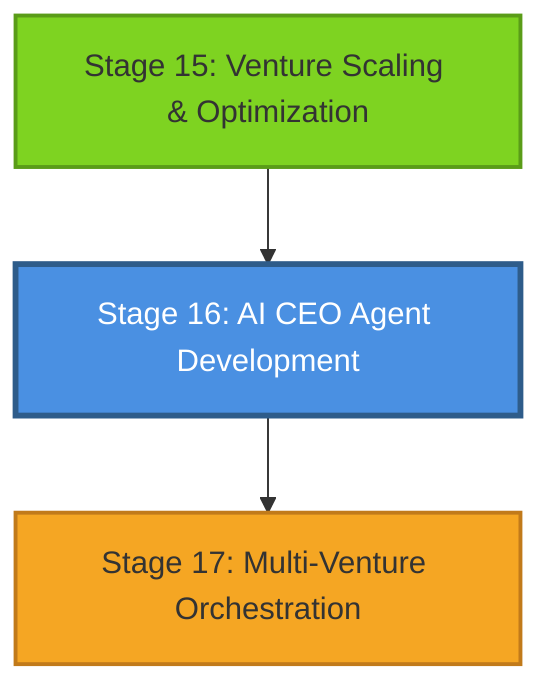

# Stage 16 Dependency Map & Workflow Position

## Visual Dependency Graph

Evidence: EHG_Engineer@6ef8cf4:docs/workflow/stages.yaml:693 "depends_on: - 15"
Evidence: EHG_Engineer@6ef8cf4:docs/workflow/critique/stage-16.md:59 "Downstream Impact: Stages 17"

## Workflow Position Analysis

### Upstream Dependencies

**Stage 15: Venture Scaling & Optimization**
- **Relationship**: Direct prerequisite
- **Critical Inputs Provided**:
  - Business strategy (validated and proven at scale)
  - Decision framework (refined through optimization cycles)
  - KPIs (established and measured)
- **Dependency Type**: Sequential (must complete before S16)
- **Handoff Requirements**:
  - Strategy documentation complete
  - KPI baselines established
  - Optimization results validated

Evidence: EHG_Engineer@6ef8cf4:docs/workflow/critique/stage-16.md:58 "Upstream Dependencies: 15"
Evidence: EHG_Engineer@6ef8cf4:docs/workflow/stages.yaml:695-697 "Business strategy, Decision framework, KPIs"

### Downstream Impact

**Stage 17: Multi-Venture Orchestration**
- **Relationship**: Enabled by Stage 16
- **Critical Outputs Required**:
  - AI CEO configuration (operational)
  - Decision models (trained and validated)
  - Automation rules (deployed and tested)
- **Impact Scope**: Stage 17 requires functional AI CEO for orchestration
- **Blocking Risk**: High - Stage 17 cannot proceed without AI CEO deployment

Evidence: EHG_Engineer@6ef8cf4:docs/workflow/critique/stage-16.md:59 "Downstream Impact: Stages 17"
Evidence: EHG_Engineer@6ef8cf4:docs/workflow/stages.yaml:699-701 "AI CEO configuration, Decision models, Automa"

### Critical Path Analysis

**Critical Path Status**: No
**Rationale**: Stage 16 is not on the critical path, allowing for flexible scheduling and iterative development of AI capabilities.

**Implications**:
- Schedule flexibility permitted
- Can be parallelized with non-dependent stages
- Lower time pressure allows for thorough validation
- Quality focus over speed optimization

Evidence: EHG_Engineer@6ef8cf4:docs/workflow/critique/stage-16.md:60 "Critical Path: No"

### Parallel Execution Opportunities

While Stage 16 is not on the critical path, it has limited parallelization opportunities due to:
- Sequential dependency on Stage 15 completion
- Single downstream consumer (Stage 17)
- AI agent resource constraints (EVA ownership)

**Potential Parallel Activities**:
- Documentation can begin during Stage 15
- Training data preparation can overlap with Stage 15 optimization
- Testing infrastructure can be set up in advance

## Substage Flow

Evidence: EHG_Engineer@6ef8cf4:docs/workflow/stages.yaml:714-732 "16.1 Agent Configuration, 16.2 Model Training"

### Substage 16.1: Agent Configuration

**Purpose**: Define AI CEO personality, decision frameworks, and operational constraints.

**Done When**:
- Personality defined (behavioral parameters, decision styles)
- Decision framework set (rules, thresholds, escalation paths)
- Constraints configured (safety limits, approval requirements)

Evidence: EHG_Engineer@6ef8cf4:docs/workflow/stages.yaml:718-720 "Personality defined, Decision framework set"

### Substage 16.2: Model Training

**Purpose**: Process historical data and train decision-making models.

**Done When**:
- Historical data processed (cleaned, normalized, validated)
- Decision models trained (algorithms selected, trained, tuned)
- Validation complete (accuracy thresholds met, bias checked)

Evidence: EHG_Engineer@6ef8cf4:docs/workflow/stages.yaml:724-726 "Historical data processed, Decision models tr"

### Substage 16.3: Integration & Testing

**Purpose**: Integrate AI CEO with existing systems and verify failsafes.

**Done When**:
- Systems integrated (APIs connected, data flows established)
- Testing complete (unit, integration, E2E tests passed)
- Failsafes verified (safety mechanisms tested, alerts configured)

Evidence: EHG_Engineer@6ef8cf4:docs/workflow/stages.yaml:730-732 "Systems integrated, Testing complete, Failsaf"

## Stage Sequencing Rules

### Entry Requirements (Must Be Met)

1. **Strategy Defined**: Complete business strategy from Stage 15
2. **KPIs Set**: Measurable KPIs established and baselined

Evidence: EHG_Engineer@6ef8cf4:docs/workflow/stages.yaml:708-709 "Strategy defined, KPIs set"

### Exit Requirements (Must Achieve)

1. **AI CEO Deployed**: Production deployment complete
2. **Decision Models Trained**: Models validated and operational
3. **Oversight Configured**: Monitoring and control systems active

Evidence: EHG_Engineer@6ef8cf4:docs/workflow/stages.yaml:711-713 "AI CEO deployed, Decision models trained, Ove"

### Handoff Protocol

**From Stage 15**:
- Artifact: Business strategy document
- Artifact: Decision framework specification
- Artifact: KPI baseline report

**To Stage 17**:
- Artifact: AI CEO configuration file
- Artifact: Trained decision models (versioned)
- Artifact: Automation rules documentation
- Artifact: Failsafe verification report

---

<!-- Generated by Claude Code Phase 7 | EHG_Engineer@6ef8cf4 | 2025-11-05 -->
