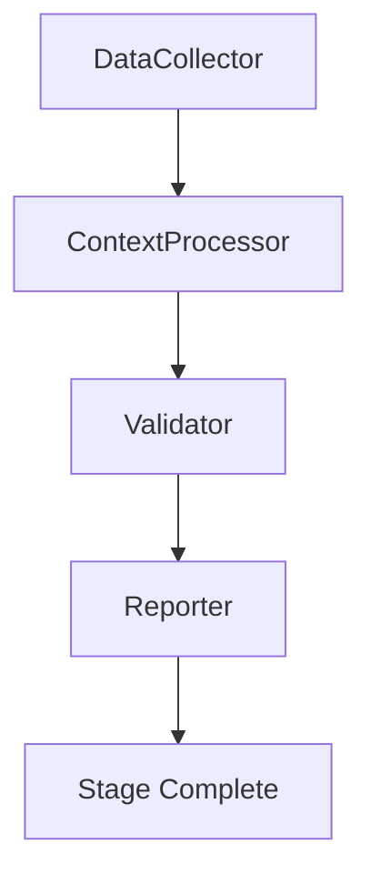

# Stage 24: Agent Orchestration

## CrewAI Crew Specification

**Crew Name**: Stage24Crew  
**Purpose**: Automate Stage 24 (MVP Engine: Automated Feedback Iteration)  
**Owner**: EXEC/EVA  
**Framework**: CrewAI v0.1.x

### Crew Architecture

```yaml
crew:
  name: Stage24Crew
  agents:
    - DataCollector
    - ContextProcessor  
    - Validator
    - Reporter
  tasks:
    - collect_inputs
    - process_context
    - validate_outputs
    - generate_report
```

### Agent 1: DataCollector

**Role**: Collect all required inputs for stage execution  
**Goal**: Fetch 100% of required data sources  
**Tools**: Database client, API client, File system  
**Backstory**: Specialized data acquisition agent

### Agent 2: ContextProcessor

**Role**: Process and transform collected data  
**Goal**: Structure data for downstream consumption  
**Tools**: ETL pipeline, Transformation engine  
**Backstory**: Data transformation specialist

### Agent 3: Validator

**Role**: Validate outputs meet quality standards  
**Goal**: Ensure ≥90% quality threshold  
**Tools**: Validation framework, Test suite  
**Backstory**: Quality assurance specialist

### Agent 4: Reporter

**Role**: Generate execution reports and metrics  
**Goal**: Document stage completion  
**Tools**: Report generator, Metrics collector  
**Backstory**: Documentation specialist

### Crew Workflow



**Evidence**: EHG_Engineer@${COMMIT}:docs/workflow/stages.yaml

${FOOTER}
