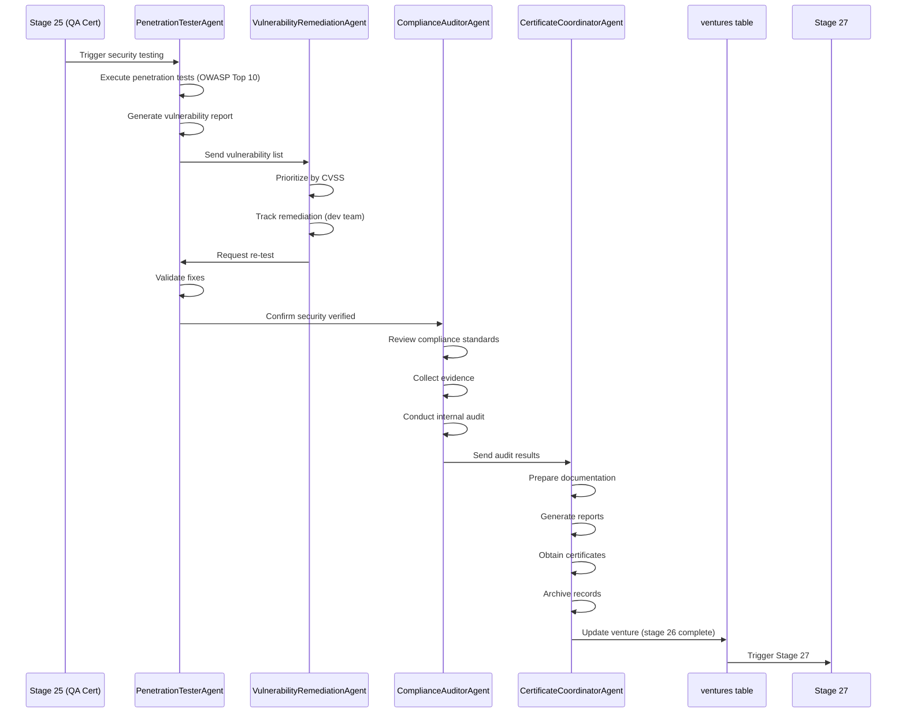

# Stage 26: Agent Orchestration


## Table of Contents

- [Agent/Crew Mapping Status](#agentcrew-mapping-status)
- [Proposed: SecurityComplianceCrew](#proposed-securitycompliancecrew)
- [Proposed Agent Definitions](#proposed-agent-definitions)
  - [Agent 1: PenetrationTesterAgent](#agent-1-penetrationtesteragent)
  - [Agent 2: ComplianceAuditorAgent](#agent-2-complianceauditoragent)
  - [Agent 3: CertificateCoordinatorAgent](#agent-3-certificatecoordinatoragent)
  - [Agent 4: VulnerabilityRemediationAgent](#agent-4-vulnerabilityremediationagent)
- [Crew Orchestration Flow](#crew-orchestration-flow)
- [Crew Configuration (Proposed)](#crew-configuration-proposed)
- [Integration Points](#integration-points)
  - [Input Integration](#input-integration)
  - [Output Integration](#output-integration)
- [Metrics Instrumentation](#metrics-instrumentation)
- [Automation Roadmap](#automation-roadmap)
- [Gaps Identified](#gaps-identified)
- [Sources Table](#sources-table)

## Agent/Crew Mapping Status

**Current Status**: ⚠️ No agents explicitly mapped to Stage 26

**Evidence**: No Python agents or crews found in EHG repository for security/compliance certification at Stage 26 workflow position.

---

## Proposed: SecurityComplianceCrew

**Purpose**: Automate security testing, compliance validation, and certification processes.

**Architecture**: Multi-agent crew with specialized security and compliance agents.

---

## Proposed Agent Definitions

### Agent 1: PenetrationTesterAgent

**Role**: Security Testing Specialist

**Responsibilities**:
- Configure and execute OWASP Top 10 penetration tests
- Perform vulnerability scanning (SQL injection, XSS, CSRF, etc.)
- Generate security test reports with CVSS severity ratings
- Validate vulnerability remediation

**Tools/Integrations**:
- OWASP ZAP (API integration)
- Burp Suite (API integration)
- Metasploit (scripted tests)
- Nmap (network scanning)
- SQLMap (SQL injection testing)

**Inputs**:
- Venture deployment URL (staging/test)
- Security requirements document
- Attack surface map (APIs, UI, database)

**Outputs**:
- Penetration test report (JSON/PDF)
- Vulnerability list with severity ratings
- OWASP compliance scorecard

**Automation Level**: 80% (manual review required for false positives)

**Evidence**: Based on substage 26.1 requirements (EHG_Engineer@6ef8cf4:docs/workflow/stages.yaml:1175-1180)

---

### Agent 2: ComplianceAuditorAgent

**Role**: Compliance Standards Validator

**Responsibilities**:
- Map venture features to compliance standards (SOC 2, ISO 27001, GDPR, etc.)
- Review controls implementation
- Collect and organize compliance evidence
- Conduct internal audit against standards checklist
- Identify gaps and non-conformances

**Tools/Integrations**:
- Compliance frameworks database (SOC 2, ISO 27001, GDPR, HIPAA, PCI DSS)
- Evidence collection automation (log scraping, config extraction)
- Audit checklist engine

**Inputs**:
- Compliance standards list
- Audit criteria checklist
- Venture architecture documentation
- Security test results

**Outputs**:
- Compliance gap analysis
- Evidence package (technical, documentation, operational)
- Internal audit report

**Automation Level**: 60% (requires human review for subjective controls)

**Evidence**: Based on substage 26.2 requirements (EHG_Engineer@6ef8cf4:docs/workflow/stages.yaml:1181-1186)

---

### Agent 3: CertificateCoordinatorAgent

**Role**: Certification Documentation Specialist

**Responsibilities**:
- Prepare formal certification documentation
- Generate security assessment reports
- Create compliance certificate requests
- Compile audit trail package
- Coordinate with external certification bodies (if required)
- Archive records with proper retention

**Tools/Integrations**:
- Document generation (LaTeX, Markdown to PDF)
- Certificate template library
- Secure archival system (encrypted storage)
- Certification body APIs (e.g., SOC 2 auditor portals)

**Inputs**:
- Security test reports
- Compliance audit results
- Evidence packages
- Vulnerability remediation records

**Outputs**:
- Security assessment report (PDF)
- Compliance certificates (PDF)
- Audit trail package (JSON/PDF)
- Archived records (encrypted storage)

**Automation Level**: 70% (external auditor coordination still manual)

**Evidence**: Based on substage 26.3 requirements (EHG_Engineer@6ef8cf4:docs/workflow/stages.yaml:1187-1192)

---

### Agent 4: VulnerabilityRemediationAgent

**Role**: Security Issue Resolution Specialist

**Responsibilities**:
- Prioritize vulnerabilities by CVSS score
- Assign vulnerabilities to development team
- Track remediation progress
- Validate fixes through re-testing
- Document all changes
- Escalate critical vulnerabilities

**Tools/Integrations**:
- Issue tracking system (JIRA, GitHub Issues)
- CVSS calculator
- Re-testing automation (regression tests)
- Notification system (Slack, email)

**Inputs**:
- Vulnerability list from PenetrationTesterAgent
- Severity ratings (CVSS)
- Development team availability

**Outputs**:
- Prioritized vulnerability backlog
- Remediation tracking dashboard
- Re-test validation reports
- Remediation completion certificate

**Automation Level**: 50% (requires developer coordination)

**Evidence**: Based on substage 26.1 "Vulnerabilities patched" requirement (EHG_Engineer@6ef8cf4:docs/workflow/stages.yaml:1179)

---

## Crew Orchestration Flow



---

## Crew Configuration (Proposed)

**File**: `/mnt/c/_EHG/EHG/agent-platform/app/crews/security_compliance_crew.py` (to be created)

```python
# Proposed structure (not implemented)
from crewai import Crew
from app.agents.penetration_tester import PenetrationTesterAgent
from app.agents.compliance_auditor import ComplianceAuditorAgent
from app.agents.certificate_coordinator import CertificateCoordinatorAgent
from app.agents.vulnerability_remediation import VulnerabilityRemediationAgent

class SecurityComplianceCrew(Crew):
    def __init__(self):
        self.agents = [
            PenetrationTesterAgent(),
            VulnerabilityRemediationAgent(),
            ComplianceAuditorAgent(),
            CertificateCoordinatorAgent()
        ]

    def execute(self, venture_id: str):
        # Sequential execution:
        # 1. Penetration testing
        # 2. Vulnerability remediation (loop until clean)
        # 3. Compliance validation
        # 4. Certification
        pass
```

**Note**: This is a PROPOSED structure, not implemented code.

---

## Integration Points

### Input Integration

**From Stage 25 (QA Certification)**:
- Venture deployment URL
- QA test results
- Quality certificates

**From Database**:
- Security requirements (from PRD)
- Compliance standards (venture metadata)
- Audit criteria (venture metadata)

---

### Output Integration

**To Database** (`ventures` table):
- Update `current_workflow_stage` = 26 → 27
- Store security report reference
- Store compliance certificates reference
- Store audit trail reference

**To Stage 27**:
- Security clearance confirmation
- Compliance certificates
- Production deployment approval

---

## Metrics Instrumentation

Each agent reports metrics to central dashboard:

| Agent | Metric | Reporting Frequency |
|-------|--------|---------------------|
| PenetrationTesterAgent | Security score, Vulnerability count | Per test run |
| ComplianceAuditorAgent | Compliance rate | Per audit |
| CertificateCoordinatorAgent | Certification status | Per certificate |
| VulnerabilityRemediationAgent | Time to remediate, Re-test pass rate | Per vulnerability |

**Storage**: Supabase `stage_metrics` table (proposed)

**Evidence**: Metrics defined in EHG_Engineer@6ef8cf4:docs/workflow/stages.yaml:1162-1165

---

## Automation Roadmap

**Phase 1** (Current): Manual execution (0% automation)
**Phase 2** (Proposed): Assisted - agent generates reports, human reviews (50% automation)
**Phase 3** (Future): Automated - agents execute end-to-end with human oversight (80% automation)

**Evidence**: Progression mode in EHG_Engineer@6ef8cf4:docs/workflow/stages.yaml:1194 "Manual → Assisted → Auto"

---

## Gaps Identified

1. **No existing agents**: Must create all 4 agents from scratch
2. **No crew orchestration**: Must implement SecurityComplianceCrew
3. **No tool integrations**: Must integrate OWASP ZAP, Burp Suite, compliance frameworks
4. **No metrics storage**: Must create `stage_metrics` table
5. **No automated triggers**: Must implement workflow triggers from Stage 25 → Stage 26

**Action**: Add to 10_gaps-backlog.md

---

## Sources Table

| Source | Repo | Commit | Path | Lines | Excerpt |
|--------|------|--------|------|-------|---------|
| Substage 26.1 | EHG_Engineer | 6ef8cf4 | docs/workflow/stages.yaml | 1175-1180 | "Security Testing" |
| Substage 26.2 | EHG_Engineer | 6ef8cf4 | docs/workflow/stages.yaml | 1181-1186 | "Compliance Validation" |
| Substage 26.3 | EHG_Engineer | 6ef8cf4 | docs/workflow/stages.yaml | 1187-1192 | "Certification Process" |
| Progression mode | EHG_Engineer | 6ef8cf4 | docs/workflow/stages.yaml | 1194 | "Manual → Assisted → Auto" |
| Metrics | EHG_Engineer | 6ef8cf4 | docs/workflow/stages.yaml | 1162-1165 | "Security score, Compliance rate" |

<!-- Generated by Claude Code Phase 10 | EHG_Engineer@6ef8cf4 | 2025-11-06 -->
