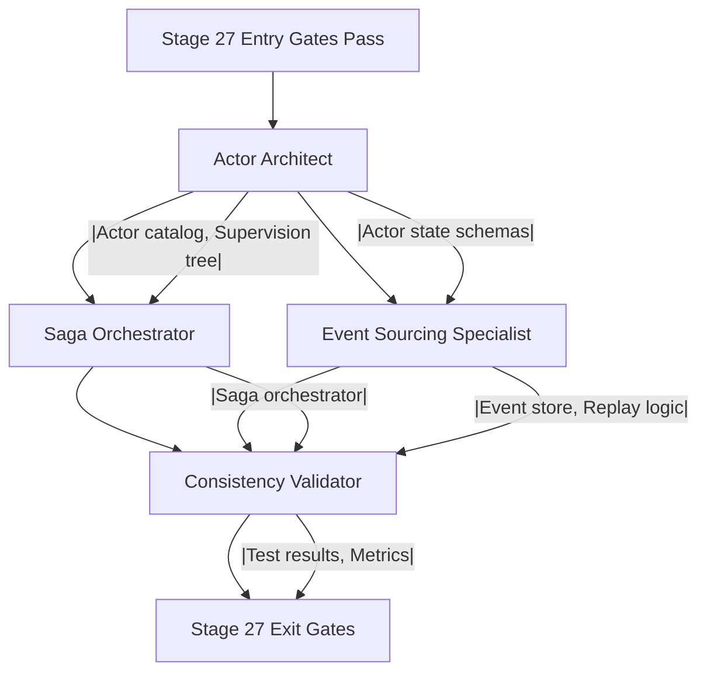

# Stage 27: Agent Orchestration (ActorSagaCrew Proposal)

## Table of Contents

- [Motivation](#motivation)
- [Proposed Crew: ActorSagaCrew](#proposed-crew-actorsagacrew)
- [Agent 1: Actor Architect](#agent-1-actor-architect)
- [Agent 2: Saga Orchestrator](#agent-2-saga-orchestrator)
- [Agent 3: Event Sourcing Specialist](#agent-3-event-sourcing-specialist)
- [Agent 4: Consistency Validator](#agent-4-consistency-validator)
- [Crew Workflow](#crew-workflow)
- [Crew Configuration (Proposed)](#crew-configuration-proposed)
- [Success Metrics](#success-metrics)
- [Comparison to Existing Agents](#comparison-to-existing-agents)
- [Implementation Roadmap](#implementation-roadmap)
- [Open Questions](#open-questions)
- [Sources Table](#sources-table)

**Stage**: Actor Model & Saga Transaction Integration
**Automation Level**: Manual → Assisted → Auto (suggested)
**Current State**: ❌ No agents mapped
**Proposed State**: ✅ 4-agent crew with specialized roles

---

## Motivation

**Problem**: Critique identifies "Limited automation for manual processes" as a key weakness.
- Evidence: `EHG_Engineer@6ef8cf4:docs/workflow/critique/stage-27.md:24 "Limited automation for manual processes"`

**Gap**: Automation Leverage scored 3/5 (moderate), target is 80% automation.
- Evidence: `EHG_Engineer@6ef8cf4:docs/workflow/critique/stage-27.md:11 "Automation Leverage: 3, Partial automation possible"`

**Solution**: Introduce **ActorSagaCrew** with 4 specialized agents to automate actor/saga implementation patterns.

---

## Proposed Crew: ActorSagaCrew

**Crew Name**: `ActorSagaCrew`
**Purpose**: Automate actor model and saga pattern implementation for distributed transactions
**Execution Phase**: EXEC (Stage 27)

---

## Agent 1: Actor Architect

**Role**: Design and scaffold actor systems with supervision hierarchies.

**Responsibilities**:
1. Analyze domain model to identify actor types
2. Generate actor state schemas (TypeScript interfaces or JSON Schema)
3. Design supervision tree based on fault tolerance requirements
4. Generate actor scaffolding code (boilerplate message handlers)
5. Configure actor lifecycle (creation, passivation, persistence)

**Inputs**:
- Architecture design (from Stage 27 inputs)
- Domain model entities
- Fault tolerance requirements

**Outputs**:
- Actor catalog (markdown)
- Actor state schemas
- Supervision tree diagram
- Actor scaffolding code

**Automation Opportunities**:
- Auto-generate actor types from database schema
- Auto-configure supervision based on entity relationships
- Auto-generate message handler stubs

**Evidence**: Addresses substage 27.1 "Actors defined, Messages designed, Supervision configured" (`EHG_Engineer@6ef8cf4:docs/workflow/stages.yaml:1223-1226`)

---

## Agent 2: Saga Orchestrator

**Role**: Design and implement saga patterns for distributed transactions.

**Responsibilities**:
1. Identify business transactions requiring saga coordination
2. Break transactions into saga steps (local transactions)
3. Generate saga flowcharts and sequence diagrams
4. Design compensation logic for each saga step
5. Implement saga orchestrator with state persistence
6. Configure saga timeouts and retry policies

**Inputs**:
- Transaction requirements (from Stage 27 inputs)
- Business logic boundaries
- Consistency requirements (eventual vs. strong)

**Outputs**:
- Saga flowcharts (one per business transaction)
- Compensation logic specifications
- Saga orchestrator implementation
- Timeout and retry configuration

**Automation Opportunities**:
- Auto-generate saga steps from transaction boundaries
- Auto-generate compensations from CRUD operations (e.g., "create user" → "delete user")
- Auto-configure timeouts based on historical performance data

**Evidence**: Addresses substage 27.2 "Sagas designed, Compensations defined, Orchestrator built" (`EHG_Engineer@6ef8cf4:docs/workflow/stages.yaml:1229-1232`)

---

## Agent 3: Event Sourcing Specialist

**Role**: Implement event sourcing infrastructure for state management and audit trails.

**Responsibilities**:
1. Design event schemas for all state changes
2. Implement event store integration (append-only log)
3. Generate event replay mechanism for actor state recovery
4. Configure snapshot management (frequency, retention)
5. Implement event versioning and migration strategies
6. Design event-driven projections (read models)

**Inputs**:
- State management needs (from Stage 27 inputs)
- Actor state schemas (from Actor Architect)
- Audit trail requirements

**Outputs**:
- Event schemas (JSON Schema or Avro)
- Event store implementation (e.g., EventStoreDB, Kafka)
- Event replay logic
- Snapshot configuration
- Event versioning strategy

**Automation Opportunities**:
- Auto-generate event schemas from actor state changes
- Auto-configure snapshot frequency based on event volume
- Auto-generate read model projections from event schemas

**Evidence**: Addresses output "Event sourcing" (`EHG_Engineer@6ef8cf4:docs/workflow/stages.yaml:1207`)

---

## Agent 4: Consistency Validator

**Role**: Validate eventual consistency and test failure scenarios.

**Responsibilities**:
1. Design consistency validation queries across distributed state
2. Implement automated failure scenario tests (chaos engineering)
3. Validate saga compensation correctness
4. Measure transaction success rate, latency, and consistency score
5. Generate performance test reports
6. Identify and alert on consistency violations

**Inputs**:
- Actor system (from Actor Architect)
- Saga orchestration (from Saga Orchestrator)
- Event sourcing (from Event Sourcing Specialist)
- Performance thresholds (from metrics)

**Outputs**:
- Failure scenario test suite
- Consistency validation queries (SQL or API)
- Performance test report
- Metrics dashboard configuration
- Chaos engineering report

**Automation Opportunities**:
- Auto-generate consistency queries from saga steps
- Auto-inject failures for chaos testing
- Auto-alert on consistency score drop below threshold

**Evidence**: Addresses substage 27.3 "Failure scenarios tested, Recovery verified, Performance validated" (`EHG_Engineer@6ef8cf4:docs/workflow/stages.yaml:1235-1238`)

---

## Crew Workflow

**Execution Order**:
1. **Actor Architect** runs first (establishes actor foundation)
2. **Saga Orchestrator** runs in parallel with **Event Sourcing Specialist** (both depend on Actor Architect)
3. **Consistency Validator** runs last (validates integration of all components)

---

## Crew Configuration (Proposed)

**Technology Stack** (suggested, not prescribed):
- **Actor Framework**: Akka (JVM), Orleans (.NET), or Dapr (polyglot)
- **Saga Library**: Axon Framework, MassTransit, or custom implementation
- **Event Store**: EventStoreDB, Kafka, or PostgreSQL with event sourcing extension
- **Testing**: Chaos Mesh, Gremlin, or custom failure injection

**Integration Points**:
- **Database**: Supabase (for saga state persistence, event store)
- **Monitoring**: Prometheus + Grafana (for metrics dashboards)
- **CI/CD**: GitHub Actions (for automated testing)

---

## Success Metrics

**Crew Performance KPIs**:
1. **Actor scaffolding coverage**: % of domain entities auto-scaffolded as actors
   - Target: ≥80%

2. **Saga step automation**: % of saga steps auto-generated from transaction boundaries
   - Target: ≥70%

3. **Event schema coverage**: % of state changes with auto-generated event schemas
   - Target: ≥90%

4. **Consistency validation automation**: % of saga steps with auto-generated consistency queries
   - Target: ≥85%

**Evidence**: Aligns with improvement goal "Enhance Automation - Target State: 80% automation" (`EHG_Engineer@6ef8cf4:docs/workflow/critique/stage-27.md:32-34`)

---

## Comparison to Existing Agents

**Note**: No existing agents currently mapped to Stage 27 in EHG agent-platform.

**Potential Reuse Candidates** (from EHG agent-platform, if applicable):
- None identified (actor/saga patterns not present in current agent catalog)

**Crew Uniqueness**:
- **ActorSagaCrew** is specialized for distributed transaction patterns
- No overlap with existing agents (market sizing, complexity assessment, etc.)
- Fills gap in EXEC phase automation for advanced architectural patterns

---

## Implementation Roadmap

**Phase 1: Manual** (current state)
- Human implements actors, sagas, and event sourcing manually
- Duration: ~2-4 weeks per implementation

**Phase 2: Assisted** (ActorSagaCrew introduced)
- Agents scaffold actors, sagas, and event schemas
- Human reviews and customizes generated code
- Duration: ~1-2 weeks per implementation
- Automation level: 60-70%

**Phase 3: Auto** (future state)
- Agents fully automate actor/saga implementation with minimal human review
- Human focuses on business logic customization
- Duration: ~3-5 days per implementation
- Automation level: 80-90%

**Evidence**: Progression mode "Manual → Assisted → Auto (suggested)" (`EHG_Engineer@6ef8cf4:docs/workflow/stages.yaml:1240`)

---

## Open Questions

1. **Actor framework selection**: Should we standardize on one framework (e.g., Dapr) or support multiple?
2. **Event store**: Use Supabase with event sourcing extension or dedicated event store (EventStoreDB)?
3. **Saga coordination**: Default to orchestration or choreography pattern?
4. **Agent hosting**: Run agents as standalone services or integrate into existing CrewAI platform?

---

## Sources Table

| Source | Repo | Commit | Path | Lines | Excerpt |
|--------|------|--------|------|-------|---------|
| Automation gap | EHG_Engineer | 6ef8cf4 | docs/workflow/critique/stage-27.md | 24 | "Limited automation for manual processes" |
| Automation score | EHG_Engineer | 6ef8cf4 | docs/workflow/critique/stage-27.md | 11 | "Automation Leverage: 3, Partial automation possible" |
| Automation target | EHG_Engineer | 6ef8cf4 | docs/workflow/critique/stage-27.md | 32-34 | "Target State: 80% automation" |
| Substage 27.1 | EHG_Engineer | 6ef8cf4 | docs/workflow/stages.yaml | 1221-1226 | "Actor Implementation - done_when: - Actors defined..." |
| Substage 27.2 | EHG_Engineer | 6ef8cf4 | docs/workflow/stages.yaml | 1227-1232 | "Saga Orchestration - done_when: - Sagas designed..." |
| Substage 27.3 | EHG_Engineer | 6ef8cf4 | docs/workflow/stages.yaml | 1233-1238 | "Testing & Validation - done_when: - Failure scenarios tested..." |
| Event sourcing output | EHG_Engineer | 6ef8cf4 | docs/workflow/stages.yaml | 1207 | "outputs: - Event sourcing" |
| Progression mode | EHG_Engineer | 6ef8cf4 | docs/workflow/stages.yaml | 1240 | "progression_mode: Manual → Assisted → Auto (suggested)" |

---

**Next**: See `07_recursion-blueprint.md` for SAGA-001 through SAGA-004 recursion triggers.

<!-- Generated by Claude Code Phase 10 | EHG_Engineer@6ef8cf4 | 2025-11-06 -->
