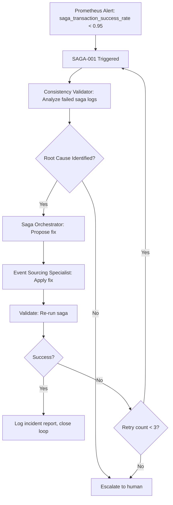

# Stage 27: Recursion Blueprint (SAGA Triggers)

**Stage**: Actor Model & Saga Transaction Integration
**Recursion Readiness**: 2/5 (Generic recursion support pending)
**Proposed Triggers**: 4 (SAGA-001 through SAGA-004)

---

## Current State

**Recursion Readiness Score**: 2/5 (Below Average)
- Evidence: `EHG_Engineer@6ef8cf4:docs/workflow/critique/stage-27.md:15 "Recursion Readiness: 2, Generic recursion support pending"`

**Gap**: No specific recursion triggers defined in stages.yaml or critique.

**Opportunity**: Actor and saga failures provide natural recursion triggers for automated remediation.

---

## Recursion Trigger Philosophy

**Actor/Saga Context**:
- Distributed systems fail frequently and unpredictably
- Failures manifest as: transaction timeouts, compensation failures, consistency violations, supervision escalations
- Manual debugging is time-consuming and error-prone
- Automated recursion can diagnose and remediate common failure patterns

**Recursion Goal**: Detect failures → Diagnose root cause → Propose fix → Execute remediation → Validate recovery

---

## Proposed Recursion Triggers

### SAGA-001: Transaction Failure Detected

**Trigger Condition**:
- Transaction success rate drops below threshold (e.g., <95% over 5-minute window)
- OR: >10 consecutive saga compensations triggered

**Detection Mechanism**:
- Prometheus alert on metric `saga_transaction_success_rate{stage="27"} < 0.95`
- OR: Event store query for compensation event frequency

**Recursion Action**:
1. **Diagnose**: Consistency Validator agent analyzes failed saga logs
2. **Identify**: Pinpoint failing saga step (e.g., "payment-service timeout")
3. **Propose**: Suggest remediation (e.g., increase timeout, add retry logic, scale service)
4. **Execute**: ActorSagaCrew applies fix (update saga configuration, deploy changes)
5. **Validate**: Re-run saga with same inputs, confirm success

**Output**:
- Incident report (root cause, remediation applied, validation result)
- Updated saga configuration (persisted to database)

**Recursion Boundary**: Trigger SAGA-001 from Stage 27 → 27 (self-recursion) up to 3 times per incident.

**Evidence**: Aligns with metric "Transaction success rate" (`EHG_Engineer@6ef8cf4:docs/workflow/stages.yaml:1209`)

---

### SAGA-002: Compensation Required

**Trigger Condition**:
- Saga compensation triggered but compensation step fails
- OR: Compensation retry limit exceeded (e.g., 3 retries)

**Detection Mechanism**:
- Event store query for event type `saga_compensation_failed`
- OR: Dead letter queue accumulation for compensating transactions

**Recursion Action**:
1. **Diagnose**: Saga Orchestrator agent reviews compensation logic
2. **Identify**: Determine why compensation failed (e.g., "delete-order API returned 404")
3. **Propose**: Suggest fix (e.g., make compensation idempotent, add existence check)
4. **Execute**: Event Sourcing Specialist updates compensation event handler
5. **Validate**: Replay failed saga from event log, confirm compensation succeeds

**Output**:
- Compensation failure analysis report
- Updated compensation logic (code commit)
- Validation test results

**Recursion Boundary**: Trigger SAGA-002 from Stage 27 → 27 (self-recursion) up to 5 times per compensation type.

**Evidence**: Aligns with substage 27.2 "Compensations defined" and improvement "Add Rollback Procedures" (`EHG_Engineer@6ef8cf4:docs/workflow/stages.yaml:1230` and `docs/workflow/critique/stage-27.md:47-50`)

---

### SAGA-003: Actor Supervision Failure

**Trigger Condition**:
- Actor restart limit exceeded (e.g., >5 restarts in 1 minute)
- OR: Supervision escalation reaches root supervisor
- OR: Dead letter queue accumulation for specific actor type

**Detection Mechanism**:
- Actor framework telemetry (e.g., Akka metrics, Dapr dashboard)
- Prometheus alert on metric `actor_restarts_total{type="OrderActor"} > 5`

**Recursion Action**:
1. **Diagnose**: Actor Architect agent analyzes actor crash logs and supervision tree
2. **Identify**: Pinpoint root cause (e.g., "OrderActor crashes on null inventory check")
3. **Propose**: Suggest fix (e.g., add null check, improve error handling, adjust supervision strategy)
4. **Execute**: Actor Architect updates actor implementation and supervision config
5. **Validate**: Inject same failure scenario, confirm actor recovers gracefully

**Output**:
- Actor failure root cause analysis
- Updated actor implementation (code commit)
- Supervision strategy adjustment (config update)

**Recursion Boundary**: Trigger SAGA-003 from Stage 27 → 27 (self-recursion) up to 3 times per actor type.

**Evidence**: Aligns with substage 27.1 "Supervision configured" and substage 27.3 "Failure scenarios tested" (`EHG_Engineer@6ef8cf4:docs/workflow/stages.yaml:1226` and `1236`)

---

### SAGA-004: Consistency Verified (Success Path)

**Trigger Condition**:
- Consistency score ≥99.9% for 24 hours
- AND: All failure scenario tests pass
- AND: Performance metrics within thresholds

**Detection Mechanism**:
- Prometheus query for sustained consistency score
- CI/CD pipeline success for failure scenario test suite

**Recursion Action**:
1. **Celebrate**: Log successful Stage 27 completion
2. **Optimize**: Consistency Validator proposes performance optimizations (e.g., reduce snapshot frequency, tune saga timeouts)
3. **Document**: Generate Stage 27 completion report with key metrics
4. **Advance**: Automatically trigger Stage 28 (Caching & Performance Optimization)

**Output**:
- Stage 27 completion report
- Performance optimization recommendations
- Automatic progression to Stage 28

**Recursion Boundary**: Trigger SAGA-004 from Stage 27 → 28 (forward progression) once.

**Evidence**: Aligns with exit gate "Consistency verified" and metric "Consistency score" (`EHG_Engineer@6ef8cf4:docs/workflow/stages.yaml:1219` and `1211`)

---

## Recursion Trigger Matrix

| Trigger ID | Condition | Detection | Action | Boundary | Priority |
|------------|-----------|-----------|--------|----------|----------|
| SAGA-001 | Transaction success rate <95% | Prometheus alert | Diagnose & remediate saga failures | 27→27 (3x) | P0 |
| SAGA-002 | Compensation failure/retry limit | Event store query | Fix compensation logic | 27→27 (5x) | P0 |
| SAGA-003 | Actor restart limit exceeded | Actor framework metrics | Fix actor implementation | 27→27 (3x) | P1 |
| SAGA-004 | Consistency ≥99.9% for 24h | Prometheus query | Optimize & advance to Stage 28 | 27→28 (1x) | P2 |

---

## Integration with ActorSagaCrew

**Agent Responsibilities**:

| Agent | SAGA-001 | SAGA-002 | SAGA-003 | SAGA-004 |
|-------|----------|----------|----------|----------|
| Actor Architect | - | - | ✅ Lead | ✅ Support |
| Saga Orchestrator | ✅ Lead | ✅ Lead | - | ✅ Support |
| Event Sourcing Specialist | ✅ Support | ✅ Support | ✅ Support | - |
| Consistency Validator | ✅ Support | ✅ Support | ✅ Support | ✅ Lead |

**Lead**: Agent drives diagnosis and remediation
**Support**: Agent provides data or applies fixes

---

## Recursion Flow Example (SAGA-001)

---

## Metrics for Recursion Effectiveness

**Recursion KPIs**:
1. **Mean Time to Detect (MTTD)**: Time from failure to trigger detection
   - Target: <5 minutes

2. **Mean Time to Diagnose (MTTD)**: Time from detection to root cause identified
   - Target: <10 minutes

3. **Mean Time to Remediate (MTTR)**: Time from diagnosis to fix applied
   - Target: <30 minutes

4. **Recursion Success Rate**: % of triggers resolved without human escalation
   - Target: ≥80%

5. **False Positive Rate**: % of triggers that did not require remediation
   - Target: <10%

---

## Open Questions

1. **Alert thresholds**: Should transaction success rate threshold be configurable per deployment?
2. **Human escalation**: What conditions trigger human-in-the-loop (e.g., after 3 recursions fail)?
3. **Audit trail**: Should all recursion actions be logged to event store for compliance?
4. **Cross-stage recursion**: Should SAGA-003 (actor failure) trigger recursion back to Stage 26 (Security Validation) if security misconfiguration suspected?

---

## Sources Table

| Source | Repo | Commit | Path | Lines | Excerpt |
|--------|------|--------|------|-------|---------|
| Recursion readiness score | EHG_Engineer | 6ef8cf4 | docs/workflow/critique/stage-27.md | 15 | "Recursion Readiness: 2, Generic recursion support pending" |
| Transaction success metric | EHG_Engineer | 6ef8cf4 | docs/workflow/stages.yaml | 1209 | "metrics: - Transaction success rate" |
| Compensation substage | EHG_Engineer | 6ef8cf4 | docs/workflow/stages.yaml | 1230 | "done_when: - Compensations defined" |
| Rollback improvement | EHG_Engineer | 6ef8cf4 | docs/workflow/critique/stage-27.md | 47-50 | "Add Rollback Procedures - Required: Clear rollback triggers" |
| Supervision substage | EHG_Engineer | 6ef8cf4 | docs/workflow/stages.yaml | 1226 | "done_when: - Supervision configured" |
| Failure scenarios substage | EHG_Engineer | 6ef8cf4 | docs/workflow/stages.yaml | 1236 | "done_when: - Failure scenarios tested" |
| Consistency exit gate | EHG_Engineer | 6ef8cf4 | docs/workflow/stages.yaml | 1219 | "exit: - Consistency verified" |
| Consistency metric | EHG_Engineer | 6ef8cf4 | docs/workflow/stages.yaml | 1211 | "metrics: - Consistency score" |

---

**Next**: See `08_configurability-matrix.md` for tunable parameters (timeouts, retry policies, thresholds).

<!-- Generated by Claude Code Phase 10 | EHG_Engineer@6ef8cf4 | 2025-11-06 -->
