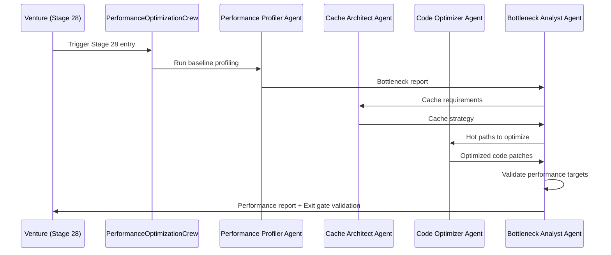

# Stage 28: Agent Orchestration

## Python CrewAI Agents (EHG App)

**Status**: ⚠️ No agents explicitly mapped to Stage 28 in available documentation

### Agent Scan Results

Scanned `/mnt/c/_EHG/ehg/agent-platform/app/agents/` and `/app/crews/`:

**Agents Found** (15+):
- base_agent.py
- ceo_agent.py
- complexity_assessment.py
- market_sizing.py
- tech_feasibility.py
- regulatory_risk.py

**Crews Found** (15+):
- quick_validation_crew.py
- deep_research_crew.py
- board_directors_crew.py

**Stage 28 Mapping**: None explicitly documented in stages.yaml or critiques

**Evidence**: EHG@0d80dac:agent-platform/app/agents/ (directory scan), EHG@0d80dac:agent-platform/app/crews/ (directory scan)

---

## Proposed Agent Orchestration: PerformanceOptimizationCrew

**Recommendation**: Create specialized crew for Stage 28 performance optimization tasks.

### Crew Structure

**Crew Name**: `PerformanceOptimizationCrew`
**Purpose**: Automate performance analysis, caching strategy, and code optimization
**Trigger**: Venture advances to Stage 28 OR performance degradation detected

---

## Agent Definitions (4 Proposed Agents)

### 1. Performance Profiler Agent

**Role**: System Performance Analyst
**Goal**: Identify bottlenecks and establish performance baselines

**Responsibilities**:
- Run profiling tools (Node.js profiler, Chrome DevTools, database EXPLAIN)
- Analyze hot paths and slow queries
- Generate bottleneck analysis report with ranked issues

**Tools**:
- Database query analyzer (pg_stat_statements)
- APM integration (e.g., New Relic, Datadog)
- Lighthouse/WebPageTest for frontend metrics

**Outputs**:
- Performance baseline report (JSON)
- Bottleneck ranking (CSV)
- Optimization targets (YAML)

**Substage Mapping**: 28.1 (Performance Analysis)

---

### 2. Cache Architect Agent

**Role**: Caching Strategy Designer
**Goal**: Design optimal cache layers and invalidation policies

**Responsibilities**:
- Analyze data access patterns to identify cacheable queries
- Select appropriate cache stores (Redis, CDN, browser cache)
- Define TTL and invalidation strategies per data type

**Tools**:
- Cache hit rate calculator
- Data access pattern analyzer
- Cache key namespace generator

**Outputs**:
- Cache architecture document (Markdown)
- Cache configuration files (YAML/JSON)
- Invalidation policy rules (JSON)

**Substage Mapping**: 28.2 (Cache Implementation)

---

### 3. Code Optimizer Agent

**Role**: Algorithm & Code Efficiency Expert
**Goal**: Refactor hot paths and improve algorithmic complexity

**Responsibilities**:
- Analyze code complexity (O(n), O(n²), etc.)
- Suggest algorithm improvements and data structure changes
- Refactor hot paths identified by Profiler Agent

**Tools**:
- AST (Abstract Syntax Tree) analyzer
- Complexity calculator (cyclomatic, computational)
- Code pattern matcher (anti-patterns detector)

**Outputs**:
- Optimized code patches (git diff)
- Algorithm improvement report (Markdown)
- Complexity reduction metrics (JSON)

**Substage Mapping**: 28.3 (Code Optimization)

---

### 4. Bottleneck Analyst Agent

**Role**: Performance Coordinator & Validator
**Goal**: Orchestrate optimization workflow and validate improvements

**Responsibilities**:
- Coordinate Profiler, Cache Architect, and Code Optimizer agents
- Validate that performance targets are met
- Generate final performance report

**Tools**:
- Load testing framework (k6, JMeter)
- Metrics aggregator (Prometheus queries)
- Before/after comparison engine

**Outputs**:
- Performance report (before/after metrics)
- Exit gate validation (Pass/Fail)
- Recommendations for future optimizations

**Substage Mapping**: All (28.1-28.3 coordination)

---

## Crew Execution Flow

---

## Integration Points

### Input Sources (From Stage 27)
1. **Performance metrics**: Collected during Stage 27 (Actor-Based Saga Orchestration)
2. **Bottleneck analysis**: Identified slow sagas or actor message queues
3. **Cache requirements**: Determined from saga state persistence patterns

**Evidence**: EHG_Engineer@6ef8cf4:docs/workflow/stages.yaml:1246-1249 "inputs"

### Output Destinations (To Stage 29)
1. **Optimized code**: Committed to repository for Final Polish stage
2. **Cache layer**: Operational and monitored
3. **Performance report**: Baseline for production readiness

**Evidence**: EHG_Engineer@6ef8cf4:docs/workflow/stages.yaml:1250-1253 "outputs"

---

## Governance Handoffs (Node.js Sub-Agents)

**Status**: ⚠️ No handoffs explicitly defined for Stage 28

**Potential Integration**:
- If performance optimization triggers a Strategic Directive (e.g., SD-PERFORMANCE-OPTIMIZATION-001), governance workflow activates
- Handoff created when performance targets cannot be met within substage scope

**Note**: This is PROPOSED integration based on governance patterns, not confirmed implementation.

---

## Automation Roadmap

**Current State**: Manual (progression_mode: Manual)
**Target State**: Auto (progression_mode: Auto)

**Phased Automation**:

### Phase 1: Manual → Assisted
- **Goal**: 50% automation
- **Actions**:
  - Deploy Profiler Agent to generate bottleneck reports
  - Cache Architect suggests cache strategy (human approves)
- **Timeline**: Q2 2025

### Phase 2: Assisted → Auto
- **Goal**: 80% automation
- **Actions**:
  - Full crew deployment with auto-approval for low-risk optimizations
  - Automated load testing and rollback triggers
- **Timeline**: Q4 2025

**Evidence**: EHG_Engineer@6ef8cf4:docs/workflow/stages.yaml:1286 "progression_mode: Manual → Assisted → Auto"

---

## Gap Analysis

**Missing Components**:
1. ❌ No agent files exist in `/agent-platform/app/agents/` for performance optimization
2. ❌ No crew file exists in `/agent-platform/app/crews/` for PerformanceOptimizationCrew
3. ❌ No tool integrations for profiling/caching defined in stages.yaml

**Recommendations**:
1. Create `performance_profiler.py` agent
2. Create `cache_architect.py` agent
3. Create `code_optimizer.py` agent
4. Create `bottleneck_analyst.py` agent
5. Create `performance_optimization_crew.py` crew
6. Integrate with APM tools (New Relic/Datadog) for automatic profiling

**Priority**: Medium (Stage 28 currently manual; automation needed for progression_mode roadmap)

**Documented In**: `10_gaps-backlog.md`

---

## Sources Table

| Source | Repo | Commit | Path | Lines |
|--------|------|--------|------|-------|
| Agent directory scan | EHG | 0d80dac | agent-platform/app/agents/ | N/A |
| Crew directory scan | EHG | 0d80dac | agent-platform/app/crews/ | N/A |
| Substages (agent mapping source) | EHG_Engineer | 6ef8cf4 | docs/workflow/stages.yaml | 1267-1284 |
| Progression mode | EHG_Engineer | 6ef8cf4 | docs/workflow/stages.yaml | 1286 |
| Inputs/outputs (integration points) | EHG_Engineer | 6ef8cf4 | docs/workflow/stages.yaml | 1246-1253 |

<!-- Generated by Claude Code Phase 10 | EHG_Engineer@6ef8cf4 | 2025-11-06 -->
