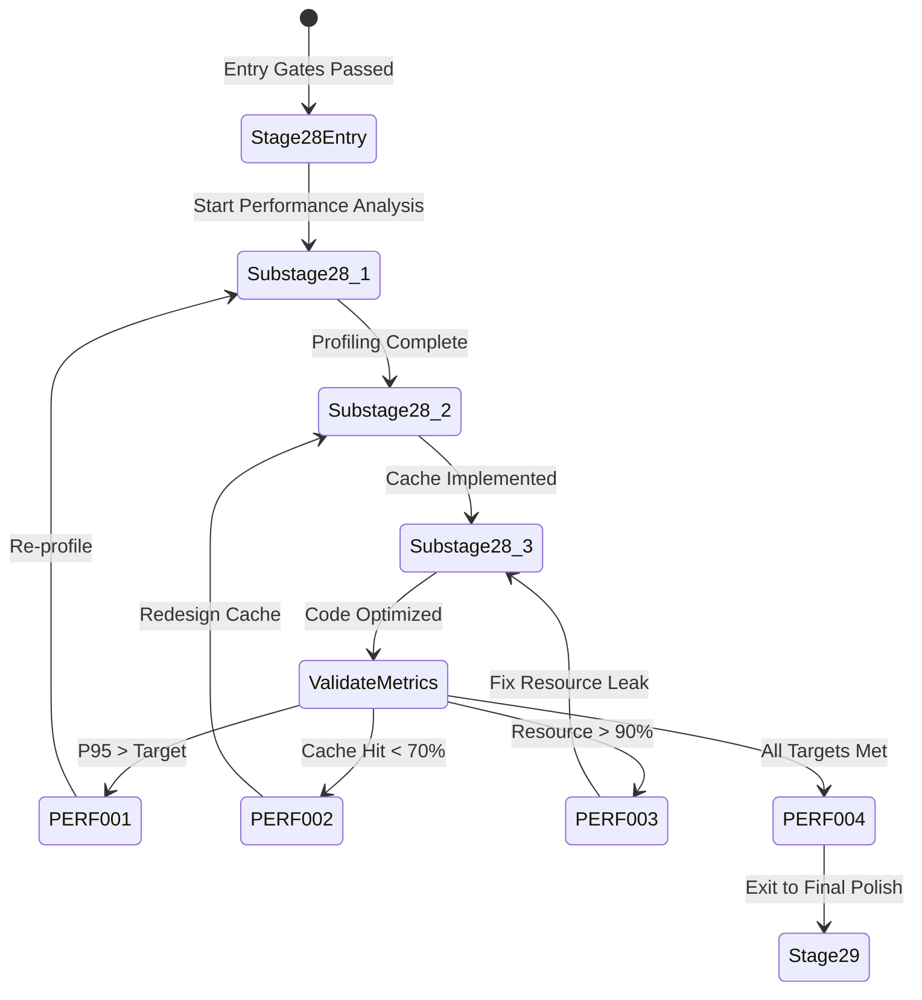

# Stage 28: Recursion Blueprint


## Table of Contents

- [Current Recursion Support](#current-recursion-support)
- [Proposed Recursion Triggers (4 Triggers)](#proposed-recursion-triggers-4-triggers)
  - [Trigger PERF-001: Response Time Threshold Exceeded](#trigger-perf-001-response-time-threshold-exceeded)
  - [Trigger PERF-002: Cache Hit Rate Below Target](#trigger-perf-002-cache-hit-rate-below-target)
  - [Trigger PERF-003: Resource Utilization Critical](#trigger-perf-003-resource-utilization-critical)
  - [Trigger PERF-004: Optimization Targets Met (Exit Trigger)](#trigger-perf-004-optimization-targets-met-exit-trigger)
- [Recursion Flow Diagram](#recursion-flow-diagram)
- [Integration with Governance](#integration-with-governance)
  - [When Recursion Triggers Strategic Directive](#when-recursion-triggers-strategic-directive)
- [Recursion Metrics (Proposed)](#recursion-metrics-proposed)
- [Comparison to Other Stages](#comparison-to-other-stages)
  - [Stage 1 (Draft Idea)](#stage-1-draft-idea)
  - [Stage 28 (Development Excellence)](#stage-28-development-excellence)
  - [Stage 40 (Launch)](#stage-40-launch)
- [Implementation Roadmap](#implementation-roadmap)
- [Gap Analysis](#gap-analysis)
- [Sources Table](#sources-table)

## Current Recursion Support

**Status**: ⚠️ Generic recursion support pending (score 2/5)

**Evidence**: EHG_Engineer@6ef8cf4:docs/workflow/critique/stage-28.md:15 "Recursion Readiness: 2"

**Gap**: No explicit recursion triggers defined in stages.yaml for Stage 28

---

## Proposed Recursion Triggers (4 Triggers)

### Trigger PERF-001: Response Time Threshold Exceeded

**Condition**: P95 response time exceeds target after optimization attempt

**Trigger Logic**:
```sql
SELECT venture_id, current_workflow_stage
FROM ventures v
JOIN performance_metrics pm ON v.id = pm.venture_id
WHERE v.current_workflow_stage = 28
  AND pm.p95_response_time_ms > pm.target_response_time_ms
  AND pm.measured_at > NOW() - INTERVAL '5 minutes';
```

**Action**: Return to Substage 28.1 (Performance Analysis)

**Rationale**: Performance targets not met; requires re-profiling to identify missed bottlenecks

**Auto/Manual**: Manual (requires human decision on whether to re-optimize or accept degraded performance)

---

### Trigger PERF-002: Cache Hit Rate Below Target

**Condition**: Cache hit rate < 70% for targeted queries after implementation

**Trigger Logic**:
```sql
SELECT venture_id, cache_layer_name, hit_rate_percent
FROM cache_metrics cm
JOIN ventures v ON cm.venture_id = v.id
WHERE v.current_workflow_stage = 28
  AND cm.hit_rate_percent < 70
  AND cm.measured_at > NOW() - INTERVAL '1 hour';
```

**Action**: Return to Substage 28.2 (Cache Implementation)

**Rationale**: Cache strategy ineffective; requires redesign of TTL, cache keys, or invalidation logic

**Auto/Manual**: Assisted (agent suggests cache strategy changes; human approves)

---

### Trigger PERF-003: Resource Utilization Critical

**Condition**: CPU > 90% OR Memory > 95% after optimization

**Trigger Logic**:
```sql
SELECT venture_id, resource_type, utilization_percent
FROM resource_metrics rm
JOIN ventures v ON rm.venture_id = v.id
WHERE v.current_workflow_stage = 28
  AND (rm.utilization_percent > 90 AND rm.resource_type = 'cpu'
       OR rm.utilization_percent > 95 AND rm.resource_type = 'memory')
  AND rm.measured_at > NOW() - INTERVAL '10 minutes';
```

**Action**: Return to Substage 28.3 (Code Optimization)

**Rationale**: Optimization introduced resource leak or inefficiency; requires algorithm review

**Auto/Manual**: Manual (critical issue requires human investigation)

---

### Trigger PERF-004: Optimization Targets Met (Exit Trigger)

**Condition**: All performance targets achieved and exit gates passed

**Trigger Logic**:
```sql
SELECT venture_id
FROM ventures v
WHERE v.current_workflow_stage = 28
  AND EXISTS (
    SELECT 1 FROM performance_metrics pm
    WHERE pm.venture_id = v.id
      AND pm.p95_response_time_ms <= pm.target_response_time_ms
      AND pm.measured_at > NOW() - INTERVAL '5 minutes'
  )
  AND EXISTS (
    SELECT 1 FROM cache_metrics cm
    WHERE cm.venture_id = v.id
      AND cm.hit_rate_percent >= 70
      AND cm.measured_at > NOW() - INTERVAL '1 hour'
  )
  AND EXISTS (
    SELECT 1 FROM resource_metrics rm
    WHERE rm.venture_id = v.id
      AND rm.utilization_percent < 80
      AND rm.measured_at > NOW() - INTERVAL '10 minutes'
  );
```

**Action**: Advance to Stage 29 (Final Polish)

**Rationale**: All exit gates passed; performance optimization complete

**Auto/Manual**: Auto (if all metrics green for 1 hour, auto-advance)

---

## Recursion Flow Diagram



---

## Integration with Governance

### When Recursion Triggers Strategic Directive

**Scenario**: Performance targets cannot be met within substage scope (e.g., architectural bottleneck)

**Trigger**: Manual escalation from Bottleneck Analyst Agent

**Action**:
1. Create Strategic Directive: SD-PERFORMANCE-OPTIMIZATION-001
2. Pause Stage 28 progression
3. Execute governance workflow (LEAD → PLAN → EXEC)
4. Return to Stage 28 after SD completion

**Example SD**:
- **Title**: "Optimize Database Schema for Query Performance"
- **Priority**: Critical
- **Scope**: Add composite indexes, denormalize high-traffic tables
- **Impact**: Unblock Stage 28 exit gates

**Evidence Gap**: Not defined in stages.yaml; proposed based on governance patterns

---

## Recursion Metrics (Proposed)

| Metric | Threshold | Action If Exceeded |
|--------|-----------|-------------------|
| Substage 28.1 retries | > 3 | Escalate to SD (architectural issue) |
| Substage 28.2 retries | > 2 | Review cache tool selection (e.g., Redis vs. Valkey) |
| Substage 28.3 retries | > 3 | Code review required (algorithm fundamental flaw) |
| Total Stage 28 duration | > 2 weeks | Chairman intervention |

**Storage**: Add `recursion_count` column to `ventures` table or `stage_metrics` table

---

## Comparison to Other Stages

### Stage 1 (Draft Idea)
- **Recursion**: None (entry point)
- **Triggers**: 0

### Stage 28 (Development Excellence)
- **Recursion**: Yes (within substages + escalation to SD)
- **Triggers**: 4 (PERF-001 through PERF-004)

### Stage 40 (Launch)
- **Recursion**: None (exit point; failures block launch, not recurse)
- **Triggers**: N/A

**Observation**: Stage 28 recursion is INTERNAL (substage loops) vs. EXTERNAL (cross-stage dependencies)

---

## Implementation Roadmap

**Phase 1: Manual Triggers** (Q1 2025)
- Implement metric collection (performance_metrics, cache_metrics, resource_metrics tables)
- Build Supabase dashboard to visualize thresholds
- Manual recursion triggered by operator

**Phase 2: Assisted Triggers** (Q2 2025)
- Deploy Bottleneck Analyst Agent to detect trigger conditions
- Agent recommends recursion; human approves

**Phase 3: Auto Triggers** (Q4 2025)
- Fully automated recursion for PERF-002 (cache hit rate)
- Auto-advance on PERF-004 (all targets met)

**Evidence**: Aligns with EHG_Engineer@6ef8cf4:docs/workflow/stages.yaml:1286 "progression_mode: Manual → Assisted → Auto"

---

## Gap Analysis

**Missing Components**:
1. ❌ No `performance_metrics` table in database schema
2. ❌ No `cache_metrics` table in database schema
3. ❌ No `resource_metrics` table in database schema
4. ❌ No recursion trigger definitions in stages.yaml
5. ❌ No `recursion_count` column in ventures table

**Recommendations**:
1. Create database migration for metrics tables
2. Integrate APM tool (New Relic/Datadog) to populate metrics
3. Add recursion triggers to stages.yaml YAML definition
4. Implement Bottleneck Analyst Agent to evaluate trigger conditions

**Priority**: Medium (required for automation roadmap)

**Documented In**: `10_gaps-backlog.md`

---

## Sources Table

| Source | Repo | Commit | Path | Lines |
|--------|------|--------|------|-------|
| Recursion Readiness score | EHG_Engineer | 6ef8cf4 | docs/workflow/critique/stage-28.md | 15 |
| Progression mode | EHG_Engineer | 6ef8cf4 | docs/workflow/stages.yaml | 1286 |
| Substages (recursion targets) | EHG_Engineer | 6ef8cf4 | docs/workflow/stages.yaml | 1267-1284 |
| Exit gates (PERF-004 logic) | EHG_Engineer | 6ef8cf4 | docs/workflow/stages.yaml | 1262-1265 |

<!-- Generated by Claude Code Phase 10 | EHG_Engineer@6ef8cf4 | 2025-11-06 -->
