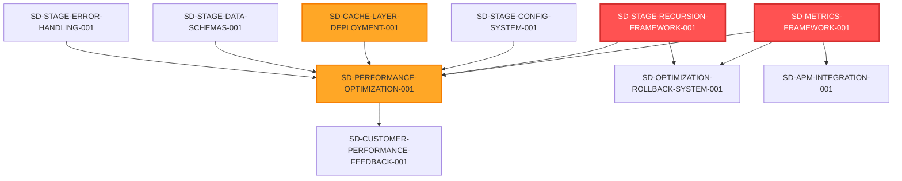

# Stage 28: Gaps & Backlog

## Overview

This document identifies gaps between the Stage 28 canonical definition and the current implementation state, then proposes Strategic Directives to address them.

**Evidence**: EHG_Engineer@6ef8cf4:docs/workflow/critique/stage-28.md:16 "Overall: 2.9 — Functional but needs optimization"

---

## Critical Gaps (Blocking Execution)

### Gap 1: No Performance Metrics Infrastructure

**Current State**: No database tables or monitoring tools to capture performance data

**Required Components**:
1. `performance_metrics` table (API/page response times)
2. `cache_metrics` table (hit rates, miss penalties)
3. `resource_metrics` table (CPU, memory, disk utilization)
4. `slow_query_log` table (database bottlenecks)

**Impact**: Cannot execute Substage 28.1 (Performance Analysis) — no baseline data

**Evidence**:
- EHG_Engineer@6ef8cf4:docs/workflow/stages.yaml:1254-1257 "metrics: Response time, Cache hit rate, Resource utilization"
- EHG_Engineer@6ef8cf4:docs/workflow/critique/stage-28.md:36-39 "Missing: Threshold values, measurement frequency"

**Proposed SD**: SD-METRICS-FRAMEWORK-001 (P0 CRITICAL, universal blocker)

---

### Gap 2: No Configuration Management

**Current State**: No database table or UI to set performance thresholds per venture

**Required Components**:
1. `stage_28_config` table (venture-specific thresholds)
2. Admin UI for config management
3. Validation logic for parameter ranges
4. Default value inheritance system

**Impact**: Cannot customize optimization targets; hardcoded values fail multi-venture scenarios

**Evidence**:
- EHG_Engineer@6ef8cf4:docs/workflow/critique/stage-28.md:36-39 "Missing: Threshold values"
- EHG_Engineer@6ef8cf4:docs/workflow/dossiers/stage-28/08_configurability-matrix.md "Missing: stage_28_config table"

**Proposed SD**: SD-STAGE-CONFIG-SYSTEM-001 (Priority: High)

---

### Gap 3: No Agent Automation

**Current State**: No Python agents exist for performance optimization

**Required Components**:
1. `performance_profiler.py` agent (Substage 28.1)
2. `cache_architect.py` agent (Substage 28.2)
3. `code_optimizer.py` agent (Substage 28.3)
4. `bottleneck_analyst.py` agent (coordinator)
5. `performance_optimization_crew.py` crew

**Impact**: Stage 28 remains fully manual; cannot progress toward automation roadmap

**Evidence**:
- EHG_Engineer@6ef8cf4:docs/workflow/stages.yaml:1286 "progression_mode: Manual → Assisted → Auto"
- EHG_Engineer@6ef8cf4:docs/workflow/critique/stage-28.md:31-34 "Target State: 80% automation"

**Proposed SD**: SD-PERFORMANCE-OPTIMIZATION-001 (Priority: Critical)

---

### Gap 4: No Cache Infrastructure

**Current State**: No Redis/Valkey deployment, no cache middleware

**Required Components**:
1. Redis/Valkey cluster deployment
2. Cache middleware (e.g., `express-redis-cache`)
3. Cache invalidation logic (event-driven triggers)
4. CDN integration for static assets

**Impact**: Cannot execute Substage 28.2 (Cache Implementation) — no cache layer to configure

**Evidence**:
- EHG_Engineer@6ef8cf4:docs/workflow/stages.yaml:1274-1278 "Cache Implementation: Cache strategy defined, Layers implemented"
- EHG_Engineer@6ef8cf4:docs/workflow/critique/stage-28.md:23-27 "Missing specific tool integrations"

**Proposed SD**: SD-CACHE-LAYER-DEPLOYMENT-001 (Priority: Critical)

---

## High-Priority Gaps (Degraded Functionality)

### Gap 5: No Rollback Procedures

**Current State**: No documented rollback decision tree or triggers

**Required Components**:
1. Rollback decision tree (when to revert optimizations)
2. Git rollback automation (revert last deployment)
3. Cache flush procedure (purge stale cache after rollback)
4. Performance regression detection (alert on degradation)

**Impact**: Failed optimizations cannot be safely reverted; risk of prolonged downtime

**Evidence**:
- EHG_Engineer@6ef8cf4:docs/workflow/critique/stage-28.md:47-50 "Add rollback procedures: Current: No rollback defined"

**Proposed SD**: SD-OPTIMIZATION-ROLLBACK-SYSTEM-001 (Priority: High)

---

### Gap 6: No Recursion Trigger Implementation

**Current State**: No database columns or automation for recursion detection

**Required Components**:
1. `recursion_count` column in `ventures` table (or `stage_metrics` table)
2. Trigger detection queries (PERF-001 through PERF-004)
3. Automated substage reassignment logic
4. Escalation to Strategic Directive after max retries

**Impact**: Cannot auto-detect optimization failures; manual intervention required

**Evidence**:
- EHG_Engineer@6ef8cf4:docs/workflow/critique/stage-28.md:15 "Recursion Readiness: 2 — Generic recursion support pending"
- EHG_Engineer@6ef8cf4:docs/workflow/dossiers/stage-28/07_recursion-blueprint.md "Proposed Recursion Triggers (4)"

**Proposed SD**: SD-STAGE-RECURSION-FRAMEWORK-001 (Priority: Medium, cross-stage)

---

### Gap 7: No APM Tool Integration

**Current State**: No Application Performance Monitoring tool deployed

**Required Components**:
1. APM tool selection (New Relic, Datadog, or Prometheus/Grafana)
2. Agent installation (Node.js, browser RUM)
3. Custom metric instrumentation (Stage 28 KPIs)
4. Alert rule configuration (performance degradation triggers)

**Impact**: Profiling data unavailable; cannot identify bottlenecks without manual instrumentation

**Evidence**:
- EHG_Engineer@6ef8cf4:docs/workflow/critique/stage-28.md:26 "Missing specific tool integrations"
- EHG_Engineer@6ef8cf4:docs/workflow/dossiers/stage-28/09_metrics-monitoring.md "Integration with APM Tools"

**Proposed SD**: SD-APM-INTEGRATION-001 (Priority: High)

---

### Gap 8: No Error Handling Documentation

**Current State**: No explicit error handling for optimization failures

**Required Components**:
1. Error taxonomy (cache errors, profiling failures, optimization regressions)
2. Error recovery procedures (retry logic, fallback strategies)
3. Error logging and alerting (capture failures for analysis)

**Impact**: Optimization failures cause Stage 28 to block; no recovery path

**Evidence**:
- EHG_Engineer@6ef8cf4:docs/workflow/critique/stage-28.md:27 "No explicit error handling"

**Proposed SD**: SD-STAGE-ERROR-HANDLING-001 (Priority: Medium, cross-stage)

---

## Medium-Priority Gaps (Quality Improvements)

### Gap 9: No Customer Feedback Loop

**Current State**: No customer validation checkpoint in Stage 28

**Proposed Enhancement**: Add optional customer feedback collection after optimization

**Use Case**: Measure perceived performance improvement (subjective user experience)

**Evidence**: EHG_Engineer@6ef8cf4:docs/workflow/critique/stage-28.md:52-55 "Add customer validation touchpoint"

**Proposed SD**: SD-CUSTOMER-PERFORMANCE-FEEDBACK-001 (Priority: Low)

---

### Gap 10: No Data Transformation Documentation

**Current State**: No schema or validation rules for input/output data

**Required Components**:
1. Input data schema (performance metrics format, bottleneck analysis structure)
2. Output data schema (optimized code format, cache layer config, performance report)
3. Validation rules (ensure data integrity across substages)

**Impact**: Data quality issues may propagate between substages

**Evidence**: EHG_Engineer@6ef8cf4:docs/workflow/critique/stage-28.md:41-45 "Gap: Data transformation and validation rules"

**Proposed SD**: SD-STAGE-DATA-SCHEMAS-001 (Priority: Medium, cross-stage)

---

## Universal Blockers (Cross-Stage Impact)

### SD-METRICS-FRAMEWORK-001

**Title**: Build Universal Metrics Collection Framework

**Priority**: P0 CRITICAL

**Scope**: Deploy metrics infrastructure for ALL 40 stages (not just Stage 28)

**Components**:
1. Create `stage_metrics` table (venture_id, stage_id, metric_name, metric_value, measured_at)
2. Create `performance_metrics`, `cache_metrics`, `resource_metrics` tables (Stage 28-specific)
3. Build metrics collection API (POST /api/metrics)
4. Deploy APM tool (New Relic or Datadog)
5. Configure Supabase dashboard (universal + stage-specific panels)

**Impact**: Blocks Stages 28, 29, 30+ that depend on performance/quality metrics

**Acceptance Criteria**:
- All 3 Stage 28 metrics (response time, cache hit rate, resource utilization) tracked
- Dashboard displays real-time data with 1-minute lag
- Alert rules trigger recursion on threshold violations

**Estimated Effort**: 3 weeks (1 week DB schema, 1 week APM integration, 1 week dashboards)

**Cross-References**:
- EHG_Engineer@6ef8cf4:docs/workflow/dossiers/stage-28/09_metrics-monitoring.md "Database Schema (Proposed)"
- All Stage 1-40 critiques mention metrics gaps

---

### SD-STAGE-RECURSION-FRAMEWORK-001

**Title**: Implement Stage Recursion & Escalation System

**Priority**: P1 High

**Scope**: Add recursion support to ALL stages with substages (not just Stage 28)

**Components**:
1. Add `recursion_count` column to `ventures` table
2. Create `recursion_triggers` table (stage_id, trigger_name, condition_sql, action)
3. Build recursion detection service (runs every 5 minutes)
4. Implement substage reassignment logic (UPDATE ventures SET current_substage)
5. Escalation to SD after max retries (auto-create SD-{STAGE}-ESCALATION-{ID})

**Impact**: Blocks automation roadmap for Stages 1-40 (progression_mode: Auto)

**Acceptance Criteria**:
- Stage 28 PERF-001 through PERF-004 triggers operational
- Auto-advance to Stage 29 when PERF-004 met
- Escalation to SD after 3 failed recursions

**Estimated Effort**: 2 weeks (1 week schema + queries, 1 week automation service)

**Cross-References**:
- EHG_Engineer@6ef8cf4:docs/workflow/dossiers/stage-28/07_recursion-blueprint.md "Proposed Recursion Triggers"
- EHG_Engineer@6ef8cf4:docs/workflow/critique/stage-28.md:15 "Recursion Readiness: 2"

---

## Proposed Strategic Directives Summary

| SD ID | Title | Priority | Scope | Estimated Effort |
|-------|-------|----------|-------|------------------|
| SD-METRICS-FRAMEWORK-001 | Build Universal Metrics Collection Framework | P0 CRITICAL | All stages | 3 weeks |
| SD-STAGE-RECURSION-FRAMEWORK-001 | Implement Stage Recursion & Escalation System | P1 High | All stages | 2 weeks |
| SD-PERFORMANCE-OPTIMIZATION-001 | Deploy PerformanceOptimizationCrew Agents | P1 Critical | Stage 28 | 4 weeks |
| SD-CACHE-LAYER-DEPLOYMENT-001 | Deploy Redis/Valkey Cache Infrastructure | P1 Critical | Stage 28 | 2 weeks |
| SD-STAGE-CONFIG-SYSTEM-001 | Build Stage Configuration Management System | P1 High | All stages | 2 weeks |
| SD-OPTIMIZATION-ROLLBACK-SYSTEM-001 | Create Optimization Rollback Automation | P2 High | Stage 28 | 1 week |
| SD-APM-INTEGRATION-001 | Integrate APM Tool (New Relic/Datadog) | P2 High | All stages | 2 weeks |
| SD-STAGE-ERROR-HANDLING-001 | Document Stage Error Handling Procedures | P2 Medium | All stages | 1 week |
| SD-STAGE-DATA-SCHEMAS-001 | Define Stage Input/Output Data Schemas | P2 Medium | All stages | 2 weeks |
| SD-CUSTOMER-PERFORMANCE-FEEDBACK-001 | Add Customer Performance Feedback Loop | P3 Low | Stage 28 | 1 week |

**Total Estimated Effort**: 20 weeks (if executed sequentially)

**Parallelization**: Can reduce to 8-10 weeks if SDs grouped by dependency

---

## Dependency Graph

**Critical Path**: METRICS → AGENTS → (Stage 28 operational)

---

## Gap Impact on Stage 28 Execution

| Substage | Required Gap Resolutions | Blocked? |
|----------|--------------------------|----------|
| 28.1 Performance Analysis | SD-METRICS-FRAMEWORK-001, SD-APM-INTEGRATION-001 | ✅ YES |
| 28.2 Cache Implementation | SD-CACHE-LAYER-DEPLOYMENT-001, SD-STAGE-CONFIG-SYSTEM-001 | ✅ YES |
| 28.3 Code Optimization | SD-PERFORMANCE-OPTIMIZATION-001 (agents), SD-OPTIMIZATION-ROLLBACK-SYSTEM-001 | ✅ YES |

**Conclusion**: Stage 28 cannot execute until at minimum SD-METRICS-FRAMEWORK-001 and SD-CACHE-LAYER-DEPLOYMENT-001 are completed.

---

## Recommendations

### Immediate Actions (Week 1)

1. **Submit SD-METRICS-FRAMEWORK-001** to governance workflow (LEAD review)
2. **Submit SD-STAGE-RECURSION-FRAMEWORK-001** to governance workflow
3. **Submit SD-CACHE-LAYER-DEPLOYMENT-001** to governance workflow

### Phase 2 Actions (Weeks 2-4)

4. Deploy metrics infrastructure (after SD approval)
5. Deploy cache infrastructure (after SD approval)
6. Begin agent development (after metrics available)

### Phase 3 Actions (Weeks 5-8)

7. Integrate APM tool (SD-APM-INTEGRATION-001)
8. Build configuration management system (SD-STAGE-CONFIG-SYSTEM-001)
9. Document error handling (SD-STAGE-ERROR-HANDLING-001)

### Phase 4 Actions (Weeks 9-12)

10. Test Stage 28 execution with all infrastructure operational
11. Validate recursion triggers (PERF-001 through PERF-004)
12. Add customer feedback loop (SD-CUSTOMER-PERFORMANCE-FEEDBACK-001)

---

## Cross-References

**Universal Blockers**:
- SD-METRICS-FRAMEWORK-001 (affects all 40 stages)
- SD-STAGE-RECURSION-FRAMEWORK-001 (affects all stages with substages)

**Stage-Specific**:
- SD-PERFORMANCE-OPTIMIZATION-001 (Stage 28 only)
- SD-CACHE-LAYER-DEPLOYMENT-001 (Stage 28, possibly Stage 27 for saga caching)

**Quality Improvements**:
- SD-STAGE-CONFIG-SYSTEM-001 (all stages)
- SD-STAGE-DATA-SCHEMAS-001 (all stages)
- SD-STAGE-ERROR-HANDLING-001 (all stages)

---

## Sources Table

| Source | Repo | Commit | Path | Lines |
|--------|------|--------|------|-------|
| Overall score | EHG_Engineer | 6ef8cf4 | docs/workflow/critique/stage-28.md | 16 |
| Weaknesses | EHG_Engineer | 6ef8cf4 | docs/workflow/critique/stage-28.md | 23-27 |
| Specific improvements | EHG_Engineer | 6ef8cf4 | docs/workflow/critique/stage-28.md | 29-72 |
| Agent gap | EHG_Engineer | 6ef8cf4 | docs/workflow/dossiers/stage-28/06_agent-orchestration.md | N/A |
| Recursion gap | EHG_Engineer | 6ef8cf4 | docs/workflow/dossiers/stage-28/07_recursion-blueprint.md | N/A |
| Config gap | EHG_Engineer | 6ef8cf4 | docs/workflow/dossiers/stage-28/08_configurability-matrix.md | N/A |
| Metrics gap | EHG_Engineer | 6ef8cf4 | docs/workflow/dossiers/stage-28/09_metrics-monitoring.md | N/A |

<!-- Generated by Claude Code Phase 10 | EHG_Engineer@6ef8cf4 | 2025-11-06 -->
