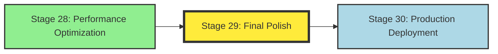
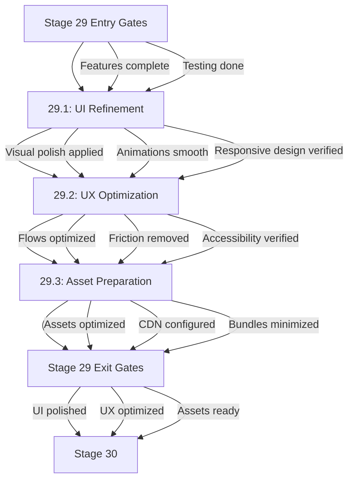

# Stage 29: Stage Map & Dependencies

## Position in 40-Stage Workflow

**Phase**: PLAN (Stages 11-20 planning phase, extended to Stage 29 per critique)
**Stage**: 29 of 40
**Critical Path**: Yes (final quality gate before production deployment)

---

## Dependency Graph

**Legend**:
- Yellow (bold): Current stage (29)
- Green: Upstream dependency (28)
- Light Blue: Downstream stage (30)

---

## Upstream Dependencies

| Stage | Title | Relationship | Exit Gates Required |
|-------|-------|--------------|---------------------|
| 28 | Performance Optimization | **HARD BLOCKER** | Performance targets met, Optimization complete, Load testing passed |

**Rationale**: Stage 29 cannot begin until performance optimization is complete, as polish work requires stable performance baseline (EHG_Engineer@6ef8cf4:docs/workflow/stages.yaml:1290-1291).

---

## Downstream Impact

| Stage | Title | Dependency Type | Impact if Stage 29 Fails |
|-------|-------|-----------------|--------------------------|
| 30 | Production Deployment | **CRITICAL** | Cannot deploy unpolished/unoptimized product to production |

**Blast Radius**: HIGH — Stage 29 is the final quality gate before production deployment. Failure blocks go-live.

---

## Substage Dependencies

**Sequential Execution**: Substages must execute in order (29.1 → 29.2 → 29.3) as UX optimization depends on UI refinement, and asset preparation depends on optimized UX flows.

---

## Entry Gates

**From stages.yaml lines 1305-1307**:

| Gate | Validation | Source |
|------|------------|--------|
| Features complete | All feature development finished | EHG_Engineer@6ef8cf4:docs/workflow/stages.yaml:1306 |
| Testing done | All tests passing (unit, integration, E2E) | EHG_Engineer@6ef8cf4:docs/workflow/stages.yaml:1307 |

**Gate Enforcement**: Both gates must pass before Stage 29 begins. See `05_professional-sop.md` for gate validation procedures.

---

## Exit Gates

**From stages.yaml lines 1308-1311**:

| Gate | Validation | Source |
|------|------------|--------|
| UI polished | Visual design refined, animations smooth, responsive verified | EHG_Engineer@6ef8cf4:docs/workflow/stages.yaml:1309 |
| UX optimized | User flows optimized, friction removed, accessibility verified | EHG_Engineer@6ef8cf4:docs/workflow/stages.yaml:1310 |
| Assets ready | Assets optimized, CDN configured, bundles minimized | EHG_Engineer@6ef8cf4:docs/workflow/stages.yaml:1311 |

**Gate Enforcement**: All 3 gates must pass before advancing to Stage 30. See `09_metrics-monitoring.md` for measurement criteria.

---

## Parallel Execution Opportunities

**Within Stage 29**:
- ❌ **Substages are sequential** (29.1 → 29.2 → 29.3)
- ✅ **Within Substage 29.3**: Asset optimization, CDN configuration, and bundle minimization can run in parallel

**Cross-Stage Parallelism**:
- ❌ Cannot run Stage 29 in parallel with Stage 28 (hard dependency)
- ❌ Cannot run Stage 30 until Stage 29 exits (hard blocker)

---

## Critical Path Analysis

**Stage 29 is on the critical path**:
1. **Blocks**: Stage 30 (Production Deployment)
2. **Blocked By**: Stage 28 (Performance Optimization)
3. **Path**: ... → Stage 28 → **Stage 29** → Stage 30 → ...

**Impact of Delay**: Any delay in Stage 29 directly impacts production go-live date.

**Mitigation**: See `08_configurability-matrix.md` for time-saving automation options.

---

## Cross-References

- **SD-PERFORMANCE-OPTIMIZATION-001** (P0, status=queued): Automates Stage 28 prerequisite
- **SD-FINAL-POLISH-AUTOMATION-001** (proposed in `10_gaps-backlog.md`): Automates Stage 29 execution
- **SD-METRICS-FRAMEWORK-001** (P0 CRITICAL, status=queued): Universal blocker for all metrics tracking

---

## Sources Table

| Source | Repo | Commit | Path | Lines | Evidence |
|--------|------|--------|------|-------|----------|
| Stage 29 definition | EHG_Engineer | 6ef8cf4 | docs/workflow/stages.yaml | 1287-1332 | "depends_on: [28]" |
| Stage 28 definition | EHG_Engineer | 6ef8cf4 | docs/workflow/stages.yaml | 1243-1286 | Upstream dependency |
| Stage 30 definition | EHG_Engineer | 6ef8cf4 | docs/workflow/stages.yaml | 1333-1378 | Downstream stage |
| Substages | EHG_Engineer | 6ef8cf4 | docs/workflow/stages.yaml | 1312-1330 | 3 substages with done_when |
| Entry gates | EHG_Engineer | 6ef8cf4 | docs/workflow/stages.yaml | 1305-1307 | 2 entry conditions |
| Exit gates | EHG_Engineer | 6ef8cf4 | docs/workflow/stages.yaml | 1308-1311 | 3 exit conditions |

<!-- Generated by Claude Code Phase 11 | EHG_Engineer@6ef8cf4 | 2025-11-06 -->
