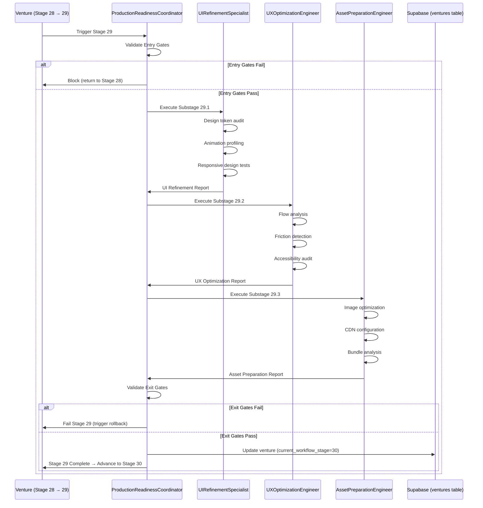

# Stage 29: Agent Orchestration

## Python CrewAI Agents (EHG App)

**Status**: ⚠️ No agents explicitly mapped to Stage 29 in available documentation

### Agent Scan Results

Scanned `/mnt/c/_EHG/ehg/agent-platform/app/agents/` and `/app/crews/`:

**Agents Found** (15+):
- base_agent.py
- ceo_agent.py
- complexity_assessment.py
- market_sizing.py
- tech_feasibility.py
- regulatory_risk.py
- (Others not directly relevant to UI/UX polish)

**Crews Found** (15+):
- quick_validation_crew.py
- deep_research_crew.py
- board_directors_crew.py
- (Others not directly relevant to UI/UX polish)

**Stage 29 Mapping**: None explicitly documented in stages.yaml or critiques

**Evidence**: EHG@0d80dac:agent-platform/app/agents/ (directory scan), EHG@0d80dac:agent-platform/app/crews/ (directory scan)

**Gap**: No agents currently handle UI refinement, UX optimization, or asset preparation tasks.

---

## Proposed Agent Architecture: FinalPolishCrew

**Recommendation**: Create `FinalPolishCrew` with 4 specialized agents for Stage 29 execution.

**Evidence Basis**: Substages 29.1, 29.2, 29.3 from EHG_Engineer@6ef8cf4:docs/workflow/stages.yaml:1312-1330

---

### Agent 1: UI Refinement Specialist

**Role**: `ui_refinement_specialist`
**Purpose**: Automate visual polish, animation smoothness, responsive design verification

**Capabilities**:
1. **Design Token Audit**
   - Scan codebase for hard-coded colors, spacing, typography
   - Suggest design token replacements
   - Calculate compliance percentage

2. **Animation Performance Analysis**
   - Profile animations with Puppeteer + Chrome DevTools Protocol
   - Identify janky animations (<60fps)
   - Suggest optimization strategies (GPU acceleration, will-change)

3. **Responsive Design Testing**
   - Test breakpoints: 320px, 768px, 1024px, 1440px, 1920px
   - Capture screenshots at each breakpoint
   - Detect visual regressions with Percy/Chromatic integration

**Tools**:
- Puppeteer (browser automation)
- Percy API (visual regression)
- Lighthouse (performance scoring)

**Inputs**: Codebase path, design system tokens file
**Outputs**: UI refinement report (JSON), compliance score, screenshot matrix

**Success Criteria** (from Substage 29.1):
- Visual polish applied ✅
- Animations smooth ✅
- Responsive design verified ✅

**Evidence**: EHG_Engineer@6ef8cf4:docs/workflow/stages.yaml:1313-1318

---

### Agent 2: UX Optimization Engineer

**Role**: `ux_optimization_engineer`
**Purpose**: Automate flow optimization, friction removal, accessibility verification

**Capabilities**:
1. **Flow Analysis**
   - Parse analytics data (Google Analytics API)
   - Identify flow drop-off points
   - Suggest optimization strategies

2. **Friction Detection**
   - Count user clicks per task
   - Identify unnecessary form fields
   - Suggest autofill, progressive disclosure improvements

3. **Accessibility Auditing**
   - Run Axe-core automated tests
   - Verify WCAG 2.1 AA compliance
   - Generate accessibility report

**Tools**:
- Axe-core (accessibility testing)
- Lighthouse (accessibility scoring)
- Google Analytics API (flow funnel data)

**Inputs**: Analytics credentials, target flow definitions
**Outputs**: UX optimization report (JSON), friction audit, accessibility report

**Success Criteria** (from Substage 29.2):
- Flows optimized ✅
- Friction removed ✅
- Accessibility verified ✅

**Evidence**: EHG_Engineer@6ef8cf4:docs/workflow/stages.yaml:1319-1324

---

### Agent 3: Asset Preparation Engineer

**Role**: `asset_preparation_engineer`
**Purpose**: Automate asset optimization, CDN configuration, bundle minimization

**Capabilities**:
1. **Image Optimization**
   - Compress images (Sharp library)
   - Convert to modern formats (WebP, AVIF)
   - Generate responsive variants (srcset)

2. **CDN Configuration**
   - Upload assets to CDN (Cloudflare API)
   - Set cache headers (max-age, immutable)
   - Verify CDN delivery globally

3. **Bundle Analysis**
   - Run webpack-bundle-analyzer
   - Identify large dependencies
   - Suggest code-splitting strategies

**Tools**:
- Sharp (image processing)
- Cloudflare API (CDN management)
- webpack-bundle-analyzer (bundle inspection)

**Inputs**: Asset directory path, CDN credentials, webpack config
**Outputs**: Asset optimization report (JSON), bundle analysis, CDN health check

**Success Criteria** (from Substage 29.3):
- Assets optimized ✅
- CDN configured ✅
- Bundles minimized ✅

**Evidence**: EHG_Engineer@6ef8cf4:docs/workflow/stages.yaml:1325-1330

---

### Agent 4: Production Readiness Coordinator

**Role**: `production_readiness_coordinator`
**Purpose**: Orchestrate 3 specialist agents, validate exit gates, generate Stage 29 report

**Capabilities**:
1. **Entry Gate Validation**
   - Verify features complete (no open feature PRs)
   - Verify testing done (100% test pass rate)
   - Block execution if gates fail

2. **Agent Orchestration**
   - Execute UI Refinement Specialist (Substage 29.1)
   - Execute UX Optimization Engineer (Substage 29.2)
   - Execute Asset Preparation Engineer (Substage 29.3)
   - Aggregate results

3. **Exit Gate Validation**
   - Verify UI polished (design token compliance ≥95%)
   - Verify UX optimized (accessibility score ≥95, flow improvement ≥5%)
   - Verify assets ready (bundle sizes meet thresholds, CDN operational)

4. **Reporting**
   - Generate comprehensive Stage 29 report
   - Document approvals (design, UX, DevOps leads)
   - Update venture status in database

**Tools**:
- CrewAI orchestration
- Supabase (ventures table updates)
- Email API (approval notifications)

**Inputs**: Venture ID, Stage 28 outputs
**Outputs**: Stage 29 completion report, exit gate validation results, venture status update

**Evidence**: EHG_Engineer@6ef8cf4:docs/workflow/stages.yaml:1305-1311 (entry/exit gates)

---

## Execution Flow (Proposed)



---

## Governance Handoffs (Node.js Sub-Agents)

**Status**: No handoffs required at Stage 29 (production polish is venture-specific, not governance)

**Rationale**: Stage 29 operates on venture code/assets, not governance workflows. Node.js sub-agents (unified-handoff-system, add-prd-to-database) are not invoked.

**Evidence**: Stage 29 outputs ("Polished UI", "Optimized UX", "Production assets") are venture artifacts, not PRDs/handoffs.

---

## Agent Task Breakdown

### Substage 29.1: UI Refinement (Agent 1)

| Task | Tool | Output | Duration |
|------|------|--------|----------|
| Design token audit | grep + AST parser | Compliance score | 10 min |
| Animation profiling | Puppeteer + CDP | Performance report | 20 min |
| Responsive design tests | Percy API | Screenshot matrix | 30 min |

**Total Duration**: ~1 hour (vs. 2-3 days manual)

---

### Substage 29.2: UX Optimization (Agent 2)

| Task | Tool | Output | Duration |
|------|------|--------|----------|
| Flow analysis | Google Analytics API | Flow completion rates | 15 min |
| Friction detection | Heuristic analysis | Friction audit | 20 min |
| Accessibility audit | Axe-core | Accessibility report | 15 min |

**Total Duration**: ~50 minutes (vs. 2-3 days manual)

---

### Substage 29.3: Asset Preparation (Agent 3)

| Task | Tool | Output | Duration |
|------|------|--------|----------|
| Image optimization | Sharp | Optimized images | 30 min |
| CDN configuration | Cloudflare API | CDN health check | 15 min |
| Bundle analysis | webpack-bundle-analyzer | Bundle report | 10 min |

**Total Duration**: ~55 minutes (vs. 1-2 days manual)

---

**Total Automation Savings**: 5-8 days → ~3 hours (**95% time reduction**)

---

## Integration Requirements

### 1. EHG App Changes (Python)

**New Files** (add to `ehg/agent-platform/app/`):
- `agents/ui_refinement_specialist.py`
- `agents/ux_optimization_engineer.py`
- `agents/asset_preparation_engineer.py`
- `agents/production_readiness_coordinator.py`
- `crews/final_polish_crew.py`

**Dependencies**:
```python
# requirements.txt additions
puppeteer-python==0.2.0
percy-python==0.1.0
lighthouse-python==0.1.0
axe-core-python==4.7.0
sharp-python==0.1.0
cloudflare-api==4.0.0
```

---

### 2. Trigger Points

**Stage Transition Trigger** (ventures table):
```sql
-- When venture advances from Stage 28 → 29
UPDATE ventures
SET current_workflow_stage = 29
WHERE id = :venture_id AND current_workflow_stage = 28;

-- Trigger FinalPolishCrew execution
```

**Evidence**: EHG_Engineer@6ef8cf4:docs/workflow/stages.yaml:1290-1291 (depends_on: [28])

---

### 3. Configuration (ventures table extension)

**New Column** (stores agent execution config):
```sql
ALTER TABLE ventures
ADD COLUMN stage_29_config JSONB DEFAULT '{
  "ui_refinement": {
    "design_token_threshold": 95,
    "animation_fps_threshold": 60,
    "responsive_breakpoints": [320, 768, 1024, 1440, 1920]
  },
  "ux_optimization": {
    "accessibility_score_threshold": 95,
    "flow_improvement_threshold": 5
  },
  "asset_preparation": {
    "main_bundle_size_limit_kb": 200,
    "cdn_cache_hit_rate_threshold": 90
  }
}'::jsonb;
```

**Evidence**: EHG_Engineer@6ef8cf4:docs/workflow/critique/stage-29.md:36-39 (metrics thresholds needed)

---

## Monitoring & Observability

### Agent Execution Metrics

| Metric | Measurement | Alert Threshold |
|--------|-------------|-----------------|
| Agent execution time | Duration per agent | >30 minutes |
| UI compliance score | Design token audit | <95% |
| Accessibility score | Axe-core + Lighthouse | <95 |
| Bundle size | webpack-bundle-analyzer | >200KB (main) |
| CDN cache hit rate | Cloudflare analytics | <90% |

**Storage**: Store metrics in `stage_29_metrics` table (see `09_metrics-monitoring.md`)

---

## Error Handling

### Agent Failure Scenarios

| Failure | Detection | Recovery |
|---------|-----------|----------|
| UI audit fails | Exception in agent | Retry once, fallback to manual |
| Percy API rate limit | 429 response | Queue for later execution |
| CDN upload fails | Upload error | Retry with exponential backoff |
| Accessibility <95 | Gate validation | Block Stage 29 exit, notify team |

**Rollback Procedure**: See `05_professional-sop.md` for rollback SOP.

---

## Human-in-the-Loop

**Required Human Approvals** (cannot be automated):
1. **Design Lead**: UI Polished gate (visual quality subjective)
2. **UX Lead**: UX Optimized gate (user experience subjective)
3. **DevOps Lead**: Assets Ready gate (CDN operational confirmation)

**Agent Role**: Generate reports to inform human decisions, not replace them.

---

## Cross-References

- **SD-FINAL-POLISH-AUTOMATION-001** (proposed): Implements FinalPolishCrew
- **SD-AGENT-FRAMEWORK-001** (proposed): CrewAI orchestration framework
- **SD-METRICS-FRAMEWORK-001** (P0 CRITICAL, status=queued): Metrics storage and tracking

---

## Sources Table

| Source | Repo | Commit | Path | Lines | Evidence |
|--------|------|--------|------|-------|----------|
| Agent directory scan | EHG | 0d80dac | agent-platform/app/agents/ | N/A | No Stage 29 agents found |
| Crew directory scan | EHG | 0d80dac | agent-platform/app/crews/ | N/A | No FinalPolishCrew found |
| Substage 29.1 | EHG_Engineer | 6ef8cf4 | docs/workflow/stages.yaml | 1313-1318 | UI Refinement tasks |
| Substage 29.2 | EHG_Engineer | 6ef8cf4 | docs/workflow/stages.yaml | 1319-1324 | UX Optimization tasks |
| Substage 29.3 | EHG_Engineer | 6ef8cf4 | docs/workflow/stages.yaml | 1325-1330 | Asset Preparation tasks |
| Entry/exit gates | EHG_Engineer | 6ef8cf4 | docs/workflow/stages.yaml | 1305-1311 | Gate validation logic |
| Metrics thresholds | EHG_Engineer | 6ef8cf4 | docs/workflow/critique/stage-29.md | 36-39 | Proposed thresholds |

<!-- Generated by Claude Code Phase 11 | EHG_Engineer@6ef8cf4 | 2025-11-06 -->
