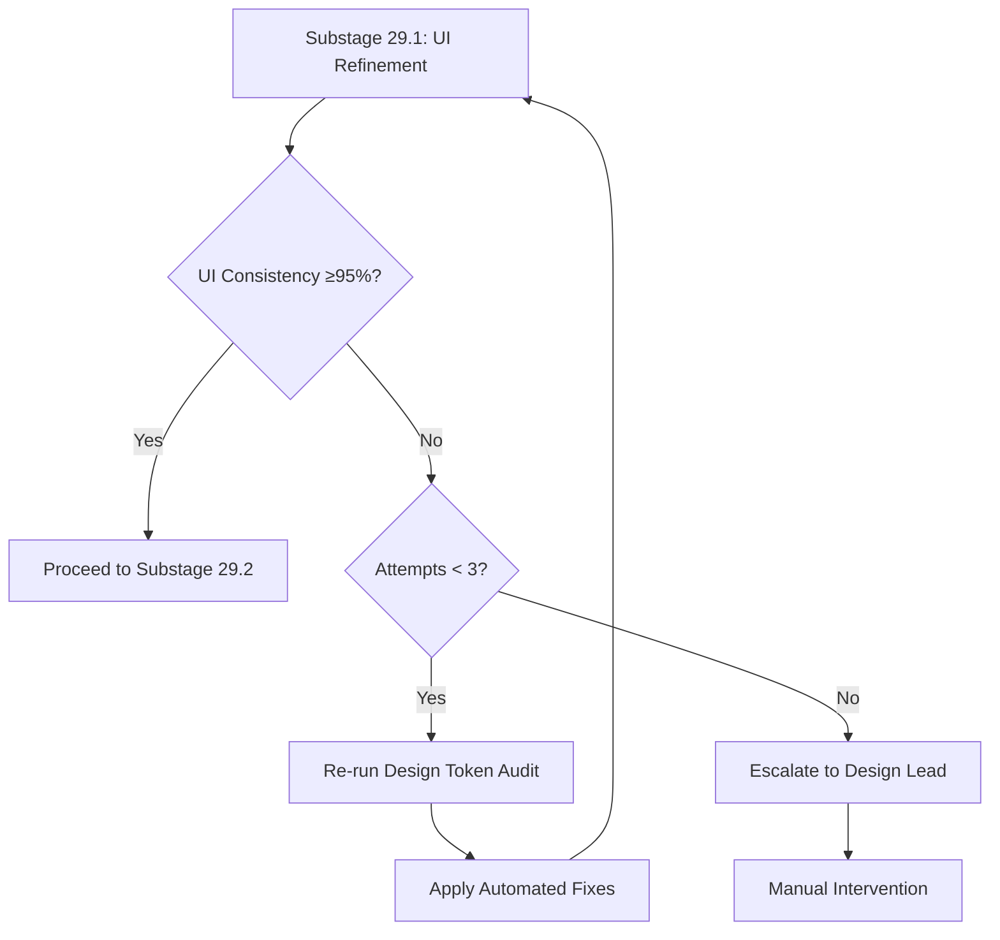
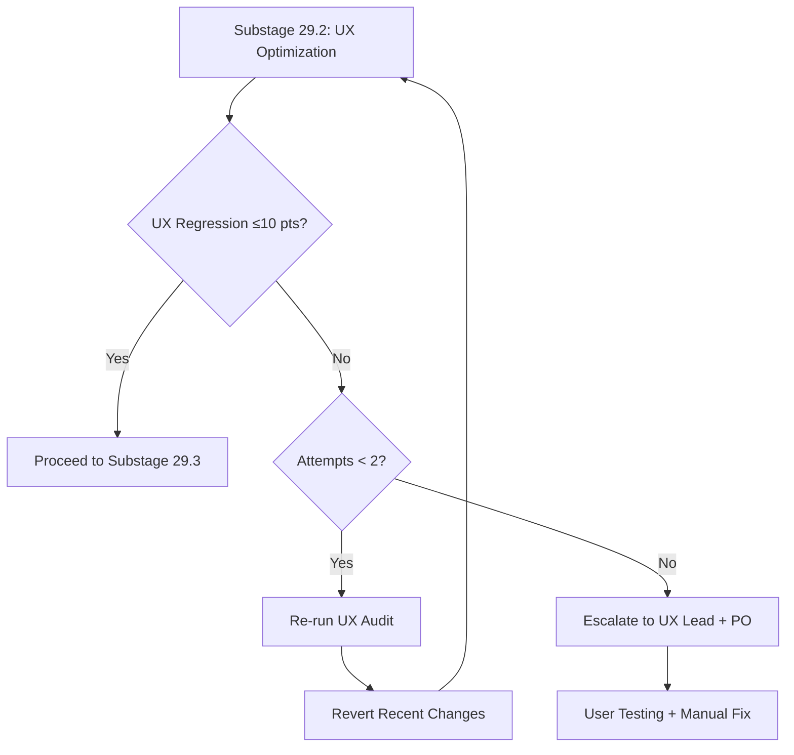
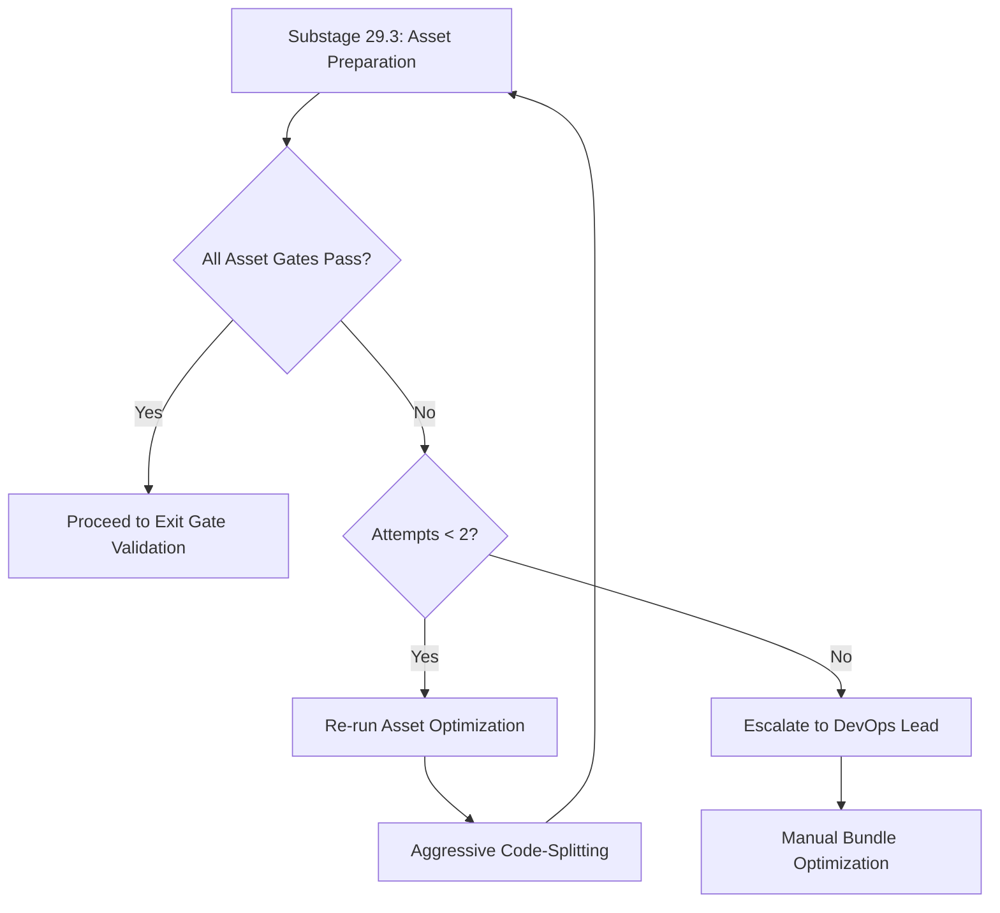

# Stage 29: Recursion Blueprint


## Table of Contents

- [Current Recursion Status](#current-recursion-status)
- [Proposed Recursion Triggers](#proposed-recursion-triggers)
- [Trigger POLISH-001: UI Consistency Degradation](#trigger-polish-001-ui-consistency-degradation)
  - [Trigger Condition](#trigger-condition)
  - [Trigger Logic](#trigger-logic)
  - [Recursion Action](#recursion-action)
  - [Success Criteria](#success-criteria)
  - [Metrics Tracking](#metrics-tracking)
- [Trigger POLISH-002: UX Score Regression](#trigger-polish-002-ux-score-regression)
  - [Trigger Condition](#trigger-condition)
  - [Trigger Logic](#trigger-logic)
  - [Recursion Action](#recursion-action)
  - [Success Criteria](#success-criteria)
- [Trigger POLISH-003: Asset Optimization Incomplete](#trigger-polish-003-asset-optimization-incomplete)
  - [Trigger Condition](#trigger-condition)
  - [Trigger Logic](#trigger-logic)
  - [Recursion Action](#recursion-action)
  - [Success Criteria](#success-criteria)
- [Trigger POLISH-004: Production Readiness Verified (Post-Deployment)](#trigger-polish-004-production-readiness-verified-post-deployment)
  - [Trigger Condition](#trigger-condition)
  - [Trigger Logic](#trigger-logic)
  - [Recursion Action](#recursion-action)
  - [Success Criteria](#success-criteria)
- [Recursion Governance](#recursion-governance)
  - [Max Recursion Depth](#max-recursion-depth)
  - [Escalation Paths](#escalation-paths)
- [Monitoring & Alerting](#monitoring-alerting)
  - [Recursion Metrics Dashboard](#recursion-metrics-dashboard)
  - [Alert Rules](#alert-rules)
- [Integration with Agent Orchestration](#integration-with-agent-orchestration)
- [Human-in-the-Loop](#human-in-the-loop)
- [Success Metrics](#success-metrics)
- [Cross-References](#cross-references)
- [Sources Table](#sources-table)

## Current Recursion Status

**Status**: ❌ No recursion support implemented
**Evidence**: EHG_Engineer@6ef8cf4:docs/workflow/critique/stage-29.md:15 "Generic recursion support pending"

**Gap**: Stage 29 lacks automated triggers to loop back for re-polish when quality thresholds are not met.

---

## Proposed Recursion Triggers

This blueprint defines 4 recursion triggers (POLISH-001 through POLISH-004) that automatically restart Stage 29 substages when quality degradation is detected.

**Design Pattern**: Quality-based recursion with progressive escalation

---

## Trigger POLISH-001: UI Consistency Degradation

### Trigger Condition

**When**: UI consistency score drops below threshold during Substage 29.1
**Threshold**: <95% design token compliance
**Detection**: Automated design token audit (see `06_agent-orchestration.md` Agent 1)

**Evidence Basis**: EHG_Engineer@6ef8cf4:docs/workflow/stages.yaml:1313-1318 (Substage 29.1 done_when conditions)

---

### Trigger Logic

```python
def check_polish_001(venture_id: str) -> bool:
    """Check if UI consistency degradation requires re-polish."""
    audit_result = run_design_token_audit(venture_id)

    ui_consistency = audit_result['compliance_percentage']
    threshold = venture.stage_29_config['ui_refinement']['design_token_threshold']  # 95

    if ui_consistency < threshold:
        logger.warning(f"POLISH-001 triggered: UI consistency {ui_consistency}% < {threshold}%")
        return True  # Trigger recursion

    return False  # Continue to Substage 29.2
```

---

### Recursion Action

**Loop Back To**: Substage 29.1 (UI Refinement)
**Max Iterations**: 3 attempts
**Escalation**: If still fails after 3 attempts, notify Design Lead for manual intervention

**Recursion Flow**:


---

### Success Criteria

**Recursion Exits When**:
- ✅ UI consistency ≥95%
- ✅ Visual regression tests pass (Percy)
- ✅ Animation performance ≥60fps

**Evidence**: EHG_Engineer@6ef8cf4:docs/workflow/stages.yaml:1315-1318 (Substage 29.1 done_when)

---

### Metrics Tracking

**Table**: `stage_29_recursion_log`
**Schema**:
```sql
CREATE TABLE stage_29_recursion_log (
    id UUID PRIMARY KEY DEFAULT gen_random_uuid(),
    venture_id UUID REFERENCES ventures(id),
    trigger_type TEXT NOT NULL,  -- 'POLISH-001', 'POLISH-002', etc.
    triggered_at TIMESTAMPTZ DEFAULT NOW(),
    threshold_value NUMERIC,
    actual_value NUMERIC,
    iteration_count INTEGER,
    resolution TEXT,  -- 'auto_fixed', 'manual_intervention', 'escalated'
    resolved_at TIMESTAMPTZ
);
```

---

## Trigger POLISH-002: UX Score Regression

### Trigger Condition

**When**: UX score drops during Substage 29.2 or after deployment
**Threshold**: Regression >10 points from baseline
**Detection**: Analytics flow funnel + accessibility audit (see `06_agent-orchestration.md` Agent 2)

**Evidence Basis**: EHG_Engineer@6ef8cf4:docs/workflow/critique/stage-29.md:47-50 (rollback trigger)

---

### Trigger Logic

```python
def check_polish_002(venture_id: str) -> bool:
    """Check if UX score regression requires re-optimization."""
    baseline_ux_score = get_stage_28_ux_score(venture_id)  # From Stage 28
    current_ux_score = run_ux_optimization_audit(venture_id)

    regression = baseline_ux_score - current_ux_score
    threshold = 10  # Points

    if regression > threshold:
        logger.warning(f"POLISH-002 triggered: UX regression {regression} pts > {threshold} pts")
        return True  # Trigger recursion

    return False  # Continue to Substage 29.3
```

---

### Recursion Action

**Loop Back To**: Substage 29.2 (UX Optimization)
**Max Iterations**: 2 attempts (faster escalation than UI)
**Escalation**: If still fails after 2 attempts, notify UX Lead + Product Owner

**Recursion Flow**:


---

### Success Criteria

**Recursion Exits When**:
- ✅ UX score regression ≤10 points
- ✅ Accessibility score ≥95/100
- ✅ Flow completion rates improved ≥5%

**Evidence**: EHG_Engineer@6ef8cf4:docs/workflow/stages.yaml:1321-1324 (Substage 29.2 done_when)

---

## Trigger POLISH-003: Asset Optimization Incomplete

### Trigger Condition

**When**: Asset optimization fails quality gates in Substage 29.3
**Threshold**:
- Main bundle >200KB (gzipped)
- CDN cache hit rate <90%
- Image compression <30% reduction

**Detection**: Bundle analyzer + CDN analytics (see `06_agent-orchestration.md` Agent 3)

**Evidence Basis**: EHG_Engineer@6ef8cf4:docs/workflow/stages.yaml:1325-1330 (Substage 29.3 done_when)

---

### Trigger Logic

```python
def check_polish_003(venture_id: str) -> bool:
    """Check if asset optimization incomplete requires re-preparation."""
    optimization_report = run_asset_preparation_audit(venture_id)

    main_bundle_size = optimization_report['main_bundle_size_kb']
    cdn_cache_hit_rate = optimization_report['cdn_cache_hit_rate']
    image_compression = optimization_report['image_compression_percentage']

    config = venture.stage_29_config['asset_preparation']

    failures = []
    if main_bundle_size > config['main_bundle_size_limit_kb']:  # 200KB
        failures.append(f"Bundle size {main_bundle_size}KB > {config['main_bundle_size_limit_kb']}KB")
    if cdn_cache_hit_rate < config['cdn_cache_hit_rate_threshold']:  # 90%
        failures.append(f"CDN cache hit rate {cdn_cache_hit_rate}% < {config['cdn_cache_hit_rate_threshold']}%")
    if image_compression < 30:
        failures.append(f"Image compression {image_compression}% < 30%")

    if failures:
        logger.warning(f"POLISH-003 triggered: {', '.join(failures)}")
        return True  # Trigger recursion

    return False  # Proceed to exit gates
```

---

### Recursion Action

**Loop Back To**: Substage 29.3 (Asset Preparation)
**Max Iterations**: 2 attempts
**Escalation**: If still fails after 2 attempts, notify DevOps Lead

**Recursion Flow**:


---

### Success Criteria

**Recursion Exits When**:
- ✅ Main bundle ≤200KB (gzipped)
- ✅ CDN cache hit rate ≥90%
- ✅ Image compression ≥30%

**Evidence**: EHG_Engineer@6ef8cf4:docs/workflow/stages.yaml:1327-1330 (Substage 29.3 done_when)

---

## Trigger POLISH-004: Production Readiness Verified (Post-Deployment)

### Trigger Condition

**When**: Stage 30 (Production Deployment) detects quality degradation in production
**Threshold**:
- Performance degradation >20%
- Error rate increase >5%
- User complaints spike

**Detection**: Production monitoring (New Relic, Sentry, etc.)

**Evidence Basis**: EHG_Engineer@6ef8cf4:docs/workflow/critique/stage-29.md:47-50 (rollback trigger)

---

### Trigger Logic

```python
def check_polish_004(venture_id: str) -> bool:
    """Check if production issues require re-polish."""
    production_metrics = get_production_metrics(venture_id)
    stage_29_baseline = get_stage_29_baseline_metrics(venture_id)

    performance_degradation = calculate_degradation(
        production_metrics['lcp'],
        stage_29_baseline['lcp']
    )
    error_rate_increase = production_metrics['error_rate'] - stage_29_baseline['error_rate']

    if performance_degradation > 20 or error_rate_increase > 5:
        logger.critical(f"POLISH-004 triggered: Production quality degradation detected")
        return True  # Trigger recursion (rollback to Stage 29)

    return False  # Continue in production
```

---

### Recursion Action

**Loop Back To**: Stage 29 (entire stage, from Substage 29.1)
**Max Iterations**: 1 attempt (production rollback is expensive)
**Escalation**: If still fails, rollback to Stage 28 baseline

**Recursion Flow**:
```mermaid
graph TD
    A[Stage 30: Production Deployment] --> B{Production Quality OK?}
    B -->|Yes| C[Continue in Production]
    B -->|No| D[Trigger POLISH-004]
    D --> E[Rollback to Stage 29 Baseline]
    E --> F[Re-run Stage 29 (all substages)]
    F --> G{Quality Restored?}
    G -->|Yes| H[Re-deploy to Production]
    G -->|No| I[Escalate: Rollback to Stage 28]
```

---

### Success Criteria

**Recursion Exits When**:
- ✅ Performance degradation ≤20%
- ✅ Error rate increase ≤5%
- ✅ User satisfaction stable

**Evidence**: EHG_Engineer@6ef8cf4:docs/workflow/critique/stage-29.md:47-50 (rollback requirement)

---

## Recursion Governance

### Max Recursion Depth

| Trigger | Max Iterations | Reason |
|---------|----------------|--------|
| POLISH-001 | 3 | UI issues often auto-fixable (token replacement) |
| POLISH-002 | 2 | UX issues require human judgment faster |
| POLISH-003 | 2 | Asset optimization has diminishing returns |
| POLISH-004 | 1 | Production rollback is expensive, escalate fast |

**Global Max**: 5 total iterations across all triggers per venture (prevent infinite loops)

---

### Escalation Paths

**Escalation Hierarchy**:
1. **Automated Fix** (Agent retries, no human intervention)
2. **Team Lead Notification** (Slack alert, async resolution)
3. **Incident Response** (PagerDuty, sync resolution with stakeholders)
4. **Executive Escalation** (CEO involvement for critical production failures)

**Evidence**: EHG_Engineer@6ef8cf4:docs/workflow/critique/stage-29.md:47-50 (rollback procedures needed)

---

## Monitoring & Alerting

### Recursion Metrics Dashboard

**Grafana Dashboard** (proposed):
- **Panel 1**: Recursion trigger count by type (POLISH-001 through POLISH-004)
- **Panel 2**: Average iterations per trigger
- **Panel 3**: Escalation rate (automated vs. manual)
- **Panel 4**: Time to resolution

**Query** (from `stage_29_recursion_log`):
```sql
SELECT
    trigger_type,
    COUNT(*) AS trigger_count,
    AVG(iteration_count) AS avg_iterations,
    AVG(EXTRACT(EPOCH FROM (resolved_at - triggered_at))) AS avg_resolution_time_seconds
FROM stage_29_recursion_log
WHERE triggered_at >= NOW() - INTERVAL '30 days'
GROUP BY trigger_type
ORDER BY trigger_count DESC;
```

---

### Alert Rules

**PagerDuty Alerts**:
1. **POLISH-004 triggered** → Critical (production impact)
2. **Any trigger exceeds max iterations** → High (manual intervention needed)
3. **Global max recursion depth reached (5)** → Critical (potential infinite loop)

---

## Integration with Agent Orchestration

**Agent Responsibility** (from `06_agent-orchestration.md`):
- **ProductionReadinessCoordinator** (Agent 4): Checks all 4 triggers after each substage
- **UIRefinementSpecialist** (Agent 1): Executes POLISH-001 automated fixes
- **UXOptimizationEngineer** (Agent 2): Executes POLISH-002 automated fixes
- **AssetPreparationEngineer** (Agent 3): Executes POLISH-003 automated fixes

---

## Human-in-the-Loop

**Required Human Decisions**:
1. **After max iterations**: Team Lead approves manual intervention or rollback
2. **POLISH-004 (production)**: DevOps Lead approves rollback to Stage 29 vs. Stage 28
3. **Escalation**: CEO/CTO approves go/no-go for continued production deployment

**Agent Role**: Automate detection and first-level fixes, escalate when limits reached.

---

## Success Metrics

**KPIs for Recursion System**:
- **Automated Fix Rate**: Target ≥70% (most issues resolved without human intervention)
- **Escalation Rate**: Target ≤30% (minimize manual overhead)
- **Average Iterations**: Target ≤2 (fast convergence)
- **Production Rollback Rate**: Target ≤5% (high quality before Stage 30)

**Measurement**: Query `stage_29_recursion_log` table monthly.

---

## Cross-References

- **SD-FINAL-POLISH-AUTOMATION-001** (proposed): Implements recursion triggers
- **SD-RECURSION-FRAMEWORK-001** (proposed): Universal recursion framework for all stages
- **SD-METRICS-FRAMEWORK-001** (P0 CRITICAL, status=queued): Metrics storage for trigger thresholds

---

## Sources Table

| Source | Repo | Commit | Path | Lines | Evidence |
|--------|------|--------|------|-------|----------|
| Recursion status | EHG_Engineer | 6ef8cf4 | docs/workflow/critique/stage-29.md | 15 | "Generic recursion support pending" |
| Rollback triggers | EHG_Engineer | 6ef8cf4 | docs/workflow/critique/stage-29.md | 47-50 | Improvement #4 |
| Substage 29.1 criteria | EHG_Engineer | 6ef8cf4 | docs/workflow/stages.yaml | 1313-1318 | UI Refinement done_when |
| Substage 29.2 criteria | EHG_Engineer | 6ef8cf4 | docs/workflow/stages.yaml | 1319-1324 | UX Optimization done_when |
| Substage 29.3 criteria | EHG_Engineer | 6ef8cf4 | docs/workflow/stages.yaml | 1325-1330 | Asset Preparation done_when |
| Metrics thresholds | EHG_Engineer | 6ef8cf4 | docs/workflow/critique/stage-29.md | 36-39 | KPIs needed |

<!-- Generated by Claude Code Phase 11 | EHG_Engineer@6ef8cf4 | 2025-11-06 -->
