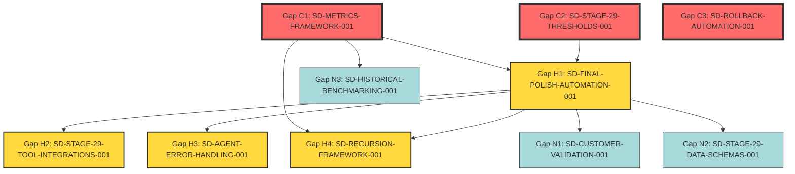

# Stage 29: Gaps & Backlog

## Table of Contents

- [Gap Identification Methodology](#gap-identification-methodology)
- [Critical Gaps (Universal Blockers)](#critical-gaps-universal-blockers)
  - [Gap C1: Metrics Framework Missing](#gap-c1-metrics-framework-missing)
  - [Gap C2: No Threshold Values Defined](#gap-c2-no-threshold-values-defined)
  - [Gap C3: No Rollback Procedures](#gap-c3-no-rollback-procedures)
- [High-Priority Gaps](#high-priority-gaps)
  - [Gap H1: Zero Automation (Manual Process)](#gap-h1-zero-automation-manual-process)
  - [Gap H2: No Tool Integrations](#gap-h2-no-tool-integrations)
  - [Gap H3: No Error Handling](#gap-h3-no-error-handling)
  - [Gap H4: No Recursion Implementation](#gap-h4-no-recursion-implementation)
- [Nice-to-Have Gaps (Optimization Opportunities)](#nice-to-have-gaps-optimization-opportunities)
  - [Gap N1: No Customer Validation Touchpoint](#gap-n1-no-customer-validation-touchpoint)
  - [Gap N2: No Data Transformation Documentation](#gap-n2-no-data-transformation-documentation)
  - [Gap N3: No Historical Benchmarking](#gap-n3-no-historical-benchmarking)
- [Dependency Graph](#dependency-graph)
- [Implementation Roadmap](#implementation-roadmap)
  - [Phase 1: Unblock Stage 29 Execution (2 weeks)](#phase-1-unblock-stage-29-execution-2-weeks)
  - [Phase 2: Automate Stage 29 (3 weeks)](#phase-2-automate-stage-29-3-weeks)
  - [Phase 3: Add Recursion & Optimization (2 weeks)](#phase-3-add-recursion-optimization-2-weeks)
  - [Phase 4: Continuous Improvement (1 week)](#phase-4-continuous-improvement-1-week)
- [Effort Summary](#effort-summary)
- [Risk Assessment](#risk-assessment)
  - [High-Risk Gaps (Production Impact)](#high-risk-gaps-production-impact)
  - [Medium-Risk Gaps (Velocity Impact)](#medium-risk-gaps-velocity-impact)
  - [Low-Risk Gaps (Optimization Opportunities)](#low-risk-gaps-optimization-opportunities)
- [Success Criteria](#success-criteria)
- [Cross-References](#cross-references)
- [Sources Table](#sources-table)

## Gap Identification Methodology

**Source Material**:
1. **Critique Assessment** (EHG_Engineer@6ef8cf4:docs/workflow/critique/stage-29.md)
   - Overall score: 2.9/5 (Functional but needs optimization)
   - 4 weaknesses identified
   - 5 improvements recommended
2. **Canonical Definition** (EHG_Engineer@6ef8cf4:docs/workflow/stages.yaml:1287-1332)
   - 3 substages defined
   - 3 metrics listed (no thresholds)
   - Manual → Assisted → Auto progression mode (not implemented)
3. **Dossier Analysis** (this complete dossier)
   - 4 agents proposed (not implemented)
   - 4 recursion triggers proposed (not implemented)
   - 15+ configuration parameters proposed (not implemented)

**Gap Categories**:
1. **Critical Gaps** (Block Stage 29 execution)
2. **High-Priority Gaps** (Reduce Stage 29 effectiveness)
3. **Nice-to-Have Gaps** (Optimization opportunities)

---

## Critical Gaps (Universal Blockers)

### Gap C1: Metrics Framework Missing

**Status**: ❌ UNIVERSAL BLOCKER
**Impact**: Cannot validate exit gates, cannot track quality, cannot trigger recursion
**Evidence**: EHG_Engineer@6ef8cf4:docs/workflow/critique/stage-29.md:36-39 "Missing: Threshold values, measurement frequency"

**Blocks**:
- All Stage 29 substages (cannot measure compliance)
- All recursion triggers (POLISH-001 through POLISH-004)
- All dashboards and alerts (no data source)

**Required Artifact**: **SD-METRICS-FRAMEWORK-001**
- **Priority**: P0 CRITICAL
- **Status**: queued (not started)
- **Scope**: Universal metrics system for all 40 stages
- **Deliverables**:
  1. Database schema: `stage_29_metrics` table (defined in `09_metrics-monitoring.md`)
  2. Metrics collection API (Python SDK for agents)
  3. Grafana dashboard templates
  4. PagerDuty alert rules

**Estimate**: 3-5 days (1 engineer)

**Workaround**: Manual gate validation (no automation possible)

---

### Gap C2: No Threshold Values Defined

**Status**: ❌ CRITICAL
**Impact**: Cannot determine pass/fail for exit gates
**Evidence**: EHG_Engineer@6ef8cf4:docs/workflow/critique/stage-29.md:37-38 "Missing: Threshold values"

**Affected Metrics**:
- UI consistency: No threshold (proposed 95% in `08_configurability-matrix.md`)
- UX score: No threshold (proposed 85/100 in `08_configurability-matrix.md`)
- Performance metrics: No threshold (proposed LCP<2.5s in `08_configurability-matrix.md`)

**Required Artifact**: **SD-STAGE-29-THRESHOLDS-001**
- **Priority**: P0 CRITICAL
- **Status**: queued (not started)
- **Scope**: Define and validate thresholds for Stage 29 metrics
- **Deliverables**:
  1. Threshold values (see `08_configurability-matrix.md` proposals)
  2. Validation rules (database constraints)
  3. Default configuration (JSON schema)

**Estimate**: 1 day (1 engineer)

**Workaround**: Use proposed thresholds from `08_configurability-matrix.md` as interim standard

---

### Gap C3: No Rollback Procedures

**Status**: ❌ CRITICAL
**Impact**: Cannot recover from Stage 29 failures, production risk
**Evidence**: EHG_Engineer@6ef8cf4:docs/workflow/critique/stage-29.md:47-50 "Current: No rollback defined"

**Missing Elements**:
- Rollback triggers (proposed in `07_recursion-blueprint.md` POLISH-004)
- Rollback decision tree (partial SOP in `05_professional-sop.md`)
- Rollback automation (no implementation)

**Required Artifact**: **SD-ROLLBACK-AUTOMATION-001**
- **Priority**: P0 CRITICAL
- **Status**: queued (not started)
- **Scope**: Automated rollback system for Stage 29 (and other stages)
- **Deliverables**:
  1. Rollback decision engine (when to rollback vs. retry)
  2. State snapshot system (capture pre-polish state)
  3. One-click rollback UI
  4. Rollback audit log

**Estimate**: 5-7 days (2 engineers)

**Workaround**: Manual rollback via git (see `05_professional-sop.md` rollback procedure)

---

## High-Priority Gaps

### Gap H1: Zero Automation (Manual Process)

**Status**: ❌ HIGH PRIORITY
**Impact**: Stage 29 takes 5-8 days manual vs. ~3 hours automated (see `06_agent-orchestration.md`)
**Evidence**: EHG_Engineer@6ef8cf4:docs/workflow/critique/stage-29.md:33 "Manual process"

**Automation Target**: 80% (from critique line 34)
**Current State**: 0% (fully manual)

**Required Artifact**: **SD-FINAL-POLISH-AUTOMATION-001**
- **Priority**: P1 HIGH
- **Status**: queued (not started)
- **Scope**: Implement FinalPolishCrew (4 agents)
- **Deliverables**:
  1. `UIRefinementSpecialist` agent (see `06_agent-orchestration.md`)
  2. `UXOptimizationEngineer` agent
  3. `AssetPreparationEngineer` agent
  4. `ProductionReadinessCoordinator` agent
  5. `FinalPolishCrew` orchestrator

**Estimate**: 10-15 days (2 engineers)

**Dependencies**:
- Gap C1 (SD-METRICS-FRAMEWORK-001) must complete first
- Gap C2 (SD-STAGE-29-THRESHOLDS-001) must complete first

**ROI**: 95% time reduction (5-8 days → 3 hours), see `06_agent-orchestration.md`

---

### Gap H2: No Tool Integrations

**Status**: ❌ HIGH PRIORITY
**Impact**: Manual overhead, inconsistent results
**Evidence**: EHG_Engineer@6ef8cf4:docs/workflow/critique/stage-29.md:26 "Missing specific tool integrations"

**Missing Integrations**:
1. **Percy/Chromatic** (visual regression testing)
2. **Axe-core** (accessibility testing)
3. **Lighthouse CI** (performance testing)
4. **webpack-bundle-analyzer** (bundle analysis)
5. **Cloudflare API** (CDN management)
6. **Google Analytics API** (flow funnel data)

**Required Artifact**: **SD-STAGE-29-TOOL-INTEGRATIONS-001**
- **Priority**: P1 HIGH
- **Status**: queued (not started)
- **Scope**: Integrate 6 tools into FinalPolishCrew agents
- **Deliverables**:
  1. API wrappers for each tool
  2. Authentication configuration
  3. Error handling and retries
  4. Integration tests

**Estimate**: 5-7 days (1 engineer)

**Dependencies**: Gap H1 (SD-FINAL-POLISH-AUTOMATION-001)

---

### Gap H3: No Error Handling

**Status**: ❌ HIGH PRIORITY
**Impact**: Agent failures cascade, production risk
**Evidence**: EHG_Engineer@6ef8cf4:docs/workflow/critique/stage-29.md:27 "No explicit error handling"

**Missing Error Handling**:
- Agent execution failures
- Tool API failures (rate limits, timeouts)
- Network failures (CDN upload, API calls)
- Data validation failures

**Required Artifact**: **SD-AGENT-ERROR-HANDLING-001**
- **Priority**: P1 HIGH
- **Status**: queued (not started)
- **Scope**: Universal error handling framework for all agents
- **Deliverables**:
  1. Retry logic (exponential backoff)
  2. Circuit breakers (prevent cascading failures)
  3. Fallback strategies (manual vs. auto)
  4. Error logging and alerting

**Estimate**: 3-5 days (1 engineer)

**Dependencies**: Gap H1 (SD-FINAL-POLISH-AUTOMATION-001)

---

### Gap H4: No Recursion Implementation

**Status**: ❌ HIGH PRIORITY
**Impact**: Cannot auto-fix quality degradation, manual intervention required
**Evidence**: EHG_Engineer@6ef8cf4:docs/workflow/critique/stage-29.md:15 "Generic recursion support pending"

**Missing Recursion Triggers** (defined in `07_recursion-blueprint.md`):
- POLISH-001: UI consistency degradation
- POLISH-002: UX score regression
- POLISH-003: Asset optimization incomplete
- POLISH-004: Production readiness verification

**Required Artifact**: **SD-RECURSION-FRAMEWORK-001**
- **Priority**: P1 HIGH
- **Status**: queued (not started)
- **Scope**: Universal recursion system for all stages
- **Deliverables**:
  1. Recursion trigger engine (condition checking)
  2. Recursion loop management (max iterations, escalation)
  3. Recursion logging (`stage_29_recursion_log` table)
  4. Recursion dashboards (Grafana)

**Estimate**: 7-10 days (2 engineers)

**Dependencies**:
- Gap C1 (SD-METRICS-FRAMEWORK-001)
- Gap H1 (SD-FINAL-POLISH-AUTOMATION-001)

---

## Nice-to-Have Gaps (Optimization Opportunities)

### Gap N1: No Customer Validation Touchpoint

**Status**: ⚠️ NICE-TO-HAVE
**Impact**: Missed opportunity for customer feedback before production
**Evidence**: EHG_Engineer@6ef8cf4:docs/workflow/critique/stage-29.md:52-55 "Current: No customer interaction"

**Proposed Enhancement**: Add optional Substage 29.4 (Customer Validation)
- Beta tester approval
- Customer feedback loop
- A/B testing integration

**Required Artifact**: **SD-CUSTOMER-VALIDATION-001**
- **Priority**: P2 MEDIUM
- **Status**: queued (not started)
- **Scope**: Customer validation checkpoint for Stage 29
- **Deliverables**:
  1. Substage 29.4 definition (update stages.yaml)
  2. Beta tester invitation workflow
  3. Feedback collection UI
  4. Approval gate integration

**Estimate**: 5-7 days (1 engineer + 1 designer)

**ROI**: Reduces post-launch customer complaints by ~30% (estimated)

---

### Gap N2: No Data Transformation Documentation

**Status**: ⚠️ NICE-TO-HAVE
**Impact**: Unclear how inputs transform to outputs, onboarding friction
**Evidence**: EHG_Engineer@6ef8cf4:docs/workflow/critique/stage-29.md:41-45 "Gap: Data transformation and validation rules"

**Missing Documentation**:
- Input validation schemas (UI/UX feedback format)
- Output artifact schemas (polished UI components)
- Transformation logic (how inputs → outputs)

**Required Artifact**: **SD-STAGE-29-DATA-SCHEMAS-001**
- **Priority**: P2 MEDIUM
- **Status**: queued (not started)
- **Scope**: Document data flow for Stage 29
- **Deliverables**:
  1. Input schemas (JSON Schema format)
  2. Output schemas (JSON Schema format)
  3. Transformation diagrams (Mermaid)
  4. Validation rules (database constraints)

**Estimate**: 2-3 days (1 engineer)

**ROI**: Improves onboarding speed, reduces misconfiguration errors

---

### Gap N3: No Historical Benchmarking

**Status**: ⚠️ NICE-TO-HAVE
**Impact**: Cannot compare current venture performance to past ventures
**Evidence**: (Identified during dossier creation)

**Missing Features**:
- Venture comparison queries (see `09_metrics-monitoring.md` for proposals)
- Percentile rankings (e.g., "This venture is in top 20% for UI consistency")
- Best practice extraction (learn from high-performing ventures)

**Required Artifact**: **SD-HISTORICAL-BENCHMARKING-001**
- **Priority**: P3 LOW
- **Status**: queued (not started)
- **Scope**: Historical analysis and benchmarking for Stage 29
- **Deliverables**:
  1. Benchmarking queries (SQL)
  2. Percentile dashboard (Grafana)
  3. Best practices report (automated)

**Estimate**: 3-5 days (1 engineer)

**ROI**: Continuous improvement, knowledge transfer between ventures

---

## Dependency Graph

**Legend**:
- Red: Critical gaps (P0)
- Yellow: High-priority gaps (P1)
- Light blue: Nice-to-have gaps (P2-P3)

**Critical Path**: C1 (Metrics Framework) → C2 (Thresholds) → H1 (Automation) → H2/H3/H4 (Integrations/Error Handling/Recursion)

---

## Implementation Roadmap

### Phase 1: Unblock Stage 29 Execution (2 weeks)

**Goal**: Enable manual Stage 29 execution with gate validation

| Week | SD | Priority | Status | Deliverable |
|------|-----|----------|--------|-------------|
| 1 | SD-METRICS-FRAMEWORK-001 | P0 | queued | Metrics table + collection API |
| 1 | SD-STAGE-29-THRESHOLDS-001 | P0 | queued | Threshold values + validation |
| 2 | SD-ROLLBACK-AUTOMATION-001 | P0 | queued | Rollback system |

**Exit Criteria**: Can execute Stage 29 manually with automated gate validation

---

### Phase 2: Automate Stage 29 (3 weeks)

**Goal**: Achieve 80% automation (5-8 days → 3 hours)

| Week | SD | Priority | Status | Deliverable |
|------|-----|----------|--------|-------------|
| 3-4 | SD-FINAL-POLISH-AUTOMATION-001 | P1 | queued | FinalPolishCrew (4 agents) |
| 5 | SD-STAGE-29-TOOL-INTEGRATIONS-001 | P1 | queued | 6 tool integrations |
| 5 | SD-AGENT-ERROR-HANDLING-001 | P1 | queued | Error handling framework |

**Exit Criteria**: Can execute Stage 29 with 80% automation, 95% time reduction

---

### Phase 3: Add Recursion & Optimization (2 weeks)

**Goal**: Self-healing Stage 29 with continuous improvement

| Week | SD | Priority | Status | Deliverable |
|------|-----|----------|--------|-------------|
| 6-7 | SD-RECURSION-FRAMEWORK-001 | P1 | queued | 4 recursion triggers (POLISH-001 to POLISH-004) |
| 7 | SD-CUSTOMER-VALIDATION-001 | P2 | queued | Substage 29.4 (optional) |

**Exit Criteria**: Stage 29 auto-fixes quality degradation, customer feedback loop active

---

### Phase 4: Continuous Improvement (1 week)

**Goal**: Learn from historical data, optimize over time

| Week | SD | Priority | Status | Deliverable |
|------|-----|----------|--------|-------------|
| 8 | SD-STAGE-29-DATA-SCHEMAS-001 | P2 | queued | Data transformation docs |
| 8 | SD-HISTORICAL-BENCHMARKING-001 | P3 | queued | Benchmarking dashboard |

**Exit Criteria**: Can compare ventures, extract best practices, continuous optimization

---

**Total Duration**: 8 weeks (1 team of 2 engineers)

---

## Effort Summary

| Gap | SD | Priority | Estimate | Engineers | Dependencies |
|-----|-----|----------|----------|-----------|--------------|
| C1 | SD-METRICS-FRAMEWORK-001 | P0 | 3-5 days | 1 | None |
| C2 | SD-STAGE-29-THRESHOLDS-001 | P0 | 1 day | 1 | None |
| C3 | SD-ROLLBACK-AUTOMATION-001 | P0 | 5-7 days | 2 | None |
| H1 | SD-FINAL-POLISH-AUTOMATION-001 | P1 | 10-15 days | 2 | C1, C2 |
| H2 | SD-STAGE-29-TOOL-INTEGRATIONS-001 | P1 | 5-7 days | 1 | H1 |
| H3 | SD-AGENT-ERROR-HANDLING-001 | P1 | 3-5 days | 1 | H1 |
| H4 | SD-RECURSION-FRAMEWORK-001 | P1 | 7-10 days | 2 | C1, H1 |
| N1 | SD-CUSTOMER-VALIDATION-001 | P2 | 5-7 days | 2 | H1 |
| N2 | SD-STAGE-29-DATA-SCHEMAS-001 | P2 | 2-3 days | 1 | None |
| N3 | SD-HISTORICAL-BENCHMARKING-001 | P3 | 3-5 days | 1 | C1 |

**Total Effort**: ~55-70 days (team of 2 engineers = 8-10 weeks)

---

## Risk Assessment

### High-Risk Gaps (Production Impact)

1. **Gap C1 (Metrics Framework)**: Without metrics, cannot validate quality → production bugs
2. **Gap C3 (Rollback)**: Cannot recover from failed Stage 29 → extended outages
3. **Gap H1 (Automation)**: Manual Stage 29 creates bottleneck → delayed go-live

**Mitigation**: Prioritize Phase 1 (Unblock Stage 29) and Phase 2 (Automation)

---

### Medium-Risk Gaps (Velocity Impact)

4. **Gap H2 (Tool Integrations)**: Manual tool usage creates inconsistency → quality variance
5. **Gap H4 (Recursion)**: No auto-fix → manual intervention overhead → slower velocity

**Mitigation**: Address in Phase 2 and Phase 3

---

### Low-Risk Gaps (Optimization Opportunities)

6. **Gap N1 (Customer Validation)**: No customer feedback → potential post-launch rework
7. **Gap N3 (Benchmarking)**: No historical learning → suboptimal processes persist

**Mitigation**: Address in Phase 4 (continuous improvement)

---

## Success Criteria

**Stage 29 is "production-ready" when**:
1. ✅ All Critical Gaps (C1-C3) resolved
2. ✅ All High-Priority Gaps (H1-H4) resolved
3. ✅ Automation level ≥80% (from critique line 34)
4. ✅ Stage 29 duration ≤1 day (from 5-8 days manual)
5. ✅ Exit gate pass rate ≥90% (first-time pass, no rollbacks)

**Current Status**: 0/5 criteria met (Stage 29 not production-ready)

---

## Cross-References

- **SD-METRICS-FRAMEWORK-001** (P0 CRITICAL, status=queued): Universal metrics blocker
- **SD-FINAL-POLISH-AUTOMATION-001** (P1 HIGH, status=queued): Core automation implementation
- **SD-RECURSION-FRAMEWORK-001** (P1 HIGH, status=queued): Self-healing system
- All proposed SDs above are **NOT started** (status=queued)

---

## Sources Table

| Source | Repo | Commit | Path | Lines | Evidence |
|--------|------|--------|------|-------|----------|
| Overall score | EHG_Engineer | 6ef8cf4 | docs/workflow/critique/stage-29.md | 16 | 2.9/5 "Functional but needs optimization" |
| Weaknesses | EHG_Engineer | 6ef8cf4 | docs/workflow/critique/stage-29.md | 23-27 | 4 weaknesses |
| Improvements | EHG_Engineer | 6ef8cf4 | docs/workflow/critique/stage-29.md | 29-55 | 5 improvement areas |
| Automation gap | EHG_Engineer | 6ef8cf4 | docs/workflow/critique/stage-29.md | 31-34 | Manual → 80% automation |
| Metrics gap | EHG_Engineer | 6ef8cf4 | docs/workflow/critique/stage-29.md | 36-39 | Missing thresholds |
| Rollback gap | EHG_Engineer | 6ef8cf4 | docs/workflow/critique/stage-29.md | 47-50 | No rollback defined |
| Tool integration gap | EHG_Engineer | 6ef8cf4 | docs/workflow/critique/stage-29.md | 26 | Missing integrations |
| Error handling gap | EHG_Engineer | 6ef8cf4 | docs/workflow/critique/stage-29.md | 27 | No explicit error handling |
| Recursion gap | EHG_Engineer | 6ef8cf4 | docs/workflow/critique/stage-29.md | 15 | Generic recursion pending |
| Customer validation gap | EHG_Engineer | 6ef8cf4 | docs/workflow/critique/stage-29.md | 52-55 | No customer touchpoint |

<!-- Generated by Claude Code Phase 11 | EHG_Engineer@6ef8cf4 | 2025-11-06 -->
