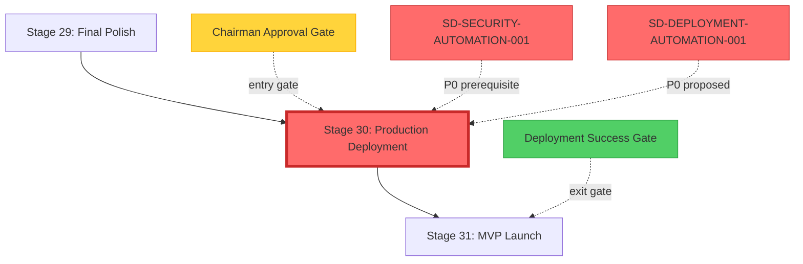

# Stage 30: Stage Map & Dependencies

## Dependency Graph

**Legend**:
- 🔴 Red border = Critical Path stage (highest priority)
- 🟡 Yellow = Chairman approval gate
- 🟢 Green = Exit gate
- 🔴 Red SD boxes = P0 CRITICAL dependencies

---

## Direct Dependencies

### Upstream (Must Complete Before Stage 30)

**Stage 29: Final Polish**
- **Relationship**: Prerequisite
- **Evidence**: EHG_Engineer@6ef8cf4:docs/workflow/stages.yaml:1337 "depends_on: - 29"
- **Requirements**: Release candidate prepared, final QA passed
- **Handoff**: Release candidate artifact + deployment plan

### Downstream (Blocked Until Stage 30 Completes)

**Stage 31: MVP Launch**
- **Relationship**: Direct successor
- **Evidence**: EHG_Engineer@6ef8cf4:docs/workflow/stages.yaml:1379-1424 "id: 31, title: MVP Launch"
- **Requirements**: Production deployment successful, monitoring active
- **Handoff**: Live production URL + monitoring dashboard

---

## Critical Path Status

**Critical Path**: ⚠️ **YES**
**Evidence**: EHG_Engineer@6ef8cf4:docs/workflow/critique/stage-30.md:60 "Critical Path: Yes"

**Impact of Delays**:
- Blocks MVP Launch (Stage 31)
- Delays market entry
- Impacts customer onboarding (Stage 32)
- Cascades to all post-production stages (32-40)

**Risk Multiplier**: 4/5 Risk Exposure × Critical Path = Maximum priority stage

---

## Transitive Dependencies

### Two Stages Back
- **Stage 28**: Quality Gates (depends on 27)
- **Evidence**: EHG_Engineer@6ef8cf4:docs/workflow/stages.yaml:1287 "depends_on: - 27"

### Two Stages Forward
- **Stage 32**: Onboard First Users (depends on 31)
- **Evidence**: EHG_Engineer@6ef8cf4:docs/workflow/stages.yaml:1425 "depends_on: - 31"

---

## Strategic Directive Dependencies

### Security Prerequisite (P0)
**SD-SECURITY-AUTOMATION-001**
- **Priority**: P0 CRITICAL
- **Status**: queued (not implemented)
- **Evidence**: EHG_Engineer@6ef8cf4:docs/workflow/dossiers/stage-26/10_gaps-backlog.md:15 "SD-SECURITY-AUTOMATION-001 (P0 CRITICAL)"
- **Blocks**: Production deployment until security automation complete

### Deployment Automation (P0 Proposed)
**SD-DEPLOYMENT-AUTOMATION-001**
- **Priority**: P0 CRITICAL (proposed in this dossier)
- **Status**: queued (proposed)
- **Scope**: Blue-green deployment automation, rollback system, zero-downtime orchestration
- **See**: `10_gaps-backlog.md` for full directive proposal

### Metrics Framework (P0 Universal)
**SD-METRICS-FRAMEWORK-001**
- **Priority**: P0 CRITICAL (universal blocker)
- **Status**: queued
- **Evidence**: Referenced across all stage dossiers
- **Blocks**: Deployment metrics tracking (success rate, downtime, rollback time)

### Recursion Engine (P0 Universal)
**SD-RECURSION-ENGINE-001**
- **Priority**: P0 CRITICAL (universal blocker)
- **Status**: queued
- **Blocks**: Automated deployment triggers (see `07_recursion-blueprint.md`)

---

## Phase Context

**EXEC Phase (Stages 26-40)**
- Stage 26: Security Hardening ✅ (prerequisite)
- Stage 27: Load Testing
- Stage 28: Quality Gates
- Stage 29: Final Polish ✅ (direct dependency)
- **Stage 30: Production Deployment** ⬅️ YOU ARE HERE
- Stage 31: MVP Launch ⚠️ (blocked by this stage)
- Stage 32-40: Post-Production stages (all blocked)

**Evidence**: EHG_Engineer@6ef8cf4:docs/workflow/stages.yaml:1-2000 "40-stage workflow structure"

---

## Workflow Position

**Stage 30 of 40** (75% through workflow)
**Phase**: EXEC (6th of 15 EXEC stages)
**Critical Path**: YES
**Chairman Gate**: YES (entry gate)

---

## Sources Table

| Source | Repo | Commit | Path | Lines | Purpose |
|--------|------|--------|------|-------|---------|
| Stage 30 definition | EHG_Engineer | 6ef8cf4 | docs/workflow/stages.yaml | 1333-1378 | Canonical dependencies |
| Stage 29 definition | EHG_Engineer | 6ef8cf4 | docs/workflow/stages.yaml | 1287-1332 | Upstream dependency |
| Stage 31 definition | EHG_Engineer | 6ef8cf4 | docs/workflow/stages.yaml | 1379-1424 | Downstream dependency |
| Critique | EHG_Engineer | 6ef8cf4 | docs/workflow/critique/stage-30.md | 60 | Critical path confirmation |
| Security SD reference | EHG_Engineer | 6ef8cf4 | docs/workflow/dossiers/stage-26/10_gaps-backlog.md | 15 | Security prerequisite |

---

**Next**: See `03_canonical-definition.md` for full YAML specification.

<!-- Generated by Claude Code Phase 11 | EHG_Engineer@6ef8cf4 | 2025-11-06 -->
