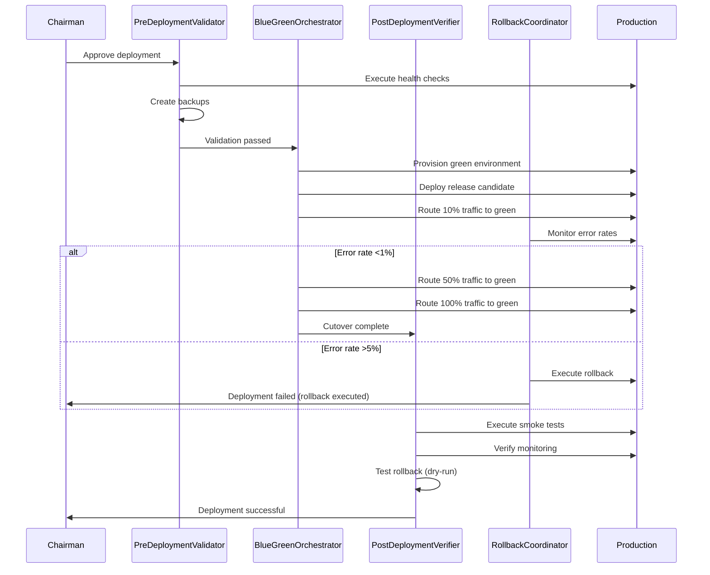

# Stage 30: Agent Orchestration

## Proposed DeploymentCrew (Python CrewAI)

**Status**: ⚠️ NOT IMPLEMENTED (requires SD-DEPLOYMENT-AUTOMATION-001)

**Crew Name**: `DeploymentCrew`
**Purpose**: Orchestrate blue-green production deployment with zero-downtime and automated rollback
**Phase**: EXEC (Stage 30)

---

## Agent Architecture

### Agent 1: PreDeploymentValidator
**Role**: Pre-flight validation and readiness checks

**Responsibilities**:
- Execute health checks against production environment (database, API, external dependencies)
- Verify dependency availability (Supabase, Stripe, email service)
- Create and verify database backups
- Generate pre-deployment validation report

**Inputs**:
- Production environment configuration
- Health check endpoints
- Backup configuration

**Outputs**:
- Validation report (pass/fail status)
- Backup metadata (location, checksum, timestamp)
- Dependency status matrix

**Tools**:
- `health_check_tool` — Execute HTTP health checks
- `backup_tool` — Create and verify database backups
- `dependency_monitor_tool` — Check external service status

**Exit Criteria**: All health checks pass, backups created and verified

**Evidence**: EHG_Engineer@6ef8cf4:docs/workflow/stages.yaml:1359-1364 "Pre-Deployment Validation"

---

### Agent 2: BlueGreenOrchestrator
**Role**: Blue-green deployment execution and traffic management

**Responsibilities**:
- Provision green environment (parallel to blue/production)
- Deploy release candidate to green environment
- Execute database migrations (if schema changes)
- Perform gradual traffic cutover (canary deployment pattern: 10% → 50% → 100%)
- Monitor error rates and response times during cutover

**Inputs**:
- Release candidate artifact (Docker image/build)
- Deployment configuration
- Traffic routing rules

**Outputs**:
- Green environment URL
- Traffic routing status (% green vs blue)
- Cutover timeline and metrics

**Tools**:
- `kubernetes_tool` — Provision and manage green environment
- `traffic_router_tool` — Gradual traffic switching
- `metrics_monitor_tool` — Real-time error rate and latency tracking

**Exit Criteria**: 100% traffic routed to green, error rates <1%, response times <500ms p95

**Evidence**: EHG_Engineer@6ef8cf4:docs/workflow/stages.yaml:1365-1370 "Blue-Green Deployment"

**Risk**: Highest risk agent (4/5 Risk Exposure) — Production traffic cutover

---

### Agent 3: PostDeploymentVerifier
**Role**: Post-deployment validation and monitoring setup

**Responsibilities**:
- Execute comprehensive smoke test suite against green environment
- Verify critical user flows (authentication, CRUD, integrations)
- Confirm monitoring stack operational (dashboards, alerts, logs)
- Validate rollback capability (dry-run test)

**Inputs**:
- Green environment URL
- Smoke test suite
- Monitoring configuration

**Outputs**:
- Smoke test results (pass/fail report)
- Monitoring dashboard URLs
- Rollback dry-run results

**Tools**:
- `test_execution_tool` — Run smoke tests
- `monitoring_setup_tool` — Configure dashboards and alerts
- `rollback_test_tool` — Execute dry-run rollback

**Exit Criteria**: All smoke tests pass, monitoring active, rollback tested

**Evidence**: EHG_Engineer@6ef8cf4:docs/workflow/stages.yaml:1371-1376 "Post-Deployment Verification"

---

### Agent 4: RollbackCoordinator
**Role**: Automated rollback on deployment failure

**Responsibilities**:
- Monitor deployment health (error rates, response times, database connections)
- Detect rollback triggers (error rate >5%, smoke test failures, health check failures)
- Execute appropriate rollback type (traffic rollback, database rollback, full rollback)
- Document rollback reason and timeline

**Inputs**:
- Deployment metrics (real-time)
- Rollback thresholds
- Backup metadata

**Outputs**:
- Rollback decision (execute/abort)
- Rollback type (traffic/database/full)
- Rollback timeline and results

**Tools**:
- `metrics_monitor_tool` — Real-time error rate tracking
- `traffic_router_tool` — Route traffic back to blue
- `backup_restore_tool` — Restore database from backup

**Exit Criteria**: Traffic routed back to blue, error rates normalized, rollback documented

**Evidence**: EHG_Engineer@6ef8cf4:docs/workflow/critique/stage-30.md:47-50 "Define rollback decision tree"

**Trigger Conditions**:
- Error rate >5% for 2 minutes during cutover
- Smoke tests fail after deployment
- Health checks fail on green environment
- Manual rollback command (Chairman override)

---

## Crew Workflow (Mermaid Diagram)

---

## Execution Flow

### Phase 1: Pre-Deployment (Substage 30.1)
**Duration**: 15-30 minutes

1. **PreDeploymentValidator** executes:
   - Health check validation (Step 1.1)
   - Dependency verification (Step 1.2)
   - Backup creation (Step 1.3)

2. **Exit Criteria**: All health checks pass, backups verified

### Phase 2: Blue-Green Deployment (Substage 30.2)
**Duration**: 30-60 minutes

1. **BlueGreenOrchestrator** executes:
   - Green environment provisioning (Step 2.1)
   - Traffic switching with canary pattern (Step 2.2)
   - Validation complete (Step 2.3)

2. **RollbackCoordinator** monitors in parallel:
   - Error rates (threshold: >5%)
   - Response times (threshold: >500ms p95)
   - Database connection pool (threshold: >80% saturation)

3. **Exit Criteria**: 100% traffic on green, error rates <1%

### Phase 3: Post-Deployment (Substage 30.3)
**Duration**: 15-30 minutes

1. **PostDeploymentVerifier** executes:
   - Smoke tests (Step 4.1)
   - Monitoring confirmation (Step 4.2)
   - Rollback testing (Step 4.3)

2. **Exit Criteria**: All smoke tests pass, monitoring active

---

## Handoff to Governance Layer

**No direct handoff to Node.js sub-agents** at Stage 30. Deployment is infrastructure-focused.

**Handoff to Stage 31 (MVP Launch)**:
- Production deployment URL
- Monitoring dashboard URLs
- Deployment success metrics (success rate, downtime, rollback time)

**Handoff Format**: See `docs/reference/unified-handoff-system.md` (7-element structure)

---

## Error Handling

### PreDeploymentValidator Failures
**Trigger**: Health checks fail, dependencies unavailable, backup creation fails

**Action**: ABORT deployment, create incident ticket, notify Chairman

**Recursion**: Trigger DEPLOY-001 ("Health checks fail") → Manual investigation

### BlueGreenOrchestrator Failures
**Trigger**: Green environment unhealthy, traffic cutover error rate >5%

**Action**: Execute rollback via RollbackCoordinator

**Recursion**: Trigger DEPLOY-002 ("Smoke tests fail") → Automated rollback

### PostDeploymentVerifier Failures
**Trigger**: Smoke tests fail, monitoring unavailable

**Action**: Execute rollback via RollbackCoordinator

**Recursion**: Trigger DEPLOY-002 ("Smoke tests fail") → Automated rollback

### RollbackCoordinator Failures
**Trigger**: Rollback execution fails (rare)

**Action**: Manual intervention, escalate to Chairman

**Recursion**: Trigger DEPLOY-003 ("Zero-downtime violated") → Emergency response

---

## Proposed Implementation Path

**Strategic Directive**: SD-DEPLOYMENT-AUTOMATION-001 (P0 CRITICAL)

**Phase 1**: Build PreDeploymentValidator agent (health checks, backups)
**Phase 2**: Build RollbackCoordinator agent (monitoring, rollback decision tree)
**Phase 3**: Build BlueGreenOrchestrator agent (green environment, traffic switching)
**Phase 4**: Build PostDeploymentVerifier agent (smoke tests, monitoring setup)
**Phase 5**: Integrate agents into DeploymentCrew

**Estimated Effort**: 3-4 sprints (12-16 weeks)

**Dependencies**:
- SD-SECURITY-AUTOMATION-001 (P0 prerequisite)
- SD-METRICS-FRAMEWORK-001 (P0 universal blocker)
- SD-RECURSION-ENGINE-001 (P0 universal blocker)

---

## Sources Table

| Source | Repo | Commit | Path | Lines | Purpose |
|--------|------|--------|------|-------|---------|
| Substages | EHG_Engineer | 6ef8cf4 | docs/workflow/stages.yaml | 1358-1376 | Agent responsibilities |
| Rollback recommendation | EHG_Engineer | 6ef8cf4 | docs/workflow/critique/stage-30.md | 47-50 | RollbackCoordinator design |
| Automation target | EHG_Engineer | 6ef8cf4 | docs/workflow/critique/stage-30.md | 31-34 | 80% automation goal |
| Unified handoff system | EHG_Engineer | 6ef8cf4 | docs/reference/unified-handoff-system.md | N/A | Handoff format reference |

---

**Next**: See `07_recursion-blueprint.md` for proposed recursion triggers.

<!-- Generated by Claude Code Phase 11 | EHG_Engineer@6ef8cf4 | 2025-11-06 -->
