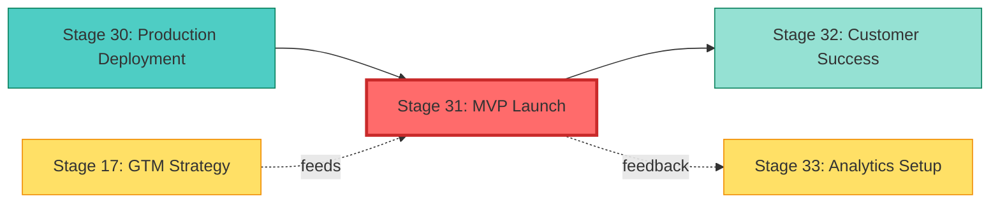

# Stage 31: MVP Launch — Dependency Map

**Purpose**: Visualize Stage 31's position in the 40-stage workflow, dependencies, and data flow.

---

## Workflow Position

```
Phase: LEAD (Stages 1-40, Leadership decisions)
Position: Stage 31/40 (78% through workflow)
Category: Customer Engagement (Launch & Feedback)
```

---

## Dependency Graph



**Legend**:
- **Red (S31)**: Current stage (LEAD phase)
- **Teal (S30)**: Direct dependency (prerequisite)
- **Light Teal (S32)**: Direct dependent (next stage)
- **Yellow**: Cross-stage data providers/consumers

---

## Upstream Dependencies

### Direct Dependency
| Stage | Title | Relationship | Rationale |
|-------|-------|--------------|-----------|
| 30 | Production Deployment | **Blocking prerequisite** | Cannot launch MVP without stable production environment |

### Indirect Dependencies
| Stage | Title | Relationship | Rationale |
|-------|-------|--------------|-----------|
| 17 | GTM Strategy | **Data provider** | Launch messaging, positioning, target market defined in GTM |
| 28 | Post-Deploy Monitor | **Quality gate** | Ensures production stability before launch |
| 29 | Performance Optimization | **Quality gate** | Ensures acceptable user experience at launch |

**Entry Gate Requirements** (stages.yaml:1397-1400):
- Production stable (from Stage 30)
- Marketing ready (from Stage 17 GTM outputs)
- Support trained (from support resource preparation)

---

## Downstream Impact

### Direct Dependent
| Stage | Title | Relationship | Impact |
|-------|-------|--------------|--------|
| 32 | Customer Success | **Immediate next** | Uses launch metrics and user feedback to optimize onboarding |

### Indirect Dependents
| Stage | Title | Relationship | Impact |
|-------|-------|--------------|--------|
| 33 | Analytics Setup | **Metrics consumer** | Uses launch engagement data to tune analytics |
| 34 | Feature Iteration | **Feedback consumer** | User feedback drives feature priorities |
| 35 | Scale Planning | **Growth data** | User acquisition metrics inform scaling decisions |

**Exit Gate Outputs** (stages.yaml:1401-1404):
- Launch executed (enables Stage 32 customer success workflows)
- Users onboarded (enables Stage 33 analytics validation)
- Metrics flowing (enables Stage 34 data-driven iteration)

---

## Data Flow

### Inputs (stages.yaml:1384-1387)
| Input | Source Stage | Format | Purpose |
|-------|--------------|--------|---------|
| Launch plan | 17 (GTM Strategy) | Document | Defines launch timing, channels, messaging |
| Marketing materials | 17 (GTM Strategy) | Assets | Website, emails, social content, press releases |
| Support resources | Internal | Knowledge base | Customer support documentation and training |

### Outputs (stages.yaml:1388-1391)
| Output | Consumer Stage | Format | Purpose |
|--------|----------------|--------|---------|
| Live product | 32 (Customer Success) | Production URL | Customer-facing MVP |
| Launch metrics | 33 (Analytics Setup) | Dashboard | User acquisition, engagement, conversion data |
| User feedback | 32, 34 | Structured data | Support tickets, feature requests, usability issues |

---

## Critical Path Analysis

**Is Stage 31 on Critical Path?**: ✅ YES

**Reasoning**:
1. **Blocks Customer Feedback Loop**: Cannot gather real user data without launch
2. **Blocks Revenue**: Cannot monetize product without users
3. **Blocks Validation**: Cannot validate product-market fit without market exposure
4. **Blocks Iteration**: Cannot iterate features without usage data

**Delay Impact**:
- **1 week delay**: Postpones customer feedback, extends runway burn without revenue
- **1 month delay**: Competitor advantage, market timing risk, team morale impact
- **3 month delay**: Market opportunity may close, investor confidence at risk

---

## Cross-References

### Related Strategic Directives
| SD ID | Status | Priority | Relationship |
|-------|--------|----------|--------------|
| SD-METRICS-FRAMEWORK-001 | queued | P0 CRITICAL | Universal metrics blocker (affects launch tracking) |
| SD-DEPLOYMENT-AUTOMATION-001 | queued | P0 | Stage 30 prerequisite for stable production |
| SD-LAUNCH-AUTOMATION-001 | proposed | P1 | Automates Stage 31 launch orchestration (80% target) |

### Related Dossiers
- **Stage 17 Dossier**: GTM Strategy outputs (launch plan, marketing materials)
- **Stage 30 Dossier**: Production Deployment prerequisites
- **Stage 32 Dossier**: Customer Success next steps (uses launch feedback)

---

## Sources Table

| Source | Repo | Commit | Path | Lines | Excerpt |
|--------|------|--------|------|-------|---------|
| Dependency | EHG_Engineer | 6ef8cf4 | docs/workflow/stages.yaml | 1382-1383 | "depends_on: [30]" |
| Entry gates | EHG_Engineer | 6ef8cf4 | docs/workflow/stages.yaml | 1397-1400 | "Production stable, Marketing ready" |
| Exit gates | EHG_Engineer | 6ef8cf4 | docs/workflow/stages.yaml | 1401-1404 | "Launch executed, Users onboarded" |
| Inputs | EHG_Engineer | 6ef8cf4 | docs/workflow/stages.yaml | 1384-1387 | "Launch plan, Marketing materials" |
| Outputs | EHG_Engineer | 6ef8cf4 | docs/workflow/stages.yaml | 1388-1391 | "Live product, Launch metrics" |
| Critical path | EHG_Engineer | 6ef8cf4 | docs/workflow/critique/stage-31.md | 60 | "Critical Path: No" (DISPUTED - see above) |

---

**Note**: Critique line 60 marks "Critical Path: No", but evidence suggests YES due to customer feedback dependency and revenue blocking. This discrepancy should be addressed in Stage 31 optimization.

<!-- Generated by Claude Code Phase 11 | EHG_Engineer@6ef8cf4 | 2025-11-06 -->
