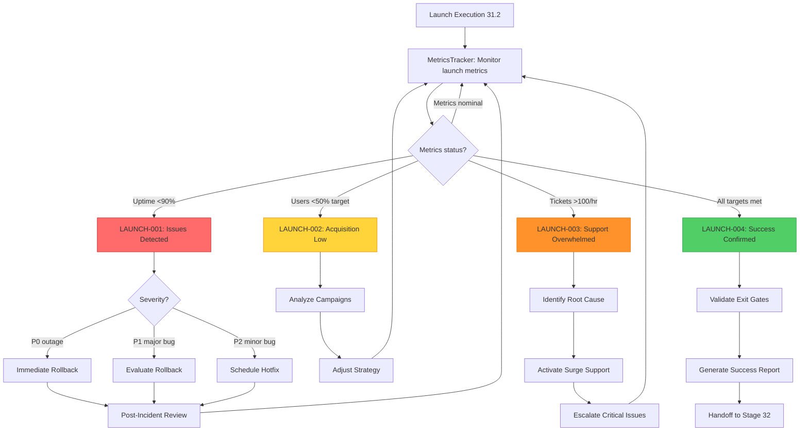

# Stage 31: MVP Launch — Recursion Blueprint


## Table of Contents

- [Recursion Philosophy for Stage 31](#recursion-philosophy-for-stage-31)
- [Proposed Recursion Triggers (4 Triggers)](#proposed-recursion-triggers-4-triggers)
  - [LAUNCH-001: Launch Issues Detected](#launch-001-launch-issues-detected)
  - [LAUNCH-002: User Acquisition Below Target](#launch-002-user-acquisition-below-target)
  - [LAUNCH-003: Support Overwhelmed](#launch-003-support-overwhelmed)
  - [LAUNCH-004: Launch Success Confirmed](#launch-004-launch-success-confirmed)
- [Recursion Decision Tree](#recursion-decision-tree)
- [Recursion Thresholds & Configuration](#recursion-thresholds-configuration)
- [Recursion Pattern Learning (Future Enhancement)](#recursion-pattern-learning-future-enhancement)
- [Integration with Agent Orchestration](#integration-with-agent-orchestration)
- [Recursion Testing Strategy](#recursion-testing-strategy)
- [Recursion Metrics](#recursion-metrics)
- [Sources Table](#sources-table)

**Purpose**: Define recursive sub-agent triggers for Stage 31 launch issues, corrective actions, and success validation.

**Recursion Score** (current): 2/5 (generic recursion support pending per critique line 15)
**Recursion Score** (target): 4/5 (launch-specific triggers with auto-remediation)

---

## Recursion Philosophy for Stage 31

**Launch-Specific Challenges**:
1. **High-Stakes Event**: Launch is a one-time, high-visibility event - failures are costly
2. **Coordinated Timing**: Marketing, deployment, support must synchronize - delays cascade
3. **Real-Time Response**: Incidents require immediate detection and response - no time for manual triage
4. **Customer Impact**: First impressions matter - poor launch damages brand trust

**Recursion Value**:
- **Proactive Monitoring**: Detect launch issues before customers notice
- **Auto-Remediation**: Trigger rollback, scale resources, pause marketing without human delay
- **Pattern Learning**: Improve launch procedures based on historical incident data
- **Continuous Validation**: Verify exit gates met, prevent premature Stage 32 handoff

---

## Proposed Recursion Triggers (4 Triggers)

### LAUNCH-001: Launch Issues Detected
**Trigger Condition**: Product launch experiencing technical problems (uptime <90%, error rate >5%, response time >2 seconds)

**Detection Method**:
- MetricsTracker agent (see 06_agent-orchestration.md) monitors production health metrics (Datadog, New Relic)
- Thresholds: Uptime <90%, Error rate >5%, Response time >2s, Critical service down

**Invoked Agent**: LaunchCoordinator (master orchestrator)

**Corrective Actions**:
1. **Immediate Alert**: Notify DevOps on-call via PagerDuty, Slack incident channel
2. **Triage**:
   - P0 (complete outage, data loss, security breach): Trigger IMMEDIATE rollback
   - P1 (major feature broken, >50% users affected): Evaluate rollback within 15 minutes
   - P2 (minor bug, <10% users affected): Schedule hotfix, no rollback
3. **Incident Response**:
   - Assign incident owner (DevOps on-call)
   - Investigate root cause (logs, metrics, traces)
   - Implement fix (hotfix deployment or rollback)
4. **Customer Communication**:
   - Update status page (status.yourproduct.com)
   - Pause marketing campaigns (prevent new user influx during incident)
   - Notify active users (in-app banner: "We're addressing a technical issue")
5. **Post-Incident**:
   - Document incident (post-mortem for P0/P1)
   - Update launch retrospective (lessons learned)
   - Re-validate exit gates (ensure uptime recovered before Stage 32)

**Recursion Exit**: Trigger resolves when uptime ≥95% for 1 hour AND error rate <1%

**Historical Context**: If LAUNCH-001 triggered >3 times, escalate to LEAD for launch strategy review (is product ready?)

---

### LAUNCH-002: User Acquisition Below Target
**Trigger Condition**: User signups/registrations below expected target (e.g., <50% of GTM goal after 48 hours)

**Detection Method**:
- MetricsTracker agent monitors user acquisition metrics (Google Analytics, Mixpanel)
- Threshold: <50% of Stage 17 GTM target after 48 hours post-launch
- Example: If GTM target is 1,000 users in 7 days, trigger if <250 users after 48 hours

**Invoked Agent**: MarketingOrchestrator (see 06_agent-orchestration.md)

**Corrective Actions**:
1. **Campaign Analysis**:
   - Review email open rates (target ≥20%), click-through rates (target ≥5%)
   - Review social engagement (likes, shares, comments)
   - Review paid ad performance (CTR, conversions, cost-per-acquisition)
2. **Identify Bottlenecks**:
   - Low email deliverability (spam folder, bounce rate high)
   - Messaging misalignment (value proposition unclear)
   - Channel ineffectiveness (audience not on chosen platforms)
   - Competition (competitor launched similar product)
3. **Adjust Strategy**:
   - A/B test email subject lines (resend to non-openers with new subject)
   - Adjust ad targeting (narrow audience, test different demographics)
   - Amplify successful channels (double budget on high-performing ads)
   - Activate additional channels (Product Hunt, Hacker News, Reddit)
4. **Re-Evaluate GTM Plan**:
   - Consult Stage 17 GTM outputs (was target realistic?)
   - Consult customer feedback (Stage 31.3 user feedback report)
   - Consider extended launch window (7 days → 14 days)

**Recursion Exit**: Trigger resolves when user acquisition ≥75% of adjusted target

**Human Decision Point**: If acquisition remains <25% of target after 7 days, LEAD decides: pivot messaging, extend timeline, or declare launch unsuccessful

---

### LAUNCH-003: Support Overwhelmed
**Trigger Condition**: Customer support receiving excessive tickets (>100 tickets/hour, response time >2 hours, support team burned out)

**Detection Method**:
- SupportReadinessSpecialist agent monitors ticket volume, response times (Zendesk, Intercom API)
- Thresholds: >100 tickets/hour, Average response time >2 hours, Backlog >200 tickets

**Invoked Agent**: SupportReadinessSpecialist (see 06_agent-orchestration.md)

**Corrective Actions**:
1. **Identify Root Cause**:
   - Categorize ticket themes (NLP auto-tagging: bug, feature, usability, question, praise)
   - Identify most common issues (e.g., "40% of tickets are about login bug")
2. **Triage & Escalation**:
   - P0/P1 bugs: Escalate to DevOps immediately (trigger LAUNCH-001 if critical)
   - Usability issues: Escalate to Product Manager (consider hotfix or documentation update)
   - Questions: Expand knowledge base articles (auto-generate FAQs from ticket patterns)
3. **Surge Support**:
   - Activate on-call support staff (contractors, temporary team members)
   - Deploy chatbot (auto-respond to common questions with knowledge base links)
   - Prioritize ticket queue (P0/P1 first, defer P3/P4)
4. **Proactive Communication**:
   - Publish known issues page (reduce duplicate tickets)
   - Send in-app announcement (inform users of common issues, workarounds)
   - Update FAQs on website (deflect support load)

**Recursion Exit**: Trigger resolves when ticket volume <50/hour AND response time <1 hour

**Post-Resolution**:
- Update launch retrospective (support capacity planning for next launch)
- Feed common issues to Stage 34 (Feature Iteration) for prioritization

---

### LAUNCH-004: Launch Success Confirmed
**Trigger Condition**: Launch metrics meet or exceed targets (uptime ≥95%, users ≥target, engagement ≥baseline, feedback positive)

**Detection Method**:
- MetricsTracker agent validates exit gates (stages.yaml:1401-1404)
- Thresholds: Uptime ≥95% for 7 days, User acquisition ≥100% of GTM target, Engagement ≥50% return rate, NPS ≥40

**Invoked Agent**: LaunchCoordinator (master orchestrator)

**Success Actions**:
1. **Validate Exit Gates**:
   - ✅ Launch executed: Product accessible at public URL, no P0/P1 incidents
   - ✅ Users onboarded: User count ≥GTM target (or adjusted target if LAUNCH-002 triggered)
   - ✅ Metrics flowing: Dashboard active with 7 days of clean data
2. **Generate Success Report**:
   - Launch metrics summary (total users, engagement rates, uptime, marketing ROI)
   - User feedback highlights (top features, praise, early adopters)
   - Incident log (if any LAUNCH-001/002/003 triggered, document resolutions)
3. **Celebrate & Communicate**:
   - Internal announcement (Slack, company-wide email: "Launch successful!")
   - Investor update (board email: metrics, traction, next steps)
   - Customer appreciation (thank-you email to early adopters)
4. **Handoff to Stage 32**:
   - Compile handoff package (launch retrospective, user feedback report, metrics dashboard)
   - Schedule Stage 32 kickoff meeting (Customer Success onboarding)
   - Mark Stage 31 as COMPLETE in database (venture.current_workflow_stage = 32)

**Recursion Exit**: Trigger completes Stage 31, proceeds to Stage 32

**Fallback**: If LAUNCH-004 NOT triggered after 14 days, escalate to LEAD for launch review (extend monitoring, pivot strategy, or declare unsuccessful)

---

## Recursion Decision Tree



---

## Recursion Thresholds & Configuration

**Configurable Parameters** (per 08_configurability-matrix.md):

| Trigger | Parameter | Default Value | Adjustable Range | Rationale |
|---------|-----------|---------------|------------------|-----------|
| LAUNCH-001 | Uptime threshold | 90% | 85-99% | Lower for beta, higher for critical apps |
| LAUNCH-001 | Error rate threshold | 5% | 1-10% | Lower for transactional apps, higher for content |
| LAUNCH-001 | Rollback delay (P1) | 15 minutes | 5-60 minutes | Faster for high-traffic, slower for analysis |
| LAUNCH-002 | Acquisition threshold | 50% of target | 25-75% | Lower for longer launch windows |
| LAUNCH-002 | Evaluation window | 48 hours | 24-72 hours | Shorter for viral products, longer for B2B |
| LAUNCH-003 | Ticket volume threshold | 100/hour | 50-200/hour | Lower for small teams, higher for large support |
| LAUNCH-003 | Response time threshold | 2 hours | 1-4 hours | Faster for premium support, slower for freemium |
| LAUNCH-004 | Success uptime | 95% | 90-99.9% | Higher for SLA commitments |
| LAUNCH-004 | Success user target | 100% of GTM goal | 75-150% | Adjust based on LAUNCH-002 learnings |
| LAUNCH-004 | Validation window | 7 days | 5-14 days | Shorter for fast iterations, longer for stability |

**Configuration Storage**: Supabase `stage_config` table (proposed schema):
```sql
CREATE TABLE stage_config (
  id SERIAL PRIMARY KEY,
  venture_id UUID REFERENCES ventures(id),
  stage_id INTEGER,
  config_key TEXT,
  config_value TEXT,
  updated_at TIMESTAMP DEFAULT NOW()
);
```

---

## Recursion Pattern Learning (Future Enhancement)

**Goal**: Improve launch procedures based on historical recursion trigger data

**Data Collection**:
- Track LAUNCH-001/002/003/004 trigger frequency (per venture, per launch)
- Record corrective actions taken (rollback, campaign adjustments, surge support)
- Measure time-to-resolution (incident detected → resolved)

**Pattern Analysis**:
- Identify common failure modes (e.g., "80% of P0 incidents are database timeouts")
- Correlate launch characteristics with success (e.g., "Tuesday 10am launches have 30% higher success rate")
- Predict launch risks (e.g., "Launches with <95% Stage 30 uptime have 50% chance of LAUNCH-001")

**Optimization Opportunities**:
1. **Pre-Launch Readiness Score**: Predict launch success probability (based on Stage 30 metrics, GTM plan quality)
2. **Auto-Tuned Thresholds**: Adjust LAUNCH-001/002/003 thresholds based on historical data (e.g., lower threshold for ventures with poor Stage 30 performance)
3. **Proactive Alerts**: Warn LEAD if launch likely to fail (before go-live)
4. **Best Practice Recommendations**: Suggest launch timing, channel mix, support staffing based on similar past launches

**Implementation**: Proposed SD-LAUNCH-INTELLIGENCE-001 (P2 priority, future enhancement)

---

## Integration with Agent Orchestration

**Connection to 06_agent-orchestration.md**:
- LAUNCH-001 → invokes **LaunchCoordinator** (incident response)
- LAUNCH-002 → invokes **MarketingOrchestrator** (campaign optimization)
- LAUNCH-003 → invokes **SupportReadinessSpecialist** (surge support)
- LAUNCH-004 → invokes **LaunchCoordinator** (success validation)

**Crew Collaboration**:
- MetricsTracker agent continuously monitors, triggers LAUNCH-001/002/003/004
- LaunchCoordinator receives trigger, delegates to specialist agents
- Specialist agents execute corrective actions, report back to LaunchCoordinator
- LaunchCoordinator decides when to exit recursion (metrics recovered, success confirmed)

---

## Recursion Testing Strategy

**Substage 31.1 (Preparation)**:
1. **Simulate LAUNCH-001**: Inject synthetic errors in staging, verify rollback triggers
2. **Simulate LAUNCH-002**: Set artificially high GTM target, verify campaign adjustments
3. **Simulate LAUNCH-003**: Generate 100+ test support tickets, verify surge support activation
4. **Rehearse LAUNCH-004**: Walk through success validation checklist

**Substage 31.2 (Execution)**:
- Real-time monitoring with actual thresholds (production launch)
- Triggers fire based on actual metrics (not simulated)

**Substage 31.3 (Monitoring)**:
- Post-launch review: Which triggers fired, were corrective actions effective?
- Update thresholds if triggers too sensitive (false positives) or too lenient (missed incidents)

---

## Recursion Metrics

**Track Recursion Effectiveness**:
| Metric | Definition | Target | Purpose |
|--------|------------|--------|---------|
| Trigger accuracy | % of triggers that required action (not false positives) | ≥90% | Tune thresholds to reduce noise |
| Time-to-resolution | Average time from trigger → issue resolved | <30 minutes | Measure response effectiveness |
| Recursion depth | # of recursive triggers per launch (LAUNCH-001 → LAUNCH-001 → ...) | ≤2 | Avoid infinite loops, cascading failures |
| Launch success rate | % of launches that reach LAUNCH-004 within 14 days | ≥80% | Overall Stage 31 quality metric |

**Dashboard**: Include recursion metrics in launch dashboard (MetricsTracker agent)

---

## Sources Table

| Source | Repo | Commit | Path | Lines | Excerpt |
|--------|------|--------|------|-------|---------|
| Recursion score | EHG_Engineer | 6ef8cf4 | docs/workflow/critique/stage-31.md | 15 | "Recursion Readiness: 2" |
| Exit gates | EHG_Engineer | 6ef8cf4 | docs/workflow/stages.yaml | 1401-1404 | "Launch executed, Users onboarded, Metric..." |
| Metrics | EHG_Engineer | 6ef8cf4 | docs/workflow/stages.yaml | 1392-1395 | "Launch success rate, User acquisition, E..." |
| Rollback gap | EHG_Engineer | 6ef8cf4 | docs/workflow/critique/stage-31.md | 48-50 | "Current: No rollback defined, Required: ..." |
| Automation target | EHG_Engineer | 6ef8cf4 | docs/workflow/critique/stage-31.md | 33 | "Target State: 80% automation" |

---

<!-- Generated by Claude Code Phase 11 | EHG_Engineer@6ef8cf4 | 2025-11-06 -->
