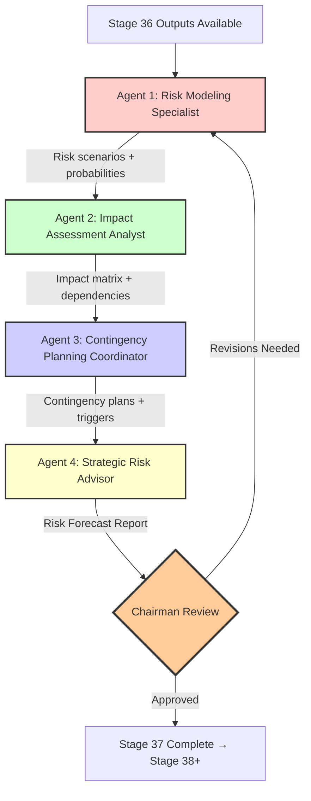

# Stage 37: Strategic Risk Forecasting - Agent Orchestration

## CrewAI Crew Definition

### RiskForecastingCrew

**Purpose**: Execute Stage 37 by coordinating risk modeling, impact assessment, and contingency planning through specialized AI agents.

**Owner**: Chairman (human oversight)
**Execution Mode**: Sequential with human checkpoints
**Estimated Runtime**: 8-12 hours (human-in-the-loop), 2-4 hours (fully automated future state)

## Agent Roster (4 Agents)

### Agent 1: Risk Modeling Specialist

**Role**: Build probabilistic risk models and define scenario narratives

**Responsibilities**:
1. Analyze market intelligence and risk indicators from Stage 36
2. Define 3-5 risk scenarios per category (market, operational, regulatory, financial)
3. Calculate probabilities using quantitative/qualitative methods
4. Generate confidence intervals for probability estimates
5. Validate model calibration against historical data

**Skills**:
- Statistical modeling (Monte Carlo, Bayesian inference)
- Scenario planning frameworks
- Data analysis (Python, R, or equivalent)
- Domain expertise in market/industry risks

**Tools**:
- Risk modeling software (@RISK, Crystal Ball, Python risk libraries)
- Historical data repositories
- Market intelligence APIs

**Inputs** (from Stage 36):
- Market intelligence reports
- Risk indicators (trends, volatility metrics)
- Scenario model templates

**Outputs** (to Agent 2):
- Probabilistic risk model (12-20 scenarios)
- Scenario narratives with trigger conditions
- Probability distribution with confidence intervals

**Success Criteria**:
- ≥12 scenarios defined across 4 categories
- All probabilities sum to 100% within categories
- Confidence intervals documented
- Model calibration validated (R² ≥ 0.7 if historical data available)

**Autonomy Level**: Semi-autonomous (requires human approval on scenario definitions)

**Evidence**: EHG_Engineer@6ef8cf4:docs/workflow/stages.yaml:1684-1687 "Risk Modeling: Models built, Scenarios defined"

---

### Agent 2: Impact Assessment Analyst

**Role**: Quantify risk impacts across dimensions and map cascading dependencies

**Responsibilities**:
1. Receive risk scenarios from Agent 1
2. Quantify impacts on financial, operational, reputational, strategic dimensions
3. Calculate expected values (Probability × Impact)
4. Map risk dependencies (cascading effects)
5. Classify risks by severity (Critical/High/Medium/Low)

**Skills**:
- Financial analysis (NPV, cost-benefit analysis)
- Systems thinking (dependency mapping)
- Data visualization (impact matrices, graphs)
- Venture economics understanding

**Tools**:
- Spreadsheet modeling (Excel, Google Sheets)
- Graph analysis tools (NetworkX, Gephi)
- Financial calculators

**Inputs** (from Agent 1):
- Probabilistic risk model (scenarios + probabilities)

**Outputs** (to Agent 3):
- Impact assessment matrix (scenarios × dimensions)
- Expected value calculations
- Risk dependency graph (nodes + edges + compound impacts)
- Severity classification table

**Success Criteria**:
- All scenarios have quantified impacts (not qualitative only)
- Expected values calculated for all scenarios
- Dependency graph includes ≥3 cascading relationships
- All scenarios classified by severity

**Autonomy Level**: Semi-autonomous (requires human validation on severity thresholds)

**Evidence**: EHG_Engineer@6ef8cf4:docs/workflow/stages.yaml:1690-1693 "Impact Assessment: Impacts quantified, Dependencies mapped"

---

### Agent 3: Contingency Planning Coordinator

**Role**: Create actionable contingency plans with triggers and resource requirements

**Responsibilities**:
1. Receive severity-classified risks from Agent 2
2. Create contingency plans for all Critical/High severity risks
3. Define activation triggers (quantitative, qualitative, time-based)
4. Calculate resource requirements (budget, personnel, tools)
5. Prioritize plans by risk severity × probability

**Skills**:
- Project planning (Gantt charts, resource allocation)
- Trigger design (event detection, threshold setting)
- Risk mitigation strategy development
- Resource estimation

**Tools**:
- Project management software (Asana, Jira, Linear)
- Resource planning tools
- Trigger monitoring systems (alerts, dashboards)

**Inputs** (from Agent 2):
- Severity classification table
- Impact assessment matrix
- Risk dependency graph

**Outputs** (to Agent 4 + Chairman):
- Contingency plan library (8-12 plans)
- Trigger monitoring plan
- Resource requirement estimates
- Priority ranking

**Success Criteria**:
- ≥1 contingency plan per Critical/High risk
- All plans have 5 required elements (trigger, actions, resources, timeline, success criteria)
- Triggers are observable/measurable
- Resource requirements quantified

**Autonomy Level**: Semi-autonomous (requires human approval on resource allocation)

**Evidence**: EHG_Engineer@6ef8cf4:docs/workflow/stages.yaml:1696-1699 "Contingency Planning: Plans created, Triggers defined"

---

### Agent 4: Strategic Risk Advisor

**Role**: Integrate forecasts, synthesize insights, advise Chairman on strategic decisions

**Responsibilities**:
1. Aggregate outputs from Agents 1-3
2. Synthesize executive summary (1-2 pages)
3. Identify top 3-5 strategic risks requiring Chairman attention
4. Recommend resource allocation for contingency reserves
5. Propose monitoring cadence and escalation paths
6. Present findings to Chairman with actionable recommendations

**Skills**:
- Executive communication (concise, actionable reporting)
- Strategic thinking (pattern recognition, prioritization)
- Risk communication (translating technical analysis to business impact)
- Decision support (recommendation framing)

**Tools**:
- Reporting templates (Markdown, PowerPoint)
- Visualization tools (charts, dashboards)
- Presentation software

**Inputs** (from Agents 1-3):
- Probabilistic risk model
- Impact assessment matrix
- Contingency plan library

**Outputs** (to Chairman + Stage 38+):
- Risk Forecast Report (executive summary + detailed analysis)
- Top 3-5 strategic risks brief
- Resource allocation recommendations
- Monitoring and escalation plan

**Success Criteria**:
- Executive summary ≤2 pages, readable by non-technical stakeholders
- Top risks ranked by expected value
- Resource recommendations within budget constraints
- Chairman approves findings and recommendations

**Autonomy Level**: Advisory (human makes final decisions)

**Evidence**: EHG_Engineer@6ef8cf4:docs/workflow/stages.yaml:1678-1680 "exit: Risks forecasted, Strategies defined"

---

## Crew Workflow

### Sequential Execution Flow



### Execution Timeline

| Phase | Agent | Duration | Dependencies | Output |
|-------|-------|----------|--------------|--------|
| 1 | Risk Modeling Specialist | 4-6h | Stage 36 outputs | Risk model (12-20 scenarios) |
| 2 | Impact Assessment Analyst | 3-5h | Agent 1 output | Impact matrix + dependency graph |
| 3 | Contingency Planning Coordinator | 4-6h | Agent 2 output | Contingency plan library (8-12 plans) |
| 4 | Strategic Risk Advisor | 2-3h | Agent 3 output | Risk Forecast Report |
| 5 | Chairman Review | 1-2h | Agent 4 output | Approval or revision feedback |
| **Total** | - | **14-22h** | - | Stage 37 complete |

**Note**: Timeline assumes sequential execution with human checkpoints. Automation (RISK-FORECAST-001 through 004) can reduce to 2-4 hours.

## Human-in-the-Loop Checkpoints

### Checkpoint 1: Scenario Approval (After Agent 1)
**Owner**: Chairman + Strategic Planning Team
**Duration**: 30-60 minutes
**Decision**: Approve scenario definitions or request revisions

**Validation**:
- Are all relevant risk categories covered?
- Are scenarios plausible and well-defined?
- Do probabilities align with expert judgment?

**Proceed if**: ≥80% of scenarios approved, any critical risks identified

### Checkpoint 2: Severity Validation (After Agent 2)
**Owner**: Chairman
**Duration**: 20-30 minutes
**Decision**: Validate severity thresholds and classifications

**Validation**:
- Are severity thresholds appropriate for venture context?
- Are any Critical/High risks misclassified?
- Are compound impacts correctly calculated?

**Proceed if**: All Critical/High risks validated, severity thresholds approved

### Checkpoint 3: Resource Approval (After Agent 3)
**Owner**: Chairman + Finance Team
**Duration**: 30-45 minutes
**Decision**: Approve resource reservations for contingency plans

**Validation**:
- Are resource requirements realistic?
- Is contingency budget within acceptable range (10-20% of total)?
- Are flexible resources available?

**Proceed if**: Resource allocation approved, contingency plans feasible

### Checkpoint 4: Final Review (After Agent 4)
**Owner**: Chairman
**Duration**: 45-60 minutes
**Decision**: Approve Risk Forecast Report and release to downstream stages

**Validation**:
- Does executive summary clearly communicate top risks?
- Are recommendations actionable?
- Is monitoring plan adequate?

**Proceed if**: Chairman signs off, Stage 37 exit gates satisfied

## Agent Communication Protocol

### Inter-Agent Communication
**Format**: Structured JSON messages (not natural language)

**Example** (Agent 1 → Agent 2):
```json
{
  "from_agent": "risk_modeling_specialist",
  "to_agent": "impact_assessment_analyst",
  "message_type": "risk_model_output",
  "timestamp": "2025-11-06T14:30:00Z",
  "payload": {
    "scenarios": [
      {
        "id": "RISK-001",
        "category": "market",
        "title": "Competitor launches similar product",
        "probability": 0.35,
        "confidence_interval": [0.25, 0.45],
        "trigger_conditions": ["Competitor press release", "Product feature overlap >60%"]
      }
    ]
  }
}
```

### Human Communication
**Format**: Natural language summaries + visualizations

**Channels**:
- Email notifications (stage transitions)
- Dashboard alerts (trigger activations)
- Scheduled reports (weekly/monthly/quarterly)

## Error Handling

### Agent Failure Scenarios

**Scenario 1: Data unavailable (Agent 1)**
- **Detection**: Stage 36 outputs missing or incomplete
- **Response**: Agent 1 pauses, alerts Chairman, requests data from Stage 36 owner
- **Fallback**: Use previous quarter's market intelligence (with caveat)

**Scenario 2: Model calibration fails (Agent 1)**
- **Detection**: R² < 0.5, probabilities don't sum to 100%
- **Response**: Agent 1 switches to qualitative expert judgment method
- **Fallback**: Proceed with wider confidence intervals (±20%)

**Scenario 3: Dependency mapping incomplete (Agent 2)**
- **Detection**: No cascading relationships identified
- **Response**: Agent 2 flags for human review, requests domain expert input
- **Fallback**: Proceed with direct impacts only (no compound impacts)

**Scenario 4: Resource constraints (Agent 3)**
- **Detection**: Contingency budget exceeds 20% threshold
- **Response**: Agent 3 prioritizes plans, proposes phased resource allocation
- **Fallback**: Create plans only for Critical risks, defer High risks

## Automation Roadmap

### Current State (Manual Execution)
- **Chairman Time**: 15h/week
- **Agent Autonomy**: 0% (all human-executed)
- **Response Time**: Days to weeks

### Phase 1: Assisted Execution (RISK-FORECAST-001)
- **Target**: 50% automation (Agent 1 automated)
- **Chairman Time**: 10h/week
- **Agent Autonomy**: Agent 1 = 80%, Agents 2-4 = 0%
- **Timeline**: 6-8 weeks implementation
- **Evidence**: EHG_Engineer@6ef8cf4:docs/workflow/critique/stage-37.md:31-34 "Enhance Automation"

### Phase 2: Semi-Automated (RISK-FORECAST-001 + 002)
- **Target**: 70% automation (Agents 1-2 automated, dashboard added)
- **Chairman Time**: 6h/week
- **Agent Autonomy**: Agents 1-2 = 80%, Agent 3 = 20%, Agent 4 = 0%
- **Timeline**: 12-16 weeks cumulative

### Phase 3: Fully Automated (RISK-FORECAST-001 through 004)
- **Target**: 80% automation (all agents automated, human oversight only)
- **Chairman Time**: 3h/week
- **Agent Autonomy**: Agents 1-3 = 80%, Agent 4 = 50% (still requires Chairman approval)
- **Response Time**: Hours (real-time monitoring + auto-activation)
- **Timeline**: 20-24 weeks cumulative

## Performance Metrics

### Agent-Level Metrics

| Agent | Metric | Target | Measurement |
|-------|--------|--------|-------------|
| Agent 1 | Model calibration quality | R² ≥ 0.7 | Quarterly backtest |
| Agent 1 | Scenario coverage | 100% of risk categories | Per execution |
| Agent 2 | Impact quantification rate | 100% of scenarios | Per execution |
| Agent 2 | Dependency identification | ≥3 cascading relationships | Per execution |
| Agent 3 | Plan completeness | 100% of Critical/High risks | Per execution |
| Agent 3 | Resource estimation accuracy | ±20% of actual costs | Quarterly review |
| Agent 4 | Report clarity score | ≥4/5 (Chairman rating) | Per execution |
| Agent 4 | Recommendation adoption rate | ≥70% | Quarterly review |

### Crew-Level Metrics

| Metric | Target | Current | Gap | Evidence |
|--------|--------|---------|-----|----------|
| Forecast accuracy | ≥75% | Not measured | N/A | EHG_Engineer@6ef8cf4:docs/workflow/stages.yaml:1670 "Forecast accuracy" |
| Risk preparedness | 100% | Not measured | N/A | EHG_Engineer@6ef8cf4:docs/workflow/stages.yaml:1671 "Risk preparedness" |
| Response time | ≤24h (critical) | Days | Days | EHG_Engineer@6ef8cf4:docs/workflow/stages.yaml:1672 "Response time" |
| Total execution time | ≤4h (automated) | 14-22h | 10-18h | Current: manual execution |

## Integration with Other Crews

### Upstream: Stage 36 (Competitive Intelligence Gathering)
**Crew**: CompetitiveIntelligenceCrew (if exists)
**Handoff**: Market intelligence reports → Agent 1 (Risk Modeling Specialist)
**Protocol**: API-based data transfer or shared database

### Downstream: Stage 38+ (Subsequent Stages)
**Crew**: Varies by stage
**Handoff**: Risk Forecast Report → Stage leads
**Protocol**: Document repository + email notification

### Cross-Stage: Stage 16 (Execution)
**Crew**: ExecutionCrew (if exists)
**Integration**: Risk forecasts inform execution decisions
**Protocol**: Bidirectional feedback (forecasts → execution, outcomes → forecast validation)

---

<!-- Generated by Claude Code Phase 13 | EHG_Engineer@6ef8cf4 | 2025-11-06 -->
