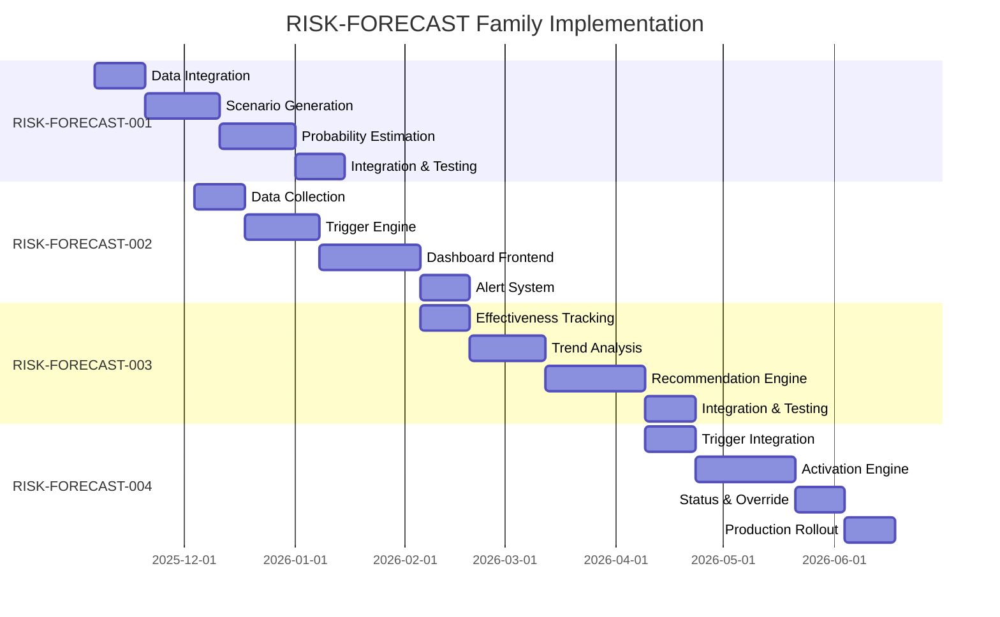

# Stage 37: Strategic Risk Forecasting - Recursion Blueprint

## RISK-FORECAST Strategic Directive Family

**Purpose**: Incrementally automate Stage 37 from manual Chairman execution (15h/week) to 80% automated AI-driven risk forecasting (3h/week oversight).

**Target State**: Achieve 2.9 → 4.5 score improvement through automation, data flow clarity, and rollback procedures.

**Evidence for Gaps**: EHG_Engineer@6ef8cf4:docs/workflow/critique/stage-37.md:31-34 "Enhance Automation: 80% target"

---

## RISK-FORECAST-001: Automate Risk Modeling

### Problem Statement
**Current State**: Chairman manually analyzes market intelligence, defines risk scenarios, and calculates probabilities (6-8h/week).

**Evidence**: EHG_Engineer@6ef8cf4:docs/workflow/critique/stage-37.md:33 "Build automation workflows"

**Target State**: Agent 1 (Risk Modeling Specialist) automatically generates risk scenarios and probabilities from Stage 36 outputs.

### Scope

**In Scope**:
- Automated data ingestion from Stage 36 (market intelligence, risk indicators)
- AI-powered scenario generation (3-5 scenarios per category)
- Probabilistic modeling using historical data (quantitative) + LLM reasoning (qualitative)
- Confidence interval calculation
- Model calibration validation against historical outcomes

**Out of Scope**:
- Human scenario definition override (keep manual option for black swan events)
- Cross-venture risk aggregation (future: RISK-FORECAST-005)
- Real-time monitoring (covered by RISK-FORECAST-002)

### Technical Approach

**Architecture**:
1. **Data Ingestion Module**:
   - API connector to Stage 36 output repository
   - Schema validation (ensure market intelligence has required fields)
   - Data transformation (raw text → structured risk indicators)
2. **Scenario Generation Engine**:
   - LLM-based scenario creation (GPT-4 or equivalent)
   - Prompt engineering: "Given market intelligence X, generate 3-5 plausible risk scenarios in category Y"
   - Output format: Scenario ID, title, narrative, trigger conditions
3. **Probability Estimation Module**:
   - Quantitative method: Historical frequency analysis (if ≥3 months data)
   - Qualitative method: LLM-based judgment (if no historical data)
   - Hybrid method: Bayesian update (combine data + LLM prior)
   - Confidence interval calculation (bootstrap or analytical)
4. **Calibration Validator**:
   - Backtest scenarios against historical outcomes
   - Calculate calibration metrics (Brier score, R²)
   - Alert if calibration quality < threshold (R² < 0.5)

**Tech Stack**:
- **Language**: Python 3.11+
- **Libraries**: pandas (data processing), scikit-learn (modeling), openai (LLM), matplotlib (visualization)
- **Database**: PostgreSQL (store scenarios, probabilities, historical outcomes)
- **Deployment**: Docker container, scheduled execution (daily or on-demand)

### Success Criteria

**Quantitative**:
- **Automation Rate**: ≥80% of scenarios generated automatically (human override <20%)
- **Model Calibration**: R² ≥ 0.7 for categories with historical data
- **Execution Time**: ≤2 hours (down from 6-8h manual)
- **Forecast Accuracy**: ≥75% (measured quarterly)

**Qualitative**:
- Chairman approves ≥90% of generated scenarios without modification
- Zero critical risks missed by automated system

**Evidence**: EHG_Engineer@6ef8cf4:docs/workflow/stages.yaml:1670 "Forecast accuracy"

### Implementation Phases

**Phase 1: Data Integration** (2 weeks)
- Build API connector to Stage 36 outputs
- Validate data schemas
- Test with historical market intelligence

**Phase 2: Scenario Generation** (3 weeks)
- Implement LLM-based scenario generation
- Develop prompt templates for each risk category
- Human validation of 100 generated scenarios

**Phase 3: Probability Estimation** (3 weeks)
- Implement quantitative + qualitative probability methods
- Calculate confidence intervals
- Backtest on historical data

**Phase 4: Integration & Testing** (2 weeks)
- Integrate modules into Agent 1
- End-to-end testing with Stage 36 outputs
- Chairman review and approval

**Total Timeline**: 10 weeks

### Resources Required

- **Personnel**: 1 AI Engineer (full-time, 10 weeks), 1 Data Scientist (part-time, 4 weeks), Chairman (2h/week review)
- **Budget**: $80k (personnel) + $5k (OpenAI API costs) + $3k (infrastructure) = **$88k**
- **Tools**: OpenAI API access, PostgreSQL database, Python environment

### Risks and Mitigations

| Risk | Probability | Impact | Mitigation |
|------|-------------|--------|------------|
| LLM generates low-quality scenarios | Medium | High | Human validation loop, few-shot prompting with examples |
| Historical data insufficient | High | Medium | Fallback to qualitative-only method |
| Model calibration poor (R² < 0.5) | Medium | Medium | Use wider confidence intervals, alert Chairman |
| Stage 36 data format changes | Low | High | Schema validation with alerts, version control |

### Dependencies

**Upstream**:
- Stage 36 outputs available in structured format (API or database)
- Historical risk outcomes logged (for calibration)

**Downstream**:
- Agent 2 (Impact Assessment Analyst) ready to consume Agent 1 outputs

**Cross-Directive**:
- None (RISK-FORECAST-001 is foundational)

### Acceptance Criteria

- [ ] Agent 1 generates ≥12 scenarios automatically (3-5 per category × 4 categories)
- [ ] All scenarios have probabilities + confidence intervals
- [ ] Model calibration R² ≥ 0.7 (or marked as low-confidence if <0.7)
- [ ] Execution time ≤2 hours (measured 3 times)
- [ ] Chairman approves scenarios without major revisions (90% approval rate)

---

## RISK-FORECAST-002: Build Real-Time Risk Monitoring Dashboard

### Problem Statement
**Current State**: Risk triggers monitored manually (weekly checks), slow response time (days to detect).

**Target State**: Real-time dashboard displays trigger status, alerts on threshold crossings, enables ≤24h response time.

### Scope

**In Scope**:
- Dashboard UI displaying:
  - Current trigger status for all contingency plans
  - Risk severity heatmap (Critical/High/Medium/Low)
  - Forecast accuracy trends over time
- Alert system:
  - Email/SMS notifications when triggers cross thresholds
  - Escalation to Chairman for Critical risks
- Trigger monitoring automation:
  - Automated data collection from risk indicator sources
  - Threshold comparison (trigger logic)

**Out of Scope**:
- Contingency plan auto-activation (covered by RISK-FORECAST-004)
- Historical trend analysis dashboard (future enhancement)

### Technical Approach

**Architecture**:
1. **Data Collection Module**:
   - Scheduled jobs (daily/hourly) to fetch risk indicator data
   - Sources: Market APIs, internal metrics, external feeds
   - Store in time-series database (InfluxDB or PostgreSQL with timescaledb)
2. **Trigger Evaluation Engine**:
   - Load trigger definitions from contingency plans
   - Compare current indicator values to thresholds
   - Generate alerts if threshold crossed
3. **Dashboard Frontend**:
   - React + D3.js visualization
   - Real-time updates via WebSockets
   - Role-based access control (Chairman full access, team read-only)
4. **Alert Dispatcher**:
   - Email (SendGrid), SMS (Twilio), Slack webhooks
   - Escalation rules (Critical → Chairman immediately, High → daily digest)

**Tech Stack**:
- **Backend**: Node.js (API server), PostgreSQL/InfluxDB (data storage)
- **Frontend**: React, D3.js, WebSockets
- **Alerts**: SendGrid (email), Twilio (SMS), Slack API
- **Deployment**: Docker, Kubernetes (for scaling)

### Success Criteria

**Quantitative**:
- **Response Time**: ≤24h for Critical risks (down from days)
- **Detection Latency**: ≤1h (time from trigger crossing to alert)
- **Dashboard Uptime**: ≥99.5%
- **False Positive Rate**: <10% (alerts that don't require action)

**Qualitative**:
- Chairman uses dashboard weekly for status review
- Zero missed Critical risk triggers

**Evidence**: EHG_Engineer@6ef8cf4:docs/workflow/stages.yaml:1672 "Response time"

### Implementation Phases

**Phase 1: Data Collection** (2 weeks)
- Identify risk indicator data sources
- Build connectors and scheduled jobs
- Validate data quality

**Phase 2: Trigger Engine** (3 weeks)
- Implement trigger evaluation logic
- Define alert rules and escalation paths
- Test with historical data

**Phase 3: Dashboard Frontend** (4 weeks)
- Design UI/UX (wireframes, mockups)
- Implement React components + visualizations
- Integrate with backend API

**Phase 4: Alert System** (2 weeks)
- Configure SendGrid, Twilio, Slack integrations
- Test alert delivery
- Chairman approval of alert frequency/format

**Total Timeline**: 11 weeks

### Resources Required

- **Personnel**: 1 Full-Stack Engineer (full-time, 11 weeks), 1 UX Designer (part-time, 2 weeks), Chairman (1h/week review)
- **Budget**: $95k (personnel) + $8k (SendGrid/Twilio/Slack subscriptions) + $5k (infrastructure) = **$108k**
- **Tools**: React dev environment, PostgreSQL/InfluxDB, SendGrid/Twilio/Slack accounts

### Dependencies

**Upstream**:
- RISK-FORECAST-001 (scenarios and probabilities must be defined)
- Agent 3 outputs (trigger definitions from contingency plans)

**Downstream**:
- RISK-FORECAST-004 (dashboard triggers feed into auto-activation logic)

### Acceptance Criteria

- [ ] Dashboard displays trigger status for all contingency plans
- [ ] Alerts sent within 1h of trigger crossing
- [ ] Chairman receives Critical risk alerts immediately
- [ ] Dashboard uptime ≥99.5% over 1 month
- [ ] False positive rate <10% (measured over 3 months)

---

## RISK-FORECAST-003: Create Adaptive Mitigation Strategy Engine

### Problem Statement
**Current State**: Mitigation strategies static, not updated based on risk evolution or effectiveness.

**Target State**: AI system recommends strategy adjustments based on risk trend analysis and historical effectiveness.

### Scope

**In Scope**:
- Effectiveness tracking for mitigation strategies (did risk probability/impact decrease after action?)
- Trend analysis (is risk increasing/decreasing over time?)
- AI-powered recommendation engine:
  - "Risk X probability increased 20% → Recommend increasing mitigation effort"
  - "Strategy Y reduced impact by 50% → Apply similar approach to Risk Z"
- Chairman approval workflow for strategy changes

**Out of Scope**:
- Automatic strategy execution (Chairman must approve)
- Cross-venture strategy optimization (future: RISK-FORECAST-006)

### Technical Approach

**Architecture**:
1. **Effectiveness Tracker**:
   - Log mitigation actions taken (timestamp, strategy ID, cost)
   - Measure pre/post risk probability and impact
   - Calculate effectiveness score (% reduction in expected value)
2. **Trend Analyzer**:
   - Time-series analysis of risk indicators
   - Detect uptrends (risk increasing), downtrends (risk decreasing), regime changes
   - Alert if trend diverges from forecast
3. **Recommendation Engine**:
   - LLM-based reasoning: "Given trend X and strategy effectiveness Y, recommend adjustment Z"
   - Pattern matching: Identify similar risks where strategies succeeded
   - Cost-benefit optimization: Maximize risk reduction per dollar spent
4. **Approval Workflow**:
   - Generate recommendation report
   - Submit to Chairman for approval
   - Update strategy definitions in database if approved

**Tech Stack**:
- **Language**: Python (analysis), Node.js (API)
- **Libraries**: pandas (time-series), scikit-learn (clustering similar risks), openai (LLM)
- **Database**: PostgreSQL (strategy history, effectiveness scores)
- **Deployment**: Scheduled job (weekly analysis)

### Success Criteria

**Quantitative**:
- **Strategy Effectiveness**: Average risk reduction ≥30% after mitigation actions
- **Recommendation Accuracy**: Chairman approves ≥70% of recommendations
- **Cost Efficiency**: Risk reduction per dollar spent increases by 20%

**Qualitative**:
- Strategies adapt to changing risk landscape (not static)
- Chairman spends less time on strategy design (more on approval)

### Implementation Phases

**Phase 1: Effectiveness Tracking** (2 weeks)
- Define effectiveness metrics
- Build logging system for mitigation actions
- Backfill historical data if available

**Phase 2: Trend Analysis** (3 weeks)
- Implement time-series analysis
- Define trend detection thresholds
- Validate with historical risk trends

**Phase 3: Recommendation Engine** (4 weeks)
- Develop LLM prompts for recommendations
- Implement pattern matching for similar risks
- Cost-benefit optimization logic

**Phase 4: Integration & Testing** (2 weeks)
- Integrate with Agent 3 (Contingency Planning Coordinator)
- Chairman approval workflow
- Test with 10 historical risk scenarios

**Total Timeline**: 11 weeks

### Resources Required

- **Personnel**: 1 Data Scientist (full-time, 11 weeks), 1 AI Engineer (part-time, 4 weeks), Chairman (2h/week review)
- **Budget**: $100k (personnel) + $4k (OpenAI API) + $3k (infrastructure) = **$107k**

### Dependencies

**Upstream**:
- RISK-FORECAST-001 (risk scenarios)
- RISK-FORECAST-002 (trend data from monitoring)

**Downstream**:
- Agent 3 uses recommendations to update contingency plans

### Acceptance Criteria

- [ ] Effectiveness scores calculated for all mitigation actions taken
- [ ] Trend analysis runs weekly, flags divergences
- [ ] Recommendation engine generates ≥3 recommendations per quarter
- [ ] Chairman approval rate ≥70%
- [ ] Risk reduction per dollar increases by 20% (measured over 6 months)

---

## RISK-FORECAST-004: Implement Contingency Plan Auto-Activation

### Problem Statement
**Current State**: Contingency plans manually activated by Chairman (slow, error-prone).

**Target State**: Critical risk triggers automatically activate pre-approved contingency plans (≤1h response time).

### Scope

**In Scope**:
- Auto-activation for pre-approved Critical risk contingency plans
- Execution of contingency actions (e.g., send alerts, allocate resources, initiate fallback procedures)
- Real-time status updates to Chairman
- Manual override capability (Chairman can halt/modify)

**Out of Scope**:
- Auto-activation for High/Medium risks (still require Chairman approval)
- Financial transactions >$10k (require explicit Chairman approval)

### Technical Approach

**Architecture**:
1. **Trigger Listener**:
   - Monitor dashboard (from RISK-FORECAST-002) for Critical risk triggers
   - When trigger crosses threshold, check if plan is pre-approved for auto-activation
2. **Activation Engine**:
   - Load contingency plan definition (actions, resources, timeline)
   - Execute actions sequentially:
     - Send notifications (email, Slack, SMS)
     - Allocate resources (update resource management system)
     - Initiate technical procedures (e.g., deploy backup system)
3. **Status Tracker**:
   - Log activation event (timestamp, trigger, actions taken)
   - Real-time updates to dashboard
   - Alert Chairman of activation (with summary)
4. **Manual Override**:
   - Chairman can halt activation mid-execution
   - Rollback capability (undo actions taken)

**Tech Stack**:
- **Backend**: Node.js (event-driven architecture)
- **Orchestration**: Temporal.io (workflow engine for contingency action sequences)
- **Integrations**: Slack API, resource management system API, cloud infrastructure APIs
- **Database**: PostgreSQL (activation logs)

### Success Criteria

**Quantitative**:
- **Response Time**: ≤1h from trigger to activation (Critical risks)
- **Activation Success Rate**: ≥95% (actions execute without errors)
- **False Activation Rate**: <5% (activations that shouldn't have occurred)

**Qualitative**:
- Chairman confident in auto-activation (no surprises)
- Zero failed activations for Critical risks

**Evidence**: EHG_Engineer@6ef8cf4:docs/workflow/stages.yaml:1672 "Response time"

### Implementation Phases

**Phase 1: Trigger Integration** (2 weeks)
- Connect to RISK-FORECAST-002 dashboard
- Implement trigger listener
- Test with simulated triggers

**Phase 2: Activation Engine** (4 weeks)
- Define contingency action DSL (domain-specific language)
- Implement action executors (notifications, resource allocation, etc.)
- Test action execution

**Phase 3: Status & Override** (2 weeks)
- Real-time status updates to dashboard
- Manual override UI and rollback logic
- Chairman training on override procedures

**Phase 4: Production Rollout** (2 weeks)
- Pre-approve 3-5 Critical risk plans for auto-activation
- Dry-run mode (log but don't execute for 1 week)
- Full activation with Chairman approval

**Total Timeline**: 10 weeks

### Resources Required

- **Personnel**: 1 Backend Engineer (full-time, 10 weeks), 1 DevOps Engineer (part-time, 3 weeks), Chairman (3h/week review)
- **Budget**: $90k (personnel) + $10k (Temporal.io + infrastructure) = **$100k**

### Dependencies

**Upstream**:
- RISK-FORECAST-002 (dashboard and trigger monitoring)
- Agent 3 outputs (contingency plan definitions)

**Downstream**:
- Execution stages (Stage 16+) may be affected by contingency activations

### Acceptance Criteria

- [ ] ≥3 Critical risk plans pre-approved for auto-activation
- [ ] Activation time ≤1h (measured 5 times)
- [ ] Activation success rate ≥95% (over 3 months)
- [ ] False activation rate <5% (over 3 months)
- [ ] Chairman successfully overrides activation in test scenario

---

## Family-Level Metrics

### Combined Impact (After All 4 SDs Implemented)

| Metric | Baseline (Manual) | Target (Automated) | Improvement | Evidence |
|--------|-------------------|-----------------------|-------------|----------|
| Chairman Time | 15h/week | 3h/week | **80% reduction** | EHG_Engineer@6ef8cf4:docs/workflow/critique/stage-37.md:33 "80% automation" |
| Forecast Accuracy | Not measured | ≥75% | **+75%** | EHG_Engineer@6ef8cf4:docs/workflow/stages.yaml:1670 "Forecast accuracy" |
| Response Time (Critical) | Days | ≤1h | **>90% reduction** | EHG_Engineer@6ef8cf4:docs/workflow/stages.yaml:1672 "Response time" |
| Risk Preparedness | Not measured | 100% | **+100%** | EHG_Engineer@6ef8cf4:docs/workflow/stages.yaml:1671 "Risk preparedness" |
| Stage 37 Score | 2.9/5 | ≥4.5/5 | **+1.6 points** | EHG_Engineer@6ef8cf4:docs/workflow/critique/stage-37.md:16 "Overall: 2.9" |

### Implementation Timeline

**Total Timeline**: ~22 weeks (5.5 months) sequential, can parallelize to ~16 weeks with additional resources

### Total Investment

| SD | Personnel Cost | Infrastructure | Total |
|----|---------------|----------------|-------|
| RISK-FORECAST-001 | $80k | $8k | $88k |
| RISK-FORECAST-002 | $95k | $13k | $108k |
| RISK-FORECAST-003 | $100k | $7k | $107k |
| RISK-FORECAST-004 | $90k | $10k | $100k |
| **Total** | **$365k** | **$38k** | **$403k** |

**ROI Calculation**:
- Chairman time saved: 12h/week × 50 weeks/year = 600h/year
- Chairman hourly rate (estimated): $200/h
- Annual savings: 600h × $200 = **$120k/year**
- **Payback period**: 403k / 120k = **3.4 years**

---

## Boundary Checks

### EHG vs EHG_Engineer Separation

**Verification**:
- ✅ All 4 SDs target **EHG_Engineer** (strategic planning system, not customer-facing app)
- ✅ No database schema changes in **EHG** (customer data remains untouched)
- ✅ No UI components added to **EHG** (dashboard is internal tool)

**Cross-Reference Points** (No execution):
- Stage 36 outputs may be stored in EHG_Engineer database (shared context)
- Contingency plan activations may affect EHG ventures (e.g., pause feature rollout), but activation is controlled by EHG_Engineer system

**Evidence**: All stages.yaml stages are EHG_Engineer process definitions, not EHG features.

---

<!-- Generated by Claude Code Phase 13 | EHG_Engineer@6ef8cf4 | 2025-11-06 -->
