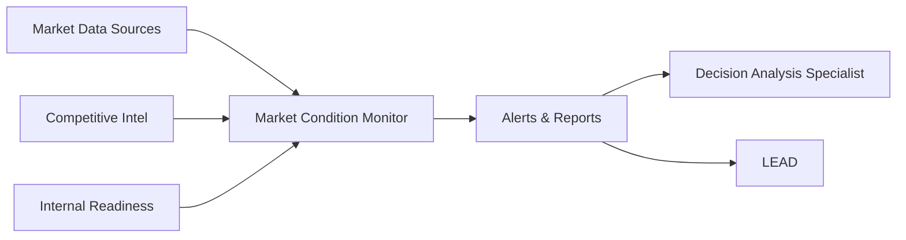
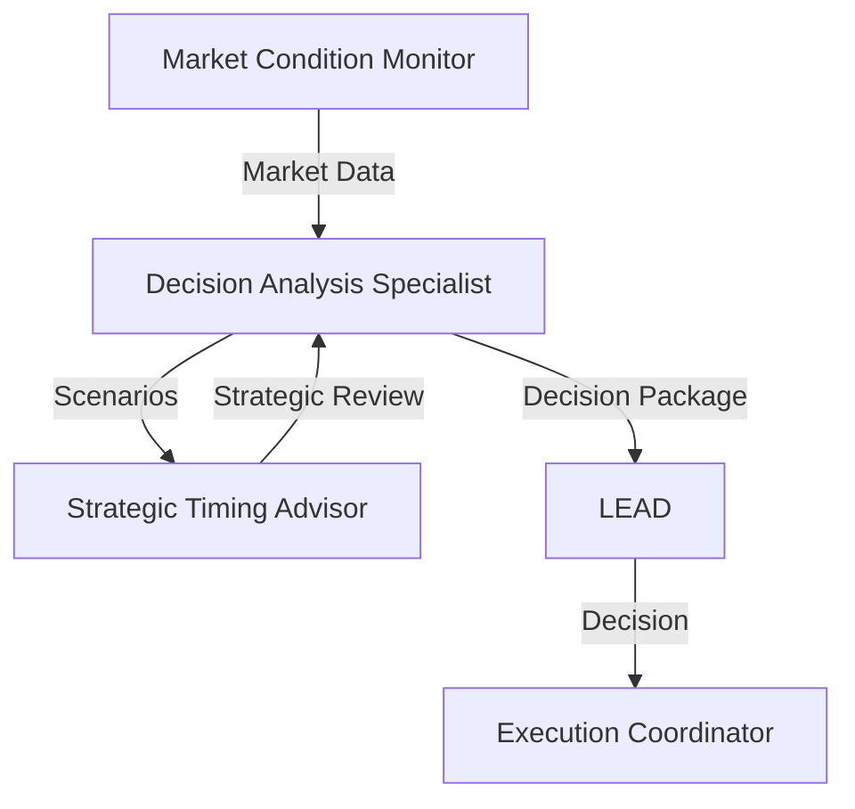
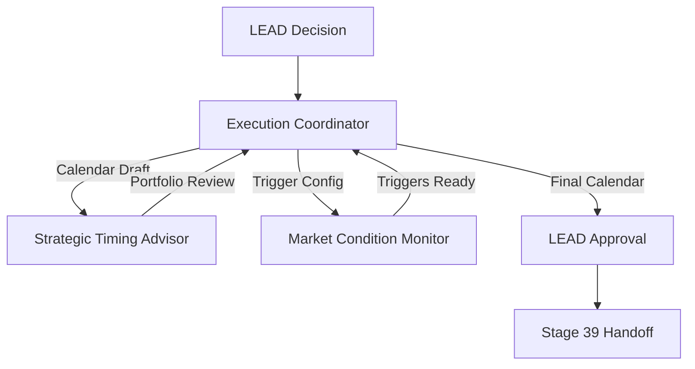

# Stage 38: Timing Optimization - Agent Orchestration


## Table of Contents

- [CrewAI Architecture](#crewai-architecture)
- [Crew Overview](#crew-overview)
- [Agent Definitions](#agent-definitions)
  - [Agent 1: Market Condition Monitor](#agent-1-market-condition-monitor)
  - [Agent 2: Decision Analysis Specialist](#agent-2-decision-analysis-specialist)
  - [Agent 3: Execution Coordinator](#agent-3-execution-coordinator)
  - [Agent 4: Strategic Timing Advisor](#agent-4-strategic-timing-advisor)
- [Workflow Orchestration](#workflow-orchestration)
  - [Phase 1: Condition Monitoring (Continuous)](#phase-1-condition-monitoring-continuous)
  - [Phase 2: Decision Analysis (Sequential)](#phase-2-decision-analysis-sequential)
  - [Phase 3: Execution Coordination (Sequential)](#phase-3-execution-coordination-sequential)
- [Agent Interaction Matrix](#agent-interaction-matrix)
- [Human-in-the-Loop Touchpoints](#human-in-the-loop-touchpoints)
  - [LEAD Decision Points](#lead-decision-points)
  - [Escalation Triggers](#escalation-triggers)
- [Automation Metrics](#automation-metrics)
- [Tool Requirements](#tool-requirements)
  - [Required Integrations](#required-integrations)
  - [Proposed Database Schema](#proposed-database-schema)
- [Success Criteria](#success-criteria)

## CrewAI Architecture

**Crew Name**: TimingOptimizationCrew
**Purpose**: Automate market monitoring, timing analysis, and execution coordination for optimal strategic decision timing
**Complexity**: Medium (4 agents with distributed responsibilities)
**Orchestration Pattern**: Sequential with parallel monitoring

## Crew Overview

```yaml
crew: TimingOptimizationCrew
stage: 38
owner: LEAD
agents_count: 4
coordination_model: Sequential with continuous monitoring
automation_target: 80%
human_oversight: LEAD (decision authority)
```

## Agent Definitions

### Agent 1: Market Condition Monitor

**Role**: Market Intelligence & Monitoring Specialist
**Goal**: Continuously track market indicators, competitive signals, and trigger alerts when conditions change

**Backstory**:
"You are an expert market analyst with 15+ years of experience tracking market trends, competitive movements, and industry dynamics. You have a talent for identifying subtle market shifts before they become obvious, and you pride yourself on providing timely, accurate market intelligence that enables strategic advantage."

**Tools**:
- `market_data_api` - Fetch market indicators from external data sources
- `competitive_intel_api` - Monitor competitor activities and announcements
- `threshold_checker` - Evaluate metrics against configured thresholds
- `alert_dispatcher` - Send notifications when thresholds breached

**Tasks**:
1. **Configure Monitoring Systems** (Task 1.1)
   - Set up market indicator feeds
   - Configure alert thresholds
   - Establish competitive tracking
   - Test monitoring infrastructure

2. **Continuous Monitoring** (Task 1.2)
   - Track market indicators in real-time
   - Monitor competitive landscape changes
   - Watch for threshold breaches
   - Dispatch alerts when conditions trigger

3. **Generate Monitoring Reports** (Task 1.3)
   - Compile market condition summaries
   - Report competitive intelligence findings
   - Document threshold breach events
   - Provide weekly status updates to LEAD

**Output Format**:
```json
{
  "market_conditions": {
    "indicators": [
      {
        "name": "Customer Demand Index",
        "value": 78,
        "threshold": 75,
        "status": "BREACH_WARNING",
        "trend": "increasing"
      }
    ],
    "competitive_signals": [
      {
        "competitor": "Competitor A",
        "event": "Product launch announced",
        "date": "2025-11-15",
        "impact": "HIGH"
      }
    ]
  },
  "alert_status": "ACTIVE",
  "recommended_actions": ["Review timing decision", "Accelerate launch"]
}
```

**Collaboration**:
- **Provides data to**: Decision Analysis Specialist (market condition data)
- **Receives configuration from**: Strategic Timing Advisor (monitoring priorities)
- **Reports to**: LEAD (weekly summaries and alerts)

---

### Agent 2: Decision Analysis Specialist

**Role**: Timing Strategy & Decision Analytics Expert
**Goal**: Evaluate timing options, calculate optimal launch windows, and prepare data-driven timing recommendations

**Backstory**:
"You are a strategic timing analyst with deep expertise in market entry timing, competitive positioning, and risk-adjusted decision modeling. You have successfully guided dozens of product launches to optimal market windows, consistently achieving first-mover advantage and market impact. You combine quantitative rigor with strategic intuition to deliver high-confidence timing recommendations."

**Tools**:
- `scenario_modeler` - Generate and evaluate timing scenarios
- `impact_calculator` - Calculate expected outcomes for each timing option
- `confidence_scorer` - Assess confidence level of recommendations
- `report_generator` - Create decision packages and executive summaries

**Tasks**:
1. **Generate Timing Scenarios** (Task 2.1)
   - Identify timing options (early, optimal, late windows)
   - Define decision criteria
   - Map timing options to market windows
   - Document assumptions

2. **Calculate Optimal Timing** (Task 2.2)
   - Score timing options against criteria
   - Calculate expected market impact
   - Assess competitive implications
   - Model risk-adjusted outcomes
   - Identify optimal window with confidence interval

3. **Assess Impacts** (Task 2.3)
   - Evaluate resource requirements
   - Analyze portfolio-level implications
   - Calculate financial impacts
   - Review with Strategic Timing Advisor

4. **Prepare Decision Package** (Task 2.4)
   - Compile comprehensive timing analysis
   - Create executive summary for LEAD
   - Include supporting data and visualizations
   - Schedule LEAD review meeting

**Output Format**:
```json
{
  "timing_recommendation": {
    "optimal_window": {
      "start_date": "2025-12-01",
      "end_date": "2025-12-15",
      "rationale": "Peak customer demand, low competitive activity"
    },
    "confidence_level": 85,
    "expected_impact": {
      "market_share_gain": "12-15%",
      "first_mover_advantage": true,
      "revenue_projection": "$2.5M in Q1"
    }
  },
  "alternative_scenarios": [
    {
      "window": "2025-11-15 to 2025-11-30",
      "confidence": 70,
      "pros": ["Earlier market entry"],
      "cons": ["Lower customer readiness"]
    }
  ],
  "risk_assessment": {
    "primary_risks": ["Competitive pre-emption", "Resource constraints"],
    "mitigation": "Accelerated resource mobilization"
  }
}
```

**Collaboration**:
- **Receives data from**: Market Condition Monitor (market intelligence)
- **Coordinates with**: Strategic Timing Advisor (portfolio optimization)
- **Delivers to**: LEAD (decision package), Execution Coordinator (timing decision)

---

### Agent 3: Execution Coordinator

**Role**: Resource Mobilization & Team Coordination Expert
**Goal**: Align teams, mobilize resources, create execution calendars, and synchronize actions for on-time execution

**Backstory**:
"You are a seasoned program manager with extensive experience orchestrating complex, multi-team product launches. You excel at creating detailed execution plans, mobilizing resources efficiently, and keeping teams aligned under tight deadlines. You have a reputation for turning ambitious timing goals into reality through meticulous planning and proactive coordination."

**Tools**:
- `resource_allocator` - Allocate resources and assign ownership
- `calendar_builder` - Create execution calendars with dependencies
- `stakeholder_manager` - Coordinate team alignment and commitments
- `progress_tracker` - Monitor execution progress and milestone completion

**Tasks**:
1. **Create Execution Calendar** (Task 3.1)
   - Develop detailed timeline with milestones
   - Map dependencies and critical path
   - Assign ownership for each milestone
   - Allocate resources (team members, budget)
   - Obtain LEAD approval

2. **Align Teams and Stakeholders** (Task 3.2)
   - Brief team members on calendar and responsibilities
   - Conduct stakeholder alignment meetings
   - Address concerns and conflicts
   - Obtain commitments from resource owners

3. **Mobilize Resources** (Task 3.3)
   - Finalize resource allocations in systems
   - Onboard new team members
   - Procure tools and infrastructure
   - Conduct execution kickoff meeting

4. **Configure Action Triggers** (Task 3.4)
   - Define action triggers based on market conditions
   - Configure automated trigger systems
   - Set up escalation paths
   - Test trigger system

5. **Publish Execution Calendar** (Task 3.5)
   - Distribute calendar to all stakeholders
   - Set up progress tracking dashboard
   - Schedule status check-ins
   - Obtain final LEAD approval

**Output Format**:
```json
{
  "execution_calendar": {
    "launch_date": "2025-12-01",
    "milestones": [
      {
        "name": "Marketing campaign launch",
        "date": "2025-11-15",
        "owner": "Marketing Team",
        "status": "ON_TRACK"
      },
      {
        "name": "Production release",
        "date": "2025-11-30",
        "owner": "Engineering Team",
        "dependencies": ["QA sign-off"],
        "status": "AT_RISK"
      }
    ],
    "resource_allocations": {
      "engineering": 5,
      "marketing": 3,
      "budget": "$150K"
    },
    "critical_path": ["Production release", "Marketing campaign"]
  },
  "stakeholder_alignment": {
    "briefed": 15,
    "commitments_confirmed": 15,
    "concerns": []
  },
  "action_triggers_configured": true
}
```

**Collaboration**:
- **Receives timing decision from**: Decision Analysis Specialist, LEAD
- **Coordinates with**: All venture team members and stakeholders
- **Works with**: Market Condition Monitor (action trigger configuration)
- **Reports to**: LEAD (execution readiness)

---

### Agent 4: Strategic Timing Advisor

**Role**: Strategic Oversight & Portfolio Optimization Expert
**Goal**: Provide strategic guidance to LEAD, optimize portfolio-level timing decisions, and monitor timing effectiveness

**Backstory**:
"You are a strategic advisor with C-suite experience guiding portfolio-level timing decisions for multi-venture organizations. You have a holistic view of market dynamics, competitive positioning, and organizational capabilities. You excel at identifying synergies and conflicts across ventures, and you provide nuanced strategic counsel that balances multiple competing priorities. Your advice has consistently led to market-leading positions and sustained competitive advantage."

**Tools**:
- `portfolio_analyzer` - Analyze portfolio-level timing interactions
- `synergy_finder` - Identify cross-venture synergies and conflicts
- `strategy_optimizer` - Optimize timing decisions across portfolio
- `effectiveness_tracker` - Monitor timing effectiveness metrics

**Tasks**:
1. **Portfolio Optimization Review** (Task 4.1)
   - Analyze timing decisions across all ventures
   - Identify synergies and conflicts
   - Recommend portfolio-level adjustments
   - Advise LEAD on strategic priorities

2. **Strategic Guidance** (Task 4.2)
   - Review timing recommendations from Decision Analysis Specialist
   - Challenge assumptions and validate analysis
   - Provide strategic context beyond quantitative analysis
   - Advise LEAD on decision

3. **Monitor Timing Effectiveness** (Task 4.3)
   - Track timing effectiveness metrics
   - Analyze market outcomes vs. predictions
   - Identify patterns and improvement opportunities
   - Report effectiveness insights to LEAD

4. **Continuous Improvement** (Task 4.4)
   - Refine decision criteria based on outcomes
   - Update monitoring priorities and thresholds
   - Enhance timing models with learnings
   - Document best practices

**Output Format**:
```json
{
  "strategic_assessment": {
    "timing_recommendation_review": {
      "recommendation": "APPROVE",
      "strategic_rationale": "Aligns with portfolio priorities",
      "considerations": ["Consider customer segment sequencing"]
    },
    "portfolio_conflicts": [],
    "synergy_opportunities": [
      {
        "ventures": ["Venture A", "Venture B"],
        "synergy": "Joint marketing campaign",
        "impact": "20% cost reduction"
      }
    ]
  },
  "effectiveness_metrics": {
    "timing_accuracy": "87%",
    "market_impact_avg": "14% market share gain",
    "first_mover_rate": "65%"
  },
  "recommendations": [
    "Continue aggressive timing strategy",
    "Increase monitoring frequency for competitive signals"
  ]
}
```

**Collaboration**:
- **Advises**: LEAD (strategic counsel)
- **Reviews**: Decision Analysis Specialist (timing recommendations)
- **Coordinates with**: Execution Coordinator (portfolio-level resource conflicts)
- **Guides**: Market Condition Monitor (monitoring priorities)

---

## Workflow Orchestration

### Phase 1: Condition Monitoring (Continuous)
**Lead Agent**: Market Condition Monitor
**Parallel Agents**: None (dedicated monitoring)
**Duration**: Continuous (ongoing throughout Stage 38)



**Handoff**: Market condition data and alerts flow continuously to Decision Analysis Specialist

---

### Phase 2: Decision Analysis (Sequential)
**Lead Agent**: Decision Analysis Specialist
**Supporting Agent**: Strategic Timing Advisor
**Duration**: 7-10 days

**Step 2.1**: Generate timing scenarios
**Step 2.2**: Calculate optimal timing (with Strategic Timing Advisor review)
**Step 2.3**: Assess impacts (with Strategic Timing Advisor portfolio review)
**Step 2.4**: Prepare decision package



**Handoff**: Decision package delivered to LEAD for review and decision

---

### Phase 3: Execution Coordination (Sequential)
**Lead Agent**: Execution Coordinator
**Supporting Agents**: Market Condition Monitor (for triggers), Strategic Timing Advisor (for conflicts)
**Duration**: 7-10 days

**Step 3.1**: Create execution calendar
**Step 3.2**: Align teams and stakeholders
**Step 3.3**: Mobilize resources
**Step 3.4**: Configure action triggers (with Market Condition Monitor)
**Step 3.5**: Publish execution calendar



**Handoff**: Execution calendar and action triggers delivered to Stage 39 (Multi-Venture Coordination)

---

## Agent Interaction Matrix

| Agent | Inputs From | Outputs To | Collaboration Type |
|-------|-------------|------------|--------------------|
| Market Condition Monitor | External data sources | Decision Analysis Specialist, LEAD | Continuous data feed |
| Decision Analysis Specialist | Market Condition Monitor | LEAD, Execution Coordinator | Sequential analysis |
| Execution Coordinator | Decision Analysis Specialist, LEAD | All teams, Stage 39 | Broadcast coordination |
| Strategic Timing Advisor | Decision Analysis Specialist, Execution Coordinator | LEAD | Advisory review |

## Human-in-the-Loop Touchpoints

### LEAD Decision Points
1. **Monitoring Configuration Approval** (Substage 38.1) - Review and approve monitoring priorities
2. **Timing Decision** (Substage 38.2) - Review decision package and make timing decision
3. **Execution Calendar Approval** (Substage 38.3) - Review and approve execution calendar
4. **Final Go/No-Go** (Substage 38.3) - Final authorization to proceed

**Total LEAD Touch Time**: 4-6 hours across 2-4 weeks

### Escalation Triggers
- **Market condition deterioration**: Alert → Market Condition Monitor → LEAD
- **Low confidence timing recommendation**: Decision Analysis Specialist → Strategic Timing Advisor → LEAD
- **Resource unavailability**: Execution Coordinator → Strategic Timing Advisor → LEAD
- **Portfolio conflicts**: Strategic Timing Advisor → LEAD

## Automation Metrics

**Current Automation Level**: 20% (manual processes dominate)
**Target Automation Level**: 80% (per critique recommendations)

**Automation Opportunities**:
- Market condition monitoring: 95% automatable (manual review of alerts only)
- Timing scenario generation: 85% automatable (manual validation required)
- Impact assessment: 70% automatable (strategic factors require human judgment)
- Execution calendar creation: 80% automatable (conflict resolution may need human)
- Resource mobilization: 60% automatable (stakeholder alignment requires human touch)

**Expected Impact**:
- Cycle time reduction: 40% (3 weeks → 1.8 weeks)
- Accuracy improvement: 15% (better data-driven decisions)
- Cost reduction: 50% (reduced manual effort)

## Tool Requirements

### Required Integrations
1. **Market Data APIs**: Google Trends, industry market research providers
2. **Competitive Intelligence**: Crunchbase, PitchBook, press release aggregators
3. **Resource Management**: ERP systems, project management tools (Jira, Asana)
4. **Communication**: Slack, email, notification systems
5. **Data Storage**: Database for market conditions, timing decisions, execution calendars

### Proposed Database Schema
```sql
-- Market conditions tracking
CREATE TABLE market_conditions_log (
  id UUID PRIMARY KEY,
  venture_id UUID REFERENCES ventures(id),
  indicator_name VARCHAR(100),
  indicator_value NUMERIC,
  threshold NUMERIC,
  breach_status VARCHAR(20),
  recorded_at TIMESTAMP DEFAULT NOW()
);

-- Timing decisions
CREATE TABLE venture_timing_decisions (
  id UUID PRIMARY KEY,
  venture_id UUID REFERENCES ventures(id),
  decision_type VARCHAR(50),
  optimal_window_start DATE,
  optimal_window_end DATE,
  confidence_level INTEGER,
  rationale TEXT,
  approved_by UUID REFERENCES users(id),
  decided_at TIMESTAMP DEFAULT NOW()
);

-- Execution calendars
CREATE TABLE execution_calendars (
  id UUID PRIMARY KEY,
  venture_id UUID REFERENCES ventures(id),
  milestone_name VARCHAR(200),
  scheduled_date DATE,
  owner VARCHAR(100),
  dependencies JSON,
  status VARCHAR(50),
  created_at TIMESTAMP DEFAULT NOW()
);
```

## Success Criteria

**Crew Performance KPIs**:
- **Monitoring Uptime**: ≥99.5% (Market Condition Monitor)
- **Decision Confidence**: ≥80% (Decision Analysis Specialist)
- **Calendar Accuracy**: ≥90% (Execution Coordinator milestones met)
- **LEAD Satisfaction**: ≥4.5/5 (Strategic Timing Advisor guidance quality)

**Stage Completion Metrics**:
- Cycle time: ≤3 weeks (entry to exit)
- Timing effectiveness: ≥85% (launches hit optimal window)
- Resource utilization: ≥80% (allocated resources used effectively)

---

**Evidence Trail**:
- EHG_Engineer@6ef8cf4:docs/workflow/stages.yaml:1728-1745 "Substages define agent responsibilities"
- EHG_Engineer@6ef8cf4:docs/workflow/critique/stage-38.md:32-34 "Target 80% automation"
- EHG_Engineer@6ef8cf4:docs/workflow/stages.yaml:1747 "progression_mode: Manual → Assisted → Auto"

<!-- Generated by Claude Code Phase 13 | EHG_Engineer@6ef8cf4 | 2025-11-06 -->
