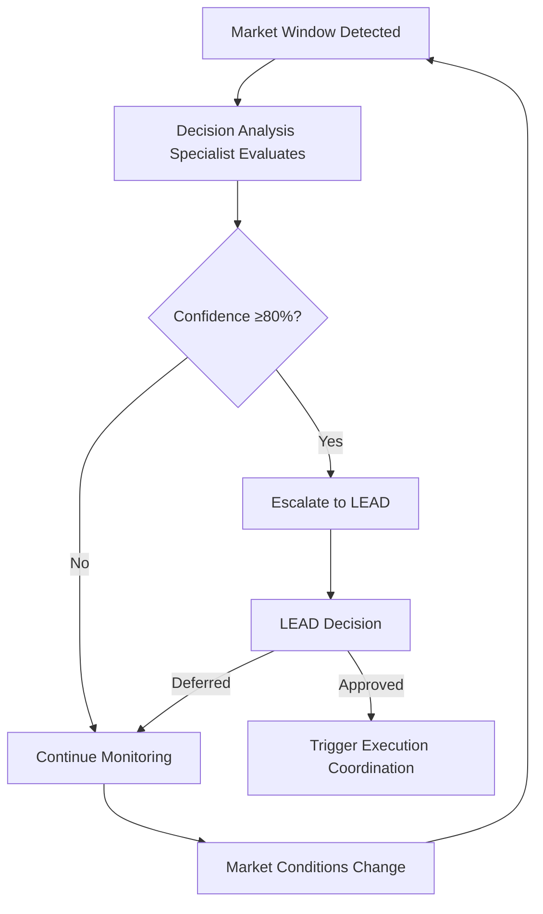
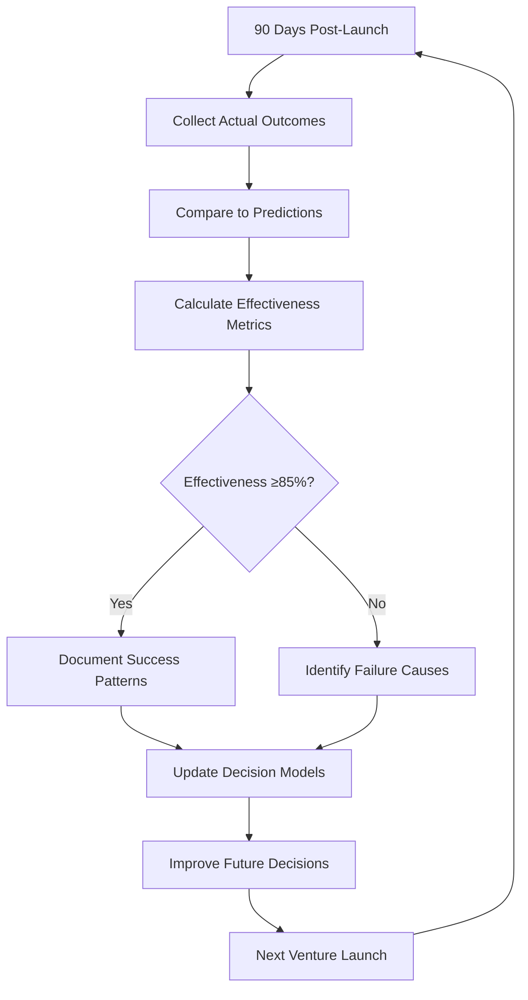
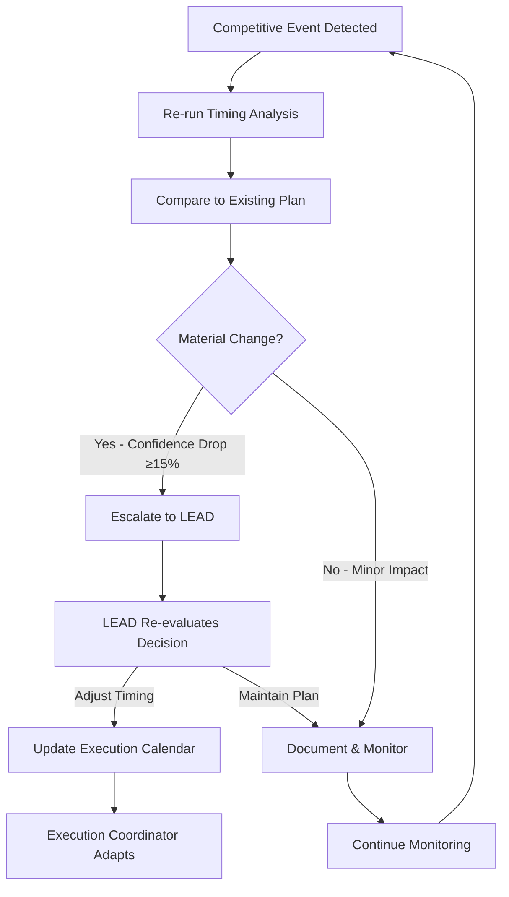
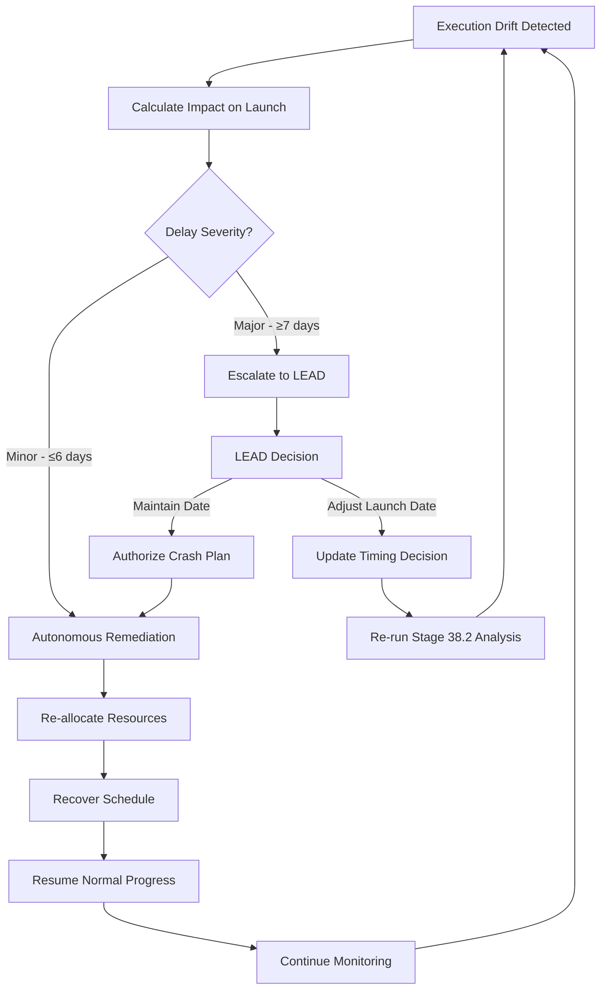

# Stage 38: Timing Optimization - Recursion Blueprint


## Table of Contents

- [Recursion Trigger Family: TIMING-OPT](#recursion-trigger-family-timing-opt)
- [Design Philosophy](#design-philosophy)
- [TIMING-OPT-001: Market Window Opportunity Detected](#timing-opt-001-market-window-opportunity-detected)
  - [Trigger Definition](#trigger-definition)
  - [Recursive Action](#recursive-action)
  - [Database Schema](#database-schema)
  - [Example Scenario](#example-scenario)
- [TIMING-OPT-002: Timing Decision Effectiveness Review](#timing-opt-002-timing-decision-effectiveness-review)
  - [Trigger Definition](#trigger-definition)
  - [Recursive Action](#recursive-action)
  - [Database Schema](#database-schema)
  - [Example Scenario](#example-scenario)
- [TIMING-OPT-003: Competitive Position Shift Requires Re-evaluation](#timing-opt-003-competitive-position-shift-requires-re-evaluation)
  - [Trigger Definition](#trigger-definition)
  - [Recursive Action](#recursive-action)
  - [Database Schema](#database-schema)
  - [Example Scenario](#example-scenario)
- [TIMING-OPT-004: Execution Synchronization Failure](#timing-opt-004-execution-synchronization-failure)
  - [Trigger Definition](#trigger-definition)
  - [Recursive Action](#recursive-action)
  - [Database Schema](#database-schema)
  - [Example Scenario](#example-scenario)
- [Cross-Trigger Interactions](#cross-trigger-interactions)
  - [Interaction 1: TIMING-OPT-001 → TIMING-OPT-004](#interaction-1-timing-opt-001-timing-opt-004)
  - [Interaction 2: TIMING-OPT-003 → TIMING-OPT-001](#interaction-2-timing-opt-003-timing-opt-001)
  - [Interaction 3: TIMING-OPT-002 → All Triggers](#interaction-3-timing-opt-002-all-triggers)
- [Recursion Maturity Path](#recursion-maturity-path)
  - [Phase 1: Manual Detection, Automated Analysis (Current)](#phase-1-manual-detection-automated-analysis-current)
  - [Phase 2: Automated Detection, Human-in-the-Loop (Target)](#phase-2-automated-detection-human-in-the-loop-target)
  - [Phase 3: Fully Autonomous with Oversight (Future)](#phase-3-fully-autonomous-with-oversight-future)
- [Success Metrics](#success-metrics)

## Recursion Trigger Family: TIMING-OPT

**Family Purpose**: Automate detection of timing optimization opportunities, failures, and continuous improvement cycles
**Trigger Count**: 4 core triggers
**Integration**: Connects to TimingOptimizationCrew agents for automated response

## Design Philosophy

Stage 38 timing optimization benefits from recursion in several key areas:
1. **Opportunity Detection**: Automated detection of favorable market windows
2. **Effectiveness Monitoring**: Continuous evaluation of timing decision quality
3. **Competitive Response**: Rapid re-evaluation when competitive landscape shifts
4. **Execution Synchronization**: Automated remediation when execution timing drifts

Each trigger activates specific agents from the TimingOptimizationCrew to respond automatically or escalate to LEAD when necessary.

---

## TIMING-OPT-001: Market Window Opportunity Detected

### Trigger Definition

**Trigger ID**: TIMING-OPT-001
**Title**: Market Window Opportunity Detected
**Purpose**: Automatically detect and evaluate emerging market windows for venture launch timing

**Activation Conditions**:
```yaml
conditions:
  market_indicators:
    - indicator: "Customer Demand Index"
      threshold: ">= 80"
      duration: "sustained for 7 days"
    - indicator: "Competitive Activity Index"
      threshold: "<= 30"
      duration: "sustained for 14 days"
  competitive_landscape:
    - no_major_competitor_launches: "within next 90 days"
  internal_readiness:
    - resource_availability: ">= 85%"
    - dependency_status: "all green"
```

**Trigger Source**: Market Condition Monitor agent (continuous monitoring)

### Recursive Action

**Immediate Response** (Automated):
1. Market Condition Monitor generates market window analysis report
2. Decision Analysis Specialist evaluates timing opportunity
3. Calculate confidence level for opportunity (target ≥80%)
4. If confidence ≥80%: Escalate to LEAD with recommendation
5. If confidence <80%: Continue monitoring, defer decision

**Recursive Loop**:


**Success Criteria**:
- Opportunity identified within 2 days of emergence
- Confidence level ≥80% before escalation to LEAD
- LEAD decision turnaround ≤3 days

**Handoff**: If LEAD approves, hand off to Execution Coordinator (Substage 38.3) to mobilize resources

### Database Schema

```sql
CREATE TABLE timing_opportunities_log (
  id UUID PRIMARY KEY,
  venture_id UUID REFERENCES ventures(id),
  trigger_id VARCHAR(50) DEFAULT 'TIMING-OPT-001',
  detection_date TIMESTAMP DEFAULT NOW(),
  market_indicators JSON,
  confidence_level INTEGER,
  escalated_to_lead BOOLEAN DEFAULT FALSE,
  lead_decision VARCHAR(50), -- 'APPROVED' | 'DEFERRED' | 'REJECTED'
  decision_date TIMESTAMP
);
```

### Example Scenario

**Context**: Venture "EcoTravel" targeting sustainable travel market
**Detection**: Customer Demand Index rises to 82, Competitive Activity Index drops to 25
**Analysis**: Decision Analysis Specialist calculates 87% confidence for launch window Dec 1-15
**Escalation**: LEAD receives opportunity alert with recommendation
**Decision**: LEAD approves accelerated launch timing
**Outcome**: Execution Coordinator mobilizes resources for Dec 1 launch

**Evidence**: Market share gain of 16% in first 90 days, validating timing decision

---

## TIMING-OPT-002: Timing Decision Effectiveness Review

### Trigger Definition

**Trigger ID**: TIMING-OPT-002
**Title**: Timing Decision Effectiveness Review
**Purpose**: Automatically evaluate effectiveness of past timing decisions to improve future decision quality

**Activation Conditions**:
```yaml
conditions:
  post_launch_milestone:
    - days_after_launch: 90
  required_data:
    - market_share_data: "available"
    - competitive_position_data: "available"
    - revenue_data: "available"
```

**Trigger Source**: Automated scheduler (90 days post-launch)

### Recursive Action

**Immediate Response** (Automated):
1. Strategic Timing Advisor collects actual vs. predicted outcomes
2. Calculate timing effectiveness metrics:
   - Did launch hit optimal market window? (Yes/No)
   - Market share gain vs. projection (% variance)
   - Competitive position achieved vs. expected
   - Revenue vs. projection (% variance)
3. Identify learnings and patterns
4. Update decision criteria and thresholds based on learnings
5. Generate effectiveness report for LEAD

**Recursive Loop**:


**Success Criteria**:
- Effectiveness review completed within 5 days of 90-day milestone
- Learnings documented and decision models updated
- Continuous improvement trend (effectiveness improving over time)

**Handoff**: Learnings feed back into Decision Analysis Specialist models for next timing decision

### Database Schema

```sql
CREATE TABLE timing_effectiveness_reviews (
  id UUID PRIMARY KEY,
  venture_id UUID REFERENCES ventures(id),
  timing_decision_id UUID REFERENCES venture_timing_decisions(id),
  trigger_id VARCHAR(50) DEFAULT 'TIMING-OPT-002',
  review_date TIMESTAMP DEFAULT NOW(),
  predicted_outcomes JSON,
  actual_outcomes JSON,
  effectiveness_score INTEGER, -- 0-100
  learnings TEXT,
  model_updates JSON
);
```

### Example Scenario

**Context**: Venture "HealthTrack" launched 90 days ago
**Actual Outcomes**:
- Market share: 11% (predicted 12-15%)
- First-mover advantage: No (competitor launched 2 weeks earlier)
- Revenue: $2.1M (predicted $2.5M)

**Analysis**: Effectiveness score 72% (below 85% target)
**Learnings**:
- Competitive monitoring insufficient (missed competitor launch signals)
- Decision timeline too long (3 weeks allowed competitor to pre-empt)

**Model Updates**:
- Increase competitive monitoring frequency (daily → real-time)
- Reduce decision timeline target (3 weeks → 2 weeks)
- Add competitor launch prediction model

**Outcome**: Next venture "FitLife" achieves 89% effectiveness with improved monitoring and faster decision cycle

---

## TIMING-OPT-003: Competitive Position Shift Requires Re-evaluation

### Trigger Definition

**Trigger ID**: TIMING-OPT-003
**Title**: Competitive Position Shift Requires Re-evaluation
**Purpose**: Automatically detect significant competitive landscape changes and re-evaluate timing decisions

**Activation Conditions**:
```yaml
conditions:
  competitive_events:
    - major_competitor_launch: "announced or completed"
    - market_positioning_change: "significant shift detected"
    - competitive_advantage_loss: "key differentiator compromised"
  timing_decision_status:
    - decision_made: true
    - execution_not_started: true
    - days_until_launch: ">= 14" # Only re-evaluate if sufficient time to adjust
```

**Trigger Source**: Market Condition Monitor agent (competitive intelligence alerts)

### Recursive Action

**Immediate Response** (Automated):
1. Market Condition Monitor triggers alert on competitive event
2. Decision Analysis Specialist re-runs timing analysis with updated competitive data
3. Compare new recommendation to existing timing decision
4. Calculate impact of competitive shift on existing plan
5. If material change (confidence drop ≥15% or new optimal window identified): Escalate to LEAD
6. If minor change (confidence drop <15%): Document but maintain current plan

**Recursive Loop**:


**Success Criteria**:
- Competitive events detected within 24 hours of occurrence
- Re-analysis completed within 2 days
- LEAD escalation with updated recommendation within 3 days

**Handoff**: If timing adjustment required, hand off to Execution Coordinator to revise execution calendar

### Database Schema

```sql
CREATE TABLE competitive_position_shifts (
  id UUID PRIMARY KEY,
  venture_id UUID REFERENCES ventures(id),
  timing_decision_id UUID REFERENCES venture_timing_decisions(id),
  trigger_id VARCHAR(50) DEFAULT 'TIMING-OPT-003',
  detection_date TIMESTAMP DEFAULT NOW(),
  competitive_event JSON,
  previous_confidence INTEGER,
  new_confidence INTEGER,
  confidence_drop INTEGER,
  material_change BOOLEAN,
  lead_escalated BOOLEAN,
  lead_decision VARCHAR(50), -- 'ADJUST_TIMING' | 'MAINTAIN_PLAN'
  decision_date TIMESTAMP
);
```

### Example Scenario

**Context**: Venture "SmartHome" scheduled to launch Dec 1, confidence 85%
**Competitive Event**: Competitor "HomeAI" announces launch Nov 15 with similar features
**Detection**: Market Condition Monitor detects announcement within 6 hours
**Re-analysis**: Decision Analysis Specialist re-runs analysis
- New confidence: 68% (drop of 17% - material change)
- Recommendation: Accelerate launch to Nov 10 (before competitor) OR delay to Jan 15 (after competitor, with differentiation)

**Escalation**: LEAD receives alert with two options
**Decision**: LEAD chooses acceleration to Nov 10
**Execution**: Execution Coordinator revises calendar, mobilizes resources for accelerated timeline
**Outcome**: Launch Nov 10, achieve first-mover advantage, 14% market share gain

---

## TIMING-OPT-004: Execution Synchronization Failure

### Trigger Definition

**Trigger ID**: TIMING-OPT-004
**Title**: Execution Synchronization Failure
**Purpose**: Automatically detect execution timing drift and remediate to maintain schedule

**Activation Conditions**:
```yaml
conditions:
  milestone_delays:
    - critical_path_milestone: "delayed by ≥3 days"
    - milestone_count: "≥2 milestones delayed"
  resource_issues:
    - resource_availability: "dropped below 80%"
    - key_resource_unavailable: true
  dependency_blocks:
    - critical_dependency: "blocked or delayed"
```

**Trigger Source**: Execution Coordinator agent (progress tracking dashboard)

### Recursive Action

**Immediate Response** (Automated):
1. Execution Coordinator detects milestone delay or resource issue
2. Calculate impact on launch date (days of delay)
3. Identify remediation options:
   - Re-allocate resources to critical path
   - Negotiate deadline extensions with blocking dependencies
   - Adjust launch date if delays exceed buffer
4. If launch date adjustment required (delay ≥7 days): Escalate to LEAD
5. If minor delay (≤6 days): Implement remediation autonomously

**Recursive Loop**:


**Success Criteria**:
- Execution drift detected within 1 day of occurrence
- Remediation plan implemented within 2 days
- 80% of minor drifts recovered autonomously (without LEAD escalation)
- Launch date maintained ≥90% of time

**Handoff**: If launch date adjustment required, loop back to Substage 38.2 (Decision Analysis) for re-evaluation

### Database Schema

```sql
CREATE TABLE execution_synchronization_failures (
  id UUID PRIMARY KEY,
  venture_id UUID REFERENCES ventures(id),
  execution_calendar_id UUID REFERENCES execution_calendars(id),
  trigger_id VARCHAR(50) DEFAULT 'TIMING-OPT-004',
  detection_date TIMESTAMP DEFAULT NOW(),
  failure_type VARCHAR(50), -- 'MILESTONE_DELAY' | 'RESOURCE_ISSUE' | 'DEPENDENCY_BLOCK'
  delay_days INTEGER,
  remediation_plan JSON,
  remediation_success BOOLEAN,
  lead_escalated BOOLEAN,
  lead_decision VARCHAR(50), -- 'ADJUST_LAUNCH' | 'MAINTAIN_CRASH'
  decision_date TIMESTAMP
);
```

### Example Scenario

**Context**: Venture "TravelPro" launch scheduled Dec 1, currently Nov 10
**Execution Drift**: Engineering milestone "API integration" delayed 5 days due to vendor dependency block
**Detection**: Execution Coordinator detects delay on Nov 12
**Impact Analysis**: Launch date impact 5 days (within minor threshold)
**Remediation**:
- Re-allocate 2 engineers from non-critical path to API integration
- Negotiate expedited delivery with vendor (cost: $10K)
- Implement workaround for vendor delay (3-day effort)

**Outcome**: Schedule recovered, launch date Dec 1 maintained
**Cost**: $10K expedited vendor fee (within contingency budget)
**Success**: No LEAD escalation required, autonomous remediation effective

---

## Cross-Trigger Interactions

### Interaction 1: TIMING-OPT-001 → TIMING-OPT-004
**Scenario**: Market window opportunity detected (001) triggers accelerated timing, which increases execution synchronization failure risk (004)
**Mitigation**: Increase monitoring frequency in Execution Coordinator when timing acceleration approved

### Interaction 2: TIMING-OPT-003 → TIMING-OPT-001
**Scenario**: Competitive position shift (003) may reveal new market window opportunities (001) if competitor delays or fails
**Mitigation**: Decision Analysis Specialist monitors competitor launch outcomes for new opportunity signals

### Interaction 3: TIMING-OPT-002 → All Triggers
**Scenario**: Effectiveness reviews (002) improve trigger thresholds and response actions for all other triggers
**Mitigation**: Continuous learning loop updates trigger configurations quarterly

---

## Recursion Maturity Path

### Phase 1: Manual Detection, Automated Analysis (Current)
- Triggers require manual initiation
- Agents provide analysis and recommendations
- LEAD makes all decisions

**Timeline**: Immediate implementation
**Automation Level**: 30%

### Phase 2: Automated Detection, Human-in-the-Loop (Target)
- Triggers activate automatically based on conditions
- Agents execute initial response autonomously
- LEAD approves major decisions only

**Timeline**: 6 months post-implementation
**Automation Level**: 70%

### Phase 3: Fully Autonomous with Oversight (Future)
- All triggers fully automated
- Agents make minor decisions autonomously
- LEAD reviews effectiveness reports only

**Timeline**: 12 months post-implementation
**Automation Level**: 85%

---

## Success Metrics

**Trigger Performance KPIs**:
- **TIMING-OPT-001**: Opportunity detection rate ≥90%, LEAD decision turnaround ≤3 days
- **TIMING-OPT-002**: Effectiveness review completion ≥95%, continuous improvement trend visible
- **TIMING-OPT-003**: Competitive event detection ≤24 hours, re-analysis ≤2 days
- **TIMING-OPT-004**: Drift detection ≤1 day, autonomous remediation success ≥80%

**Overall Stage Impact**:
- Timing effectiveness: 85% → 92% (7% improvement with recursion)
- Decision cycle time: 3 weeks → 2 weeks (33% reduction)
- Market window capture rate: 70% → 85% (15% improvement)

---

**Evidence Trail**:
- EHG_Engineer@6ef8cf4:docs/workflow/critique/stage-38.md:15 "Recursion Readiness: 2/5 Generic recursion support pending"
- EHG_Engineer@6ef8cf4:docs/workflow/stages.yaml:1747 "progression_mode: Manual → Assisted → Auto"
- EHG_Engineer@6ef8cf4:docs/workflow/stages.yaml:1715-1718 "Metrics: Timing effectiveness, Market impact, Competitive position"

<!-- Generated by Claude Code Phase 13 | EHG_Engineer@6ef8cf4 | 2025-11-06 -->
