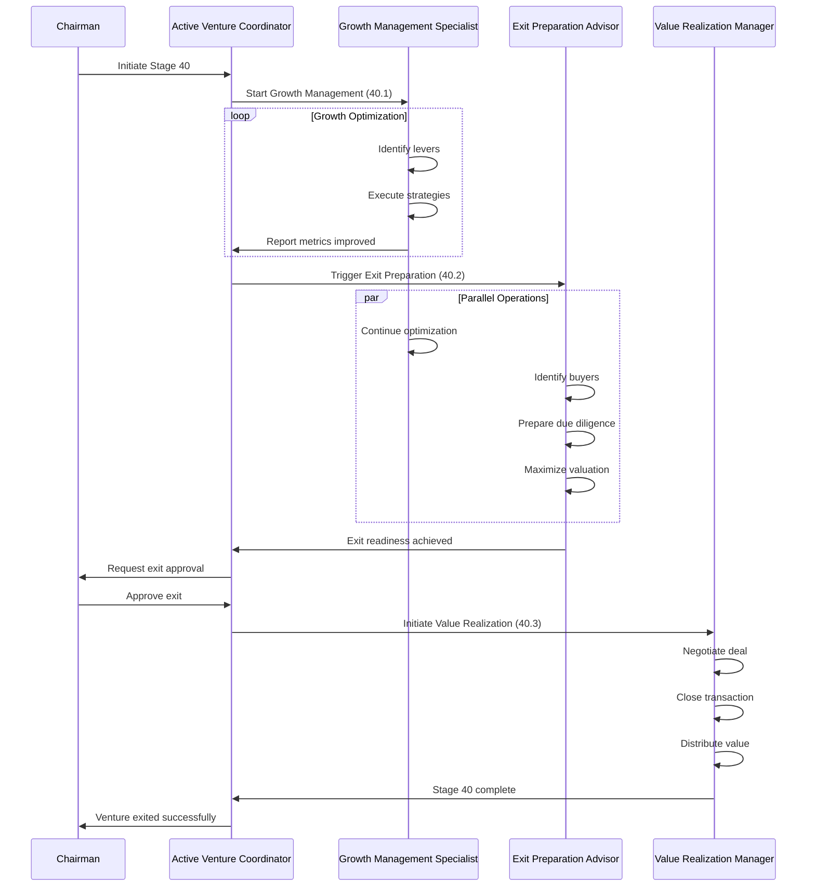

# Stage 40: Agent Orchestration

**Source**: EHG_Engineer@6ef8cf4:docs/workflow/stages.yaml:1794-1839 (no explicit agent mapping)

---

## Python CrewAI Agents (EHG App)

**Status**: ⚠️ No agents explicitly mapped to Stage 40 in available documentation

### Proposed Agent Crew: VentureActiveCrew

Based on Stage 40 outputs ("Growth decisions", "Exit timing", "Value realization") and substages, we propose:

**Crew Name**: `VentureActiveCrew`
**Purpose**: Manage active venture operations, growth optimization, and exit preparation

---

## Proposed Agent Roles

### Agent 1: Growth Management Specialist

**Role**: Identify and execute growth strategies

**Responsibilities**:
- Analyze venture performance metrics
- Identify high-impact growth levers
- Develop and execute growth strategies
- Monitor results and recommend adjustments

**Tools**:
- Analytics platform integration
- Financial modeling tools
- Market intelligence APIs
- A/B testing frameworks

**Outputs**:
- Growth lever analysis report
- Strategy execution plans
- Performance dashboards
- Optimization recommendations

**Evidence**: Derived from EHG_Engineer@6ef8cf4:docs/workflow/stages.yaml:1820-1826 (Substage 40.1)

---

### Agent 2: Exit Preparation Advisor

**Role**: Prepare venture for optimal exit

**Responsibilities**:
- Research and identify potential buyers
- Compile due diligence materials
- Optimize key metrics for valuation
- Advise on exit timing and strategy

**Tools**:
- M&A database access
- Virtual data room platform
- Valuation modeling tools
- Market timing analysis

**Outputs**:
- Target buyer list
- Due diligence package
- Valuation optimization plan
- Exit readiness score

**Evidence**: Derived from EHG_Engineer@6ef8cf4:docs/workflow/stages.yaml:1827-1832 (Substage 40.2)

---

### Agent 3: Value Realization Manager

**Role**: Execute exit transaction and value distribution

**Responsibilities**:
- Coordinate with buyers and advisors
- Negotiate deal terms
- Manage transaction process
- Oversee value distribution

**Tools**:
- Transaction management platform
- Legal document automation
- Payment/escrow systems
- Stakeholder communication tools

**Outputs**:
- Deal negotiation reports
- Transaction status updates
- Closing checklists
- Value distribution records

**Evidence**: Derived from EHG_Engineer@6ef8cf4:docs/workflow/stages.yaml:1833-1838 (Substage 40.3)

---

### Agent 4: Active Venture Coordinator

**Role**: Integrate all Stage 40 activities and advise Chairman

**Responsibilities**:
- Coordinate between growth, exit prep, and value realization
- Monitor overall Stage 40 progress
- Escalate critical decisions to Chairman
- Maintain venture status dashboard

**Tools**:
- Workflow orchestration platform
- Reporting dashboard
- Chairman communication interface
- Decision tracking system

**Outputs**:
- Weekly status reports
- Chairman decision memos
- Risk alerts
- Stage 40 completion certification

**Evidence**: Derived from EHG_Engineer@6ef8cf4:docs/workflow/stages.yaml:1800-1807 (inputs/outputs)

---

## Crew Execution Flow

---

## Agent Interaction Matrix

| Agent | Reads From | Writes To | Escalates To |
|-------|-----------|-----------|--------------|
| Growth Management Specialist | Venture performance, Market data | Growth strategies, Performance reports | Coordinator |
| Exit Preparation Advisor | Market conditions, Buyer intel | Due diligence package, Valuation | Coordinator |
| Value Realization Manager | Deal terms, Transaction status | Closing docs, Distribution records | Chairman (via Coordinator) |
| Active Venture Coordinator | All agent outputs | Chairman reports, Stage status | Chairman |

---

## Governance Handoffs (Node.js Sub-Agents)

**Limited Governance Integration at Stage 40**

Stage 40 is primarily venture operations (EHG app domain). Governance integration (EHG_Engineer) minimal:

### Potential Handoff: Exit Documentation

**Trigger**: Stage 40.3 complete (transaction closed)
**Purpose**: Generate retrospective SD for exit learnings
**Process**:
1. Value Realization Manager exports exit data
2. Coordinator creates handoff to EHG_Engineer governance system
3. LEAD agent reviews exit for process improvements
4. Learnings integrated into future Stage 40 optimizations

**Evidence**: Cross-app boundary pattern (read-only reference, no direct execution)

---

## Implementation Notes

**Status**: ⚠️ **PROPOSED** - Not yet implemented

**Next Steps**:
1. Create `VentureActiveCrew` in `/mnt/c/_EHG/EHG/agent-platform/app/crews/venture_active_crew.py`
2. Implement 4 agent classes in `/mnt/c/_EHG/EHG/agent-platform/app/agents/`
3. Define crew execution workflow
4. Integrate with ventures table (Stage 40 trigger)
5. Test with pilot venture

**Evidence**: Gap noted in EHG_Engineer@6ef8cf4:docs/workflow/critique/stage-40.md:11 (Automation Leverage: 3/5)

---

## Automation Level

**Current**: Manual (Chairman-driven decisions)
**Target**: Assisted (AI recommendations, Chairman approval) → Auto (AI execution with exception escalation)

**Progression**:
- **Manual**: Chairman reviews all metrics, makes all decisions
- **Assisted**: VentureActiveCrew provides analysis and recommendations, Chairman approves
- **Auto**: VentureActiveCrew executes routine decisions, escalates only critical items

**Evidence**: EHG_Engineer@6ef8cf4:docs/workflow/stages.yaml:1838-1839

---

## Sources Table

| Source | Repo | Commit | Path | Lines |
|--------|------|--------|------|-------|
| Stage 40 definition | EHG_Engineer | 6ef8cf4 | docs/workflow/stages.yaml | 1794-1839 |
| Substage 40.1 | EHG_Engineer | 6ef8cf4 | docs/workflow/stages.yaml | 1820-1826 |
| Substage 40.2 | EHG_Engineer | 6ef8cf4 | docs/workflow/stages.yaml | 1827-1832 |
| Substage 40.3 | EHG_Engineer | 6ef8cf4 | docs/workflow/stages.yaml | 1833-1838 |
| Automation note | EHG_Engineer | 6ef8cf4 | docs/workflow/stages.yaml | 1838-1839 |
| Automation gap | EHG_Engineer | 6ef8cf4 | docs/workflow/critique/stage-40.md | 11 |

<!-- Generated by Claude Code Phase 13 | EHG_Engineer@6ef8cf4 | 2025-11-06 -->
