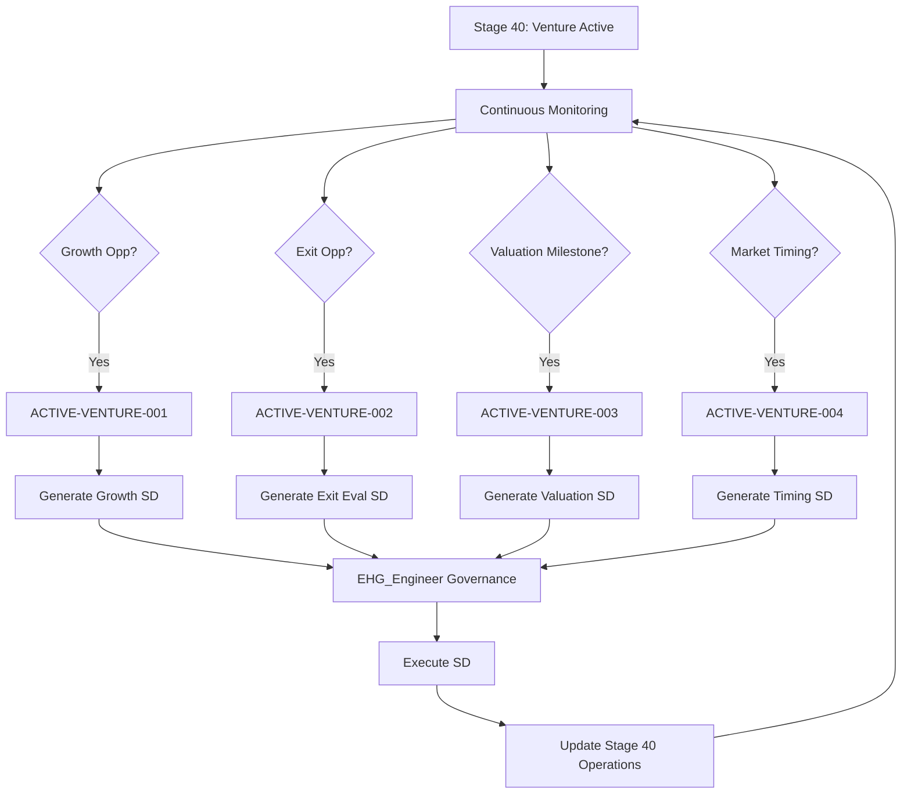

# Stage 40: Recursion Blueprint

**Source**: EHG_Engineer@6ef8cf4:docs/workflow/stages.yaml:1794-1839 (no recursion triggers defined)

---

## Current Recursion Status

**Recursion Support**: ❌ None

**Evidence**: EHG_Engineer@6ef8cf4:docs/workflow/critique/stage-40.md:15 (Recursion Readiness: 2/5 - "Generic recursion support pending")

---

## Proposed Recursion Trigger Family: ACTIVE-VENTURE

Stage 40 represents ongoing venture management. Unlike transient stages, Stage 40 requires **continuous monitoring** with event-driven governance interventions.

### Recursion Philosophy

**Stage 40 Recursion Model**: Event-driven Strategic Directives

- **Traditional Stages**: One-time completion → advance to next stage
- **Stage 40 Model**: Ongoing operations → trigger SDs when events detected

**Purpose**: Generate Strategic Directives for governance refinements based on Stage 40 events.

---

## Trigger 1: ACTIVE-VENTURE-001 (Growth Opportunity Detected)

### Trigger Condition

```yaml
trigger_id: ACTIVE-VENTURE-001
title: Growth Opportunity Detected
description: AI identifies high-potential growth lever requiring governance review
```

**When to Fire**:
- Growth Management Specialist identifies lever with projected ROI > 3x
- Lever requires significant resource allocation (>$100K or >20% budget)
- Strategic decision needed (Chairman approval required)

**Evidence**: Derived from EHG_Engineer@6ef8cf4:docs/workflow/stages.yaml:1820-1826 (Substage 40.1)

### Proposed Action

**Generate SD**: "Implement [Growth Lever Name] Strategy"
- **Phase**: LEAD (Chairman approval for resource allocation)
- **Inputs**: Growth analysis, ROI projections, resource requirements
- **Outputs**: Approved strategy, budget allocation, timeline
- **Owner**: Chairman (final decision), Growth Management Specialist (execution)

**Example**:
```
Trigger: Growth Management Specialist identifies "Partnership with Distributor X"
SD Generated: SD-GROWTH-PARTNERSHIP-X-001
Description: Evaluate and execute partnership with Distributor X (projected 40% revenue increase)
Requires: Legal review, contract negotiation, integration plan
```

---

## Trigger 2: ACTIVE-VENTURE-002 (Exit Opportunity Evaluation Required)

### Trigger Condition

```yaml
trigger_id: ACTIVE-VENTURE-002
title: Exit Opportunity Evaluation Required
description: Potential buyer expresses interest or market conditions favor exit
```

**When to Fire**:
- Inbound acquisition inquiry received
- Exit Preparation Advisor identifies optimal exit window (market timing)
- Valuation reaches Chairman's target threshold

**Evidence**: Derived from EHG_Engineer@6ef8cf4:docs/workflow/stages.yaml:1827-1832 (Substage 40.2)

### Proposed Action

**Generate SD**: "Evaluate Exit Opportunity: [Buyer/Condition]"
- **Phase**: LEAD (Chairman decision on pursuing exit)
- **Inputs**: Buyer profile, market conditions, valuation estimate, strategic fit
- **Outputs**: Go/No-Go decision, negotiation parameters, timeline
- **Owner**: Chairman (strategic decision), Exit Preparation Advisor (analysis)

**Example**:
```
Trigger: Strategic buyer "BigCorp Inc" expresses interest
SD Generated: SD-EXIT-EVAL-BIGCORP-001
Description: Evaluate acquisition offer from BigCorp Inc ($15M indicative)
Requires: Valuation analysis, strategic fit assessment, term sheet review
```

---

## Trigger 3: ACTIVE-VENTURE-003 (Valuation Milestone Review)

### Trigger Condition

```yaml
trigger_id: ACTIVE-VENTURE-003
title: Valuation Milestone Review
description: Venture reaches significant valuation milestone requiring governance update
```

**When to Fire**:
- Valuation increases/decreases by >25% in single quarter
- Valuation crosses predefined threshold ($1M, $5M, $10M, etc.)
- Market comparables shift significantly (industry consolidation, bubble, crash)

**Evidence**: Derived from EHG_Engineer@6ef8cf4:docs/workflow/stages.yaml:1808 (metric: "Valuation")

### Proposed Action

**Generate SD**: "Update Valuation Strategy Based on [Milestone]"
- **Phase**: PLAN (update valuation assumptions and exit strategy)
- **Inputs**: Current valuation, market conditions, comparable transactions
- **Outputs**: Revised valuation model, updated exit targets, strategic adjustments
- **Owner**: Chairman (approval), Exit Preparation Advisor (analysis)

**Example**:
```
Trigger: Venture valuation reaches $10M (2x previous estimate)
SD Generated: SD-VALUATION-UPDATE-10M-001
Description: Update exit strategy based on $10M valuation milestone
Requires: Re-evaluate buyer pool, adjust exit timeline, update due diligence materials
```

---

## Trigger 4: ACTIVE-VENTURE-004 (Market Conditions Favor Exit Timing)

### Trigger Condition

```yaml
trigger_id: ACTIVE-VENTURE-004
title: Market Conditions Favor Exit Timing
description: AI detects optimal exit window based on market signals
```

**When to Fire**:
- Industry M&A activity spikes (similar companies acquired)
- Market multiples reach historical highs
- Regulatory changes favor current structure (exit before new rules)
- Competitive landscape shifts (new entrants, consolidation)

**Evidence**: Derived from EHG_Engineer@6ef8cf4:docs/workflow/stages.yaml:1801 (input: "Market conditions")

### Proposed Action

**Generate SD**: "Accelerate Exit Process Due to Market Timing"
- **Phase**: EXEC (accelerate Substage 40.2 → 40.3 transition)
- **Inputs**: Market analysis, timing rationale, readiness assessment
- **Outputs**: Accelerated exit timeline, buyer outreach plan, urgency justification
- **Owner**: Chairman (go/no-go), Value Realization Manager (execution)

**Example**:
```
Trigger: 3 comparable companies acquired at 8x revenue (2x normal multiple)
SD Generated: SD-EXIT-TIMING-MARKET-PEAK-001
Description: Capitalize on favorable market conditions for exit
Requires: Rapid due diligence finalization, buyer outreach, expedited negotiations
```

---

## Recursion Workflow Integration

### Stage 40 Event Loop



### Cross-App Boundary

**EHG App** (Venture Operations):
- Runs VentureActiveCrew agents
- Monitors Stage 40 events
- Detects trigger conditions

**EHG_Engineer** (Governance):
- Receives trigger notifications via handoff
- Generates and manages Strategic Directives
- Returns approved decisions to EHG app

**Boundary Protocol**: Read-only references, handoff-based communication (no direct execution)

---

## Implementation Roadmap

### Phase 1: Trigger Detection (EHG App)
1. Implement event monitoring in VentureActiveCrew
2. Define trigger condition logic
3. Create trigger notification system

### Phase 2: Handoff Integration (Cross-App)
1. Design ACTIVE-VENTURE handoff schema
2. Implement handoff creation in VentureActiveCrew
3. Configure handoff reception in EHG_Engineer

### Phase 3: SD Generation (EHG_Engineer)
1. Create SD templates for each trigger type
2. Implement automated SD creation on handoff receipt
3. Route to appropriate governance phase (LEAD/PLAN/EXEC)

### Phase 4: Closed-Loop Execution
1. Execute SD through governance workflow
2. Return approved decisions to EHG app
3. Update Stage 40 operations based on SD outputs
4. Monitor outcomes and iterate

---

## Recursion Metrics

**Trigger Effectiveness**:
- Trigger accuracy rate (% of triggers leading to approved SDs)
- Average SD completion time per trigger type
- ROI of trigger-generated SDs

**Stage 40 Performance**:
- Growth rate improvement from ACTIVE-VENTURE-001 SDs
- Exit timing optimization from ACTIVE-VENTURE-004 SDs
- Valuation increase from all trigger-driven interventions

---

## Sources Table

| Source | Repo | Commit | Path | Lines |
|--------|------|--------|------|-------|
| Recursion readiness score | EHG_Engineer | 6ef8cf4 | docs/workflow/critique/stage-40.md | 15 |
| Substage 40.1 (growth) | EHG_Engineer | 6ef8cf4 | docs/workflow/stages.yaml | 1820-1826 |
| Substage 40.2 (exit prep) | EHG_Engineer | 6ef8cf4 | docs/workflow/stages.yaml | 1827-1832 |
| Substage 40.3 (value real) | EHG_Engineer | 6ef8cf4 | docs/workflow/stages.yaml | 1833-1838 |
| Inputs (market conditions) | EHG_Engineer | 6ef8cf4 | docs/workflow/stages.yaml | 1800-1803 |
| Metrics (valuation) | EHG_Engineer | 6ef8cf4 | docs/workflow/stages.yaml | 1808-1811 |

<!-- Generated by Claude Code Phase 13 | EHG_Engineer@6ef8cf4 | 2025-11-06 -->
