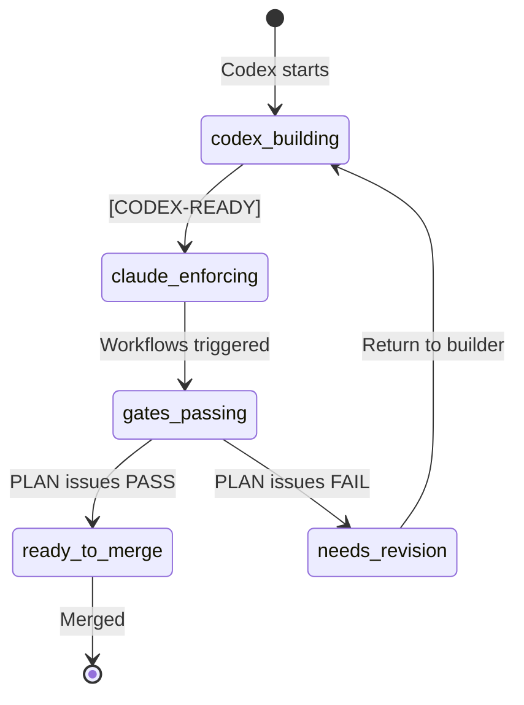

# Dual-Lane SOP — Roles & Responsibilities

## Overview
This Standard Operating Procedure defines the chain of responsibility for PR monitoring and gate enforcement under the dual-lane workflow, consistent with CLAUDE.md (LEO Protocol v4.2.0).

**Effective Date**: 2025-01-19
**Protocol Version**: LEO v4.2.0_story_gates
**Classification**: Operational Governance

---

## 1. Lane Definitions & Boundaries

### 1.1 Codex (Builder Lane)
**Role**: Read-only builder generating implementation artifacts

**Responsibilities**:
- Generates patch bundles (`artifact.tar.gz`) containing:
  - Unified diffs (`changes.patch`)
  - SBOM (CycloneDX 1.5 JSON format)
  - Attestation (in-toto v1.0, SLSA Provenance v0.2)
  - Rollback notes and merge-base SHA
- Commits to `staging/codex-*` branches only
- Outputs handoff marker: `[CODEX-READY:<hash>]`

**Restrictions**:
- ❌ No database writes (read-only via `SUPABASE_ANON_KEY`)
- ❌ No PR creation authority
- ❌ No gate monitoring responsibilities
- ❌ No deployment permissions
- ❌ No network access for signing (Sigstore blocked in sandbox)

---

### 1.2 Claude/EXEC (Enforcer Lane)
**Role**: Write-enabled enforcer applying patches and triggering gates

**Responsibilities**:
- Verifies builder artifacts (SHA256, attestation validity, SBOM compliance)
- Re-signs artifacts with Sigstore keyless signing if needed
- Applies patches to `feature/*` branch via cherry-pick or apply
- Opens PR with commit marker: `[CLAUDE-APPLIED:<hash>]`
- Triggers required workflows:
  - SLSA verification workflow
  - Policy verification workflow
  - LEO Gate Validation (Gate 3)
  - Story Release Gate Check

**Authority**:
- ✅ Database writes via `SUPABASE_SERVICE_ROLE_KEY`
- ✅ PR creation and label management
- ✅ Workflow triggering

**Responsibility Boundary**:
- **Ends**: Once PR is created and workflows are triggered
- **Does NOT**: Monitor gate results or issue verdicts

---

## 2. Verification & Approval Roles

### 2.1 PLAN (Supervisor)
**Role**: Technical verification and "done done" confirmation

**Active Monitoring Responsibilities**:
- Monitors PR workflows after EXEC creates PR
- Runs supervisor verification:
  - Command: `/leo-verify [PR-number]`
  - Script: `node scripts/plan-supervisor-verification.js --pr [PR-number]`
- Aggregates sub-agent results (Security, Database, Testing, Performance, Design)
- Issues definitive verdict:
  - **PASS**: ≥85% confidence, all requirements met
  - **FAIL**: Critical issues or <85% confidence
  - **CONDITIONAL_PASS**: Minor issues, escalate to LEAD
  - **ESCALATE**: Cannot reach consensus, needs LEAD intervention

**Verification Percentage**: 15% of total work (per LEO Protocol)

**Branch Protection Enforcement**:
- Gate name: `LEO Gate Validation / Run Gate 3 for PRD-*`
- Blocks merge until PASS verdict is recorded
- Must be marked as "Required" in GitHub branch protection

---

### 2.2 LEAD (Strategic Authority)
**Role**: Strategic escalation and final approval

**Responsibilities**:
- Reviews PRs only when PLAN issues:
  - `CONDITIONAL_PASS` verdict
  - `ESCALATE` verdict
- Provides final strategic approval after PLAN's PASS
- Authority to override with documented justification
- Sets priority levels for competing PRs

**Approval Percentage**: 15% of total work (per LEO Protocol)

---

## 3. Branch Protection Configuration

### Required Checks (Must ALL Pass)
```yaml
required_status_checks:
  contexts:
    - "LEO Gate Validation / Run Gate 3 for PRD-*"  # PLAN Supervisor ≥85%
    - "Story Release Gate Check / Check Story Release Gate"
    - "SLSA Verification / Verify SLSA Provenance"
    - "Policy Verification / Validate Policy Bundle"
```

### Label State Machine


---

## 4. Handoff Workflow

### 4.1 Complete Flow
```
1. Codex → Creates patch on staging/codex-* branch
2. Codex → Commits with [CODEX-READY:<hash>]
3. Claude → Verifies artifacts and signatures
4. Claude → Applies to feature/* branch
5. Claude → Opens PR with [CLAUDE-APPLIED:<hash>]
6. Claude → Triggers all required workflows
7. PLAN → Monitors PR and workflows
8. PLAN → Runs supervisor verification
9. PLAN → Issues PASS/FAIL verdict
10. LEAD → Reviews if escalation needed
11. System → Allows merge only after PASS recorded
```

### 4.2 Handoff Markers
| Stage | Marker | Responsible Role |
|-------|--------|-----------------|
| Builder complete | `[CODEX-READY:<hash>]` | Codex |
| Enforcer applied | `[CLAUDE-APPLIED:<hash>]` | Claude/EXEC |
| Verification pass | `PLAN-SUPERVISOR: PASS` | PLAN |
| Strategic approval | `LEAD-APPROVED: <reason>` | LEAD |

---

## 5. Accountability Matrix

| Action | Codex | Claude/EXEC | PLAN | LEAD |
|--------|-------|-------------|------|------|
| Generate patches | ✅ | ❌ | ❌ | ❌ |
| Sign artifacts | ❌ | ✅ | ❌ | ❌ |
| Create PR | ❌ | ✅ | ❌ | ❌ |
| Trigger workflows | ❌ | ✅ | ❌ | ❌ |
| Monitor gates | ❌ | ❌ | ✅ | ❌ |
| Issue PASS verdict | ❌ | ❌ | ✅ | ❌ |
| Escalation review | ❌ | ❌ | ❌ | ✅ |
| Database writes | ❌ | ✅ | ✅ | ✅ |

---

## 6. Failure Modes & Recovery

### 6.1 Gate Failure
- **PLAN issues FAIL**: PR blocked, return to Codex for fixes
- **Recovery**: Codex generates new patch, process restarts

### 6.2 Timeout
- **Gates don't complete in 4 hours**: PLAN escalates to LEAD
- **Recovery**: LEAD can force re-run or approve with override

### 6.3 Conflict
- **Sub-agents disagree**: PLAN attempts resolution (max 3 iterations)
- **Recovery**: ESCALATE to LEAD for decision

---

## 7. Compliance & Audit

### 7.1 Required Evidence
- All handoff markers must be in git history
- PASS verdicts must be recorded in database
- PR must link to source handoff bundle
- Audit trail must show role separation

### 7.2 Database Records
```sql
-- Required tables for audit trail
leo_handoff_tracking     -- Handoff events
leo_verification_results -- PLAN verdicts
leo_gate_executions      -- Workflow results
pr_approval_audit        -- LEAD decisions
```

---

## 8. Quick Reference

### Commands
```bash
# Codex (Builder)
git checkout -b staging/codex-<feature>
git commit -m "[CODEX-READY:<hash>] <message>"

# Claude (Enforcer)
git checkout -b feature/<name>
git cherry-pick <codex-commit>
git commit -m "[CLAUDE-APPLIED:<hash>] <message>"
gh pr create --label claude-enforcing

# PLAN (Supervisor)
node scripts/plan-supervisor-verification.js --pr <number>
/leo-verify PR-<number>

# LEAD (if needed)
node scripts/lead-approval-assessment.js --pr <number>
```

### Environment Variables
```bash
# Codex
source .env.codex  # Read-only

# Claude
source .env.claude  # Write-enabled
```

---

## 9. References
- CLAUDE.md (LEO Protocol v4.2.0)
- docs/dual-lane-branch-protection.md
- .github/workflows/slsa-verification.yml
- .github/workflows/policy-verification.yml
- .github/workflows/leo-gates.yml

---

## 10. Sigstore Signing Requirements

### 10.1 Network Requirements
**CRITICAL**: Sigstore keyless signing requires network access to:
- Fulcio CA: https://fulcio.sigstore.dev
- Rekor: https://rekor.sigstore.dev
- OIDC Provider: GitHub Actions or configured identity provider

**Sandbox Limitations**:
- Codex lane (sandboxed) CANNOT perform Sigstore signing
- Only Claude/EXEC lane has required network egress
- GPG fallback available for air-gapped environments

### 10.2 Signing Workflow
```bash
# Claude/EXEC lane only
COSIGN_EXPERIMENTAL=1 cosign sign-blob \
  --yes \
  --bundle artifact.bundle \
  --output-signature artifact.sig \
  --output-certificate artifact.crt \
  artifact.tar.gz
```

### 10.3 GPG Fallback (Sandbox/Air-gapped)
When Sigstore is unavailable:
1. Use GPG with dedicated signing key
2. Rotate keys every 30 days
3. Store public keys in database
4. Include key fingerprint in attestation

```bash
# Generate signing key
gpg --gen-key --batch <<EOF
Key-Type: RSA
Key-Length: 4096
Name-Real: EHG Artifact Signer
Name-Email: artifacts@ehg.example
Expire-Date: 30d
EOF

# Sign artifact
gpg --detach-sign --armor artifact.tar.gz
```

### 10.4 Verification Requirements
All artifacts MUST be verified before use:
- **Container Images**: cosign verify with digest
- **Policy Bundles**: Signed and attested
- **Artifact Bundles**: SLSA L3 provenance
- **Attestations**: in-toto v1.0 format

### 10.5 SLSA Level 3 Compliance
To achieve SLSA L3:
- ✅ Non-falsifiable provenance (signed attestations)
- ✅ Isolated builds (GitHub Actions runners)
- ✅ Parameterless builds (all inputs in provenance)
- ✅ Hermetic builds (reproducible with same inputs)

---

*This SOP is maintained under database-first architecture. Do not create file-based PRDs or handoff documents. All state must be tracked in the database.*

**Last Updated**: 2025-01-19
**Next Review**: 2025-02-19
**Owner**: Platform Engineering Team