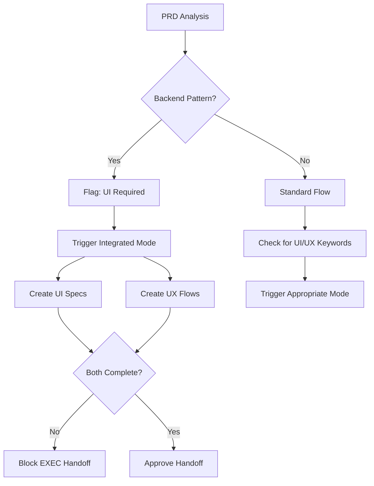

# Design UI/UX Collaboration Workflow

**LEO Protocol v4.2.0 - Enhanced Design Sub-Agent**

## 🎯 Purpose

This playbook ensures **every feature** has proper UI and UX coverage, preventing "invisible backend features" that exist in code but have no user-facing interface.

## 🏗️ Architecture Overview

### Single Design Sub-Agent with Dual Modes

The **Senior Design Sub-Agent** ("The UX Artisan") operates in three workflow modes:

1. **UI Mode** - Visual component design and styling
2. **UX Mode** - User experience and interaction design
3. **Integrated Mode** - Complete UI/UX analysis (default for new features)

## 📋 Workflow Modes

### 1. UI Mode (Visual Component Design)

**When to Use:**
- New visual components needed
- Styling or CSS changes
- Design system updates
- Theme implementation (light/dark mode)

**Deliverables:**
- Component visual specifications
- CSS/Tailwind class definitions
- Design tokens and variables
- Responsive design breakpoints
- Theme support implementation

**Checklist (Must be 100%):**
- [ ] Visual components defined with complete specs
- [ ] Design system compliance verified
- [ ] Responsive design tested at all breakpoints
- [ ] Theme support (light/dark) implemented
- [ ] CSS/styling implementation ready

### 2. UX Mode (User Experience Design)

**When to Use:**
- New user flows required
- Navigation changes
- Accessibility improvements
- Interaction pattern updates

**Deliverables:**
- User flow diagrams
- Navigation maps
- Interaction specifications
- Accessibility audit results
- User journey documentation

**Checklist (Must be 100%):**
- [ ] User flows documented and mapped
- [ ] Navigation paths clear and intuitive
- [ ] WCAG 2.1 AA accessibility verified
- [ ] Interaction patterns defined
- [ ] End-to-end user journey validated

### 3. Integrated Mode (Complete Feature)

**When to Use (Automatic Triggers):**
- New feature implementation
- Backend feature without UI
- API endpoint created
- Database model/table added
- User-facing functionality

**Workflow:**
1. **UX Analysis** → Create user flows and navigation
2. **UI Analysis** → Design visual components
3. **Validation** → Ensure flows work with components
4. **Handoff** → Create unified EXEC handoff with both specs
5. **Gate** → Both checklists must be 100% before approval

## 🔄 Integration with LEO Phases

### LEAD Phase
- LEAD detects strategic directive needs UI/UX
- Flags features requiring user interface
- Ensures Design sub-agent will be triggered in PLAN

### PLAN Phase
**CRITICAL: Design sub-agent runs HERE**

1. **Detection**
   - PLAN analyzes PRD content
   - Detects backend features, API endpoints, data models
   - Triggers Design sub-agent automatically

2. **Design Analysis**
   - Design sub-agent determines mode (UI/UX/Integrated)
   - Runs appropriate workflow and checklists
   - Validates 100% completion

3. **Handoff Creation**
   - Design creates handoff to EXEC
   - Includes both UI and UX specifications
   - Sets gate requirement: `hasUIUXDesign: true`

4. **Blocking Gate**
   - PLAN CANNOT handoff to EXEC without Design approval
   - Both UI and UX checklists must be 100%
   - Accessibility must be verified

### EXEC Phase
1. **Receives Design Handoff**
   - UI component specifications
   - UX flow documentation
   - Accessibility requirements
   - Design system compliance rules

2. **Implementation**
   - Follows UI specifications exactly
   - Implements UX flows as designed
   - Includes accessibility attributes (ARIA, keyboard nav)
   - Maintains design system compliance

3. **Post-Implementation Verification**
   - Design sub-agent verifies visual accuracy
   - Design sub-agent validates UX flow completeness
   - Checks accessibility compliance

## 🚨 Backend Feature Detection

### Automatic Triggers

The Design sub-agent automatically activates when detecting:

| Backend Pattern | Detection Keyword | UI Required |
|----------------|-------------------|-------------|
| API Endpoint | "api endpoint", "new endpoint" | ✅ CRITICAL |
| Database Model | "database model", "database table" | ✅ CRITICAL |
| Route/Controller | "new route", "controller" | ✅ HIGH |
| Service Layer | "service layer", "business logic" | ✅ HIGH |
| Data Structure | "data model", "data structure" | ✅ MEDIUM |

### Detection Workflow



## 🤝 Sub-Agent Collaboration

### With DATABASE Sub-Agent

**Interaction:** Proactive UI verification

When DATABASE sub-agent creates/modifies data models:
1. DATABASE notifies Design sub-agent
2. Design verifies UI components exist for data display
3. Design creates specs if missing
4. Both approve before EXEC

**Example:**
```
DATABASE: "Created `ventures` table with 12 fields"
DESIGN: "Verifying UI for venture data..."
DESIGN: "Missing: Venture card component, detail view, list display"
DESIGN: "Creating UI specs for venture components"
```

### With SECURITY Sub-Agent

**Interaction:** Visual security feedback

When SECURITY defines auth requirements:
1. SECURITY defines auth logic
2. Design creates visual states for auth
3. Design specifies error messages
4. Both approve security UX

**Visual Elements:**
- Login/logout UI flows
- Auth state indicators
- Permission-based UI variations
- Security error message design

### With TESTING Sub-Agent

**Interaction:** Testable design

Design provides testing-friendly specs:
- `data-testid` attributes for all interactive elements
- Consistent selector patterns
- Clear visual states for testing
- Accessibility tree for automated testing

### With PERFORMANCE Sub-Agent

**Interaction:** Performance-aware design

Design considers performance:
- Lazy loading for images/components
- Animation performance (60fps target)
- Bundle size impact of design assets
- Critical rendering path optimization

## 📊 Success Metrics

### Coverage Metrics
- **100%** of features have UI/UX approval
- **0** invisible backend features
- **95%+** design system consistency
- **95%+** accessibility compliance (WCAG 2.1 AA)

### Quality Gates
- Both UI and UX checklists 100% complete
- Accessibility verified for all interactions
- Responsive design tested at all breakpoints
- Design system patterns followed

### Audit Frequency
- **Per PRD:** Run design audit before EXEC
- **Weekly:** Full system audit (`node scripts/design-ui-ux-audit.js --all`)
- **Per Release:** Comprehensive UI/UX review

## 🔧 Tools & Scripts

### Audit Script
```bash
# Audit all active PRDs
node scripts/design-ui-ux-audit.js --all

# Audit specific PRD
node scripts/design-ui-ux-audit.js --prd PRD-2025-001

# Audit by Strategic Directive
node scripts/design-ui-ux-audit.js --sd SD-2025-001
```

### Command
```bash
# Trigger Design sub-agent manually
/leo-design [describe UI/UX issue]
```

### Database Migration
```bash
# Apply expanded triggers
psql $DATABASE_URL -f database/migrations/expand-design-subagent-triggers.sql
```

## 📝 Examples

### Example 1: Backend Feature Caught

**PRD Content:**
> "Create API endpoint `/api/ventures/stats` returning venture analytics data"

**Design Detection:**
```
🚨 CRITICAL: Backend feature detected without UI
- API endpoint: /api/ventures/stats
- Data: venture analytics
- UI Component: MISSING

🎨 Triggering Integrated Mode:
1. UX Analysis → Create analytics dashboard flow
2. UI Analysis → Design charts and stats cards
3. Validation → Ensure data flow works
4. Handoff → Specs ready for EXEC
```

**Result:**
- UX flow: Navigation → Dashboard → Analytics view
- UI specs: Chart components, stat cards, data tables
- Accessibility: Screen reader support for charts
- EXEC receives complete specifications

### Example 2: Pure UI Change

**PRD Content:**
> "Update button styles to match new brand guidelines"

**Design Detection:**
```
🎨 UI Mode Triggered (no UX changes needed)

Checklist:
✅ Visual components defined (button variants)
✅ Design system compliance (brand colors applied)
✅ Responsive design verified (all breakpoints)
✅ Theme support (light/dark variants)
✅ CSS implementation (Tailwind classes specified)
```

### Example 3: Navigation Update

**PRD Content:**
> "Add breadcrumb navigation to improve user wayfinding"

**Design Detection:**
```
👤 UX Mode Triggered (navigation improvement)

Checklist:
✅ User flows documented (navigation paths)
✅ Navigation clear (breadcrumb hierarchy)
✅ Accessibility verified (ARIA breadcrumb role)
✅ Interaction patterns (click/keyboard nav)
✅ User journey complete (all pages covered)
```

## 🚀 Quick Start Guide

### For PLAN Agents

1. **Read PRD thoroughly**
2. **Check for backend patterns** (API, DB, routes)
3. **Trigger Design sub-agent** (automatic if patterns detected)
4. **Verify both checklists** are 100% complete
5. **Only handoff to EXEC** if Design approved

### For EXEC Agents

1. **Review Design handoff** (UI + UX specs)
2. **Implement UI components** per specifications
3. **Implement UX flows** as designed
4. **Include accessibility** attributes
5. **Request Design verification** post-implementation

### For Design Sub-Agent

1. **Detect mode** (UI/UX/Integrated) from task
2. **Run workflow** for detected mode
3. **Complete checklists** (100% required)
4. **Create handoff** with all specifications
5. **Verify implementation** after EXEC completes

## ❌ Common Pitfalls

### Pitfall 1: "Backend-Only" PRDs
**Problem:** PRD only describes API/database without UI

**Solution:**
- Design sub-agent auto-detects backend patterns
- Blocks EXEC handoff until UI/UX specs created
- Forces integrated mode for complete coverage

### Pitfall 2: Accessibility Afterthought
**Problem:** Accessibility added after implementation

**Solution:**
- Accessibility is part of UX checklist (mandatory)
- WCAG 2.1 AA verified before EXEC starts
- Design specifies ARIA labels, keyboard nav upfront

### Pitfall 3: Inconsistent Design System
**Problem:** Components don't follow design patterns

**Solution:**
- UI checklist requires design system compliance
- Design sub-agent verifies patterns used
- Rejects non-compliant specifications

## 📚 Reference

### Checklists
- [UI Checklist](#1-ui-mode-visual-component-design)
- [UX Checklist](#2-ux-mode-user-experience-design)

### Integration Points
- [PLAN Phase Integration](#plan-phase)
- [Sub-Agent Collaboration](#-sub-agent-collaboration)

### Tools
- [Audit Script](../scripts/design-ui-ux-audit.js)
- [Design Command](../.claude/commands/leo-design.md)
- [Database Migration](../database/migrations/expand-design-subagent-triggers.sql)

### Personas
- [Design Agent Persona](../lib/agents/personas/sub-agents/design-agent.json)

---

**Remember:** Every backend feature needs a frontend face. If users can't see it, it doesn't exist.
