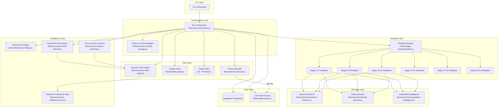
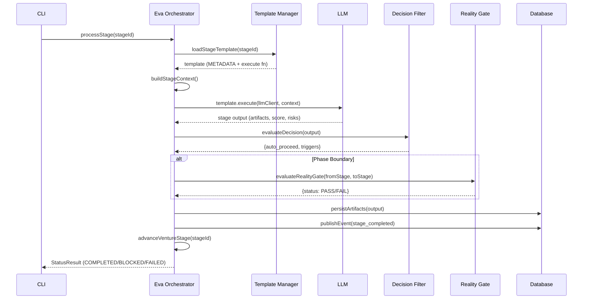

## Table of Contents

- [Purpose](#purpose)
- [System Architecture](#system-architecture)
- [The 25-Stage Lifecycle](#the-25-stage-lifecycle)
  - [Phase Summary](#phase-summary)
- [Component Inventory](#component-inventory)
  - [Core Modules (~6,500 LOC total)](#core-modules-6500-loc-total)
  - [Stage Templates (25 files, ~80-230 lines each)](#stage-templates-25-files-80-230-lines-each)
  - [Services](#services)
- [Key Architectural Patterns](#key-architectural-patterns)
  - [1. Dependency Injection](#1-dependency-injection)
  - [2. Pure Functions](#2-pure-functions)
  - [3. Fail-Closed Gates](#3-fail-closed-gates)
  - [4. Idempotency](#4-idempotency)
  - [5. Resolution Cascading](#5-resolution-cascading)
  - [6. Event-Driven Audit](#6-event-driven-audit)
- [Gate Architecture](#gate-architecture)
- [Data Flow](#data-flow)
  - [Single Stage Execution](#single-stage-execution)
  - [Lifecycle-to-SD Bridge Flow (Stage 18)](#lifecycle-to-sd-bridge-flow-stage-18)
- [Database Schema Overview](#database-schema-overview)
- [Token Budget Profiles](#token-budget-profiles)
- [Integration Points](#integration-points)
  - [With LEO Protocol](#with-leo-protocol)
  - [With LLM Client Factory](#with-llm-client-factory)
  - [With Chairman Governance](#with-chairman-governance)
- [For AI Agents: Quick Start](#for-ai-agents-quick-start)

---
Category: Architecture
Status: Approved
Version: 1.0.0
Author: DOCMON Sub-Agent
Last Updated: 2026-02-08
Tags: [cli-venture-lifecycle, eva, orchestrator, architecture]
Related SDs: [SD-LEO-ORCH-CLI-VENTURE-LIFECYCLE-001]
---

# Eva Orchestrator: System Architecture Overview

## Purpose

The Eva Orchestrator is a CLI-driven autonomous system that guides ventures through a 25-stage development lifecycle. It coordinates stage execution, gate evaluation, artifact persistence, and chairman governance to systematically progress a venture from initial idea to optimized, scaling product.

**Design Philosophy:**
- Solo AI Entrepreneur: Optimized for AI-assisted venture development
- Phase-Gated Progression: Clear boundaries prevent premature advancement
- Decision Gates: Explicit kill/revise/proceed checkpoints
- Artifact-Driven: Every stage produces measurable outputs
- Deterministic Governance: Risk evaluation via rules, not AI guessing

---

## System Architecture



---

## The 25-Stage Lifecycle

The lifecycle organizes 25 stages into 6 phases, each serving a distinct purpose in venture development:

```
┌──────────────────────────────────────────────────────────────────┐
│                     25-STAGE VENTURE LIFECYCLE                    │
├──────────────────────────────────────────────────────────────────┤
│                                                                   │
│  PHASE 1: THE TRUTH (1-5)              PHASE 2: THE ENGINE (6-9) │
│  Validate idea before investment       Build business model       │
│  ┌─────────────────────────┐           ┌─────────────────┐       │
│  │ 1  2  3☠ 4  5☠        │──[RG]──►  │ 6  7  8  9      │       │
│  └─────────────────────────┘           └─────────────────┘       │
│                                              │                    │
│                                           [RG]                    │
│                                              ▼                    │
│  PHASE 3: THE IDENTITY (10-12)         PHASE 4: BLUEPRINT (13-16)│
│  Brand and GTM strategy                Technical specification    │
│  ┌─────────────────┐                   ┌──────────────────┐      │
│  │ 10† 11  12      │──────[RG]──────► │ 13☠ 14† 15† 16⬆ │      │
│  └─────────────────┘                   └──────────────────┘      │
│                                              │                    │
│                                           [RG]                    │
│                                              ▼                    │
│  PHASE 5: THE BUILD LOOP (17-22)       PHASE 6: LAUNCH (23-25)  │
│  Implementation (all SD-required)       Deploy and optimize       │
│  ┌─────────────────────────┐           ┌─────────────────┐       │
│  │ 17⬆† 18†🔗 19† 20† 21†│──[RG]──► │ 23☠ 24  25†⟳   │       │
│  │ 22⬆†                   │           └─────────────────┘       │
│  └─────────────────────────┘                                      │
│                                                                   │
│  Legend:  ☠ Kill Gate   ⬆ Promotion Gate   [RG] Reality Gate     │
│           † SD Required  🔗 Lifecycle-SD Bridge  ⟳ Drift Check   │
└──────────────────────────────────────────────────────────────────┘
```

### Phase Summary

| Phase | Name | Stages | Purpose | Gates |
|-------|------|--------|---------|-------|
| 1 | THE TRUTH | 1-5 | Validate idea before investment | Kill: 3, 5. Reality: 5→6 |
| 2 | THE ENGINE | 6-9 | Build business model foundation | Reality: 9→10 |
| 3 | THE IDENTITY | 10-12 | Brand, positioning, GTM | Reality: 12→13 |
| 4 | THE BLUEPRINT | 13-16 | Technical specification | Kill: 13. Promotion: 16. Reality: 16→17 |
| 5 | THE BUILD LOOP | 17-22 | Implementation | Promotion: 17, 22. Reality: 20→21 |
| 6 | LAUNCH & LEARN | 23-25 | Deploy and optimize | Kill: 23. Drift: 25 |

---

## Component Inventory

### Core Modules (~6,500 LOC total)

| Module | File | Lines | Purpose |
|--------|------|-------|---------|
| Eva Orchestrator | `lib/eva/eva-orchestrator.js` | 502 | Core orchestration engine |
| Decision Filter Engine | `lib/eva/decision-filter-engine.js` | 261 | Deterministic risk evaluation |
| Reality Gates | `lib/eva/reality-gates.js` | 320 | Phase boundary enforcement |
| Chairman Preference Store | `lib/eva/chairman-preference-store.js` | 295 | Scoped preference resolution |
| Devil's Advocate | `lib/eva/devils-advocate.js` | 260 | Adversarial review via GPT-4o |
| Venture Context Manager | `lib/eva/venture-context-manager.js` | 261 | Active venture tracking |
| Lifecycle-SD Bridge | `lib/eva/lifecycle-sd-bridge.js` | 284 | Sprint-to-SD conversion |
| Constraint Drift Detector | `lib/eva/constraint-drift-detector.js` | 468 | Assumption drift analysis |
| Cross-Venture Learning | `lib/eva/cross-venture-learning.js` | 358 | Pattern analysis across ventures |
| Barrel Export | `lib/eva/index.js` | 43 | Public API exports |

### Stage Templates (25 files, ~80-230 lines each)

| Phase | Files | Total Lines |
|-------|-------|-------------|
| Truth (1-5) | `stage-01.js` to `stage-05.js` | ~577 |
| Engine (6-9) | `stage-06.js` to `stage-09.js` | ~619 |
| Identity (10-12) | `stage-10.js` to `stage-12.js` | ~563 |
| Blueprint (13-16) | `stage-13.js` to `stage-16.js` | ~748 |
| Build Loop (17-22) | `stage-17.js` to `stage-22.js` | ~816 |
| Launch (23-25) | `stage-23.js` to `stage-25.js` | ~504 |
| Registry + Validation | `index.js`, `validation.js` | ~205 |

### Services

| Service | File | Lines | Purpose |
|---------|------|-------|---------|
| Venture Research | `lib/eva/services/venture-research.js` | 445 | Research session management |
| Brand Genome | `lib/eva/services/brand-genome.js` | 320 | Brand identity + completeness |
| Competitive Intelligence | `lib/eva/services/competitive-intelligence.js` | 254 | Competitor tracking |

---

## Key Architectural Patterns

### 1. Dependency Injection

All core modules accept injected dependencies (database client, logger, custom gate functions). This enables testing without module mocking and allows flexible composition.

**Pattern**: `processStage(params, deps)` where `deps` can override `evaluateDecisionFn`, `validateStageGateFn`, etc.

### 2. Pure Functions

The Decision Filter Engine and Constraint Drift Detector are pure/deterministic. Same inputs always produce same outputs. No side effects in core logic.

### 3. Fail-Closed Gates

Reality Gates and Decision Filter Engine fail-closed on errors. Database errors cause gate failure (conservative default). Missing preferences use conservative default thresholds.

### 4. Idempotency

- `processStage()` supports `idempotencyKey` parameter
- `venture_stage_transitions` has unique index on `(venture_id, idempotency_key)`
- Lifecycle-SD Bridge checks for existing orchestrators before creating
- Duplicate executions return cached results

### 5. Resolution Cascading

Chairman Preference Store resolves preferences in order:
1. Venture-specific: `(chairman_id, venture_id, key)`
2. Global fallback: `(chairman_id, NULL, key)`

### 6. Event-Driven Audit

All stage completions, gate evaluations, and decisions publish events to `eva_events` table. Provides full audit trail of venture lifecycle progression.

---

## Gate Architecture

Eva uses four types of gates to control venture progression:

```
                        GATE ARCHITECTURE

    ┌─────────────────────────────────────────────────┐
    │  KILL GATES (4)                                  │
    │  Stages: 3, 5, 13, 23                           │
    │  Action: Terminate venture if criteria not met    │
    │  Decision: Chairman kill/revise/proceed           │
    │  Devil's Advocate: Required                      │
    ├─────────────────────────────────────────────────┤
    │  PROMOTION GATES (3)                             │
    │  Stages: 16, 17, 22                             │
    │  Action: Approve advancement to next phase        │
    │  Decision: Checklist validation                   │
    │  Devil's Advocate: Stages 16, 22                 │
    ├─────────────────────────────────────────────────┤
    │  REALITY GATES (5)                               │
    │  Boundaries: 5→6, 9→10, 12→13, 16→17, 20→21    │
    │  Action: Validate artifact quality at phase edge  │
    │  Decision: Automated (artifact checks)            │
    │  Always-on, fail-closed                          │
    ├─────────────────────────────────────────────────┤
    │  DECISION FILTER (6 triggers)                    │
    │  All stages, after analysis completes             │
    │  Action: Determine auto-proceed vs human review   │
    │  Decision: Deterministic threshold evaluation     │
    │  Triggers: cost, tech, pivot, score, novel, drift │
    └─────────────────────────────────────────────────┘
```

---

## Data Flow

### Single Stage Execution



### Lifecycle-to-SD Bridge Flow (Stage 18)

```
Stage 18 Output                   LEO Protocol
┌────────────────┐               ┌───────────────┐
│ Sprint Plan    │               │ Orchestrator   │
│ ├─ Feature A   │──[Bridge]──► │ SD             │
│ ├─ Bugfix B    │               │ ├─ Child SD A  │
│ └─ Enhancement │               │ ├─ Child SD B  │
│                │               │ └─ Child SD C  │
└────────────────┘               └───────────────┘

Bridge: lib/eva/lifecycle-sd-bridge.js
  - convertSprintToSDs() creates orchestrator + children
  - Idempotent: checks for existing orchestrator
  - Type mapping: feature/bugfix/enhancement → sd_type
```

---

## Database Schema Overview

10 core tables support the Eva Orchestrator:

| Table | Purpose | Key Columns |
|-------|---------|-------------|
| `ventures` | Core venture data | `current_lifecycle_stage` (1-25), `status`, `health_score` |
| `venture_artifacts` | Stage outputs | `lifecycle_stage`, `artifact_type`, `quality_score` |
| `venture_stage_transitions` | Transition audit | `from_stage`, `to_stage`, `idempotency_key` |
| `lifecycle_stage_config` | Stage definitions | `stage_number`, `work_type`, `sd_required` |
| `eva_ventures` | Health tracking | `mrr`, `churn_rate`, `decision_class` |
| `eva_events` | Event bus | `event_type`, `event_data`, `processed` |
| `eva_decisions` | Decision tracking | `decision_class`, `options`, `status` |
| `eva_audit_log` | Full audit | `action_type`, `actor_type` |
| `chairman_preferences` | Preferences | `preference_key`, `preference_value` |
| `chairman_decisions` | Chairman actions | `recommendation`, `decision`, `preference_snapshot` |

**See**: [implementation/database-schema.md](./implementation/database-schema.md) for complete schema reference.

---

## Token Budget Profiles

Ventures are assigned compute budget profiles that control total LLM token allocation:

| Profile | Total Tokens | Use Case |
|---------|-------------|----------|
| Exploratory | 75,000 | Quick validation, kill fast |
| Standard | 375,000 | Normal venture progression |
| Deep Due Diligence | 1,500,000 | High-stakes, complex markets |
| Custom | Variable | Chairman override |

**Standard Allocation by Phase:**
- THE TRUTH: 25%
- THE ENGINE: 15%
- THE IDENTITY: 10%
- THE BLUEPRINT: 20%
- THE BUILD LOOP: 20%
- LAUNCH & LEARN: 10%

---

## Integration Points

### With LEO Protocol

The Eva lifecycle integrates with LEO Protocol governance at two critical points:

1. **Stage 18 (Lifecycle-to-SD Bridge)**: Sprint plan output is converted into LEO Strategic Directives, creating orchestrator + child SDs that are tracked through LEAD-PLAN-EXEC workflow.

2. **SD-Required Stages**: 12 of 25 stages require Strategic Directives, which means the work is formally tracked, gated, and reviewed through LEO Protocol.

### With LLM Client Factory

Stage templates specify an `llmTier` (haiku/sonnet/opus) which routes through the LLM Client Factory (`lib/llm/client-factory.js`). This supports local Ollama routing for haiku-tier calls and cloud routing for higher tiers.

### With Chairman Governance

The Chairman (human decision-maker) interacts at:
- Kill gate decisions (kill/revise/proceed)
- Promotion gate approvals
- Preference configuration (thresholds, constraints)
- Override decisions (logged with reason)

---

## For AI Agents: Quick Start

**When to invoke the Eva Orchestrator:**
- User says "start a venture", "create a venture", "run lifecycle"
- User references a specific venture stage
- User asks about venture progress or status

**Key entry points:**
- `lib/eva/index.js` - All public exports
- `lib/eva/eva-orchestrator.js` - Core engine
- `lib/eva/stage-templates/index.js` - Template registry

**What to check before processing a stage:**
1. Active venture exists (`VentureContextManager.hasActiveVenture()`)
2. Venture status is `active` (not paused/killed/graduated)
3. Stage dependencies are met (`lifecycle_stage_config.depends_on`)
4. Required artifacts from prior stages exist

**How to validate stage completion:**
1. Status result is `COMPLETED` (not BLOCKED/FAILED)
2. Artifacts persisted to `venture_artifacts` table
3. Event published to `eva_events` table
4. Venture `current_lifecycle_stage` advanced

---

**Next**: [01-foundation-infrastructure.md](./01-foundation-infrastructure.md) - Foundation components and dependency chain
